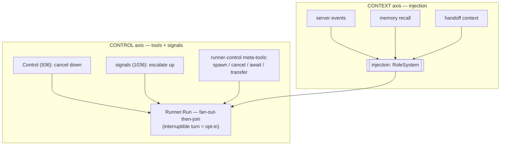
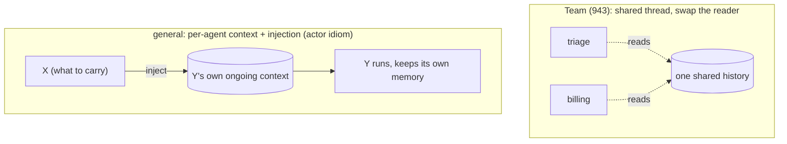

# Agent Composition — multi-agent over one Runner

Design map for mcpkit's multi-agent story (Phase 3, epic 927). Companion to
`docs/AGENT_DESIGN.md` (the single-agent host loop) and
`docs/AGENT_MEMORY_FLOW.md` (memory). Some of this is built; the rest is a
frame for the follow-ups, called out inline.

**The one-liner:** multi-agent is not a new engine. It is **two axes** wrapped
around the same stateless `Runner` — how *context* gets into a turn, and how
*control* is steered across turns and agents. Every pattern — sub-agent as a
tool, async sub-agent, handoff, supervision, speculative groups — is a point
in that two-axis space.

**The architectural bet (same as memory):** `Run(ctx, history, emit)` stays a
deterministic **fan-out-then-join** pure function of its inputs. Composition
never lives *inside* the loop; it wraps it. The one deliberate exception (the
interruptible turn) is opt-in, so the default stays pure — which is exactly
what lets resume / fork / eval / compaction compose around `Run`.

## The two axes

### 1. Context in — everything is injection

The only ways context reaches a turn are the `history` + `Tools` it is handed,
and **injection** (pre-turn `RoleSystem` messages). Server events, memory
recall, the working-memory summary, and — the key realization —
**handoff context** all flow through the *same* injection seam. "Give agent Y
what it needs to continue" is not special control flow; it is an injection
producer.

### 2. Control — tools + signals, in both directions

Execution is steered two ways, and both are already idiomatic mcpkit (the
model manages its own async through meta-tools today: `create_trigger`,
`cancel_task`, `subscribe_events`):

- **Down** — `Control` (issue 936): an outside caller cancels an in-flight
  call, cleanly, across all outcome shapes.
- **Up** — **signals** (issue 1036, deferred): a child raises an
  exception/signal to its parent — "stop the siblings," "escalate" — itself
  just a tool call from the child's side.
- **Model-driven** — **runner-control meta-tools** (deferred): `spawn_agent`,
  `cancel_agent`, `await_agent`, `transfer_to`, `schedule` — the async-control
  plane extended to sub-agents, so "supervision/orchestration" is *a Runner
  whose tools control other Runners*, not a separate engine.
- **Composition-via-tools** — the same principle one level up: not just steering
  *execution* but mutating the *graph*. Membership is **static today** (`Team`
  declares its members at construction; a fixed, validated handoff graph), and
  **model-driven dynamic** is the deferred extension (issue 1038): an agent
  **catalog** the model composes from via `add_agent` / `remove_agent` /
  `spawn(role)`, with the transfer graph recomputed as it changes. Dynamic
  composition trades the static graph's determinism, so the depth / budget /
  handoff caps matter *more* — a model that grows its own tree needs hard
  bounds.
- **Interruptible turn** (opt-in) — reacting to a signal or a partial result
  mid-fan-out breaks the join barrier. Gated so the default fan-out-then-join
  stays deterministic; only a signal-wired turn becomes interruptible.

### A note on the third channel — observability (not an axis)

The two axes are about how *context* and *control* move. There is a third,
pre-existing channel that is neither: the Runner's **emit stream** —
`emit func(Event)`, the turn-lifecycle events (`turn-begin`, `tool-begin`,
`text-delta`, `turn-end`) a surface renders and a tracer records. It carries
**observability out**, fire-and-forget; it never affects execution.

`SubAgentEvent` (942) is exactly this channel, **nested**: a sub-agent's emit
stream forwarded to the parent's surface, scoped, so the parent can *render*
what the child is doing. It is not context-in and not control — do not confuse
it with either:

- It carries `agent.Event` (lifecycle), **not** MCP domain events. If a
  sub-agent subscribes to some event `e1`, that `e1` is injected into the
  **sub-agent's** context, never the parent's; the parent only sees the
  sub-agent's *activity* (its lifecycle events), never its *inputs*.
- Because it is observability, the control signals (1036) do not replace it —
  a "stop the siblings" signal is not a render event. The two may share one
  upward child→parent pipe, but with different consumers (a surface that
  renders vs. the Runner that acts).

## The patterns as points in the space

| Pattern | Context axis | Control axis | Status |
|---|---|---|---|
| **Sub-agent as tool** (`AgentSource`) | isolated fresh slice (the `task`) | sync, blocking `Call` (answer this turn) | built — 941 |
| **Nested events** (`SubAgentEvent`) | — | child's stream surfaces up, scoped (envelope) | built — 942 |
| **Supervision** | each sub-agent an isolated slice | a Runner whose tools are `AgentSource`s | built (falls out of 941 + `MultiSource`) |
| **Handoff** (`Team`) | shared thread today; general = inject-into-target | transfer tool + swap/schedule the active agent | built minimal — 943 |
| **Async sub-agent** | result injected on a later turn | spawn tool + ack now (task-backed) | deferred — 1035 |
| **Speculative group** (early-cancel / dynamic spawn) | partial results | signals up + `Control` down + interruptible turn | deferred — 1036 |
| **Fan-out ergonomics** (map/gather) | N isolated slices | Runner's built-in parallel dispatch | deferred — 1033 |

Two orthogonal knobs recur across the rows: **context isolation** (fresh slice
vs shared thread vs injected-into-a-persistent-context) and **control timing**
(blocking this turn vs async-and-injected-later vs interrupt-on-signal).

## Handoff, two ways

Handoff moves two things: **(a) context** — the specialist needs to know what
happened — and **(b) control** — the specialist now runs and owns the next
response. Axis 1 dissolves (a): handoff context is just an injection producer.
Axis 2 still owns (b): *something* decides "run Y next." So
**transfer = inject-context-into-Y + schedule-Y** — both built from primitives
we already have, rather than a bespoke swap engine.

- **Team (built)** uses a shared thread and swaps which stateless Runner reads
  it — the minimal concrete handoff.
- **The general form** gives each agent its *own persistent context* and makes
  transfer an **injection** into the target (the actor / message-passing
  idiom mcpkit already leans toward via triggers + events). More general —
  agents accumulate their own memory and collaborate over turns — and it
  reuses the injection seam instead of a swap loop.
- **"While Y is running"** — injecting into an *idle* Y is ordinary pre-turn
  injection (have it). Injecting into a *live* turn is the mid-turn-injection /
  interruptible-turn problem (the opt-in from axis 2). Idle: easy. Concurrent:
  needs the interruptible turn.

## Why the Runner doesn't change

The turn is a pure fan-out-then-join because that is what makes everything else
composable: resume, fork, per-turn eval, and history compaction all wrap `Run`
precisely because it has no hidden state and no mid-turn re-entry. A live
scheduler *inside* the loop — result-watching, sibling cancellation, dynamic
spawning — would forfeit that (nondeterministic ordering, the turn no longer a
function of its inputs) and break A2 (events must project 1:1 onto a wire). So
the composition primitives all wrap the Runner, and the *one* place we let a
turn become re-entrant (the signal-driven interruptible turn) is explicit and
opt-in.

## Constraints this model respects

- **A6** (model-facing → `agent/`): `AgentSource`, `Team`, and the future
  control meta-tools are all model-facing, so they live in `agent/`.
- **A2** (wire-serializable events): nesting rides the `SubAgentEvent`
  envelope (scope/depth on the wrapper); `Event` stays flat.
- **A1** (dependency direction): composition is pure `agent/` over `Runner` +
  `ToolSource`; no new upward deps.

## Status & sequencing

**Built (Phase 3):** `AgentSource` (941, agent-as-tool + depth/budget guards),
`SubAgentEvent` nesting (942), `Team` handoff (943), and the
`examples/multi-agent` walkthrough (1031, part 1).

**Deferred, mapped to the axes:**

- Context: handoff-via-injection + per-agent persistent context (the actor
  form above) — a generalization of `Team`.
- Control: async sub-agents (1035), upward signals + runner-control meta-tools
  + interruptible turn (1036), parallel fan-out ergonomics (1033),
  aggregate step/token tree budget (1032).
- Surface: declarative `agent/host` + agentchat multi-agent config and nested
  rendering (1031, part 2).

**Phase 4 (workflows, 928)** is the *durable* version of the control axis: when
the schedule/transfer/spawn decisions should be code-driven and
resumable-across-restarts rather than model-driven per turn, they become a
state machine that reuses `TriggerPolicy` for suspend/resume — the same two
axes, made durable.
