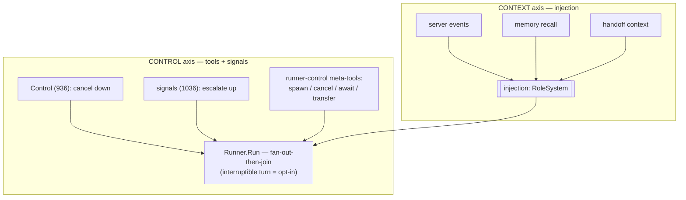
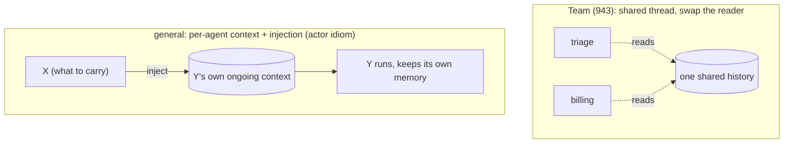

# Agent Composition — multi-agent over one Runner

Design map for mcpkit's multi-agent story (Phase 3, epic 927). Companion to
`docs/AGENT_DESIGN.md` (the single-agent host loop) and
`docs/AGENT_MEMORY_FLOW.md` (memory). Some of this is built; the rest is a
frame for the follow-ups, called out inline.

**The one-liner:** multi-agent is not a new engine. It is **two axes** wrapped
around the same stateless `Runner` — how *context* gets into a turn, and how
*control* is steered across turns and agents. Every pattern — sub-agent as a
tool, async sub-agent, handoff, supervision, speculative groups — is a point
in that two-axis space.

**The architectural bet (same as memory):** `Run(ctx, history, emit)` stays a
deterministic **fan-out-then-join** pure function of its inputs. Composition
never lives *inside* the loop; it wraps it. The one deliberate exception (the
interruptible turn) is opt-in, so the default stays pure — which is exactly
what lets resume / fork / eval / compaction compose around `Run`.

## The two axes

### 1. Context in — everything is injection

The only ways context reaches a turn are the `history` + `Tools` it is handed,
and **injection** (pre-turn `RoleSystem` messages). Server events, memory
recall, the working-memory summary, and — the key realization —
**handoff context** all flow through the *same* injection seam. "Give agent Y
what it needs to continue" is not special control flow; it is an injection
producer.

### 2. Control — tools + signals, in both directions

Execution is steered two ways, and both are already idiomatic mcpkit (the
model manages its own async through meta-tools today: `create_trigger`,
`cancel_task`, `subscribe_events`):

- **Down** — `Control` (issue 936): an outside caller cancels an in-flight
  call, cleanly, across all outcome shapes.
- **Up** — **signals** (issue 1165, piece A of 1036): a child raises an
  exception/signal to its parent — "stop the siblings," "escalate" — itself
  just a tool call from the child's side, writing to a ctx-threaded upward sink
  the parent reads at the join. This is the *mechanism*; reacting mid-fan-out
  is the interruptible turn below.
- **Model-driven** — **runner-control meta-tools** (issue 1166, piece B of
  1036): `spawn_agent`, `cancel_agent`, `await_agent`, `transfer_to`,
  `schedule` — the async-control plane extended to sub-agents, so
  "supervision/orchestration" is *a Runner whose tools control other Runners*,
  not a separate engine. Host-layer over a running-agent registry; no Runner
  change.
- **Composition-via-tools** — the same principle one level up: not just steering
  *execution* but mutating the *graph*. Membership is **static today** (`Team`
  declares its members at construction; a fixed, validated handoff graph), and
  **model-driven dynamic** is the deferred extension (issue 1038): an agent
  **catalog** the model composes from via `add_agent` / `remove_agent` /
  `spawn(role)`, with the transfer graph recomputed as it changes. Dynamic
  composition trades the static graph's determinism, so the depth / budget /
  handoff caps matter *more* — a model that grows its own tree needs hard
  bounds.
- **Interruptible turn** (opt-in — issue 1167, piece C of 1036) — reacting to a
  signal or a partial result mid-fan-out breaks the join barrier. Gated so the
  default fan-out-then-join stays deterministic; only a signal-wired turn
  becomes interruptible. The one structural Runner change of the three; requires
  A (a signal to react to).

The 1036 epic decomposes into these three separable pieces — **A** upward
signals (1165, the mechanism, no barrier break), **B** runner-control meta-tools
(1166, host-layer), **C** the interruptible turn (1167, the gated exception).
Sequence is A -> C (C needs a signal to react to); B is independent. A is the
keystone: it forces the signal-payload design B and C both consume, and it is
what the interaction mediator (1157) needs.

### A note on the third channel — observability (not an axis)

The two axes are about how *context* and *control* move. There is a third,
pre-existing channel that is neither: the Runner's **emit stream** —
`emit func(Event)`, the turn-lifecycle events (`turn-begin`, `tool-begin`,
`text-delta`, `turn-end`) a surface renders and a tracer records. It carries
**observability out**, fire-and-forget; it never affects execution.

`SubAgentEvent` (942) is exactly this channel, **nested**: a sub-agent's emit
stream forwarded to the parent's surface, scoped, so the parent can *render*
what the child is doing. It is not context-in and not control — do not confuse
it with either:

- It carries `agent.Event` (lifecycle), **not** MCP domain events. If a
  sub-agent subscribes to some event `e1`, that `e1` is injected into the
  **sub-agent's** context, never the parent's; the parent only sees the
  sub-agent's *activity* (its lifecycle events), never its *inputs*.
- Because it is observability, the control signals (1036) do not replace it —
  a "stop the siblings" signal is not a render event. The two may share one
  upward child→parent pipe, but with different consumers (a surface that
  renders vs. the Runner that acts).

```mermaid
flowchart TD
    subgraph ctx["CONTEXT axis — injection"]
      EV[server events] --> INJ[[injection: RoleSystem]]
      MEM[memory recall] --> INJ
      HO["handoff context"] --> INJ
    end
    subgraph ctl["CONTROL axis — tools + signals"]
      DOWN["Control (936): cancel down"] --> RUN
      UP["signals (1036): escalate up"] --> RUN
      MT["runner-control meta-tools:<br/>spawn / cancel / await / transfer"] --> RUN
    end
    INJ --> RUN["Runner.Run — fan-out-then-join<br/>(interruptible turn = opt-in)"]
```

## The patterns as points in the space

| Pattern | Context axis | Control axis | Status |
|---|---|---|---|
| **Sub-agent as tool** (`AgentSource`) | isolated fresh slice (the `task`) | sync, blocking `Call` (answer this turn) | built — 941 |
| **Nested events** (`SubAgentEvent`) | — | child's stream surfaces up, scoped (envelope) | built — 942 |
| **Supervision** | each sub-agent an isolated slice | a Runner whose tools are `AgentSource`s | built (falls out of 941 + `MultiSource`) |
| **Handoff** (`Team`) | shared thread today; general = inject-into-target | transfer tool + swap/schedule the active agent | built minimal — 943 |
| **Async sub-agent** | result injected on a later turn | spawn tool + ack now (task-backed) | deferred — 1035 |
| **Speculative group** (early-cancel / dynamic spawn) | partial results | signals up + `Control` down + interruptible turn | deferred — 1036 |
| **Fan-out ergonomics** (map/gather) | N isolated slices | Runner's built-in parallel dispatch | deferred — 1033 |

Two orthogonal knobs recur across the rows: **context isolation** (fresh slice
vs shared thread vs injected-into-a-persistent-context) and **control timing**
(blocking this turn vs async-and-injected-later vs interrupt-on-signal).

## Multi-model falls out for free

There is no separate multi-model machinery — **every `Runner` carries its own
`Provider`**, so composing models is just composing agents. A heavy supervisor
delegating to cheaper sub-agents is a supervisor `Runner` on one model whose
`AgentSource`/`TeamMember` children each have a `RunnerConfig.Provider` on
another. "Route the hard subtask to the big model, the bulk to a small one" is
which provider you hand each child — an axis-agnostic config property, not a
composition primitive.

*Within* a single conversation, switching models is a different seam:
`ConnectionRegistry` + `providerSwitch` (the `/provider` command),
`FailoverProvider` (primary/backup with cooldown), and the deferred
per-turn/per-role routing policy (issue 991). Across agents = per-`Runner`
provider (here); within one agent = provider switching (that seam).

## Handoff, two ways

Handoff moves two things: **(a) context** — the specialist needs to know what
happened — and **(b) control** — the specialist now runs and owns the next
response. Axis 1 dissolves (a): handoff context is just an injection producer.
Axis 2 still owns (b): *something* decides "run Y next." So
**transfer = inject-context-into-Y + schedule-Y** — both built from primitives
we already have, rather than a bespoke swap engine.

```mermaid
flowchart TB
    subgraph team["Team (943): shared thread, swap the reader"]
      H[(one shared history)]
      A1[triage] -. reads .-> H
      B1[billing] -. reads .-> H
    end
    subgraph actor["general: per-agent context + injection (actor idiom)"]
      X["X (what to carry)"] -->|inject| YC[("Y's own ongoing context")]
      YC --> Y2["Y runs, keeps its own memory"]
    end
```

- **Team (built)** uses a shared thread and swaps which stateless Runner reads
  it — the minimal concrete handoff. Host-wired via `Config.Team` (1042):
  `App.RunTurn` drives `Team.RunTurn` instead of the single Runner, and the
  **active agent persists across user turns** (control stays transferred, it does
  not re-route from Start each turn). Team mode replaces the single main agent,
  so it is mutually exclusive with that agent's memory / sub-agents / fan-out
  (integrating those into team members is deferred). `OnHandoff` surfaces as a
  `HostHandoff` event; demoed in `examples/agents/kitchen-sink` (`just team`).
- **The general form** gives each agent its *own persistent context* and makes
  transfer an **injection** into the target (the actor / message-passing
  idiom mcpkit already leans toward via triggers + events). More general —
  agents accumulate their own memory and collaborate over turns — and it
  reuses the injection seam instead of a swap loop.
- **"While Y is running"** — injecting into an *idle* Y is ordinary pre-turn
  injection (have it). Injecting into a *live* turn is the mid-turn-injection /
  interruptible-turn problem (the opt-in from axis 2). Idle: easy. Concurrent:
  needs the interruptible turn.

## Why the Runner doesn't change

The turn is a pure fan-out-then-join because that is what makes everything else
composable: resume, fork, per-turn eval, and history compaction all wrap `Run`
precisely because it has no hidden state and no mid-turn re-entry. A live
scheduler *inside* the loop — result-watching, sibling cancellation, dynamic
spawning — would forfeit that (nondeterministic ordering, the turn no longer a
function of its inputs) and break A2 (events must project 1:1 onto a wire). So
the composition primitives all wrap the Runner, and the *one* place we let a
turn become re-entrant (the signal-driven interruptible turn) is explicit and
opt-in.

## Sub-agents and memory

The injection-only boundary has a direct consequence: **a sub-agent gets no
ambient parent state — no working memory, no shared store handle.** It receives
exactly what crosses the boundary explicitly (task arguments + injected
context) and returns exactly its answer.

This is not a cleanliness preference; it falls out of the two axes. A
sub-agent's location is not guaranteed. The in-process `AgentSource` is the
*degenerate co-located case*; the general case is a child on another host,
provider, or model. Shared parent memory assumes co-location, and A2
wire-serializability already forbids non-serializable state (a pointer to the
parent's store) from crossing the parent-to-child edge. So "what the child
needs to know" is the orchestrator's job to distill and pass — the same
"choose what crosses into the next context under a budget" problem
`docs/AGENT_MEMORY_FLOW.md` frames for turn-to-turn memory, one level up.

Consequences:

- **A child that needs memory owns it entirely** — its store, persistence, and
  namespace scheme configured on its own Runner, opaque to the parent. This is
  the same encapsulation as a stateful MCP tool owning its own database: the
  caller neither provisions nor knows it. A code-cleanup sub-agent that
  remembers its past runs sets that up itself.
- **The trap:** wiring a child with `WithMemoryNamespaceFunc(a.currentRunID)`
  silently drops it into the *parent's* namespace — explicitly not the model. A
  child's memory is never addressed by the parent's run id.
- **Hierarchy** (a parent recalling across its children's memory) is deferred
  behind a prefix/hierarchical namespace query the `MemoryStore` seam does not
  have (exact-match today), and even then it is a query over serializable
  results, not shared mutable access.
- **`AgentSource` stays; colocation is contained, not removed.** It is the
  in-process implementation of the location-independent `ToolSource` contract —
  the zero-serialization fast path. A remote sub-agent is a *sibling*
  implementation of the same seam (largely "a sub-agent published as an MCP
  server, reached through the existing server-tools `ToolSource`"); what it adds
  is carrying the composition metadata ctx threads for free in-process
  (depth/budget, cancellation, the nested event stream) over the wire — the
  surface of async sub-agents (1035), upward signals (1036), and dynamic
  composition (1038). Enforcing the no-shared-memory rule now, while everything
  is co-located, is what keeps the local and remote implementations
  interchangeable from the parent's side.

Decision captured in issue 1151; enforced by constraint A7.

## Constraints this model respects

- **A6** (model-facing → `agent/`): `AgentSource`, `Team`, and the future
  control meta-tools are all model-facing, so they live in `agent/`.
- **A2** (wire-serializable events): nesting rides the `SubAgentEvent`
  envelope (scope/depth on the wrapper); `Event` stays flat.
- **A1** (dependency direction): composition is pure `agent/` over `Runner` +
  `ToolSource`; no new upward deps.
- **A7** (no shared sub-agent memory): a persona is built over the server-only
  `serverTools`, never the memory-bearing aggregate; parent-to-child is params
  + injection. See § Sub-agents and memory above.

## Status & sequencing

**Built (Phase 3):** `AgentSource` (941, agent-as-tool + depth/budget guards),
`SubAgentEvent` nesting (942), `Team` handoff (943), the
`examples/agents/multi-agent` walkthrough (1031, part 1), and **`FanOutSource`**
(1033 — one tool broadcasts a task to N member sub-agents concurrently and
returns their results aggregated in member order; the parallel-ensemble
primitive, reusing `AgentSource` for per-member depth/budget/scope, host-wired
as `Config.FanOut` and demoed in `examples/agents/kitchen-sink`).

**Team-in-host (1042):** `Config.Team` drives the App loop; active agent
persists across turns; `HostHandoff` event; `just team` demo. Mutually exclusive
with the single-agent features (deferred: integrating memory/offloading into
team members).

**`AsyncAgentSource` — the Task form (1035):** the spawn-and-continue counterpart
to `AgentSource`'s blocking Tool form. `Call` returns an ack immediately and runs
the child on a detached goroutine (`core.DetachForBackground` — it outlives the
turn and makes server calls); on completion `OnComplete` delivers the result,
which the host injects as a `subagent.completed` event (reusing the `tasks_bg.go`
Ingest + trigger path), so the parent picks it up on a later turn. Depth/budget
guards apply at spawn; `SubAgentEvent` still surfaces the background stream.
Host: `SubAgentConfig.Async` builds it; demoed as `deep_researcher` in
`examples/agents/kitchen-sink`.

**Tool vs Task vs *a real Task*:**
- **Tool** (`AgentSource`): call-and-block, answer this turn. For short subtasks
  the parent must have now.
- **Task form** (`AsyncAgentSource`): ack-now, result later via injection. For
  long-running or fan-out-and-continue work. But it is **not** an MCP task — no
  wire presence, no model-visible poll/cancel, the goroutine is ephemeral (dies
  with the process).
- **A real (server-side) task** (`ext/tasks`): when you need the model to *poll*
  or *cancel* the background work, or it must survive a restart. Heavier: a task
  runtime + wire support. The async sub-agent is the no-runtime, ephemeral end of
  the same spawn-and-continue spectrum whose durable/controllable end is a task.

**Deferred, mapped to the axes:**

- Context: handoff-via-injection + per-agent persistent context (the actor
  form above) — a generalization of `Team`.
- Control: the 1036 epic, now split into three tracked pieces — upward signals
  (1165, A), runner-control meta-tools (1166, B), interruptible turn (1167, C);
  sequence A -> C, B independent.
  **`TreeBudget` shipped (1032):** a ctx-threaded aggregate cap on total model
  **steps** and **tokens** across a turn's whole tree (parent + sub-agents +
  fan-out members + handoff rounds), consulted by the Runner per step. The
  top-level Runner installs it (`RunnerConfig.TreeBudget`, host `Config.MaxTree*`
  / agentchat `--max-tree-*`); every child run inherits the same shared counter
  through ctx. Exhaustion aborts with `ErrTreeBudget` (a sub-agent's becomes a
  non-fatal `IsError` result). It completes the cost-guard set alongside the
  per-source depth cap, the call-count budget (`WithAgentCallBudget`), and
  per-Runner `MaxSteps`/`Team.MaxHandoffs`.
  **1033 is closed**: `AgentSource.InputSchema` (typed subtask in) + `Structured`
  output (a child with a `ResponseSchema` returns coerced JSON) + `Team.OnEvent`
  (member events tagged by active agent name, rendered attributed as
  `HostSubAgentEvent`). Map-style fan-out (distribute distinct subtasks) was NOT
  part of 1033 — `FanOutSource` broadcasts one task to all members; a distinct-
  subtask variant is a separate future item if wanted.
- Surface: declarative `agent/host` + agentchat multi-agent config and nested
  rendering (1031, part 2).

**Phase 4 (workflows, 928)** is the *durable* version of the control axis: when
the schedule/transfer/spawn decisions should be code-driven and
resumable-across-restarts rather than model-driven per turn, they become a
state machine that reuses `TriggerPolicy` for suspend/resume — the same two
axes, made durable.
