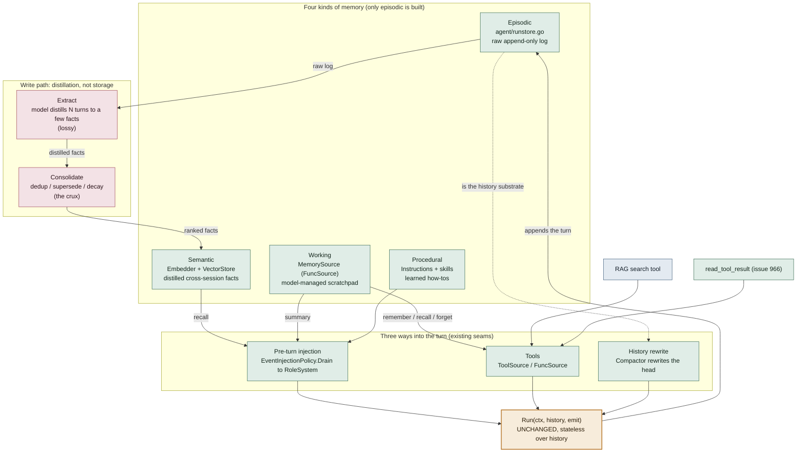

# Agent Memory — how it wraps the Runner

Design map for the Phase 2 memory work (`docs/AGENT_SDK_ROADMAP.md` §A). **Phase 2 is now SHIPPED (epic 926 closed):** episodic (`RunStore`) + offloading + working memory (`MemorySource`/`MemoryStore`) + compaction (`SummarizingCompactor`) + semantic recall (`Embedder` + `InMemorySemanticStore` + pre-turn `RecallRelevant` injection). What remains are the deferred refinements (a distillation write path, a Scorer/Reranker, pgvector, the injection arbiter, an explicit context pipeline — all filed). The seams below are real code now, not a sketch.

**The one-liner:** persistence keeps the conversation; memory chooses what crosses into the next one. The `RunStore` is about *not losing* things. Memory is about *choosing* things — which tiny subset of everything-ever-known enters the next model call, under a finite budget.

**The architectural bet:** every memory type feeds the turn through a seam that already exists (injection, tools, or a history rewrite), so `Run(ctx, history, emit)` never changes. Memory wraps the loop; it is not baked into it.

## Reading the diagram

- **Top band** — the four memory types. A real taxonomy: each has a different home, write path, and failure mode. **Episodic** (the `RunStore`), **working** (`MemorySource`/`MemoryStore`), and **semantic** (`Embedder` + `InMemorySemanticStore`) are built; **procedural** is partly covered by skills + the system prompt.
- **Middle band** — the entry paths. No new Runner seam. The working-memory summary and semantic recall arrive as `RoleSystem` messages through a **dedicated host injection step** (`withMemorySummaryLocked`), NOT through `EventInjectionPolicy` (which is events-only — the reason for that rename). **Read is synchronous** (embed the user's turn, query, inject); the *write* (indexing) is what stays off the critical path, and the automatic distillation write path is still deferred (issue 1022). Working-memory ops and offloading arrive as tools the model calls on demand. Compaction rewrites the head of the `history` slice via the Runner's `Compactor` hook, at the top of the turn.
- **The spine** — `Run` is stateless over history, so resume / fork / compaction / injection all compose *around* it.
- **Write path** — the episodic log feeds distillation. Storing is trivial; **Extract** (lossy) and **Consolidate** (duplicate vs update vs contradiction) are where memory actually gets hard, and are the still-deferred part (issue 1022). Today semantic memory is populated by the model calling `remember`, not auto-extracted.

## Why it's a phase, not a weekend

The stores are the easy 20% (they look like `RunStore`). The other 80% is policy, and policy is model-shaped:

- **No round-trip test.** A store is correct if it is *faithful* (provable). Memory is correct if it is *relevant under budget* — fuzzy, task-dependent, judged statistically.
- **Silent failure.** A missing memory does not error; it just makes a subtly worse answer. This is exactly why the eval harness (issue 932) shipped *before* memory — it is the only way to measure whether recall helps.
- **Retrieval is approximate.** Embedding similarity is a blunt signal; good recall blends semantic match + recency + importance. Retrieve too eagerly and you poison context.
- **Errors compound.** Unlike a store, memory feeds itself: a bad fact gets recalled, shapes an answer, and gets re-consolidated. The write path's mistakes do not stay contained.

## Where RAG and offloading fit

- **RAG is the semantic layer.** Retrieve chunks then inject is the *same machinery* as semantic recall (`Embedder` + `VectorStore`). It is not a separate primitive; it falls out of the memory seams.
- **RAG today.** The shift is from "pre-baked top-k every turn" to *retrieval as a tool the agent calls* (the Tools path). Large context windows plus offloading erode classic RAG; it still wins when the corpus is larger than the context window, or for freshness, citations, and cost.
- **Offloading (issue 966).** Extends the *episodic* layer with on-demand reads (`read_tool_result`). Lossless and pay-per-lookup — it shrinks how much the lossy layers ever have to guess, which is why it is the right opener before full memory.

## Prior art & interface extensibility

Working memory's `remember` / `recall` / `forget` verbs are not idiosyncratic — they are the **agent-self-edited** camp of memory design, done minimally. Two camps exist:

- **Model-managed** (ours): the agent decides what to keep by calling tools. Letta/MemGPT (`core_memory_append` / `archival_memory_insert` / `archival_memory_search`), LangChain LangMem (`manage_memory` + `search_memory`).
- **Pipeline-managed**: a background LLM step extracts and consolidates facts from the raw conversation; the agent never explicitly remembers. Mem0 (`add()` runs an ADD/UPDATE/DELETE/NOOP decision internally), Zep (temporal knowledge-graph extraction). This is the **write path** above (Extract → Consolidate), complementary to the tool surface, not a replacement.

Primitives other systems expose, and where each lands for us:

| Primitive | Who | Our plan |
|---|---|---|
| Semantic `search` with a relevance **score** (vs substring list) | Mem0, LangGraph `BaseStore.search`, Letta archival, Zep | Issue 940. `ListMemoriesRequest` already carries `Query`; a `Score` on the returned items is the only add. |
| **Namespace / scope** (`user_id`, `agent_id`, `run_id`, session) | Near-universal — LangGraph hierarchical namespaces, Mem0 scoping, Letta per-agent | Issue 1003. The most-standard thing we don't yet have; a `Namespace` field on the request structs. |
| Explicit **`update` / supersede** as a distinct op | Mem0, LangMem | Covered as upsert-by-key today; consolidation is the pipeline camp — defer. |
| **`history(id)`** — how a fact changed over time | Mem0, Zep (bi-temporal) | Nice-to-have for the knowledge-update category; not now. |
| **Tiered**: in-context core blocks vs archival | Letta/MemGPT, Mastra (markdown profile) | `InjectSummary` is "core-lite"; editable core blocks are a bigger design — defer. |
| Memory-as-**filesystem** (`view` / `create` / `str_replace`) | Anthropic memory tool (2025 beta) | This is our offloading / `FileToolResultStore` direction, a different substrate than the working-memory scratchpad. |
| Configurable tool **names** (vs fixed `remember`/`recall`/`forget`) | competitors use fixed names + namespacing | YAGNI. Names are exported constants; a variadic `NewMemorySource(store, opts...)` with a name-prefix option is non-breaking to add when a second in-agent MemorySource or prompt-tuning actually needs it. `MultiSource` already collision-qualifies names, so it isn't needed for aggregation. |

**Why none of this forces a change to the first cut:** the `MemoryStore` seam uses the gRPC-style req/resp struct convention. `Namespace`, `Score`, a `GetMemory` point-read, `DeleteAll` — all land as new struct fields or new methods without breaking the interface or any backend (same reason `PutMemoryResponse` is an empty struct). The store starts minimal on purpose and grows additively into the primitives above.

## Sequencing (roadmap §A) — all shipped

issue 966 offloading → working memory + `MemorySource` (938) → eval harness (974) → compaction `SummarizingCompactor` (939) → `Embedder` + `InMemorySemanticStore` + recall auto-injection (940). Phase 2 complete (epic 926 closed).

**Deferred refinements (filed):** distillation write path (1022, the Extract→Consolidate loop above), Scorer/Reranker multi-signal ranking (1020), pgvector durable store (1019), unified injection arbiter (1024), explicit context-assembly pipeline (1026), faster cosine (1018), metrics seam (1023), LongMemEval dataset loader (1014).
