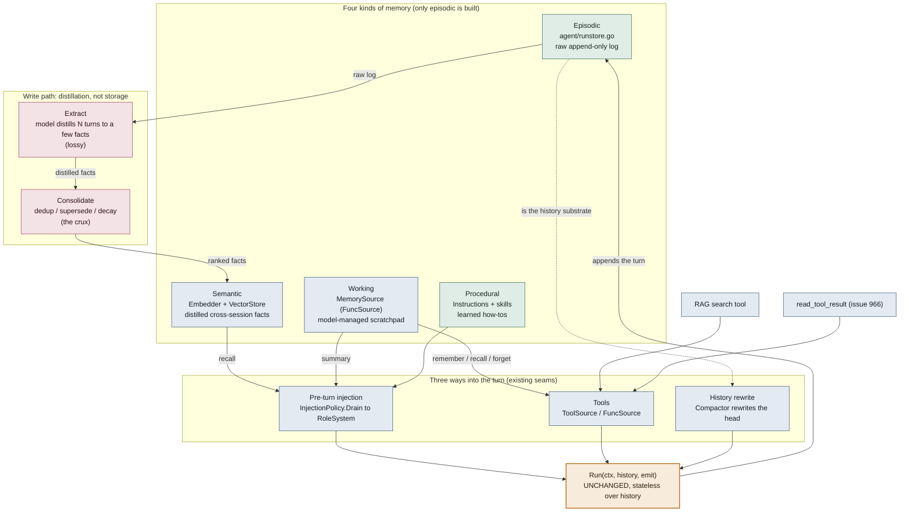

# Agent Memory — how it wraps the Runner

Design sketch for the Phase 2 memory work (`docs/AGENT_SDK_ROADMAP.md` §A). Nothing here is built yet except the episodic layer (the Phase 1 `RunStore`).

**The one-liner:** persistence keeps the conversation; memory chooses what crosses into the next one. The `RunStore` is about *not losing* things. Memory is about *choosing* things — which tiny subset of everything-ever-known enters the next model call, under a finite budget.

**The architectural bet:** every memory type feeds the turn through a seam that already exists (injection, tools, or a history rewrite), so `Run(ctx, history, emit)` never changes. Memory wraps the loop; it is not baked into it.

## Reading the diagram

- **Top band** — the four memory types. A real taxonomy: each has a different home, write path, and failure mode. Only **episodic** (the `RunStore`) exists; **procedural** is partly covered by skills + the system prompt.
- **Middle band** — the three entry paths. No new Runner seam. Semantic recall and the working-memory summary arrive as `RoleSystem` messages through `InjectionPolicy` (do it *async* so embedding latency stays off the critical path). Working-memory ops, RAG search, and offloading arrive as tools the model calls on demand. Compaction rewrites the head of the `history` slice before `Run` is even called.
- **The spine** — `Run` is stateless over history, so resume / fork / compaction / injection all compose *around* it.
- **Write path** — after the turn, the episodic log feeds distillation. Storing is trivial; **Extract** (lossy) and **Consolidate** (duplicate vs update vs contradiction) are where memory actually gets hard. The loop closes: consolidated facts re-enter the next turn through injection.

## Why it's a phase, not a weekend

The stores are the easy 20% (they look like `RunStore`). The other 80% is policy, and policy is model-shaped:

- **No round-trip test.** A store is correct if it is *faithful* (provable). Memory is correct if it is *relevant under budget* — fuzzy, task-dependent, judged statistically.
- **Silent failure.** A missing memory does not error; it just makes a subtly worse answer. This is exactly why the eval harness (issue 932) shipped *before* memory — it is the only way to measure whether recall helps.
- **Retrieval is approximate.** Embedding similarity is a blunt signal; good recall blends semantic match + recency + importance. Retrieve too eagerly and you poison context.
- **Errors compound.** Unlike a store, memory feeds itself: a bad fact gets recalled, shapes an answer, and gets re-consolidated. The write path's mistakes do not stay contained.

## Where RAG and offloading fit

- **RAG is the semantic layer.** Retrieve chunks then inject is the *same machinery* as semantic recall (`Embedder` + `VectorStore`). It is not a separate primitive; it falls out of the memory seams.
- **RAG today.** The shift is from "pre-baked top-k every turn" to *retrieval as a tool the agent calls* (the Tools path). Large context windows plus offloading erode classic RAG; it still wins when the corpus is larger than the context window, or for freshness, citations, and cost.
- **Offloading (issue 966).** Extends the *episodic* layer with on-demand reads (`read_tool_result`). Lossless and pay-per-lookup — it shrinks how much the lossy layers ever have to guess, which is why it is the right opener before full memory.

## Sequencing (roadmap §A)

issue 966 offloading → working memory + `MemorySource` → compaction (`SummarizingCompactor`) → embedder / vectorstore recall wired into injection.
