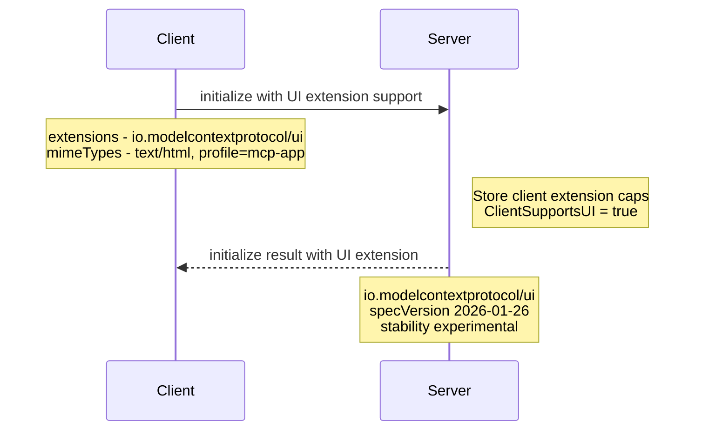
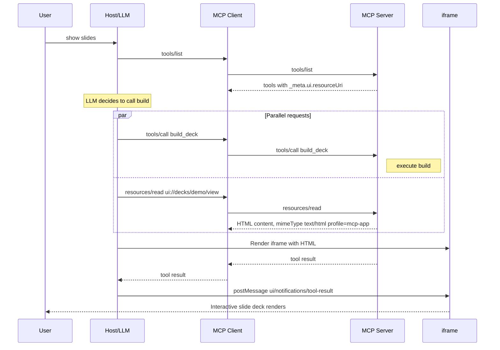
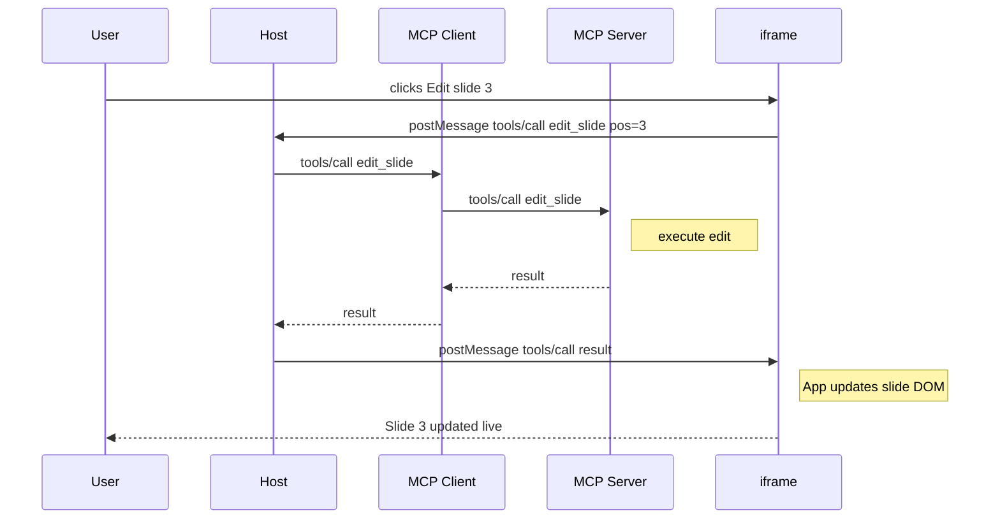
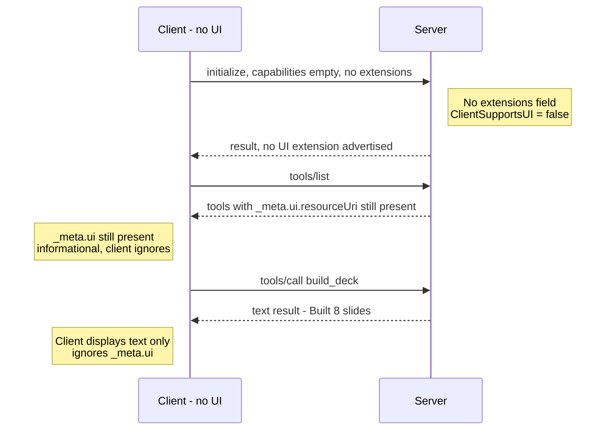
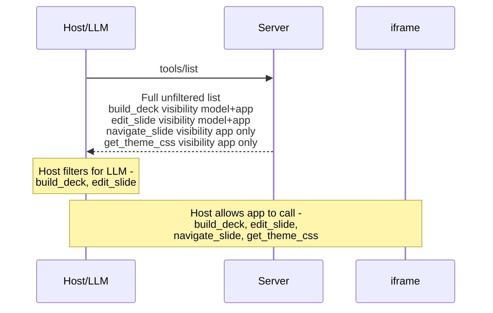
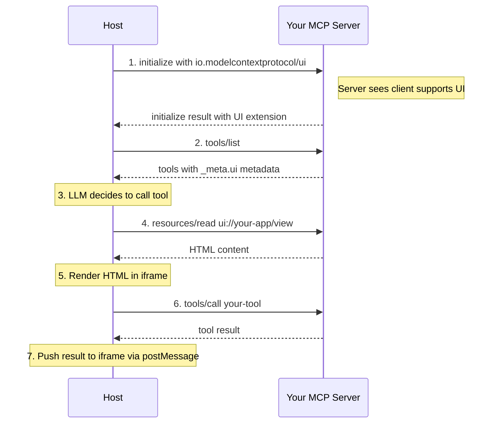
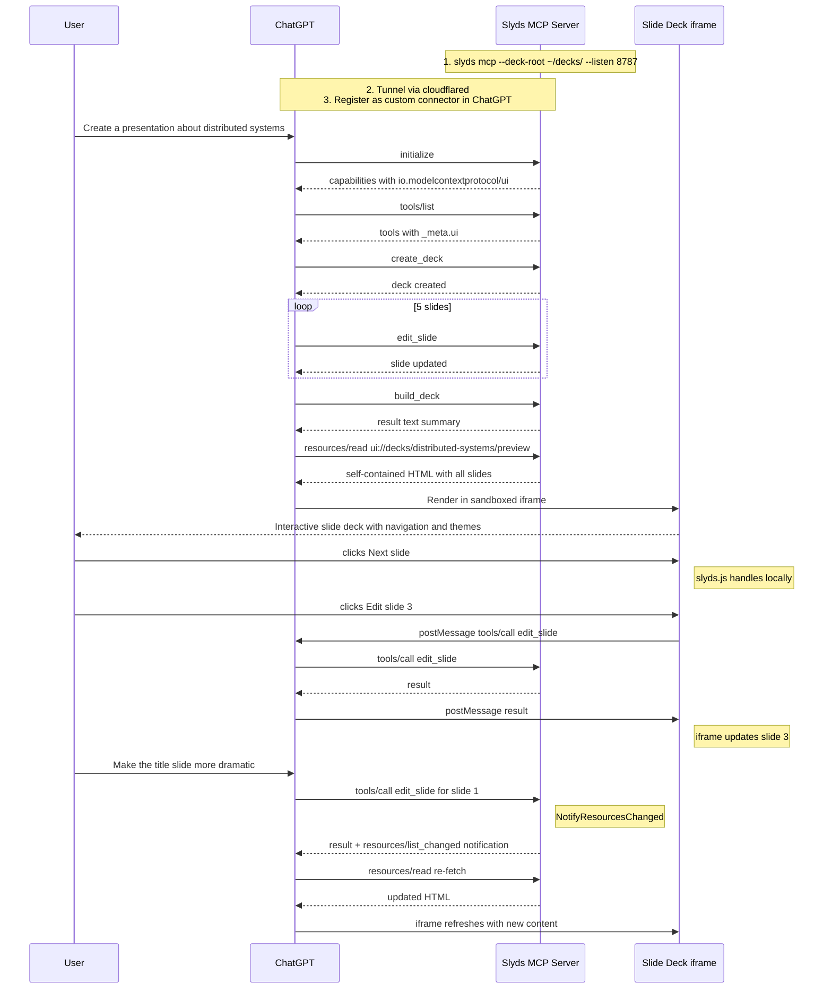

# MCP Apps Extension — Design

## Overview

MCPKit adds support for the MCP Apps extension (`io.modelcontextprotocol/ui`), enabling servers to return interactive HTML user interfaces that render inline in host conversations (Claude, ChatGPT, VS Code Copilot, Goose, etc.). This document covers the architecture, protocol surface, edge cases, conformance strategy, and the slyds reference integration.

MCP Apps combines two existing MCP primitives — tools declare a UI resource via `_meta.ui.resourceUri`, and resources serve the HTML content with MIME type `text/html;profile=mcp-app`. The interactive iframe↔host protocol (JSON-RPC over `postMessage`) is the host's responsibility; mcpkit's scope is the server-side metadata, resource serving, capability negotiation, and client-side detection.

## Design Principles

1. **Core module stays zero-deps** — UI metadata types live in mcpkit core. No HTML processing, no JS bundling, no browser dependencies.
2. **Additive extension** — servers without UI config work exactly as before. Existing tools, resources, and transports are unaffected.
3. **Interface in core, implementation in sub-module** — core defines the `UIMetadata` struct and `_meta` plumbing. A future `mcpkit/ui` sub-module could provide helpers (CSP builders, HTML inlining), but is not required for v1.
4. **Follow the auth pattern** — `UIExtension` implements `ExtensionProvider`, registered via `WithExtension(ui.UIExtension{})`. Capability negotiation mirrors auth exactly.
5. **Slyds as the reference app** — design decisions are validated against a real use case: an HTML slide deck editor served as an MCP App.

## Spec Reference

- Extension ID: `io.modelcontextprotocol/ui`
- Feature name: "MCP Apps" (the extension ID uses `ui`, but the feature is called "Apps")
- Spec version: `2026-01-26` (current stable)
- Overview: [modelcontextprotocol.io/extensions/apps/overview](https://modelcontextprotocol.io/extensions/apps/overview)
- Repository: [github.com/modelcontextprotocol/ext-apps](https://github.com/modelcontextprotocol/ext-apps)
- Specification: [specification/2026-01-26/apps.mdx](https://github.com/modelcontextprotocol/ext-apps/blob/main/specification/2026-01-26/apps.mdx)
- Supported hosts: Claude, Claude Desktop, VS Code GitHub Copilot, Goose, Postman, MCPJam

### Implementation notes

- Standard `Permissions` values: `"camera"`, `"microphone"`, `"geolocation"`, `"clipboardWrite"`
- `PrefersBorder` and `Domain` fields may be host-specific — not all hosts honor them
- Hosts may preload `ui://` resources before tools/call for faster rendering

## Architecture

```
┌──────────────────────────────────────────────────────────────────────┐
│  mcpkit (core module, zero UI deps)                                  │
│                                                                      │
│  NEW TYPES:                          CHANGED TYPES:                  │
│  ├─ UIMetadata                       ├─ ToolDef._Meta                │
│  ├─ UICSPConfig                      ├─ ResourceDef._Meta            │
│  ├─ UIVisibility (enum)              ├─ ResourceReadContent._Meta    │
│  └─ AppMIMEType (const)              ├─ ClientCapabilities.Extensions│
│                                      └─ initializeParams (extensions)│
│                                                                      │
│  EXISTING (unchanged):                                               │
│  ├─ ExtensionProvider                                                │
│  ├─ Extension, Stability                                             │
│  └─ RegisterResource, RegisterTool, etc.                             │
├──────────────────────────────────────────────────────────────────────┤
│  mcpkit/ui (optional sub-module, future)                             │
│                                                                      │
│  IMPLEMENTATIONS:                                                    │
│  ├─ UIExtension         → implements ExtensionProvider               │
│  ├─ CSPBuilder          → constructs CSP from UICSPConfig            │
│  ├─ HTMLInliner         → inlines CSS/JS/images into single HTML     │
│  └─ RegisterAppTool()   → convenience: tool + resource in one call   │
│                                                                      │
│  (v1 ships UIExtension only; helpers are future work)                │
├──────────────────────────────────────────────────────────────────────┤
│  Application (e.g. slyds)                                            │
│                                                                      │
│  ├─ Registers tools with _Meta.UI.ResourceUri = "ui://..."           │
│  ├─ Registers ui:// resources serving HTML                           │
│  ├─ Optionally embeds App-class JS for bidirectional communication   │
│  └─ Uses mcpkit server as usual (SSE / Streamable HTTP)              │
└──────────────────────────────────────────────────────────────────────┘
```

### Responsibility Boundary

```
┌─────────────┐     ┌──────────────┐     ┌─────────────────┐     ┌──────────┐
│  MCP Client │     │  MCP Server  │     │  Host (Claude,   │     │  iframe  │
│  (mcpkit    │     │  (mcpkit     │     │   ChatGPT, etc.) │     │  (MCP    │
│   client)   │     │   server)    │     │                  │     │   App)   │
├─────────────┤     ├──────────────┤     ├──────────────────┤     ├──────────┤
│ Negotiate   │◄───►│ Advertise    │     │                  │     │          │
│ extensions  │     │ extension    │     │                  │     │          │
│             │     │              │     │                  │     │          │
│ tools/list  │◄───►│ Return tools │     │                  │     │          │
│             │     │ with _meta.ui│     │                  │     │          │
│             │     │              │     │                  │     │          │
│ tools/call  │◄───►│ Execute tool │     │ Render iframe    │────►│ Display  │
│             │     │ return result│     │ from ui:// res   │     │ HTML     │
│             │     │              │     │                  │     │          │
│ resources/  │◄───►│ Serve HTML   │     │ postMessage      │◄───►│ JSON-RPC │
│ read        │     │ content      │     │ bridge           │     │ ui/*     │
└─────────────┘     └──────────────┘     └──────────────────┘     └──────────┘
                    ▲                    ▲
                    │ mcpkit scope       │ host scope
                    │ (this design)      │ (not mcpkit)
```

**mcpkit is responsible for:**
- Capability negotiation (server advertises, client detects)
- `_meta.ui` metadata on tools and resources
- Serving `ui://` resources with correct MIME type
- Tool visibility filtering
- Text-only fallback when client doesn't support UI

**The host is responsible for:**
- Fetching `ui://` resources via `resources/read`
- Rendering HTML in sandboxed iframe
- The `postMessage` ↔ JSON-RPC bridge (`ui/initialize`, `ui/notifications/*`, etc.)
- CSP enforcement, permission policy, double-iframe sandbox proxy
- Teardown lifecycle

## Core Types

### UIMetadata (new, in mcpkit core)

```go
// UIMetadata describes UI presentation metadata for tools and resources.
// Serialized as the "_meta.ui" object in tools/list and resources/read responses.
type UIMetadata struct {
    // ResourceUri points to a ui:// resource containing the HTML to render.
    // Required for tools that want inline UI rendering.
    ResourceUri string `json:"resourceUri,omitempty"`

    // Visibility controls who can see/call this tool.
    // Default: ["model", "app"] (both LLM and iframe can access).
    Visibility []UIVisibility `json:"visibility,omitempty"`

    // CSP declares external domains the app needs to load resources from.
    // Hosts construct Content-Security-Policy from these declarations.
    CSP *UICSPConfig `json:"csp,omitempty"`

    // Permissions lists browser capabilities the app requests
    // (e.g., "camera", "microphone", "geolocation", "clipboardWrite").
    Permissions []string `json:"permissions,omitempty"`

    // PrefersBorder hints whether the host should draw a visible border.
    // nil = host decides, true = border, false = no border.
    PrefersBorder *bool `json:"prefersBorder,omitempty"`

    // Domain requests a dedicated sandbox origin for the app.
    // Format is host-dependent (e.g., "myapp" → myapp.claudemcpcontent.com).
    Domain string `json:"domain,omitempty"`
}

// UICSPConfig declares external domains for Content-Security-Policy construction.
type UICSPConfig struct {
    // ConnectDomains → CSP connect-src (fetch, XHR, WebSocket targets).
    ConnectDomains []string `json:"connectDomains,omitempty"`

    // ResourceDomains → CSP script-src, style-src, img-src, font-src, media-src.
    ResourceDomains []string `json:"resourceDomains,omitempty"`

    // FrameDomains → CSP frame-src (nested iframes).
    FrameDomains []string `json:"frameDomains,omitempty"`

    // BaseUriDomains → CSP base-uri.
    BaseUriDomains []string `json:"baseUriDomains,omitempty"`
}

// UIVisibility controls tool access scope.
type UIVisibility string

const (
    // UIVisibilityModel means the tool appears in tools/list for the LLM.
    UIVisibilityModel UIVisibility = "model"

    // UIVisibilityApp means the tool is callable by apps from the same server.
    UIVisibilityApp UIVisibility = "app"
)

// AppMIMEType is the MIME type for MCP App HTML resources.
const AppMIMEType = "text/html;profile=mcp-app"
```

### Changes to ToolDef

```go
type ToolDef struct {
    Name        string         `json:"name"`
    Description string         `json:"description"`
    InputSchema any            `json:"inputSchema"`
    Annotations map[string]any `json:"annotations,omitempty"`

    // Meta holds protocol-level metadata (e.g., UI presentation hints).
    // Serialized as "_meta" in the tools/list response.
    Meta *ToolMeta `json:"_meta,omitempty"`
}

// ToolMeta holds protocol-level metadata for a tool definition.
type ToolMeta struct {
    // UI contains MCP Apps presentation metadata.
    UI *UIMetadata `json:"ui,omitempty"`
}
```

### Changes to ResourceReadContent

```go
type ResourceReadContent struct {
    URI      string `json:"uri"`
    MimeType string `json:"mimeType,omitempty"`
    Text     string `json:"text,omitempty"`
    Blob     string `json:"blob,omitempty"`

    // Meta holds per-content metadata (e.g., UI overrides).
    // Takes precedence over the resource-level _meta from resources/list.
    Meta *ResourceContentMeta `json:"_meta,omitempty"`
}

// ResourceContentMeta holds per-content metadata in resources/read responses.
type ResourceContentMeta struct {
    UI *UIMetadata `json:"ui,omitempty"`
}
```

### Changes to ClientCapabilities

```go
type ClientCapabilities struct {
    Sampling    *struct{}                     `json:"sampling,omitempty"`
    Roots       *RootsCap                     `json:"roots,omitempty"`
    Elicitation *struct{}                     `json:"elicitation,omitempty"`
    Extensions  map[string]ClientExtensionCap `json:"extensions,omitempty"`
}

// ClientExtensionCap describes a client's support for a specific extension.
type ClientExtensionCap struct {
    MIMETypes []string `json:"mimeTypes,omitempty"`
}
```

### UIExtension (in mcpkit/ui sub-module)

```go
package ui

import "github.com/panyam/mcpkit"

// UIExtension declares support for the MCP Apps extension.
type UIExtension struct{}

func (UIExtension) Extension() mcpkit.Extension {
    return mcpkit.Extension{
        ID:          "io.modelcontextprotocol/ui",
        SpecVersion: "2026-01-26",
        Stability:   mcpkit.Experimental,
    }
}
```

## Protocol Flows

### Flow A: Capability negotiation (initialize)



### Flow B: Tool with UI — full lifecycle (host perspective)



### Flow C: Interactive tool call from iframe (bidirectional)



### Flow D: Text-only fallback (client without UI support)



### Flow E: Tool visibility filtering



## Edge Cases and Challenges

### 1. HTML Size Limits

**Problem:** Self-contained HTML (with inlined CSS, JS, images) can be large. Slyds presentations with embedded images can exceed several MB. The MCP protocol has no explicit size limit, but:
- JSON-RPC messages transit as HTTP request/response bodies
- Some hosts may impose practical limits on resource content size
- Base64-encoded images inflate 33%

**Mitigation:**
- `ResourceReadContent.Blob` (base64) is available alongside `.Text` — hosts should accept both
- Servers SHOULD keep HTML under 5MB when possible (practical limit observed in Claude)
- For large assets, use `UICSPConfig.ResourceDomains` to allow loading from external CDN instead of inlining
- Document size guidance in API docs; don't enforce in the library (host limits vary)

**Impact on slyds:** `slyds build` already inlines everything. Add an `--mcp-app` build mode that uses external asset references (via CSP domains) instead of inlining when the deck exceeds a size threshold.

### 2. Resource Caching and Staleness

**Problem:** Hosts MAY cache `resources/read` responses. After a user edits a slide via `edit_slide`, the cached HTML is stale. The spec says dynamic metadata should go in `resources/read` (not `resources/list`), but there's no explicit cache invalidation protocol.

**Mitigation:**
- Use `notifications/resources/list_changed` to signal the host that resources have changed (already supported by mcpkit)
- The tool result from `edit_slide` can include updated text content as a hint
- Hosts that support `list_changed` will re-fetch; others may show stale content
- For slyds: after any mutation, emit `list_changed` notification AND return the updated slide content in the tool result

**mcpkit change:** Add a helper `NotifyResourcesChanged(ctx)` that emits the notification. Tool handlers call this after mutations.

### 3. Metadata Precedence (resources/list vs resources/read)

**Problem:** `_meta.ui` can appear in both `resources/list` (static defaults) and `resources/read` (per-response overrides). The spec says `resources/read` takes precedence.

**Mitigation:**
- mcpkit already separates `ResourceDef` (for list) and `ResourceReadContent` (for read)
- Both now get `_Meta` fields
- Document the precedence rule; don't merge them in the library (that's the host's job)
- Servers SHOULD put stable metadata in `ResourceDef._Meta` and dynamic overrides in `ResourceReadContent._Meta`

### 4. Deprecated Flat Metadata Format

**Problem:** The spec mentions a deprecated flat format: `_meta["ui/resourceUri"]` (string). The nested `_meta.ui.resourceUri` format is current. The old format "will be removed before GA."

**Mitigation:**
- mcpkit implements only the current nested format
- Document that the deprecated format is not supported
- If conformance tests check the old format, we'll note it as intentional non-support of a deprecated path

### 5. Tool Visibility Enforcement (Server vs Host)

**Problem:** The spec says hosts "MUST NOT include tools in the agent's tool list when visibility does not include 'model'". This is host-side filtering. But what about servers?

**Decision:**
- mcpkit `tools/list` returns ALL tools, including app-only ones (visibility metadata included)
- Hosts filter before presenting to the LLM
- mcpkit's Go client adds a `ListToolsForModel()` helper that filters locally (useful for testing)
- Server-side `tools/call` does NOT enforce visibility — any authenticated caller can invoke any tool. Visibility is a presentation concern, not an access control mechanism.

**Rationale:** The spec places enforcement responsibility on the host. Server-side enforcement would break legitimate use cases (automated testing, admin tools calling app-only tools directly).

### 6. CSP Construction is Host-Side

**Problem:** The `UICSPConfig` domains are declarations, not enforcement. The server says "I need these domains"; the host constructs and enforces the actual CSP header on the iframe.

**Mitigation:**
- mcpkit just serializes the CSP config as metadata
- No CSP header generation in mcpkit (that's iframe/host responsibility)
- A future `mcpkit/ui.CSPBuilder` could generate CSP strings for testing/validation, but it's not needed for v1

### 7. ui:// Scheme is Not Special in MCP Protocol

**Problem:** `ui://` is a URI convention, not a protocol-level concept. `resources/read` works with any URI. A host could fetch `ui://foo` or `https://example.com/foo` — the scheme doesn't change the transport.

**Mitigation:**
- mcpkit treats `ui://` URIs like any other — they're just strings matched against registered resources/templates
- Validation: `UIMetadata.ResourceUri` SHOULD start with `ui://` — emit a warning log if it doesn't, but don't reject
- Template matching already works: `ui://decks/{name}/view` matches `ui://decks/demo/view`

### 8. Blob vs Text Content Delivery

**Problem:** HTML can be served as `text` (UTF-8 string) or `blob` (base64-encoded). The spec says both are valid. Large HTML with binary assets (e.g., embedded images in data URIs) may be more efficiently served as blob to avoid JSON string escaping overhead.

**Decision:**
- Default to `text` for HTML resources (simpler, debuggable)
- Applications can use `blob` via `ResourceReadContent.Blob` for binary-heavy content
- mcpkit does not auto-convert between formats

### 9. Streamable HTTP Required, SSE Discouraged

**Problem:** MCP Apps require `resources/read` to fetch UI content. Both transports support this. However, the interactive phase (iframe calling tools back) requires the host to proxy `tools/call` from the iframe through the MCP client to the server. This works on both transports, but Streamable HTTP is the modern choice and what hosts test against.

**Impact:** No mcpkit changes needed. Both transports already support all required methods. Slyds already defaults to Streamable HTTP.

### 10. No Teardown Protocol for Server

**Problem:** The spec defines `ui/resource-teardown` as a host→iframe notification. There is no corresponding teardown notification from host to server. The server has no way to know when the iframe is closed.

**Mitigation:**
- This is by design — the server is stateless with respect to UI rendering
- Tool handlers should not assume the UI is visible
- For slyds: slide builds are idempotent, no cleanup needed

### 11. Auth + Apps Interaction

**Problem:** If the server requires auth (mcpkit/auth), the host must include Bearer tokens in `resources/read` requests for `ui://` resources, same as any other MCP request.

**Mitigation:**
- Already handled — `CheckAuth` runs on ALL requests including `resources/read`
- No special auth bypass for `ui://` resources
- Document that auth tokens are required for UI resource fetches

### 12. Multiple UIs per Server

**Problem:** A server may expose multiple tools, each with a different UI. Each tool's `_meta.ui.resourceUri` points to a different `ui://` resource.

**Mitigation:**
- Already supported — each tool has its own `_meta.ui.resourceUri`
- Resource templates handle parameterized UIs (e.g., `ui://decks/{name}/view`)
- Each UI resource can have different CSP, permissions, and domain settings

### 13. Host Doesn't Support Apps Extension

**Problem:** If the host doesn't advertise `io.modelcontextprotocol/ui` in its client capabilities (or doesn't send an `extensions` field at all), the server's UI tools still work — they just return text content without the iframe rendering.

**Decision:**
- Tools MUST always return useful text content in `ToolResult`, regardless of UI support
- `_meta.ui` is informational — a bonus for capable hosts
- The server can check `ClientSupportsUI()` and conditionally add richer text output for non-UI clients (e.g., ASCII table of slide titles instead of rendered deck)

```go
// In tool handler:
if mcpkit.ClientSupportsUI(ctx) {
    // Host will render the iframe; minimal text is fine
    return mcpkit.TextResult("Deck built: 8 slides"), nil
} else {
    // No UI; return detailed text
    return mcpkit.TextResult(detailedSlideList), nil
}
```

## Conformance Strategy

### Server Conformance Tests

mcpkit adds conformance tests for the server-side Apps protocol surface. These validate metadata correctness and protocol behavior, not iframe rendering.

#### Test Categories

| Category                   | Tests | What's Validated                                                                                                                          |
|----------------------------|-------|-------------------------------------------------------------------------------------------------------------------------------------------|
| **Capability negotiation** | 3     | Server advertises `io.modelcontextprotocol/ui` extension; client extensions parsed; extension absent when not registered                  |
| **Tool metadata**          | 5     | `_meta.ui.resourceUri` present; visibility defaults; CSP serialization; permissions array; prefersBorder                                  |
| **Resource serving**       | 4     | `ui://` resource returns HTML; MIME type is `text/html;profile=mcp-app`; text and blob delivery; template matching for parameterized URIs |
| **Metadata precedence**    | 2     | `_meta.ui` on `ResourceReadContent` overrides `ResourceDef`; absent `_meta` on read inherits from list                                    |
| **Visibility**             | 3     | tools/list includes all tools; `ListToolsForModel()` filters app-only; app-only tools callable via tools/call                             |
| **Text fallback**          | 2     | Tools return text content alongside UI metadata; result is valid without UI rendering                                                     |
| **Integration**            | 2     | Auth + UI (token required for ui:// read); resource change notification after mutation                                                    |

**Total: ~21 conformance scenarios**

#### Conformance Test Structure

```
mcpkit/
  conformance/
    baseline.yml              ← add apps: section
  cmd/testserver/
    main.go                   ← add UI tools + resources
  tests/
    apps/                     ← new: Apps conformance tests
      go.mod                  ← separate module (like e2e)
      apps_test.go            ← capability negotiation tests
      tools_test.go           ← tool metadata tests
      resources_test.go       ← resource serving tests
      visibility_test.go      ← visibility filtering tests
      testenv_test.go         ← test environment setup
```

#### Test Server Additions

The existing `cmd/testserver` gains UI-enabled tools:

```go
// Tool with UI resource
srv.RegisterTool(mcpkit.ToolDef{
    Name:        "show-dashboard",
    Description: "Display an interactive dashboard",
    InputSchema: map[string]any{"type": "object"},
    Meta: &mcpkit.ToolMeta{
        UI: &mcpkit.UIMetadata{
            ResourceUri: "ui://dashboard/view",
            Visibility:  []mcpkit.UIVisibility{mcpkit.UIVisibilityModel, mcpkit.UIVisibilityApp},
            CSP: &mcpkit.UICSPConfig{
                ResourceDomains: []string{"cdn.example.com"},
            },
            PrefersBorder: boolPtr(false),
        },
    },
}, dashboardHandler)

// App-only tool (hidden from LLM)
srv.RegisterTool(mcpkit.ToolDef{
    Name:        "navigate-dashboard",
    Description: "Navigate to a specific dashboard tab",
    InputSchema: map[string]any{...},
    Meta: &mcpkit.ToolMeta{
        UI: &mcpkit.UIMetadata{
            Visibility: []mcpkit.UIVisibility{mcpkit.UIVisibilityApp},
        },
    },
}, navigateHandler)

// UI resource
srv.RegisterResource(mcpkit.ResourceDef{
    URI:      "ui://dashboard/view",
    Name:     "Dashboard UI",
    MimeType: mcpkit.AppMIMEType,
}, func(ctx context.Context, req mcpkit.ResourceRequest) (mcpkit.ResourceResult, error) {
    return mcpkit.ResourceResult{
        Contents: []mcpkit.ResourceReadContent{{
            URI:      "ui://dashboard/view",
            MimeType: mcpkit.AppMIMEType,
            Text:     dashboardHTML,
        }},
    }, nil
})
```

### Client Conformance

mcpkit's Go client gains:

```go
// Advertise UI support during initialize
client := mcpkit.NewClient(url, info,
    mcpkit.WithUIExtension(),  // adds io.modelcontextprotocol/ui to client caps
)

// Check server support
if client.ServerSupportsUI() { ... }

// Filter tools by visibility
modelTools := client.ListToolsForModel()  // excludes app-only
allTools := client.ListTools()             // includes all
```

### External Conformance (ext-apps test suite)

The ext-apps repo has Playwright-based e2e tests in `tests/e2e/`. These test the full stack (server + host + iframe). To validate mcpkit servers against these:

1. Build a test server using mcpkit with UI tools
2. Run the ext-apps Playwright suite against it
3. Track results in `conformance/baseline.yml` under `apps:` section

This is Phase 4 work — requires Node.js + Playwright + a basic host harness.

## Slyds Reference Integration

### Architecture

```
┌───────────────────────────────────────────────────────────────────┐
│  slyds MCP server (existing, enhanced)                            │
│                                                                   │
│  TOOLS (existing):           TOOLS (new, app-only):               │
│  ├─ create_deck              ├─ navigate_slide [app]              │
│  ├─ describe_deck            ├─ get_theme_css [app]               │
│  ├─ list_slides              └─ refresh_preview [app]             │
│  ├─ read_slide                                                    │
│  ├─ edit_slide               RESOURCES (new):                     │
│  ├─ query_slide              ├─ ui://decks/{name}/preview         │
│  ├─ add_slide                │   (serves built HTML)              │
│  ├─ remove_slide             └─ ui://decks/{name}/editor          │
│  ├─ check_deck                   (serves editor HTML, phase 3)    │
│  └─ build_deck *                                                  │
│       ↑                                                           │
│       └─ _meta.ui.resourceUri: "ui://decks/{name}/preview"        │
│                                                                   │
│  EXISTING RESOURCES:         APP BRIDGE (phase 3):                │
│  ├─ slyds://server/info      Thin vanilla JS in slyds.js:         │
│  ├─ slyds://decks            ├─ postMessage JSON-RPC handler      │
│  ├─ slyds://decks/{name}     ├─ callServerTool() wrapper          │
│  └─ ...                      └─ onToolResult() callback           │
└───────────────────────────────────────────────────────────────────┘
```

### Phase 2: Read-Only Preview (slyds changes)

```go
// In slyds cmd/mcp_tools.go — enhance build_deck tool

srv.RegisterTool(mcpkit.ToolDef{
    Name:        "build_deck",
    Description: "Build self-contained HTML for the presentation",
    InputSchema: buildDeckSchema,
    Meta: &mcpkit.ToolMeta{
        UI: &mcpkit.UIMetadata{
            ResourceUri:   "ui://decks/{name}/preview",
            PrefersBorder: boolPtr(false),
        },
    },
}, buildDeckHandler)

// In slyds cmd/mcp_resources.go — new UI resource template

srv.RegisterResourceTemplate(mcpkit.ResourceTemplate{
    URITemplate: "ui://decks/{name}/preview",
    Name:        "Deck Preview",
    Description: "Interactive slide deck preview",
    MimeType:    mcpkit.AppMIMEType,
}, func(ctx context.Context, uri string, params map[string]string) (mcpkit.ResourceResult, error) {
    deck, err := core.OpenDeck(fsForDeck(params["name"]))
    if err != nil {
        return mcpkit.ResourceResult{}, err
    }
    result, err := deck.Build()
    if err != nil {
        return mcpkit.ResourceResult{}, err
    }
    return mcpkit.ResourceResult{
        Contents: []mcpkit.ResourceReadContent{{
            URI:      uri,
            MimeType: mcpkit.AppMIMEType,
            Text:     result.HTML,
        }},
    }, nil
})
```

### Phase 3: Interactive Bridge (slyds.js additions)

```javascript
// Appended to slyds.js when served as MCP App

(function() {
    if (window.parent === window) return; // Not in iframe, skip

    const pending = new Map();
    let nextId = 1;

    // Listen for host messages
    window.addEventListener('message', (event) => {
        const msg = event.data;
        if (!msg || !msg.jsonrpc) return;

        if (msg.method === 'ui/notifications/tool-result') {
            // Initial tool result — update slides if needed
            handleToolResult(msg.params);
        } else if (msg.id && pending.has(msg.id)) {
            // Response to our request
            const { resolve, reject } = pending.get(msg.id);
            pending.delete(msg.id);
            if (msg.error) reject(msg.error);
            else resolve(msg.result);
        }
    });

    // Call a tool on the MCP server via host
    window.slydsApp = {
        callServerTool(name, args) {
            return new Promise((resolve, reject) => {
                const id = nextId++;
                pending.set(id, { resolve, reject });
                window.parent.postMessage({
                    jsonrpc: '2.0',
                    id,
                    method: 'tools/call',
                    params: { name, arguments: args }
                }, '*');
            });
        },

        async editSlide(position, content) {
            return this.callServerTool('edit_slide', {
                deck: window.slydsDeckName,
                position,
                content
            });
        },

        async navigateSlide(n) {
            changeSlide(n); // existing slyds function
        }
    };
})();
```

### User Experience Flow (slyds on Claude)

```
┌─────────────────────────────────────────────────────────────────┐
│  Claude Chat                                                     │
│                                                                  │
│  User: Create a presentation about Go concurrency                │
│                                                                  │
│  Claude: I'll create that presentation for you.                  │
│                                                                  │
│  [Calling create_deck, edit_slide x5, build_deck]                │
│                                                                  │
│  ┌───────────────────────────────────────────────────────────┐   │
│  │  ┌─────────────────────────────────────────────────────┐  │   │
│  │  │                                                     │  │   │
│  │  │           Go Concurrency Patterns                   │  │   │
│  │  │                                                     │  │   │
│  │  │    ┌──────────┐  ┌──────────┐  ┌──────────┐         │  │   │
│  │  │    │Goroutines│  │ Channels │  │  Select  │         │  │   │
│  │  │    └──────────┘  └──────────┘  └──────────┘         │  │   │
│  │  │                                                     │  │   │
│  │  │                                                     │  │   │
│  │  │  ◄ 1/8 ►    🎨 Theme    📥 Export    📝 Notes       │  │   │
│  │  └─────────────────────────────────────────────────────┘  │   │
│  │  ↑ Interactive slide deck rendered inline                 │   │
│  │  ↑ User clicks through slides, changes themes             │   │
│  │  ↑ "Edit" button → calls edit_slide via postMessage       │   │
│  └───────────────────────────────────────────────────────────┘   │
│                                                                  │
│  User: Make slide 3 more concise                                 │
│                                                                  │
│  Claude: [Calling edit_slide for slide 3]                        │
│                                                                  │
│  [Slide deck above updates live via resource notification]       │
│                                                                  │
└─────────────────────────────────────────────────────────────────┘
```

## Onboarding Guide: Ship Your App as an MCP App via mcpkit

This section is a complete walkthrough for taking any Go application with an MCP server (built on mcpkit) and making it render interactive UI in Claude, ChatGPT, VS Code Copilot, and other MCP Apps hosts. It uses slyds as the running example, but the pattern applies to any app.

### Prerequisites

Your app needs:
1. An MCP server built on mcpkit (Streamable HTTP transport)
2. A tool that produces or displays HTML content
3. The HTML itself (self-contained or with declared external assets)

### Step 1: Understand What the Host Expects

When a host like Claude or ChatGPT calls your tool, here's what happens behind the scenes:



The host needs three things from your server:
- **Extension declaration** in initialize → "I support MCP Apps"
- **Tool metadata** in tools/list → "This tool has a UI at this URI"
- **HTML resource** via resources/read → "Here's the HTML to render"

### Step 2: Register the Extension

Tell the host your server supports MCP Apps:

```go
import (
    "github.com/panyam/mcpkit"
    "github.com/panyam/mcpkit/ui"
)

srv := mcpkit.NewServer(
    mcpkit.ServerInfo{Name: "slyds", Version: "1.0"},
    mcpkit.WithExtension(ui.UIExtension{}),  // ← declares io.modelcontextprotocol/ui
)
```

This adds the extension to your initialize response:

```json
{
  "capabilities": {
    "tools": {},
    "resources": {},
    "extensions": {
      "io.modelcontextprotocol/ui": {
        "specVersion": "2026-01-26",
        "stability": "experimental"
      }
    }
  }
}
```

### Step 3: Add `_meta.ui` to Your Tool

Link your tool to a UI resource:

```go
srv.RegisterTool(mcpkit.ToolDef{
    Name:        "build_deck",
    Description: "Build and display the presentation",
    InputSchema: buildDeckSchema,
    Meta: &mcpkit.ToolMeta{
        UI: &mcpkit.UIMetadata{
            ResourceUri:   "ui://decks/demo/preview",
            PrefersBorder: boolPtr(false),
        },
    },
}, buildDeckHandler)
```

**Key fields in `UIMetadata`:**

| Field           | Required | Purpose                                                 | Example                                                 |
|-----------------|----------|---------------------------------------------------------|---------------------------------------------------------|
| `ResourceUri`   | Yes      | `ui://` URI pointing to the HTML resource               | `"ui://decks/demo/preview"`                             |
| `Visibility`    | No       | Who can see/call this tool. Default: `["model", "app"]` | `[]UIVisibility{UIVisibilityApp}` for iframe-only tools |
| `CSP`           | No       | External domains the HTML needs to load                 | `{ResourceDomains: ["cdn.jsdelivr.net"]}`               |
| `Permissions`   | No       | Browser capabilities (camera, mic, clipboard)           | `["clipboardWrite"]`                                    |
| `PrefersBorder` | No       | Whether host should draw a border around the iframe     | `boolPtr(false)`                                        |
| `Domain`        | No       | Request a dedicated sandbox origin                      | `"slyds"`                                               |

**Important:** Your tool handler MUST still return useful text content. Non-UI clients (CLI tools, older hosts) ignore `_meta.ui` and only see the text:

```go
func buildDeckHandler(ctx context.Context, req mcpkit.ToolRequest) (mcpkit.ToolResult, error) {
    // ... build the deck ...

    // Always return text — the UI is a bonus, not a replacement
    return mcpkit.TextResult("Built presentation: 8 slides, theme=default"), nil
}
```

### Step 4: Serve the HTML Resource

Register a resource handler for the `ui://` URI your tool references:

```go
// Static URI (one fixed UI):
srv.RegisterResource(mcpkit.ResourceDef{
    URI:      "ui://decks/demo/preview",
    Name:     "Deck Preview",
    MimeType: mcpkit.AppMIMEType,  // "text/html;profile=mcp-app"
}, func(ctx context.Context, req mcpkit.ResourceRequest) (mcpkit.ResourceResult, error) {
    html := buildSelfContainedHTML()
    return mcpkit.ResourceResult{
        Contents: []mcpkit.ResourceReadContent{{
            URI:      req.URI,
            MimeType: mcpkit.AppMIMEType,
            Text:     html,
        }},
    }, nil
})

// Parameterized URI (multiple UIs, e.g., one per deck):
srv.RegisterResourceTemplate(mcpkit.ResourceTemplate{
    URITemplate: "ui://decks/{name}/preview",
    Name:        "Deck Preview",
    MimeType:    mcpkit.AppMIMEType,
}, func(ctx context.Context, uri string, params map[string]string) (mcpkit.ResourceResult, error) {
    deckName := params["name"]
    html := buildHTMLForDeck(deckName)
    return mcpkit.ResourceResult{
        Contents: []mcpkit.ResourceReadContent{{
            URI:      uri,
            MimeType: mcpkit.AppMIMEType,
            Text:     html,
        }},
    }, nil
})
```

### Step 5: Prepare Your HTML

The HTML is rendered in a **sandboxed iframe** with restrictive defaults. Here's what that means for your content:

#### Option A: Self-contained HTML (simplest, recommended for v1)

Bundle everything — CSS, JS, images — into a single HTML file. No external requests, no CSP worries.

```html
<!DOCTYPE html>
<html lang="en">
<head>
  <meta charset="UTF-8">
  <style>/* all CSS inlined here */</style>
</head>
<body>
  <div id="app">Your content</div>
  <script>/* all JS inlined here */</script>
</body>
</html>
```

**Pros:** Works everywhere, no CSP configuration needed.
**Cons:** Large file size if assets are big. Base64 images inflate 33%.

**Practical size guidance:**
- Under 1MB: works reliably across all hosts
- 1-5MB: works on Claude and ChatGPT, may be slow
- Over 5MB: risk of timeouts or host-imposed limits — use Option B

#### Option B: External assets via CSP declarations

If your HTML loads scripts, fonts, or images from CDNs, declare the domains:

```go
Meta: &mcpkit.ToolMeta{
    UI: &mcpkit.UIMetadata{
        ResourceUri: "ui://my-app/view",
        CSP: &mcpkit.UICSPConfig{
            ResourceDomains: []string{
                "cdn.jsdelivr.net",     // JS libraries
                "fonts.googleapis.com", // Google Fonts
                "fonts.gstatic.com",    // Font files
            },
            ConnectDomains: []string{
                "api.example.com",      // XHR/fetch targets
            },
        },
    },
},
```

The host constructs CSP headers from these declarations:

```
                          Your declaration            Host-constructed CSP
                          ─────────────────           ────────────────────
CSP.ConnectDomains     →  ["api.example.com"]      →  connect-src 'self' api.example.com
CSP.ResourceDomains    →  ["cdn.jsdelivr.net"]     →  script-src 'self' 'unsafe-inline' cdn.jsdelivr.net
                                                       style-src 'self' 'unsafe-inline' cdn.jsdelivr.net
                                                       img-src 'self' data: cdn.jsdelivr.net
CSP.FrameDomains       →  ["youtube.com"]          →  frame-src youtube.com
```

**Default CSP (when no CSP declared):**
```
default-src 'none';
script-src 'self' 'unsafe-inline';
style-src 'self' 'unsafe-inline';
img-src 'self' data:;
connect-src 'none';
```

This means: no external fetches, no external scripts/images. Self-contained HTML works by default.

#### HTML gotchas in the sandbox

| What                                | Works?               | Notes                                       |
|-------------------------------------|----------------------|---------------------------------------------|
| Inline `<script>`                   | Yes                  | `'unsafe-inline'` is in default CSP         |
| Inline `<style>`                    | Yes                  | Same                                        |
| `<script src="cdn...">`             | Only with CSP        | Declare domain in `ResourceDomains`         |
| ``              | Yes                  | `data:` is in default `img-src`             |
| ``           | Only with CSP        | Declare domain in `ResourceDomains`         |
| `fetch()` / `XMLHttpRequest`        | Only with CSP        | Declare domain in `ConnectDomains`          |
| `localStorage` / cookies            | No                   | Sandbox blocks these                        |
| `window.open()` / `target="_blank"` | No                   | Use `ui/open-link` via postMessage instead  |
| `navigator.clipboard`               | Only with permission | Declare `"clipboardWrite"` in `Permissions` |

### Step 6: Choose Your Transport

MCP Apps hosts communicate over **Streamable HTTP**. This is the modern MCP transport and what all Apps-capable hosts use.

```go
mux := http.NewServeMux()
mux.Handle("/mcp", srv.Handler(mcpkit.WithStreamableHTTP(true)))
http.ListenAndServe(":8787", mux)
```

SSE transport also works (hosts fall back to it), but Streamable HTTP is preferred.

### Step 7: Connect to a Host

#### Claude (web or Desktop)

For local development, tunnel your server to the internet:

```bash
# Terminal 1: start your MCP server
slyds mcp --deck-root ~/presentations/ --listen :8787

# Terminal 2: tunnel via cloudflare
npx cloudflared tunnel --url http://localhost:8787
# → https://random-name.trycloudflare.com
```

Then in Claude:
1. Profile → Settings → Connectors → Add custom connector
2. URL: `https://random-name.trycloudflare.com/mcp`
3. Start a new chat and ask Claude to use your tool

**Note:** Custom connectors require a paid Claude plan (Pro, Max, or Team).

#### ChatGPT

ChatGPT supports MCP Apps via its connector system. The flow is similar — expose your server URL and register it as a connector.

#### VS Code Copilot

Add to your VS Code MCP settings (`.vscode/mcp.json` or user settings):

```json
{
  "servers": {
    "slyds": {
      "url": "http://localhost:8787/mcp"
    }
  }
}
```

#### For production deployment

In production, your MCP server runs behind HTTPS (not a tunnel). The same `/mcp` endpoint serves both regular MCP tools and UI resources. No special deployment changes are needed for MCP Apps — it's the same server, same endpoint, same transport.

```
Production deployment:

┌──────────────┐     ┌──────────────────┐     ┌──────────────────┐
│  Host        │     │  Load balancer   │     │  Your MCP server │
│  (Claude,    │────>│  (HTTPS term.)   │────>│  :8787/mcp       │
│   ChatGPT)   │     │                  │     │                  │
└──────────────┘     └──────────────────┘     │  tools/list      │
                                              │  tools/call      │
                                              │  resources/read  │
                                              │  (all same endpoint)
                                              └──────────────────┘
```

### Step 8: Add Interactivity (optional)

So far your app is read-only — the host renders HTML, the user views it. To make it interactive (user clicks a button in the iframe → calls a tool on your server), add a thin JS bridge to your HTML:

```javascript
// Minimal MCP App bridge — add to your HTML's <script>
(function() {
    if (window.parent === window) return; // not in iframe

    const pending = new Map();
    let nextId = 1;

    window.addEventListener('message', (event) => {
        const msg = event.data;
        if (!msg || !msg.jsonrpc) return;

        // Host pushing a tool result to us
        if (msg.method === 'ui/notifications/tool-result') {
            if (typeof window.onMCPToolResult === 'function') {
                window.onMCPToolResult(msg.params);
            }
        }

        // Response to a request we sent
        if (msg.id && pending.has(msg.id)) {
            const { resolve, reject } = pending.get(msg.id);
            pending.delete(msg.id);
            msg.error ? reject(msg.error) : resolve(msg.result);
        }
    });

    // Call a tool on your MCP server via the host
    window.callMCPTool = function(name, args) {
        return new Promise((resolve, reject) => {
            const id = nextId++;
            pending.set(id, { resolve, reject });
            window.parent.postMessage({
                jsonrpc: '2.0', id,
                method: 'tools/call',
                params: { name, arguments: args || {} }
            }, '*');
        });
    };
})();
```

Then in your HTML:

```html
<button onclick="callMCPTool('edit_slide', {position: 3, content: '...'})
    .then(() => location.reload())">
    Edit Slide 3
</button>
```

#### App-only tools

Some tools only make sense when called from the iframe, not by the LLM. For example, `navigate_slide` or `get_theme_css` are UI controls, not things an LLM should reason about. Mark these as app-only:

```go
srv.RegisterTool(mcpkit.ToolDef{
    Name:        "navigate_slide",
    Description: "Navigate to a specific slide by number",
    InputSchema: navigateSchema,
    Meta: &mcpkit.ToolMeta{
        UI: &mcpkit.UIMetadata{
            Visibility: []mcpkit.UIVisibility{mcpkit.UIVisibilityApp}, // hidden from LLM
        },
    },
}, navigateHandler)
```

The host filters these out of the LLM's tool list but still allows the iframe to call them.

### Step 9: Handle Mutations and Freshness

If your tools modify state (edit a slide, update a dashboard), the cached UI resource becomes stale. Signal the host to re-fetch:

```go
func editSlideHandler(ctx context.Context, req mcpkit.ToolRequest) (mcpkit.ToolResult, error) {
    // ... perform the edit ...

    // Tell the host: resources may have changed, re-fetch if needed
    mcpkit.NotifyResourcesChanged(ctx)

    return mcpkit.TextResult("Slide 3 updated"), nil
}
```

Not all hosts support this notification. For best compatibility:
1. Always call `NotifyResourcesChanged` after mutations
2. Also return useful text in the tool result (so non-UI clients see the update)
3. Design your UI to handle being rebuilt from scratch (host may re-fetch the entire HTML)

### Step 10: Test Locally

Before connecting to Claude/ChatGPT, validate your setup locally using mcpkit's Go client:

```go
client := mcpkit.NewClient("http://localhost:8787/mcp", clientInfo,
    mcpkit.WithUIExtension(),
)
if err := client.Connect(ctx); err != nil { ... }

// Verify extension negotiation
assert(client.ServerSupportsUI())

// Verify tool has _meta.ui
tools, _ := client.ListTools()
buildTool := findTool(tools, "build_deck")
assert(buildTool.Meta.UI.ResourceUri == "ui://decks/demo/preview")

// Verify resource serves HTML with correct MIME type
res, _ := client.ReadResource(ctx, "ui://decks/demo/preview")
assert(res.Contents[0].MimeType == "text/html;profile=mcp-app")
assert(strings.Contains(res.Contents[0].Text, "<!DOCTYPE html>"))
```

You can also use the ext-apps basic-host for visual testing:

```bash
git clone https://github.com/modelcontextprotocol/ext-apps.git
cd ext-apps/examples/basic-host
npm install
SERVERS='["http://localhost:8787/mcp"]' npm start
# → open http://localhost:8080
```

### Checklist: Is My App Ready?

```
Server setup:
  [ ] mcpkit server with Streamable HTTP transport
  [ ] UIExtension registered via WithExtension()
  [ ] At least one tool with _meta.ui.resourceUri
  [ ] Matching ui:// resource registered (exact or template)
  [ ] Tool handler returns text content (fallback for non-UI clients)

HTML content:
  [ ] Valid HTML5 document
  [ ] MIME type is text/html;profile=mcp-app
  [ ] Self-contained OR external domains declared in CSP
  [ ] Works in an iframe (no localStorage, no window.open)
  [ ] Under 5MB (or external assets via CSP for larger content)

Interactivity (optional):
  [ ] postMessage bridge in JS (callMCPTool function)
  [ ] App-only tools marked with visibility: ["app"]
  [ ] NotifyResourcesChanged called after mutations

Deployment:
  [ ] Server accessible via HTTPS (or tunnel for local dev)
  [ ] /mcp endpoint serves all MCP methods
  [ ] Registered as custom connector in Claude/ChatGPT
```

### End-to-End Example: Slyds on ChatGPT



## Implementation Plan

### Phase 1: MCPKit Core — MCP Apps Extension Support

**Goal:** Server can declare UI extension, tools carry `_meta.ui`, resources serve with correct MIME type, clients detect support.

| Step | File(s)           | Change                                                                                                                   |
|------|-------------------|--------------------------------------------------------------------------------------------------------------------------|
| 1.1  | `tool.go`         | Add `Meta *ToolMeta`, `ToolMeta`, `UIMetadata`, `UICSPConfig`, `UIVisibility`, `AppMIMEType`                             |
| 1.2  | `resource.go`     | Add `Meta` to `ResourceDef` and `ResourceReadContent`                                                                    |
| 1.3  | `dispatch.go`     | Parse `extensions` from `initializeParams`; add `Extensions` to `ClientCapabilities`; add `ClientSupportsUI(ctx)` helper |
| 1.4  | `dispatch.go`     | `handleToolsList` — serialize `_meta` on tool definitions                                                                |
| 1.5  | `dispatch.go`     | `handleResourcesRead` — serialize `_meta` on read content                                                                |
| 1.6  | `client.go`       | `WithUIExtension()` option; `ServerSupportsUI()` method; `ListToolsForModel()` helper                                    |
| 1.7  | `ui/extension.go` | `UIExtension` implementing `ExtensionProvider`                                                                           |
| 1.8  | Unit tests        | Capability negotiation, tool serialization, resource MIME type, visibility filtering                                     |

### Phase 2: Slyds Integration — Read-Only Preview

**Goal:** `build_deck` tool produces inline slide preview in Claude/ChatGPT.

| Step | File(s)                      | Change                                                                  |
|------|------------------------------|-------------------------------------------------------------------------|
| 2.1  | slyds `cmd/mcp_tools.go`     | Add `_meta.ui.resourceUri` to `build_deck`                              |
| 2.2  | slyds `cmd/mcp_resources.go` | Register `ui://decks/{name}/preview` template                           |
| 2.3  | slyds `core/builder.go`      | Optional: `--mcp-app` build mode (external assets via CSP)              |
| 2.4  | slyds `go.mod`               | Bump mcpkit dependency                                                  |
| 2.5  | Manual test                  | Connect slyds to Claude via cloudflared tunnel, verify inline rendering |

### Phase 3: Slyds Interactive Bridge

**Goal:** Users interact with slides directly; edits flow back through MCP tools.

| Step | File(s)                      | Change                                                                   |
|------|------------------------------|--------------------------------------------------------------------------|
| 3.1  | slyds `assets/slyds.js`      | Add MCP App bridge (postMessage JSON-RPC, callServerTool)                |
| 3.2  | slyds `cmd/mcp_tools.go`     | Add app-only tools: `navigate_slide`, `get_theme_css`, `refresh_preview` |
| 3.3  | slyds `cmd/mcp_resources.go` | `NotifyResourcesChanged` after mutations                                 |
| 3.4  | Integration test             | E2E: create → build → verify HTML → call app-only tool                   |

### Phase 4: Conformance

**Goal:** Automated validation of mcpkit's Apps support.

| Step | File(s)                        | Change                                            |
|------|--------------------------------|---------------------------------------------------|
| 4.1  | `cmd/testserver/main.go`       | Add UI-enabled tools + resources                  |
| 4.2  | `tests/apps/`                  | New test module with ~21 scenarios                |
| 4.3  | `conformance/baseline.yml`     | Add `apps:` section tracking expected results     |
| 4.4  | `Makefile`                     | `make test-apps` target                           |
| 4.5  | (Optional) ext-apps Playwright | Run upstream e2e suite against mcpkit test server |

## What Belongs Where: mcpkit vs oneauth vs Application

Unlike the auth extension (which heavily wraps oneauth), MCP Apps is almost entirely MCP-specific. Here's the boundary analysis:

### Everything is mcpkit (or application)

| Concern                                           | Where                  | Why                                                       |
|---------------------------------------------------|------------------------|-----------------------------------------------------------|
| `UIMetadata`, `UICSPConfig`, `UIVisibility` types | mcpkit core            | Pure MCP protocol types, no auth/crypto/identity involved |
| `UIExtension` (`ExtensionProvider`)               | mcpkit/ui              | MCP extension declaration, no external deps               |
| `_meta.ui` serialization on tools/resources       | mcpkit core            | JSON marshaling in dispatch layer                         |
| `ClientCapabilities.Extensions` parsing           | mcpkit core            | Protocol negotiation                                      |
| `ClientSupportsUI()` helper                       | mcpkit core            | Session state query                                       |
| `ui://` resource serving                          | mcpkit core            | Standard `resources/read` — no special handling           |
| Tool visibility filtering                         | mcpkit client          | Client-side convenience                                   |
| HTML content (building, inlining, templating)     | Application (slyds)    | App-specific, not library concern                         |
| postMessage bridge JS                             | Application (slyds)    | Runs in iframe, browser-only                              |
| CSP enforcement                                   | Host (Claude, ChatGPT) | Host controls the iframe sandbox                          |

### Nothing goes to oneauth

The auth extension needed oneauth because it deals with JWT validation, JWKS key stores, OAuth flows, and token management — all generic identity primitives. MCP Apps has **no identity, cryptography, or authorization surface**. The closest intersection is:

1. **Auth tokens on `resources/read`** — already handled by existing `CheckAuth`. No new auth code needed.
2. **CSP configuration** — this is browser security, not OAuth/OIDC. oneauth has no CSP primitives and shouldn't.
3. **Sandbox isolation** — host responsibility (iframe `sandbox` attribute). Not a library concern.

**Verdict:** MCP Apps is a clean mcpkit-only extension. No oneauth changes needed, no cross-module adapter layer, no new external dependencies.

### Contrast with auth extension

```
Auth extension layering:              Apps extension layering:
┌──────────────┐                      ┌──────────────┐
│  Application │                      │  Application │  (slyds: HTML, JS)
├──────────────┤                      ├──────────────┤
│  mcpkit/auth │  ← wraps oneauth     │  mcpkit/ui   │  ← just ExtensionProvider
├──────────────┤                      ├──────────────┤
│  mcpkit core │  ← interfaces        │  mcpkit core │  ← types + serialization
├──────────────┤                      └──────────────┘
│  oneauth     │  ← JWT, JWKS, OAuth   (no external deps)
└──────────────┘
```

This simplicity is a feature. MCP Apps adds protocol metadata and resource serving — both well within mcpkit's existing capabilities.

## Open Questions

1. **Should `_meta.ui` on tools/list trigger automatic `resources` capability?** If a server registers tools with `_meta.ui.resourceUri` but no explicit resources, should mcpkit auto-add `resources` to capabilities? Probably yes — the host needs `resources/read` to work.

2. **Should mcpkit validate `ui://` URI consistency?** When a tool references `ui://foo/bar` but no resource is registered for that URI, should `RegisterTool` warn/error? Leaning toward warn-at-startup (log), not error.

3. **Sub-module or core?** `UIExtension` is tiny (like `AuthExtension`). Should it live in core instead of a separate `mcpkit/ui` module? Auth needed a sub-module because of the oneauth dependency. UI has no external deps. Could go either way — sub-module is consistent with auth pattern, core is simpler.

4. **Resource size guidance:** Should mcpkit document a recommended max size for UI resources? The spec doesn't specify one. Practical testing with Claude/ChatGPT would inform this.

## File Layout (after all phases)

```
mcpkit/
  tool.go                    # ToolMeta, UIMetadata, UICSPConfig, UIVisibility, AppMIMEType
  resource.go                # ResourceContentMeta on ResourceReadContent
  dispatch.go                # ClientCapabilities.Extensions, ClientSupportsUI()
  client.go                  # WithUIExtension(), ServerSupportsUI(), ListToolsForModel()
  ui/
    go.mod                   # github.com/panyam/mcpkit/ui (or inline in core)
    extension.go             # UIExtension (ExtensionProvider)
  tests/
    apps/
      go.mod
      testenv_test.go
      apps_test.go           # capability negotiation
      tools_test.go          # tool metadata, visibility
      resources_test.go      # ui:// serving, MIME type, _meta
  conformance/
    baseline.yml             # apps: section added
  cmd/testserver/
    main.go                  # UI tools + resources added
  docs/
    APPS_DESIGN.md           # ← this document
```
