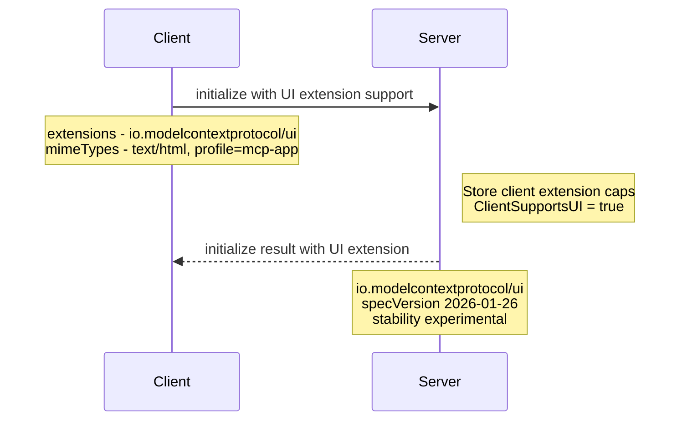
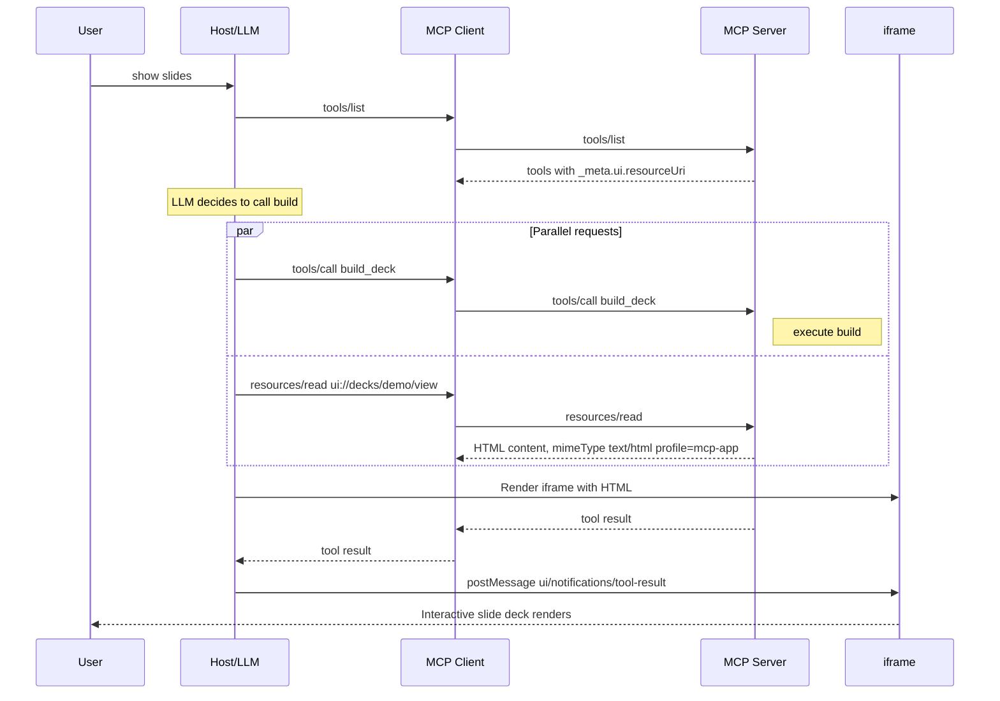
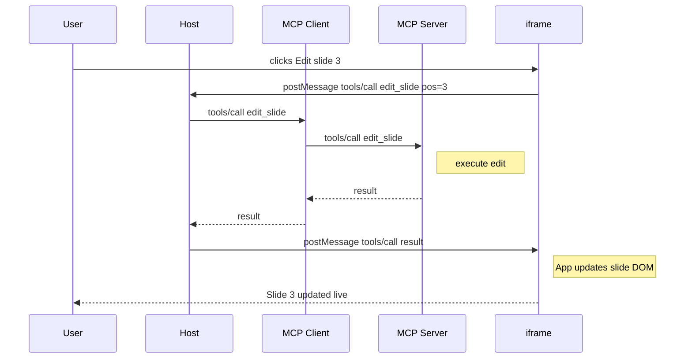
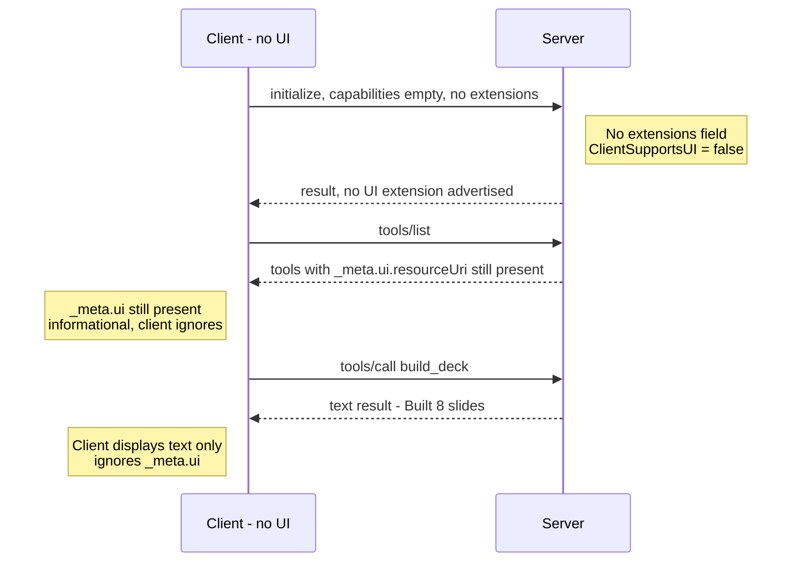
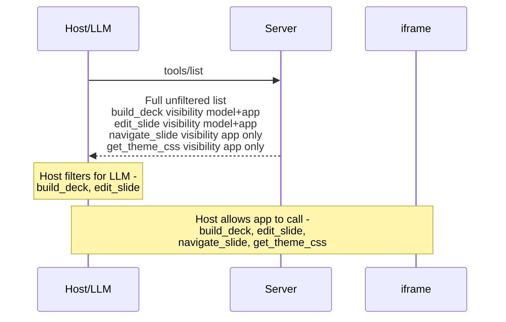

# MCP Apps Extension — Design

## Overview

MCPKit adds support for the MCP Apps extension (`io.modelcontextprotocol/ui`), enabling servers to return interactive HTML user interfaces that render inline in host conversations (Claude, ChatGPT, VS Code Copilot, Goose, etc.). This document covers the architecture, protocol surface, edge cases, conformance strategy, and the slyds reference integration.

MCP Apps combines two existing MCP primitives — tools declare a UI resource via `_meta.ui.resourceUri`, and resources serve the HTML content with MIME type `text/html;profile=mcp-app`. The interactive iframe↔host protocol (JSON-RPC over `postMessage`) is the host's responsibility; mcpkit's scope is the server-side metadata, resource serving, capability negotiation, and client-side detection.

## Design Principles

1. **Core module stays zero-deps** — UI metadata types live in mcpkit core. No HTML processing, no JS bundling, no browser dependencies.
2. **Additive extension** — servers without UI config work exactly as before. Existing tools, resources, and transports are unaffected.
3. **Interface in core, implementation in sub-module** — core defines the `UIMetadata` struct and `_meta` plumbing. A future `mcpkit/ui` sub-module could provide helpers (CSP builders, HTML inlining), but is not required for v1.
4. **Follow the auth pattern** — `UIExtension` implements `ExtensionProvider`, registered via `WithExtension(ui.UIExtension{})`. Capability negotiation mirrors auth exactly.
5. **Slyds as the reference app** — design decisions are validated against a real use case: an HTML slide deck editor served as an MCP App.

## Spec Reference

- Extension ID: `io.modelcontextprotocol/ui`
- Feature name: "MCP Apps" (the extension ID uses `ui`, but the feature is called "Apps")
- Spec version: `2026-01-26` (current stable)
- Overview: [modelcontextprotocol.io/extensions/apps/overview](https://modelcontextprotocol.io/extensions/apps/overview)
- Repository: [github.com/modelcontextprotocol/ext-apps](https://github.com/modelcontextprotocol/ext-apps)
- Specification: [specification/2026-01-26/apps.mdx](https://github.com/modelcontextprotocol/ext-apps/blob/main/specification/2026-01-26/apps.mdx)
- Supported hosts: Claude, Claude Desktop, VS Code GitHub Copilot, Goose, Postman, MCPJam

### Implementation notes

- Standard `Permissions` values: `"camera"`, `"microphone"`, `"geolocation"`, `"clipboardWrite"`
- `PrefersBorder` and `Domain` fields may be host-specific — not all hosts honor them
- Hosts may preload `ui://` resources before tools/call for faster rendering

## Architecture

```
┌──────────────────────────────────────────────────────────────────────┐
│  mcpkit (core module, zero UI deps)                                  │
│                                                                      │
│  NEW TYPES:                          CHANGED TYPES:                  │
│  ├─ UIMetadata                       ├─ ToolDef._Meta                │
│  ├─ UICSPConfig                      ├─ ResourceDef._Meta            │
│  ├─ UIVisibility (enum)              ├─ ResourceReadContent._Meta    │
│  └─ AppMIMEType (const)              ├─ ClientCapabilities.Extensions│
│                                      └─ initializeParams (extensions)│
│                                                                      │
│  EXISTING (unchanged):                                               │
│  ├─ ExtensionProvider                                                │
│  ├─ Extension, Stability                                             │
│  └─ RegisterResource, RegisterTool, etc.                             │
├──────────────────────────────────────────────────────────────────────┤
│  mcpkit/ui (optional sub-module, future)                             │
│                                                                      │
│  IMPLEMENTATIONS:                                                    │
│  ├─ UIExtension         → implements ExtensionProvider               │
│  ├─ CSPBuilder          → constructs CSP from UICSPConfig            │
│  ├─ HTMLInliner         → inlines CSS/JS/images into single HTML     │
│  └─ RegisterAppTool()   → convenience: tool + resource in one call   │
│                                                                      │
│  (v1 ships UIExtension only; helpers are future work)                │
├──────────────────────────────────────────────────────────────────────┤
│  Application (e.g. slyds)                                            │
│                                                                      │
│  ├─ Registers tools with _Meta.UI.ResourceUri = "ui://..."           │
│  ├─ Registers ui:// resources serving HTML                           │
│  ├─ Optionally embeds App-class JS for bidirectional communication   │
│  └─ Uses mcpkit server as usual (SSE / Streamable HTTP)              │
└──────────────────────────────────────────────────────────────────────┘
```

### Responsibility Boundary

```
┌─────────────┐     ┌──────────────┐     ┌─────────────────┐     ┌──────────┐
│  MCP Client │     │  MCP Server  │     │  Host (Claude,   │     │  iframe  │
│  (mcpkit    │     │  (mcpkit     │     │   ChatGPT, etc.) │     │  (MCP    │
│   client)   │     │   server)    │     │                  │     │   App)   │
├─────────────┤     ├──────────────┤     ├──────────────────┤     ├──────────┤
│ Negotiate   │◄───►│ Advertise    │     │                  │     │          │
│ extensions  │     │ extension    │     │                  │     │          │
│             │     │              │     │                  │     │          │
│ tools/list  │◄───►│ Return tools │     │                  │     │          │
│             │     │ with _meta.ui│     │                  │     │          │
│             │     │              │     │                  │     │          │
│ tools/call  │◄───►│ Execute tool │     │ Render iframe    │────►│ Display  │
│             │     │ return result│     │ from ui:// res   │     │ HTML     │
│             │     │              │     │                  │     │          │
│ resources/  │◄───►│ Serve HTML   │     │ postMessage      │◄───►│ JSON-RPC │
│ read        │     │ content      │     │ bridge           │     │ ui/*     │
└─────────────┘     └──────────────┘     └──────────────────┘     └──────────┘
                    ▲                    ▲
                    │ mcpkit scope       │ host scope
                    │ (this design)      │ (not mcpkit)
```

**mcpkit is responsible for:**
- Capability negotiation (server advertises, client detects)
- `_meta.ui` metadata on tools and resources
- Serving `ui://` resources with correct MIME type
- Tool visibility filtering
- Text-only fallback when client doesn't support UI

**The host is responsible for:**
- Fetching `ui://` resources via `resources/read`
- Rendering HTML in sandboxed iframe
- The `postMessage` ↔ JSON-RPC bridge (`ui/initialize`, `ui/notifications/*`, etc.)
- CSP enforcement, permission policy, double-iframe sandbox proxy
- Teardown lifecycle

## Core Types

### UIMetadata (new, in mcpkit core)

```go
// UIMetadata describes UI presentation metadata for tools and resources.
// Serialized as the "_meta.ui" object in tools/list and resources/read responses.
type UIMetadata struct {
    // ResourceUri points to a ui:// resource containing the HTML to render.
    // Required for tools that want inline UI rendering.
    ResourceUri string `json:"resourceUri,omitempty"`

    // Visibility controls who can see/call this tool.
    // Default: ["model", "app"] (both LLM and iframe can access).
    Visibility []UIVisibility `json:"visibility,omitempty"`

    // CSP declares external domains the app needs to load resources from.
    // Hosts construct Content-Security-Policy from these declarations.
    CSP *UICSPConfig `json:"csp,omitempty"`

    // Permissions lists browser capabilities the app requests
    // (e.g., "camera", "microphone", "geolocation", "clipboardWrite").
    Permissions []string `json:"permissions,omitempty"`

    // PrefersBorder hints whether the host should draw a visible border.
    // nil = host decides, true = border, false = no border.
    PrefersBorder *bool `json:"prefersBorder,omitempty"`

    // Domain requests a dedicated sandbox origin for the app.
    // Format is host-dependent (e.g., "myapp" → myapp.claudemcpcontent.com).
    Domain string `json:"domain,omitempty"`
}

// UICSPConfig declares external domains for Content-Security-Policy construction.
type UICSPConfig struct {
    // ConnectDomains → CSP connect-src (fetch, XHR, WebSocket targets).
    ConnectDomains []string `json:"connectDomains,omitempty"`

    // ResourceDomains → CSP script-src, style-src, img-src, font-src, media-src.
    ResourceDomains []string `json:"resourceDomains,omitempty"`

    // FrameDomains → CSP frame-src (nested iframes).
    FrameDomains []string `json:"frameDomains,omitempty"`

    // BaseUriDomains → CSP base-uri.
    BaseUriDomains []string `json:"baseUriDomains,omitempty"`
}

// UIVisibility controls tool access scope.
type UIVisibility string

const (
    // UIVisibilityModel means the tool appears in tools/list for the LLM.
    UIVisibilityModel UIVisibility = "model"

    // UIVisibilityApp means the tool is callable by apps from the same server.
    UIVisibilityApp UIVisibility = "app"
)

// AppMIMEType is the MIME type for MCP App HTML resources.
const AppMIMEType = "text/html;profile=mcp-app"
```

### Changes to ToolDef

```go
type ToolDef struct {
    Name        string         `json:"name"`
    Description string         `json:"description"`
    InputSchema any            `json:"inputSchema"`
    Annotations map[string]any `json:"annotations,omitempty"`

    // Meta holds protocol-level metadata (e.g., UI presentation hints).
    // Serialized as "_meta" in the tools/list response.
    Meta *ToolMeta `json:"_meta,omitempty"`
}

// ToolMeta holds protocol-level metadata for a tool definition.
type ToolMeta struct {
    // UI contains MCP Apps presentation metadata.
    UI *UIMetadata `json:"ui,omitempty"`
}
```

### Changes to ResourceReadContent

```go
type ResourceReadContent struct {
    URI      string `json:"uri"`
    MimeType string `json:"mimeType,omitempty"`
    Text     string `json:"text,omitempty"`
    Blob     string `json:"blob,omitempty"`

    // Meta holds per-content metadata (e.g., UI overrides).
    // Takes precedence over the resource-level _meta from resources/list.
    Meta *ResourceContentMeta `json:"_meta,omitempty"`
}

// ResourceContentMeta holds per-content metadata in resources/read responses.
type ResourceContentMeta struct {
    UI *UIMetadata `json:"ui,omitempty"`
}
```

### Changes to ClientCapabilities

```go
type ClientCapabilities struct {
    Sampling    *struct{}                     `json:"sampling,omitempty"`
    Roots       *RootsCap                     `json:"roots,omitempty"`
    Elicitation *struct{}                     `json:"elicitation,omitempty"`
    Extensions  map[string]ClientExtensionCap `json:"extensions,omitempty"`
}

// ClientExtensionCap describes a client's support for a specific extension.
type ClientExtensionCap struct {
    MIMETypes []string `json:"mimeTypes,omitempty"`
}
```

### UIExtension (in mcpkit/ui sub-module)

```go
package ui

import "github.com/panyam/mcpkit"

// UIExtension declares support for the MCP Apps extension.
type UIExtension struct{}

func (UIExtension) Extension() mcpkit.Extension {
    return mcpkit.Extension{
        ID:          "io.modelcontextprotocol/ui",
        SpecVersion: "2026-01-26",
        Stability:   mcpkit.Experimental,
    }
}
```

## Protocol Flows

### Flow A: Capability negotiation (initialize)



### Flow B: Tool with UI — full lifecycle (host perspective)



### Flow C: Interactive tool call from iframe (bidirectional)



### Flow D: Text-only fallback (client without UI support)



### Flow E: Tool visibility filtering



## Observed Host Behavior (MCPJam, April 2026)

Testing slyds against MCPJam revealed important details about how hosts
actually implement the `_meta.ui.resourceUri` lifecycle. These behaviors
are not specified in the ext-apps spec and vary by host.

### Pre-fetch timing

MCPJam pre-fetches `resources/read` for `_meta.ui.resourceUri` **immediately
before** `tools/call` — not at connection time or `tools/list` time. The
pre-fetch and tool call happen in parallel (resource read ~300ms before tool
result arrives). The iframe boots from the pre-fetched HTML while the tool
executes.

### Template URI concrete fallbacks

Hosts (MCPJam, Claude Desktop, VS Code) do not substitute template variables
in `_meta.ui.resourceUri`. They fetch the URI literally. mcpkit's
`RegisterAppTool` generates a concrete fallback URI (e.g.,
`ui://slyds/preview_deck/latest`) and a wrapped handler that replays the
most recent tool-call params into the `TemplateHandler`.

**Implication:** The concrete fallback handler receives `resources/read`
before any `tools/call` has set params. It must return a valid HTML document
(not an error), or the host will fail to boot the iframe entirely. mcpkit
returns a placeholder HTML in this case.

### Tool results flow through postMessage, not resource re-fetch

After `tools/call` completes, the host does **not** re-fetch `resources/read`.
Instead, it forwards the tool result to the already-loaded iframe via
`postMessage` (`ui/notifications/tool-result`). The iframe app is responsible
for updating its DOM based on the tool result.

This means:
- The initial `resources/read` HTML is the **app shell** — it boots the
  iframe and sets up the postMessage listener
- Tool results are delivered as structured data, not as new HTML
- `notifications/resources/updated` does not trigger a resource re-fetch
  in MCPJam (as of April 2026)

### `structuredContent` must be a JSON object

The MCP draft spec (schema) defines `structuredContent` in `CallToolResult`
as `"type": "object"`. MCPJam validates this and rejects arrays with:
`"expected record, received array"`. Tools returning lists must wrap them
in an object (e.g., `{"decks": [...]}`).

### Spec gaps identified

1. **No guidance on pre-fetch behavior.** The spec does not define when
   hosts should fetch `_meta.ui.resourceUri` relative to `tools/call`. In
   practice, hosts pre-fetch in parallel with the tool call. Servers with
   template URIs must handle `resources/read` before any tool has been
   called (empty params).

2. **No guidance on template URI substitution.** The spec does not say
   whether hosts should substitute template variables in
   `_meta.ui.resourceUri` before fetching. Current hosts do not. This
   forces the concrete-fallback pattern with param capture.

3. **Unclear role of `notifications/resources/updated`.** The spec defines
   this notification for resource subscriptions, but its interaction with
   MCP Apps iframes is unspecified. MCPJam ignores it for app resources —
   tool results flow through `postMessage` instead.

These observations have been filed as feedback to the ext-apps spec:
<!-- TODO: add link to spec issue once filed -->

## Edge Cases and Challenges

### 1. HTML Size Limits

**Problem:** Self-contained HTML (with inlined CSS, JS, images) can be large. Slyds presentations with embedded images can exceed several MB. The MCP protocol has no explicit size limit, but:
- JSON-RPC messages transit as HTTP request/response bodies
- Some hosts may impose practical limits on resource content size
- Base64-encoded images inflate 33%

**Mitigation:**
- `ResourceReadContent.Blob` (base64) is available alongside `.Text` — hosts should accept both
- Servers SHOULD keep HTML under 5MB when possible (practical limit observed in Claude)
- For large assets, use `UICSPConfig.ResourceDomains` to allow loading from external CDN instead of inlining
- Document size guidance in API docs; don't enforce in the library (host limits vary)

**Impact on slyds:** `slyds build` already inlines everything. Add an `--mcp-app` build mode that uses external asset references (via CSP domains) instead of inlining when the deck exceeds a size threshold.

### 2. Resource Caching and Staleness

**Problem:** Hosts MAY cache `resources/read` responses. After a user edits a slide via `edit_slide`, the cached HTML is stale. The spec says dynamic metadata should go in `resources/read` (not `resources/list`), but there's no explicit cache invalidation protocol.

**Mitigation:**
- Use `notifications/resources/list_changed` to signal the host that resources have changed (already supported by mcpkit)
- The tool result from `edit_slide` can include updated text content as a hint
- Hosts that support `list_changed` will re-fetch; others may show stale content
- For slyds: after any mutation, emit `list_changed` notification AND return the updated slide content in the tool result

**mcpkit change:** Add a helper `NotifyResourcesChanged(ctx)` that emits the notification. Tool handlers call this after mutations.

### 3. Metadata Precedence (resources/list vs resources/read)

**Problem:** `_meta.ui` can appear in both `resources/list` (static defaults) and `resources/read` (per-response overrides). The spec says `resources/read` takes precedence.

**Mitigation:**
- mcpkit already separates `ResourceDef` (for list) and `ResourceReadContent` (for read)
- Both now get `_Meta` fields
- Document the precedence rule; don't merge them in the library (that's the host's job)
- Servers SHOULD put stable metadata in `ResourceDef._Meta` and dynamic overrides in `ResourceReadContent._Meta`

### 4. Deprecated Flat Metadata Format

**Problem:** The spec mentions a deprecated flat format: `_meta["ui/resourceUri"]` (string). The nested `_meta.ui.resourceUri` format is current. The old format "will be removed before GA."

**Mitigation:**
- mcpkit implements only the current nested format
- Document that the deprecated format is not supported
- If conformance tests check the old format, we'll note it as intentional non-support of a deprecated path

### 5. Tool Visibility Enforcement (Server vs Host)

**Problem:** The spec says hosts "MUST NOT include tools in the agent's tool list when visibility does not include 'model'". This is host-side filtering. But what about servers?

**Decision:**
- mcpkit `tools/list` returns ALL tools, including app-only ones (visibility metadata included)
- Hosts filter before presenting to the LLM
- mcpkit's Go client adds a `ListToolsForModel()` helper that filters locally (useful for testing)
- Server-side `tools/call` does NOT enforce visibility — any authenticated caller can invoke any tool. Visibility is a presentation concern, not an access control mechanism.

**Rationale:** The spec places enforcement responsibility on the host. Server-side enforcement would break legitimate use cases (automated testing, admin tools calling app-only tools directly).

### 6. CSP Construction is Host-Side

**Problem:** The `UICSPConfig` domains are declarations, not enforcement. The server says "I need these domains"; the host constructs and enforces the actual CSP header on the iframe.

**Mitigation:**
- mcpkit just serializes the CSP config as metadata
- No CSP header generation in mcpkit (that's iframe/host responsibility)
- A future `mcpkit/ui.CSPBuilder` could generate CSP strings for testing/validation, but it's not needed for v1

### 7. ui:// Scheme is Not Special in MCP Protocol

**Problem:** `ui://` is a URI convention, not a protocol-level concept. `resources/read` works with any URI. A host could fetch `ui://foo` or `https://example.com/foo` — the scheme doesn't change the transport.

**Mitigation:**
- mcpkit treats `ui://` URIs like any other — they're just strings matched against registered resources/templates
- Validation: `UIMetadata.ResourceUri` SHOULD start with `ui://` — emit a warning log if it doesn't, but don't reject
- Template matching already works: `ui://decks/{name}/view` matches `ui://decks/demo/view`

### 8. Blob vs Text Content Delivery

**Problem:** HTML can be served as `text` (UTF-8 string) or `blob` (base64-encoded). The spec says both are valid. Large HTML with binary assets (e.g., embedded images in data URIs) may be more efficiently served as blob to avoid JSON string escaping overhead.

**Decision:**
- Default to `text` for HTML resources (simpler, debuggable)
- Applications can use `blob` via `ResourceReadContent.Blob` for binary-heavy content
- mcpkit does not auto-convert between formats

### 9. Streamable HTTP Required, SSE Discouraged

**Problem:** MCP Apps require `resources/read` to fetch UI content. Both transports support this. However, the interactive phase (iframe calling tools back) requires the host to proxy `tools/call` from the iframe through the MCP client to the server. This works on both transports, but Streamable HTTP is the modern choice and what hosts test against.

**Impact:** No mcpkit changes needed. Both transports already support all required methods. Slyds already defaults to Streamable HTTP.

### 10. No Teardown Protocol for Server

**Problem:** The spec defines `ui/resource-teardown` as a host→iframe notification. There is no corresponding teardown notification from host to server. The server has no way to know when the iframe is closed.

**Mitigation:**
- This is by design — the server is stateless with respect to UI rendering
- Tool handlers should not assume the UI is visible
- For slyds: slide builds are idempotent, no cleanup needed

### 11. Auth + Apps Interaction

**Problem:** If the server requires auth (mcpkit/auth), the host must include Bearer tokens in `resources/read` requests for `ui://` resources, same as any other MCP request.

**Mitigation:**
- Already handled — `CheckAuth` runs on ALL requests including `resources/read`
- No special auth bypass for `ui://` resources
- Document that auth tokens are required for UI resource fetches

### 12. Multiple UIs per Server

**Problem:** A server may expose multiple tools, each with a different UI. Each tool's `_meta.ui.resourceUri` points to a different `ui://` resource.

**Mitigation:**
- Already supported — each tool has its own `_meta.ui.resourceUri`
- Resource templates handle parameterized UIs (e.g., `ui://decks/{name}/view`)
- Each UI resource can have different CSP, permissions, and domain settings

### 13. Host Doesn't Support Apps Extension

**Problem:** If the host doesn't advertise `io.modelcontextprotocol/ui` in its client capabilities (or doesn't send an `extensions` field at all), the server's UI tools still work — they just return text content without the iframe rendering.

**Decision:**
- Tools MUST always return useful text content in `ToolResult`, regardless of UI support
- `_meta.ui` is informational — a bonus for capable hosts
- The server can check `ClientSupportsUI()` and conditionally add richer text output for non-UI clients (e.g., ASCII table of slide titles instead of rendered deck)

```go
// In tool handler:
if mcpkit.ClientSupportsUI(ctx) {
    // Host will render the iframe; minimal text is fine
    return mcpkit.TextResult("Deck built: 8 slides"), nil
} else {
    // No UI; return detailed text
    return mcpkit.TextResult(detailedSlideList), nil
}
```

## Conformance Strategy

### Server Conformance Tests

mcpkit adds conformance tests for the server-side Apps protocol surface. These validate metadata correctness and protocol behavior, not iframe rendering.

#### Test Categories

| Category                   | Tests | What's Validated                                                                                                                          |
|----------------------------|-------|-------------------------------------------------------------------------------------------------------------------------------------------|
| **Capability negotiation** | 3     | Server advertises `io.modelcontextprotocol/ui` extension; client extensions parsed; extension absent when not registered                  |
| **Tool metadata**          | 5     | `_meta.ui.resourceUri` present; visibility defaults; CSP serialization; permissions array; prefersBorder                                  |
| **Resource serving**       | 4     | `ui://` resource returns HTML; MIME type is `text/html;profile=mcp-app`; text and blob delivery; template matching for parameterized URIs |
| **Metadata precedence**    | 2     | `_meta.ui` on `ResourceReadContent` overrides `ResourceDef`; absent `_meta` on read inherits from list                                    |
| **Visibility**             | 3     | tools/list includes all tools; `ListToolsForModel()` filters app-only; app-only tools callable via tools/call                             |
| **Text fallback**          | 2     | Tools return text content alongside UI metadata; result is valid without UI rendering                                                     |
| **Integration**            | 2     | Auth + UI (token required for ui:// read); resource change notification after mutation                                                    |

**Total: ~21 conformance scenarios**

#### Conformance Test Structure

```
mcpkit/
  conformance/
    baseline.yml              ← add apps: section
  cmd/testserver/
    main.go                   ← add UI tools + resources
  tests/
    apps/                     ← new: Apps conformance tests
      go.mod                  ← separate module (like e2e)
      apps_test.go            ← capability negotiation tests
      tools_test.go           ← tool metadata tests
      resources_test.go       ← resource serving tests
      visibility_test.go      ← visibility filtering tests
      testenv_test.go         ← test environment setup
```

#### Test Server Additions

The existing `cmd/testserver` gains UI-enabled tools:

```go
// Tool with UI resource
srv.RegisterTool(mcpkit.ToolDef{
    Name:        "show-dashboard",
    Description: "Display an interactive dashboard",
    InputSchema: map[string]any{"type": "object"},
    Meta: &mcpkit.ToolMeta{
        UI: &mcpkit.UIMetadata{
            ResourceUri: "ui://dashboard/view",
            Visibility:  []mcpkit.UIVisibility{mcpkit.UIVisibilityModel, mcpkit.UIVisibilityApp},
            CSP: &mcpkit.UICSPConfig{
                ResourceDomains: []string{"cdn.example.com"},
            },
            PrefersBorder: boolPtr(false),
        },
    },
}, dashboardHandler)

// App-only tool (hidden from LLM)
srv.RegisterTool(mcpkit.ToolDef{
    Name:        "navigate-dashboard",
    Description: "Navigate to a specific dashboard tab",
    InputSchema: map[string]any{...},
    Meta: &mcpkit.ToolMeta{
        UI: &mcpkit.UIMetadata{
            Visibility: []mcpkit.UIVisibility{mcpkit.UIVisibilityApp},
        },
    },
}, navigateHandler)

// UI resource
srv.RegisterResource(mcpkit.ResourceDef{
    URI:      "ui://dashboard/view",
    Name:     "Dashboard UI",
    MimeType: mcpkit.AppMIMEType,
}, func(ctx context.Context, req mcpkit.ResourceRequest) (mcpkit.ResourceResult, error) {
    return mcpkit.ResourceResult{
        Contents: []mcpkit.ResourceReadContent{{
            URI:      "ui://dashboard/view",
            MimeType: mcpkit.AppMIMEType,
            Text:     dashboardHTML,
        }},
    }, nil
})
```

### Client Conformance

mcpkit's Go client gains:

```go
// Advertise UI support during initialize
client := mcpkit.NewClient(url, info,
    mcpkit.WithUIExtension(),  // adds io.modelcontextprotocol/ui to client caps
)

// Check server support
if client.ServerSupportsUI() { ... }

// Filter tools by visibility
modelTools := client.ListToolsForModel()  // excludes app-only
allTools := client.ListTools()             // includes all
```

### External Conformance (ext-apps test suite)

The ext-apps repo has Playwright-based e2e tests in `tests/e2e/`. These test the full stack (server + host + iframe). To validate mcpkit servers against these:

1. Build a test server using mcpkit with UI tools
2. Run the ext-apps Playwright suite against it
3. Track results in `conformance/baseline.yml` under `apps:` section

This is Phase 4 work — requires Node.js + Playwright + a basic host harness.


## Tracing across the Apps Bridge (SEP-414 P6, issue 660)

MCP Apps run an `iframe ↔ Bridge JS ↔ host ↔ server` loop. A user gesture in the iframe triggers a tool call. If the iframe has its own observability (browser OTel SDK, RUM), the trace **starts in the browser** — but without explicit propagation, the postMessage hop strips the W3C trace context and the backend tool-call span emitted by the MCP server can't stitch to its browser-side parent. Structurally this is the same "non-MCP propagation hop" as the events EventBus, just across the JS/Go boundary instead of replica/replica.

mcpkit's Apps Bridge relays W3C trace context across the boundary by carrying `traceparent` / `tracestate` inside `params._meta` on the bridge envelope — the same shape SEP-414 uses on the MCP wire. The relay is **off by default** (no provider wired = no propagation, zero overhead); adopters opt in on each side independently.

### Iframe side (TS bridge)

`MCPApp.setTraceContextProvider(fn)` registers a function the bridge calls before sending each outbound request and notification. The function returns `{traceparent?, tracestate?}` (or null to skip). When a traceparent is supplied, it merges into `params._meta` — caller-set `_meta.traceparent` wins (the provider is a fallback, never a clobber, mirroring Go-side `core.InjectTraceContextIntoParams`).

Wiring against the OTel JS SDK (typical production setup):

```ts
import { propagation, context } from "@opentelemetry/api";
MCPApp.setTraceContextProvider(() => {
  const carrier: Record<string, string> = {};
  propagation.inject(context.active(), carrier);
  return { traceparent: carrier.traceparent, tracestate: carrier.tracestate };
});
```

Demo wiring (no OTel SDK; just to prove the relay works):

```ts
MCPApp.setTraceContextProvider(() => ({
  traceparent: "00-0af7651916cd43dd8448eb211c80319c-b7ad6b7169203331-01",
}));
```

The hook ships dep-free — mcp-app-bridge.ts pulls no OTel JS dependency. Bundle size unchanged for adopters who don't wire the hook.

### Host side (Go AppHost)

`ui.WithTracerProvider(tp core.TracerProvider)` on `AppHost` opts the forward path into instrumentation. When set, `handleAppRequest` extracts the bridge envelope's `params._meta.traceparent`, makes it the parent of an `apps.host.forward` span, and forwards the request to the MCP server. The outbound `client.Call` preserves the iframe's `_meta.traceparent` on the wire (SEP-414 P3's caller-set-wins contract), so the server's P2 trace middleware stitches the dispatch span as a child of the iframe's traceparent.

```go
host := ui.NewAppHost(c, bridge, ui.WithTracerProvider(tp))
```

End-to-end trace shape with both sides wired:

```
iframe-stamped traceparent      (browser OTel; the parent)
└─ apps.host.forward             (ext/ui AppHost, this PR)
   └─ server tools/call          (mcpkit server, SEP-414 P2)
      └─ tool handler work
```

### Open: should the Apps spec mandate this?

The Apps Bridge is a non-MCP transport. SEP-414 governs only the MCP wire. **Whether `traceparent` rides the bridge envelope as a cross-SDK interop contract belongs in the ext-ui / Apps spec, not SEP-414.** mcpkit ships the relay; if cross-SDK adopters need to interop, the Apps WG can lift this shape into the spec. Filed as a follow-up if upstream interest surfaces — for now, documented here and shipped per mcpkit's own design.

## Related Docs

| Doc | What |
|-----|------|
| [APPS_ONBOARDING.md](APPS_ONBOARDING.md) | Step-by-step guide to ship your app as an MCP App |
| [APPS_HOST.md](APPS_HOST.md) | AppHost, AppBridge, ServerRegistry — building custom hosts |
| [SEP_414_OTEL.md](SEP_414_OTEL.md) | Trace context propagation across mcpkit — context for the bridge relay above |
| `ext/ui/` README | Bridge JS API, typed app tools, embedding |
| `examples/apps/` | Working examples: vanilla, todolist, react |
| `tests/e2e/apps/` README | Conformance test matrix with sequence diagrams |
