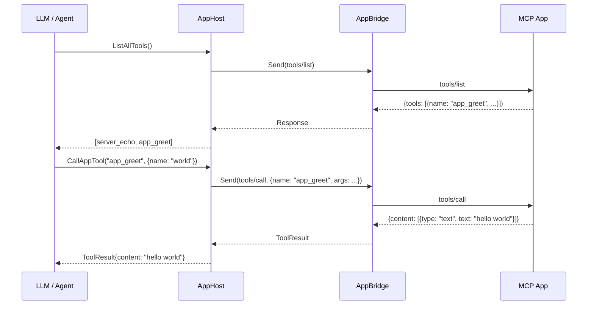
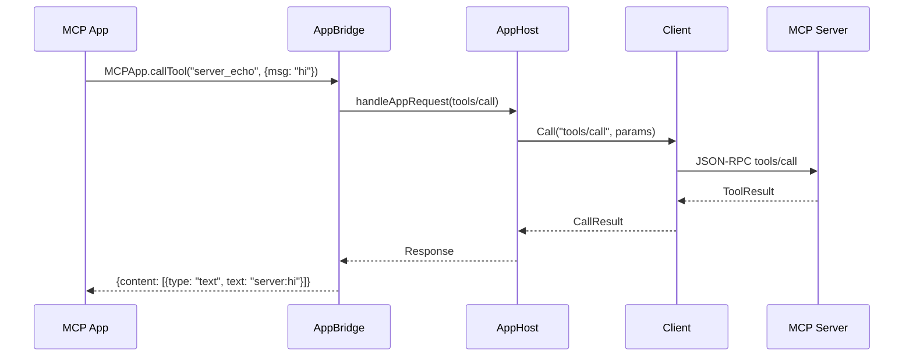
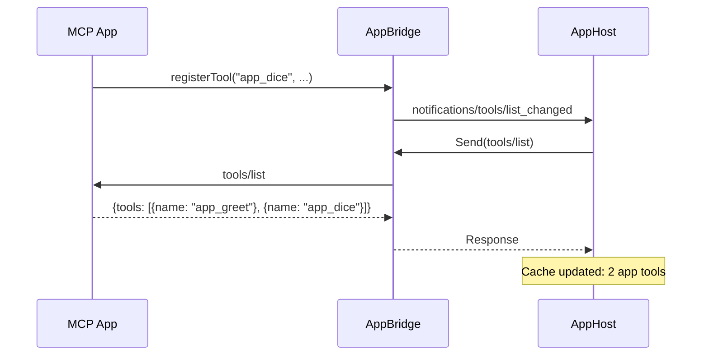
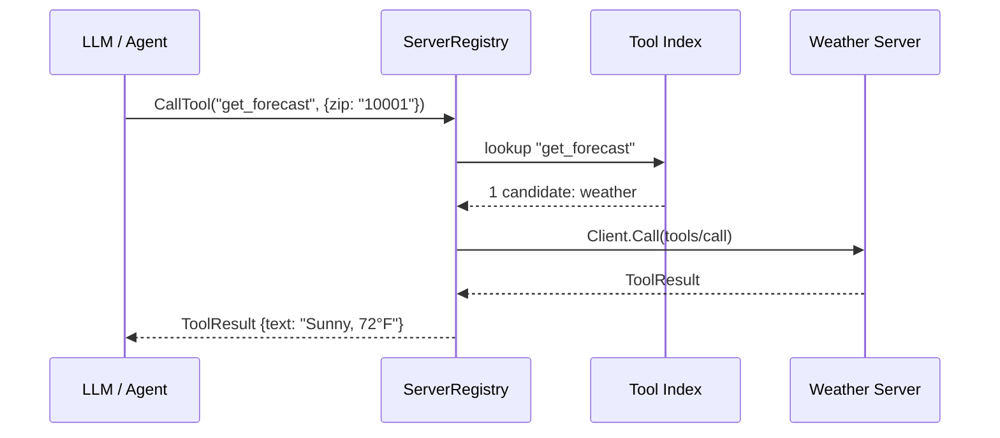
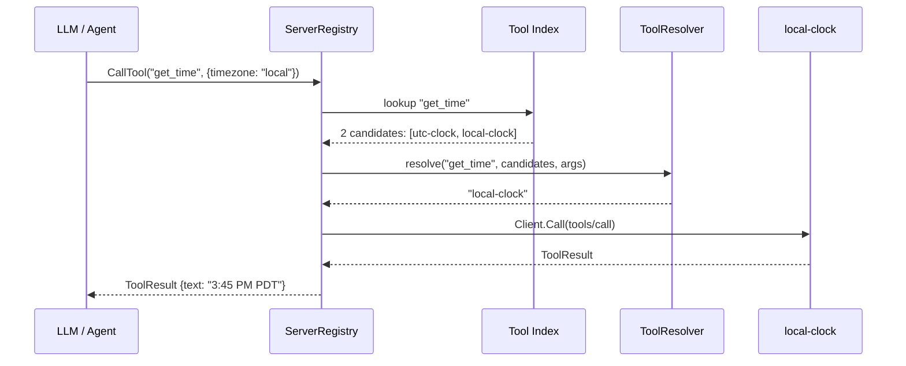
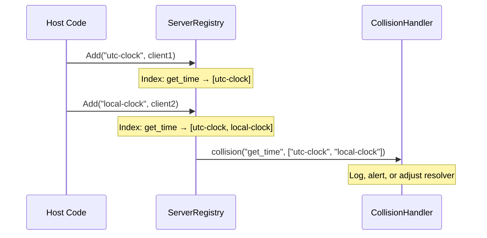

# MCP Apps — Host Implementation Guide

Building custom MCP hosts (agent harnesses, desktop apps, custom UIs) using AppHost and ServerRegistry.

See [APPS_DESIGN.md](APPS_DESIGN.md) for the core protocol design and [APPS_ONBOARDING.md](APPS_ONBOARDING.md) for shipping your app.

## AppHost — Host-Side App Management

### Overview

`AppHost` (`ext/ui/app_host.go`) wraps an MCP `Client` and an `AppBridge` to mediate between an MCP App (running in a browser iframe or in-process) and an MCP server. It enables custom host implementations — agent harnesses, desktop apps, or custom UIs — to manage app-provided tools.

### Architecture

```
┌─────────────────┐     ┌───────────────┐     ┌──────────────┐
│   MCP Server    │◄────│   AppHost     │────►│   MCP App    │
│  (tools, etc.)  │     │ (mediator)    │     │ (iframe/Go)  │
│                 │     │               │     │              │
│ server_echo     │     │ ListAllTools  │     │ app_greet    │
│ server_fetch    │     │ CallAppTool   │     │ app_dice     │
└─────────────────┘     └───────────────┘     └──────────────┘
        ▲                    │    ▲                   │
        │                    │    │                   │
    Client.Call         bridge.Send            bridge.SendToHost
```

### Request Flows

#### Host→App: Calling an App-Provided Tool

The host (or LLM) discovers app tools via `ListAppTools()` and invokes them via `CallAppTool()`. The bridge forwards the JSON-RPC request to the app.



#### App→Host: App Calling a Server Tool

The app calls `MCPApp.callTool("server_tool", {...})`, which the bridge forwards to AppHost, which forwards to the MCP server via the Client.



#### Dynamic Tool Registration

When the app registers a new tool at runtime, a `notifications/tools/list_changed` notification triggers a cache refresh.



### AppBridge Interface

`AppBridge` abstracts the host↔app communication channel. The protocol is JSON-RPC 2.0, mirroring the `postMessage` protocol in `mcp-app-bridge.ts`.

```go
type AppBridge interface {
    Send(ctx context.Context, req *core.Request) (*core.Response, error)
    SetRequestHandler(fn func(ctx context.Context, req *core.Request) *core.Response)
    SetNotificationHandler(fn func(method string, params json.RawMessage))
    Start() error
    Close() error
}
```

Implementations:
- **`InProcessAppBridge`** — for testing. Registers Go handlers that simulate app-side tools.
- **WebSocket bridge** (future) — for Go hosts serving browser iframes over WebSocket.
- **Native bridge** (future) — for desktop apps using webview/wails JS↔Go bindings.

### Usage with OAuth Authentication

AppHost does not own auth — the caller wires `ext/auth.OAuthTokenSource` into the Client. Auth retry (401/403) happens transparently at the Client's transport layer.

```go
// 1. Create OAuth token source
ts := &auth.OAuthTokenSource{
    ServerURL:   "https://api.example.com/mcp",
    ClientID:    "my-host",
    OpenBrowser: browser.Open,
    CredStore:   myCredStore,
}

// 2. Create client with auth
c := client.NewClient(url, info,
    client.WithTokenSource(ts),
    client.WithUIExtension(),
)
c.Connect()
defer c.Close() // also closes OAuthTokenSource

// 3. Create AppHost
bridge := ui.NewInProcessAppBridge() // or WebSocketBridge for browser
host := ui.NewAppHost(c, bridge)
host.Start(ctx)
defer host.Close()

// 4. Use
tools, _ := host.ListAllTools(ctx) // server + app tools
result, _ := host.CallAppTool(ctx, "app_greet", map[string]any{"name": "world"})
```

### Lifecycle

1. Create `Client` with desired auth and extensions
2. `Client.Connect()` — MCP handshake with server
3. `NewAppHost(client, bridge)` + `host.Start(ctx)` — wires bridge handlers, fetches initial tool list
4. Use `ListAllTools`, `CallAppTool`, etc.
5. `host.Close()` — closes bridge
6. `client.Close()` — closes MCP session and auth token source

## ServerRegistry — Multi-Server Aggregation

### Overview

`ServerRegistry` (`ext/ui/server_registry.go`) manages connections to multiple MCP servers simultaneously. It aggregates tool lists across servers, routes tool calls to the correct server, and provides pluggable collision resolution for ambiguous tool names.

### Architecture

```
┌──────────────────────────────────────────────────────────┐
│                    ServerRegistry                        │
│                                                          │
│  ┌─────────────┐  ┌─────────────┐  ┌─────────────┐     │
│  │  "weather"   │  │  "calendar"  │  │   "game"    │     │
│  │  Client      │  │  Client      │  │  Client     │     │
│  │  (OAuth)     │  │  (Bearer)    │  │  (no auth)  │     │
│  │             │  │             │  │  + AppHost  │     │
│  │ get_forecast│  │ list_events │  │  new_game   │     │
│  │ get_alerts  │  │ create_event│  │  get_board  │     │
│  └──────┬──────┘  └──────┬──────┘  └──────┬──────┘     │
│         │                │                │             │
│  ┌──────┴────────────────┴────────────────┴──────┐      │
│  │              Tool Index                        │      │
│  │  get_forecast → weather                        │      │
│  │  get_alerts   → weather                        │      │
│  │  list_events  → calendar                       │      │
│  │  create_event → calendar                       │      │
│  │  new_game     → game (server)                  │      │
│  │  get_board    → game (app)                     │      │
│  └───────────────────────────────────────────────┘      │
│                                                          │
│  AllTools() → [get_alerts, get_board, get_forecast, ...] │
│  CallTool("get_forecast", args) → routes to weather      │
│  CallToolOn("game", "get_board", args) → routes to app   │
└──────────────────────────────────────────────────────────┘
```

### Request Flows

#### Unambiguous tool call — direct routing



#### Ambiguous tool call — resolver invoked



#### Collision detection on Add



### Usage

```go
// Create registry with collision handling
reg := ui.NewServerRegistry(
    ui.WithToolResolver(func(ctx context.Context, name string,
        candidates []ui.RegisteredTool, args map[string]any) (string, error) {
        // Pick based on args, LLM context, user input, etc.
        return candidates[0].ServerID, nil
    }),
    ui.WithCollisionHandler(func(name string, ids []string) {
        log.Printf("tool %q available from servers: %v", name, ids)
    }),
)

// Add servers with independent auth
weatherClient := client.NewClient(url1, info, client.WithTokenSource(oauthTS))
weatherClient.Connect()
reg.Add(ctx, "weather", weatherClient)

calendarClient := client.NewClient(url2, info, client.WithClientBearerToken("sk-..."))
calendarClient.Connect()
reg.Add(ctx, "calendar", calendarClient)

// Add server with app bridge
bridge := ui.NewInProcessAppBridge()
gameClient := client.NewClient(url3, info)
gameClient.Connect()
reg.AddWithBridge(ctx, "game", gameClient, bridge)

// Use
tools, _ := reg.AllTools(ctx)                              // all tools, clean names
result, _ := reg.CallTool(ctx, "get_forecast", args)       // auto-routes
result, _ = reg.CallToolOn(ctx, "game", "get_board", args) // explicit routing

// Cleanup
reg.Close()       // closes bridges
weatherClient.Close()  // caller owns clients
calendarClient.Close()
gameClient.Close()
```
