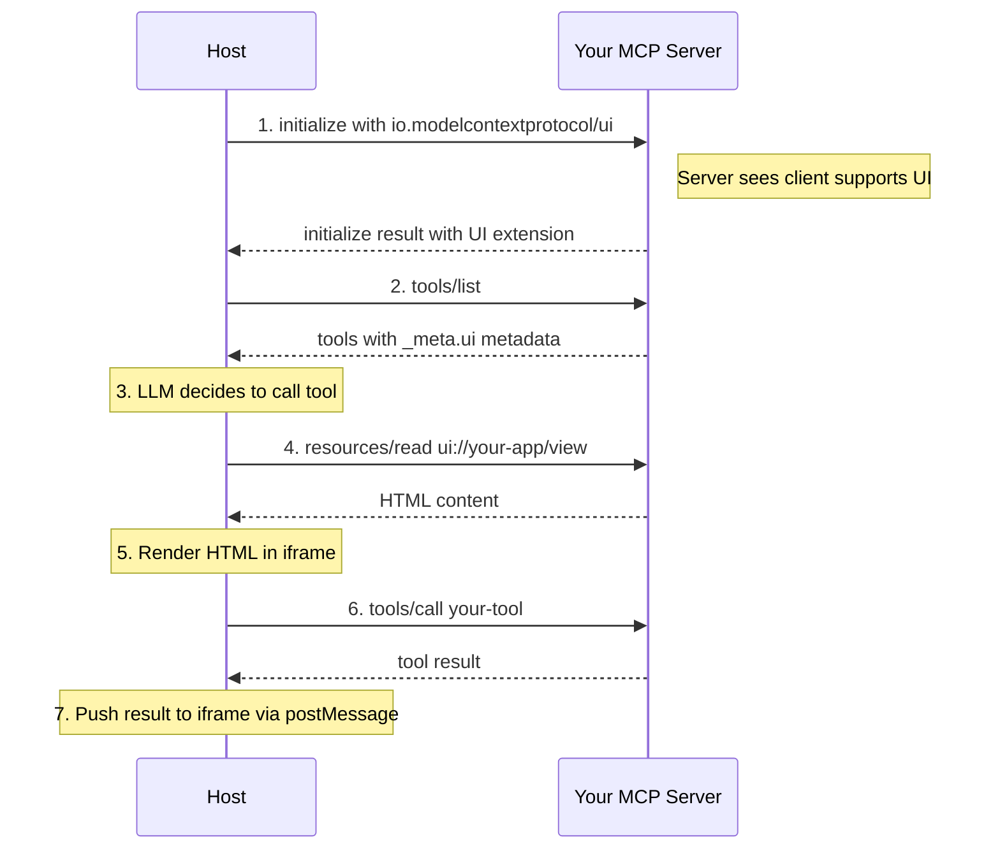
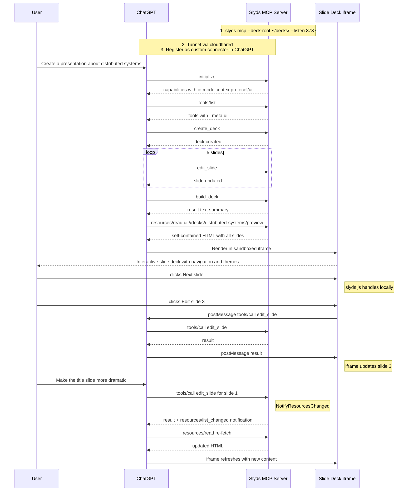

# Ship Your App as an MCP App via mcpkit

See [APPS_DESIGN.md](APPS_DESIGN.md) for the core protocol design and [APPS_HOST.md](APPS_HOST.md) for building custom hosts.

This section is a complete walkthrough for taking any Go application with an MCP server (built on mcpkit) and making it render interactive UI in Claude, ChatGPT, VS Code Copilot, and other MCP Apps hosts. It uses slyds as the running example, but the pattern applies to any app.

### Prerequisites

Your app needs:
1. An MCP server built on mcpkit (Streamable HTTP transport)
2. A tool that produces or displays HTML content
3. The HTML itself (self-contained or with declared external assets)

### Step 1: Understand What the Host Expects

When a host like Claude or ChatGPT calls your tool, here's what happens behind the scenes:



The host needs three things from your server:
- **Extension declaration** in initialize → "I support MCP Apps"
- **Tool metadata** in tools/list → "This tool has a UI at this URI"
- **HTML resource** via resources/read → "Here's the HTML to render"

### Step 2: Register the Extension

Tell the host your server supports MCP Apps:

```go
import (
    "github.com/panyam/mcpkit"
    "github.com/panyam/mcpkit/ui"
)

srv := mcpkit.NewServer(
    mcpkit.ServerInfo{Name: "slyds", Version: "1.0"},
    mcpkit.WithExtension(ui.UIExtension{}),  // ← declares io.modelcontextprotocol/ui
)
```

This adds the extension to your initialize response:

```json
{
  "capabilities": {
    "tools": {},
    "resources": {},
    "extensions": {
      "io.modelcontextprotocol/ui": {
        "specVersion": "2026-01-26",
        "stability": "experimental"
      }
    }
  }
}
```

### Step 3: Add `_meta.ui` to Your Tool

Link your tool to a UI resource:

```go
srv.RegisterTool(mcpkit.ToolDef{
    Name:        "build_deck",
    Description: "Build and display the presentation",
    InputSchema: buildDeckSchema,
    Meta: &mcpkit.ToolMeta{
        UI: &mcpkit.UIMetadata{
            ResourceUri:   "ui://decks/demo/preview",
            PrefersBorder: boolPtr(false),
        },
    },
}, buildDeckHandler)
```

**Key fields in `UIMetadata`:**

| Field           | Required | Purpose                                                 | Example                                                 |
|-----------------|----------|---------------------------------------------------------|---------------------------------------------------------|
| `ResourceUri`   | Yes      | `ui://` URI pointing to the HTML resource               | `"ui://decks/demo/preview"`                             |
| `Visibility`    | No       | Who can see/call this tool. Default: `["model", "app"]` | `[]UIVisibility{UIVisibilityApp}` for iframe-only tools |
| `CSP`           | No       | External domains the HTML needs to load                 | `{ResourceDomains: ["cdn.jsdelivr.net"]}`               |
| `Permissions`   | No       | Browser capabilities (camera, mic, clipboard)           | `["clipboardWrite"]`                                    |
| `PrefersBorder` | No       | Whether host should draw a border around the iframe     | `boolPtr(false)`                                        |
| `Domain`        | No       | Request a dedicated sandbox origin                      | `"slyds"`                                               |

**Important:** Your tool handler MUST still return useful text content. Non-UI clients (CLI tools, older hosts) ignore `_meta.ui` and only see the text:

```go
func buildDeckHandler(ctx context.Context, req mcpkit.ToolRequest) (mcpkit.ToolResult, error) {
    // ... build the deck ...

    // Always return text — the UI is a bonus, not a replacement
    return mcpkit.TextResult("Built presentation: 8 slides, theme=default"), nil
}
```

### Step 4: Serve the HTML Resource

Register a resource handler for the `ui://` URI your tool references:

```go
// Static URI (one fixed UI):
srv.RegisterResource(mcpkit.ResourceDef{
    URI:      "ui://decks/demo/preview",
    Name:     "Deck Preview",
    MimeType: mcpkit.AppMIMEType,  // "text/html;profile=mcp-app"
}, func(ctx context.Context, req mcpkit.ResourceRequest) (mcpkit.ResourceResult, error) {
    html := buildSelfContainedHTML()
    return mcpkit.ResourceResult{
        Contents: []mcpkit.ResourceReadContent{{
            URI:      req.URI,
            MimeType: mcpkit.AppMIMEType,
            Text:     html,
        }},
    }, nil
})

// Parameterized URI (multiple UIs, e.g., one per deck):
srv.RegisterResourceTemplate(mcpkit.ResourceTemplate{
    URITemplate: "ui://decks/{name}/preview",
    Name:        "Deck Preview",
    MimeType:    mcpkit.AppMIMEType,
}, func(ctx context.Context, uri string, params map[string]string) (mcpkit.ResourceResult, error) {
    deckName := params["name"]
    html := buildHTMLForDeck(deckName)
    return mcpkit.ResourceResult{
        Contents: []mcpkit.ResourceReadContent{{
            URI:      uri,
            MimeType: mcpkit.AppMIMEType,
            Text:     html,
        }},
    }, nil
})
```

### Step 5: Prepare Your HTML

The HTML is rendered in a **sandboxed iframe** with restrictive defaults. Here's what that means for your content:

#### Option A: Self-contained HTML (simplest, recommended for v1)

Bundle everything — CSS, JS, images — into a single HTML file. No external requests, no CSP worries.

```html
<!DOCTYPE html>
<html lang="en">
<head>
  <meta charset="UTF-8">
  <style>/* all CSS inlined here */</style>
</head>
<body>
  <div id="app">Your content</div>
  <script>/* all JS inlined here */</script>
</body>
</html>
```

**Pros:** Works everywhere, no CSP configuration needed.
**Cons:** Large file size if assets are big. Base64 images inflate 33%.

**Practical size guidance:**
- Under 1MB: works reliably across all hosts
- 1-5MB: works on Claude and ChatGPT, may be slow
- Over 5MB: risk of timeouts or host-imposed limits — use Option B

#### Option B: External assets via CSP declarations

If your HTML loads scripts, fonts, or images from CDNs, declare the domains:

```go
Meta: &mcpkit.ToolMeta{
    UI: &mcpkit.UIMetadata{
        ResourceUri: "ui://my-app/view",
        CSP: &mcpkit.UICSPConfig{
            ResourceDomains: []string{
                "cdn.jsdelivr.net",     // JS libraries
                "fonts.googleapis.com", // Google Fonts
                "fonts.gstatic.com",    // Font files
            },
            ConnectDomains: []string{
                "api.example.com",      // XHR/fetch targets
            },
        },
    },
},
```

The host constructs CSP headers from these declarations:

```
                          Your declaration            Host-constructed CSP
                          ─────────────────           ────────────────────
CSP.ConnectDomains     →  ["api.example.com"]      →  connect-src 'self' api.example.com
CSP.ResourceDomains    →  ["cdn.jsdelivr.net"]     →  script-src 'self' 'unsafe-inline' cdn.jsdelivr.net
                                                       style-src 'self' 'unsafe-inline' cdn.jsdelivr.net
                                                       img-src 'self' data: cdn.jsdelivr.net
CSP.FrameDomains       →  ["youtube.com"]          →  frame-src youtube.com
```

**Default CSP (when no CSP declared):**
```
default-src 'none';
script-src 'self' 'unsafe-inline';
style-src 'self' 'unsafe-inline';
img-src 'self' data:;
connect-src 'none';
```

This means: no external fetches, no external scripts/images. Self-contained HTML works by default.

#### HTML gotchas in the sandbox

| What                                | Works?               | Notes                                       |
|-------------------------------------|----------------------|---------------------------------------------|
| Inline `<script>`                   | Yes                  | `'unsafe-inline'` is in default CSP         |
| Inline `<style>`                    | Yes                  | Same                                        |
| `<script src="cdn...">`             | Only with CSP        | Declare domain in `ResourceDomains`         |
| ``              | Yes                  | `data:` is in default `img-src`             |
| ``           | Only with CSP        | Declare domain in `ResourceDomains`         |
| `fetch()` / `XMLHttpRequest`        | Only with CSP        | Declare domain in `ConnectDomains`          |
| `localStorage` / cookies            | No                   | Sandbox blocks these                        |
| `window.open()` / `target="_blank"` | No                   | Use `ui/open-link` via postMessage instead  |
| `navigator.clipboard`               | Only with permission | Declare `"clipboardWrite"` in `Permissions` |

### Step 6: Choose Your Transport

MCP Apps hosts communicate over **Streamable HTTP**. This is the modern MCP transport and what all Apps-capable hosts use.

```go
mux := http.NewServeMux()
mux.Handle("/mcp", srv.Handler(mcpkit.WithStreamableHTTP(true)))
http.ListenAndServe(":8787", mux)
```

SSE transport also works (hosts fall back to it), but Streamable HTTP is preferred.

### Step 7: Connect to a Host

#### Claude (web or Desktop)

For local development, tunnel your server to the internet:

```bash
# Terminal 1: start your MCP server
slyds mcp --deck-root ~/presentations/ --listen :8787

# Terminal 2: tunnel via cloudflare
npx cloudflared tunnel --url http://localhost:8787
# → https://random-name.trycloudflare.com
```

Then in Claude:
1. Profile → Settings → Connectors → Add custom connector
2. URL: `https://random-name.trycloudflare.com/mcp`
3. Start a new chat and ask Claude to use your tool

**Note:** Custom connectors require a paid Claude plan (Pro, Max, or Team).

#### ChatGPT

ChatGPT supports MCP Apps via its connector system. The flow is similar — expose your server URL and register it as a connector.

#### VS Code Copilot

Add to your VS Code MCP settings (`.vscode/mcp.json` or user settings):

```json
{
  "servers": {
    "slyds": {
      "url": "http://localhost:8787/mcp"
    }
  }
}
```

#### For production deployment

In production, your MCP server runs behind HTTPS (not a tunnel). The same `/mcp` endpoint serves both regular MCP tools and UI resources. No special deployment changes are needed for MCP Apps — it's the same server, same endpoint, same transport.

```
Production deployment:

┌──────────────┐     ┌──────────────────┐     ┌──────────────────┐
│  Host        │     │  Load balancer   │     │  Your MCP server │
│  (Claude,    │────>│  (HTTPS term.)   │────>│  :8787/mcp       │
│   ChatGPT)   │     │                  │     │                  │
└──────────────┘     └──────────────────┘     │  tools/list      │
                                              │  tools/call      │
                                              │  resources/read  │
                                              │  (all same endpoint)
                                              └──────────────────┘
```

### Step 8: Add Interactivity (optional)

So far your app is read-only — the host renders HTML, the user views it. To make it interactive (user clicks a button in the iframe → calls a tool on your server), add a thin JS bridge to your HTML:

```javascript
// Minimal MCP App bridge — add to your HTML's <script>
(function() {
    if (window.parent === window) return; // not in iframe

    const pending = new Map();
    let nextId = 1;

    window.addEventListener('message', (event) => {
        const msg = event.data;
        if (!msg || !msg.jsonrpc) return;

        // Host pushing a tool result to us
        if (msg.method === 'ui/notifications/tool-result') {
            if (typeof window.onMCPToolResult === 'function') {
                window.onMCPToolResult(msg.params);
            }
        }

        // Response to a request we sent
        if (msg.id && pending.has(msg.id)) {
            const { resolve, reject } = pending.get(msg.id);
            pending.delete(msg.id);
            msg.error ? reject(msg.error) : resolve(msg.result);
        }
    });

    // Call a tool on your MCP server via the host
    window.callMCPTool = function(name, args) {
        return new Promise((resolve, reject) => {
            const id = nextId++;
            pending.set(id, { resolve, reject });
            window.parent.postMessage({
                jsonrpc: '2.0', id,
                method: 'tools/call',
                params: { name, arguments: args || {} }
            }, '*');
        });
    };
})();
```

Then in your HTML:

```html
<button onclick="callMCPTool('edit_slide', {position: 3, content: '...'})
    .then(() => location.reload())">
    Edit Slide 3
</button>
```

#### App-only tools

Some tools only make sense when called from the iframe, not by the LLM. For example, `navigate_slide` or `get_theme_css` are UI controls, not things an LLM should reason about. Mark these as app-only:

```go
srv.RegisterTool(mcpkit.ToolDef{
    Name:        "navigate_slide",
    Description: "Navigate to a specific slide by number",
    InputSchema: navigateSchema,
    Meta: &mcpkit.ToolMeta{
        UI: &mcpkit.UIMetadata{
            Visibility: []mcpkit.UIVisibility{mcpkit.UIVisibilityApp}, // hidden from LLM
        },
    },
}, navigateHandler)
```

The host filters these out of the LLM's tool list but still allows the iframe to call them.

### Step 9: Handle Mutations and Freshness

If your tools modify state (edit a slide, update a dashboard), the cached UI resource becomes stale. Signal the host to re-fetch:

```go
func editSlideHandler(ctx context.Context, req mcpkit.ToolRequest) (mcpkit.ToolResult, error) {
    // ... perform the edit ...

    // Tell the host: resources may have changed, re-fetch if needed
    mcpkit.NotifyResourcesChanged(ctx)

    return mcpkit.TextResult("Slide 3 updated"), nil
}
```

Not all hosts support this notification. For best compatibility:
1. Always call `NotifyResourcesChanged` after mutations
2. Also return useful text in the tool result (so non-UI clients see the update)
3. Design your UI to handle being rebuilt from scratch (host may re-fetch the entire HTML)

### Step 10: Test Locally

Before connecting to Claude/ChatGPT, validate your setup locally using mcpkit's Go client:

```go
client := mcpkit.NewClient("http://localhost:8787/mcp", clientInfo,
    mcpkit.WithUIExtension(),
)
if err := client.Connect(ctx); err != nil { ... }

// Verify extension negotiation
assert(client.ServerSupportsUI())

// Verify tool has _meta.ui
tools, _ := client.ListTools()
buildTool := findTool(tools, "build_deck")
assert(buildTool.Meta.UI.ResourceUri == "ui://decks/demo/preview")

// Verify resource serves HTML with correct MIME type
res, _ := client.ReadResource(ctx, "ui://decks/demo/preview")
assert(res.Contents[0].MimeType == "text/html;profile=mcp-app")
assert(strings.Contains(res.Contents[0].Text, "<!DOCTYPE html>"))
```

You can also use the ext-apps basic-host for visual testing:

```bash
git clone https://github.com/modelcontextprotocol/ext-apps.git
cd ext-apps/examples/basic-host
npm install
SERVERS='["http://localhost:8787/mcp"]' npm start
# → open http://localhost:8080
```

### Checklist: Is My App Ready?

```
Server setup:
  [ ] mcpkit server with Streamable HTTP transport
  [ ] UIExtension registered via WithExtension()
  [ ] At least one tool with _meta.ui.resourceUri
  [ ] Matching ui:// resource registered (exact or template)
  [ ] Tool handler returns text content (fallback for non-UI clients)

HTML content:
  [ ] Valid HTML5 document
  [ ] MIME type is text/html;profile=mcp-app
  [ ] Self-contained OR external domains declared in CSP
  [ ] Works in an iframe (no localStorage, no window.open)
  [ ] Under 5MB (or external assets via CSP for larger content)

Interactivity (optional):
  [ ] postMessage bridge in JS (callMCPTool function)
  [ ] App-only tools marked with visibility: ["app"]
  [ ] NotifyResourcesChanged called after mutations

Deployment:
  [ ] Server accessible via HTTPS (or tunnel for local dev)
  [ ] /mcp endpoint serves all MCP methods
  [ ] Registered as custom connector in Claude/ChatGPT
```

### End-to-End Example: Slyds on ChatGPT



