# Multi-replica notification delivery

This document describes how mcpkit fans server-pushed notifications across an N-replica deployment, and how adopters wire each notification surface to work correctly at N>1.

If you run mcpkit at N=1 (single server process), this doc is informational — nothing here is required. If you run N>1 (multiple replicas behind a load balancer or service mesh), **the surfaces enumerated here do not work without explicit wiring**, and a session connected to one replica will silently miss notifications generated on another.

The architecture lifted from issue 755 (PR A `#757`, PR B1 `#759`, PR B2 `#768`, PR B3 this doc).

## The problem at N>1

Every server-pushed notification mcpkit emits today reaches only the clients connected to the replica that generated it:

| Surface | Trigger | Affected at N>1 |
|---|---|---|
| `notifications/tools/list_changed` | `Registry.AddTool` / `RemoveTool` | ✗ Only origin replica's clients hear |
| `notifications/resources/list_changed` | `Registry.AddResource` / `RemoveResource` / `AddResourceTemplate` / `RemoveResourceTemplate` | ✗ Same |
| `notifications/prompts/list_changed` | `Registry.AddPrompt` / `RemovePrompt` | ✗ Same |
| `notifications/resources/updated` | `Server.NotifyResourceUpdated` | ✗ Only origin's clients subscribed via `resources/subscribe` hear |
| `notifications/events/event` | `YieldingSource.yield` (events SDK) | ✗ Only origin's stream subscribers hear (unless a Pattern B `Bus` is wired) |

Without coordination, adopters running N>1 either (a) avoid these notifications, (b) use sticky sessions to dodge the issue, or (c) build a custom cross-replica gossip layer.

## Pattern B as the recommended architecture

Each replica runs a publisher + subscriber pair against a shared pub/sub transport (Redis pubsub today; Kafka / NATS / SNS in principle). Notifications generated on replica K are:

1. Delivered locally to K's own connected clients (current behavior, unchanged).
2. Published outward through the transport.
3. Received on every other replica K′, which routes them through its local delivery machinery — applying its per-replica subscription filters as if the notification had been generated there.

Self-publish dedup happens inside the transport adapter, invisibly: each publisher carries a process-unique origin marker; the colocated subscriber drops messages carrying its own marker before invoking the receiver.

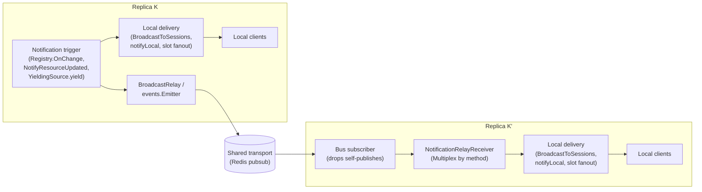

## Two routing categories

Every notification mcpkit emits falls into one of two categories, determined by whether each client needs an independent per-subscription filter on receive.

### Capability-shaped

No per-client filter. Every connected client that declared the capability sees the notification. The receiver fires `Server.BroadcastToSessions` on each receiving replica; the per-transport session machinery fans out to every session.

Surfaces:
- `notifications/tools/list_changed`
- `notifications/resources/list_changed`
- `notifications/prompts/list_changed`

Reference receiver: `server.CapabilityBroadcastReceiver`.

### Subscription-shaped

Each replica applies a per-subscription filter on receive. The notification reaches every replica via the transport; each replica decides which of its locally-subscribed clients hear it.

Surfaces and their per-replica filters:

| Surface | Per-replica filter | Reference receiver |
|---|---|---|
| `notifications/resources/updated` | URI prefix match against `resources/subscribe` set | `server.ResourcesUpdatedReceiver` |
| `notifications/events/event` | `EventDef.Match` per subscriber slot (tenant scoping, role-based, custom) | `events.YieldingSource` itself (implements `NotificationRelayReceiver`) |

### Decision table per surface

| Surface | Category | Per-replica filter | Receiver to install |
|---|---|---|---|
| `tools/list_changed` | Capability | none | `CapabilityBroadcastReceiver` |
| `resources/list_changed` | Capability | none | `CapabilityBroadcastReceiver` |
| `prompts/list_changed` | Capability | none | `CapabilityBroadcastReceiver` |
| `resources/updated` | Subscription | URI prefix | `ResourcesUpdatedReceiver` |
| `events/event` | Subscription | `EventDef.Match` per slot | `YieldingSource` (as receiver) |

## Component overview

### Server-level seams

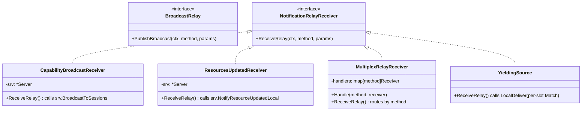

### Transport adapters

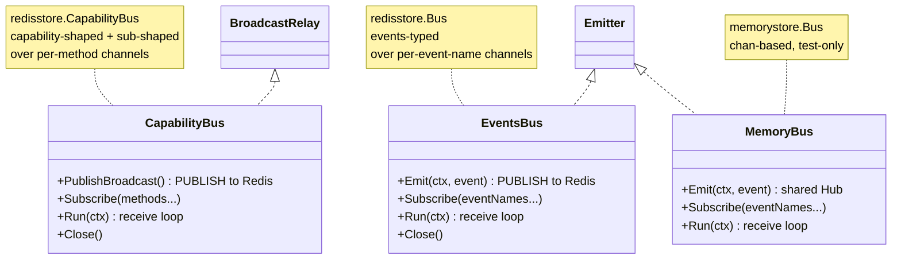

## Per-component flows

### `Server.Broadcast` — the dispatch fork

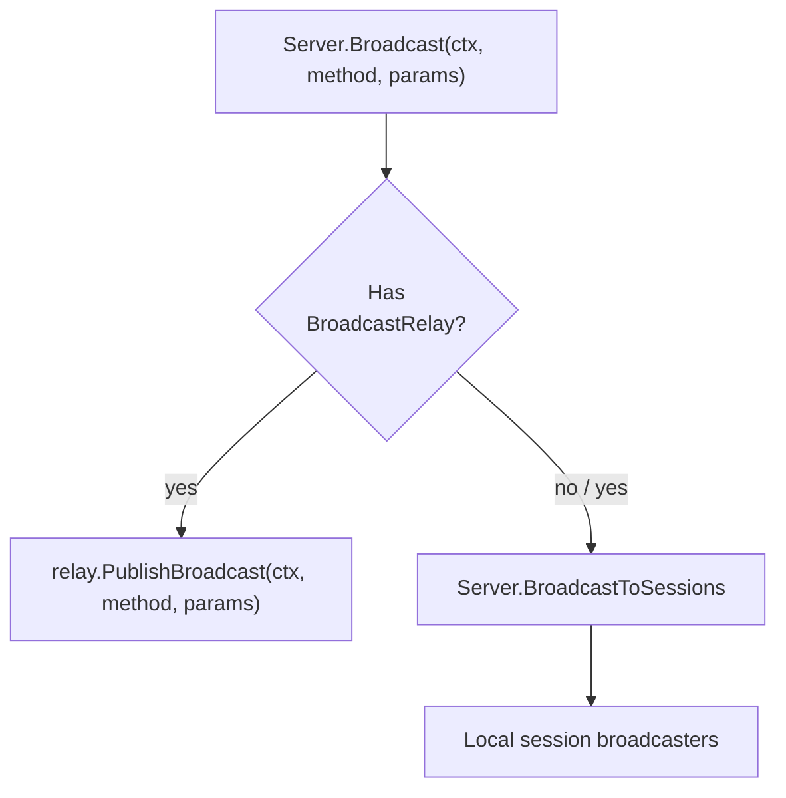

`Broadcast` always fires `BroadcastToSessions`. The relay's `PublishBroadcast` runs ALSO when a relay is installed. There's no else branch — local fan-out is universal.

`BroadcastToSessions` is the **local-only** path. The receive side of Pattern B calls this (NOT `Broadcast`) so a cross-replica relay receive doesn't re-publish through the relay and loop.

### `BroadcastRelay` — publish side

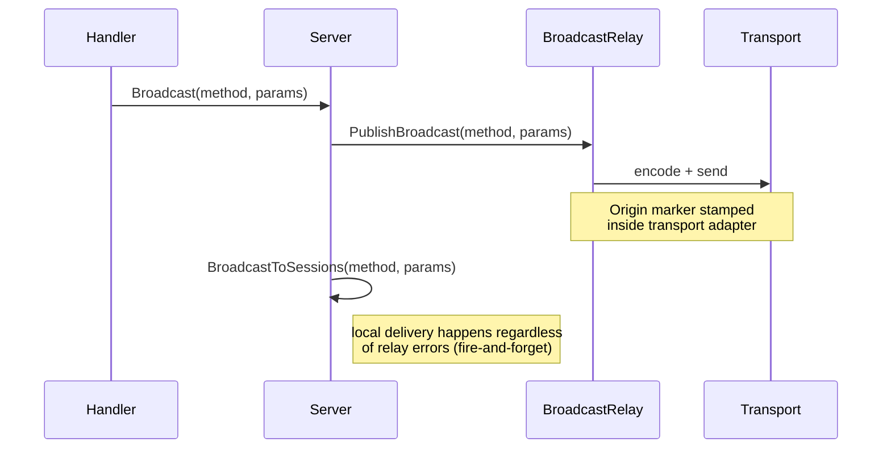

`BroadcastRelay` is fire-and-forget — errors are not surfaced. Transports log internally if a publish fails; local fan-out still runs.

### `NotificationRelayReceiver` — receive side

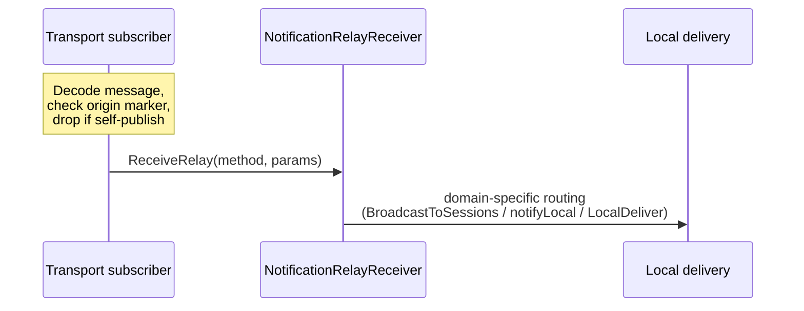

The receiver is the **routing decision** for cross-replica notifications. The transport handles dedup; the receiver decides what to do with each message destined for this replica.

### `MultiplexRelayReceiver` — per-method dispatch

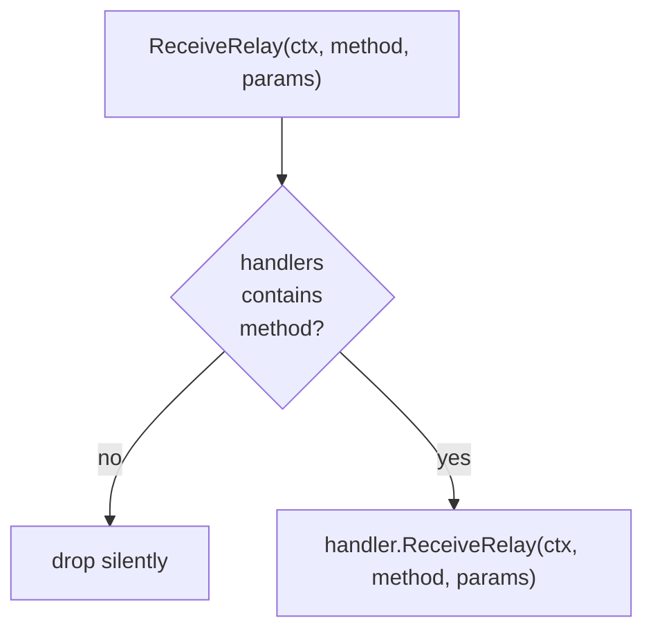

Multiplexer adopters wire one Bus + one multiplexer + multiple per-method receivers:

```go
mux := server.NewMultiplexRelayReceiver().
    Handle("notifications/tools/list_changed",        server.NewCapabilityBroadcastReceiver(srv)).
    Handle("notifications/resources/list_changed",    server.NewCapabilityBroadcastReceiver(srv)).
    Handle("notifications/prompts/list_changed",      server.NewCapabilityBroadcastReceiver(srv)).
    Handle("notifications/resources/updated",         server.NewResourcesUpdatedReceiver(srv))
bus, _ := redisstore.NewCapabilityBus(opts, mux)
```

### `CapabilityBroadcastReceiver` — capability-shaped routing

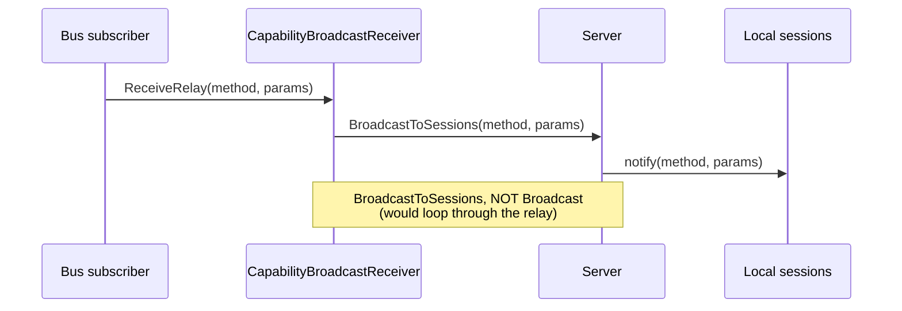

### `ResourcesUpdatedReceiver` — subscription-shaped routing for URIs

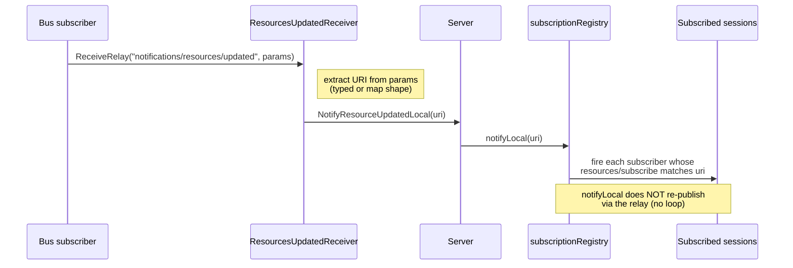

### `YieldingSource.ReceiveRelay` — subscription-shaped routing for events

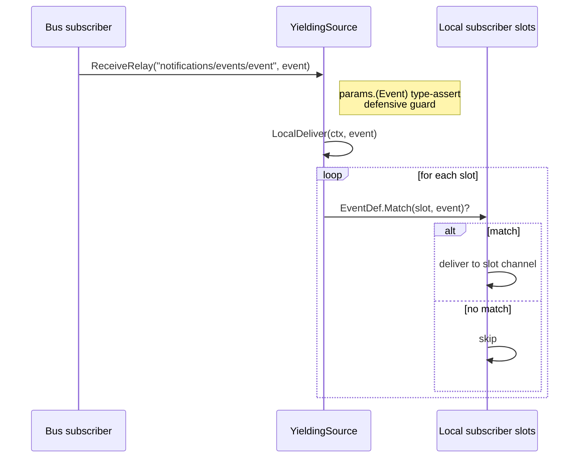

`YieldingSource.ReceiveRelay` is a thin adapter; `LocalDeliver` is the work — runs the per-slot fanout loop without firing the configured `Emitter` (so no re-publish).

### `redisstore.CapabilityBus` — capability-shaped Pattern B

```mermaid
flowchart LR
    subgraph "PublishBroadcast (origin)"
        P1[method + params]
        P2[envelope: {origin, params}]
        P3[Codec.Encode]
        P4["PUBLISH prefix.broadcast.method"]
        P1 --> P2 --> P3 --> P4
    end
    P4 -->|Redis| S1
    subgraph "Run loop (every replica)"
        S1[receive message]
        S2[Codec.Decode envelope]
        S3{origin == self?}
        S4[drop]
        S5[receiver.ReceiveRelay]
        S1 --> S2 --> S3
        S3 -->|yes| S4
        S3 -->|no| S5
    end
```

Wire format: per-method channel `<ChannelPrefix>.broadcast.<method>`. Payload is a JSON envelope `{"origin": "<uuid>", "params": <json>}`. Origin lives in the envelope, NOT in `params._meta` — capability-shaped notifications often have `nil params`, so the marker can't live there.

### `redisstore.Bus` — events-typed Pattern B

```mermaid
flowchart LR
    subgraph "Emit (origin)"
        P1["events.Event"]
        P2["event.Meta[origin] = marker"]
        P3[Codec.Encode]
        P4["PUBLISH prefix.event_name"]
        P1 --> P2 --> P3 --> P4
    end
    P4 -->|Redis| S1
    subgraph "Run loop (every replica)"
        S1[receive message]
        S2[Codec.Decode events.Event]
        S3{event.Meta[origin] == self?}
        S4[drop]
        S5["strip origin marker from Meta"]
        S6["receiver.ReceiveRelay(method, event)"]
        S1 --> S2 --> S3
        S3 -->|yes| S4
        S3 -->|no| S5 --> S6
    end
```

Wire format: per-event-name channel `<ChannelPrefix>.<event.Name>`. Payload is the `Codec`-encoded `events.Event` with the origin marker stamped on `event.Meta` (stripped before deliver so consumers never see it).

### `memorystore.Bus` — in-process test transport

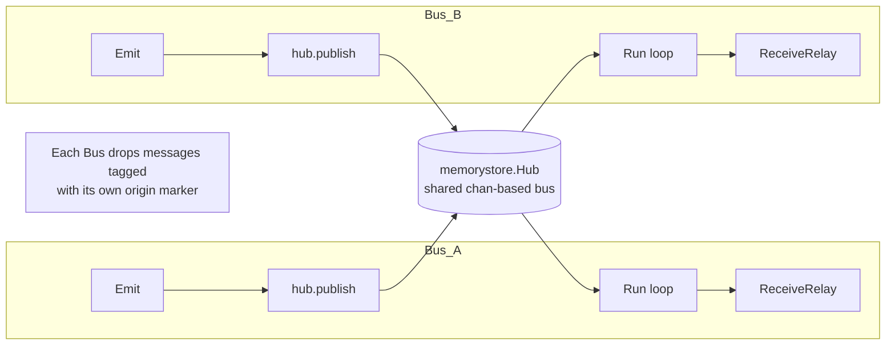

Test-only — same shape as `redisstore.Bus` but uses goroutines + channels in the same process. Lets the events SDK be exercised in multi-replica mode without standing up Redis.

## Per-surface end-to-end flows

### `notifications/tools/list_changed`

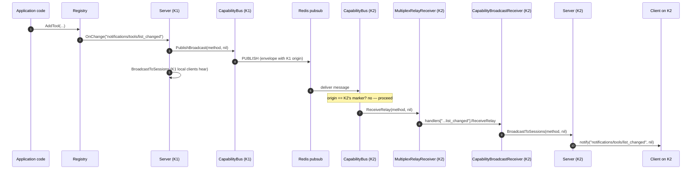

Same flow for `resources/list_changed` and `prompts/list_changed` — only the method name changes.

### `notifications/resources/updated`

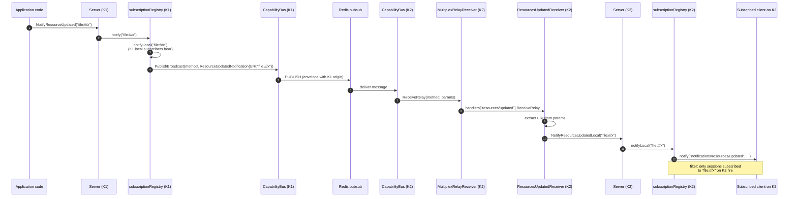

### `notifications/events/event`

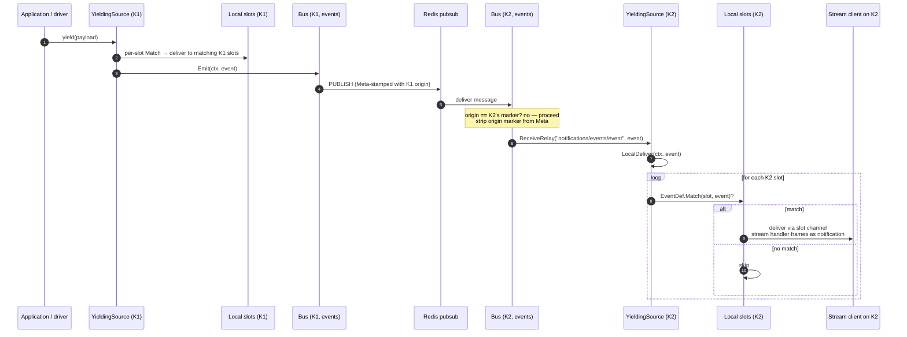

Per-slot `Match` runs on every replica that holds a matching subscriber. The transport sprays to all replicas; each replica filters its own slots independently.

## Scenario walkthroughs

### Single-replica yield (N=1, no relay)

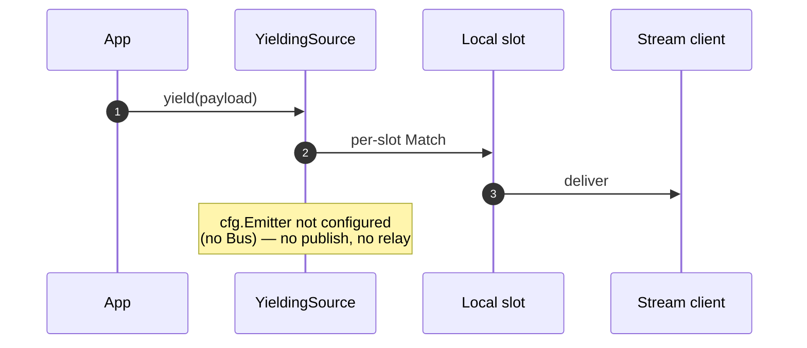

At N=1, adopters don't need any Pattern B wiring. The yield → for-loop → local slot path is the entire story. Configure a Bus only when adding a second replica.

### Cross-replica yield (N=3, with relay)

This is the headline path. App calls `yield` on K3; K1's stream subscriber (subscribed to the same event type) receives the event:

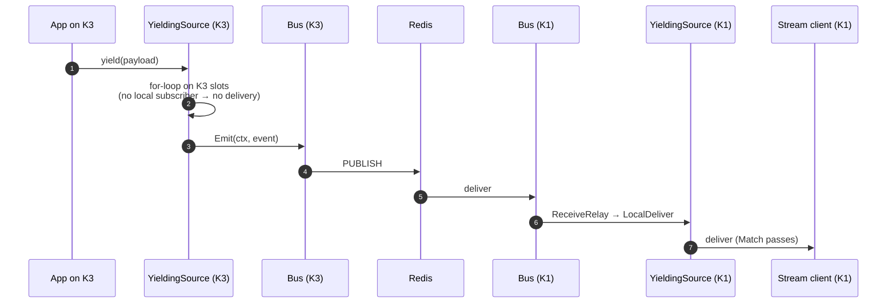

### Self-publish dedup

K1's own Bus subscriber receives the K1-published message. Without the dedup, K1's slot would fire twice (once via the yield's for-loop, once via the round-trip).

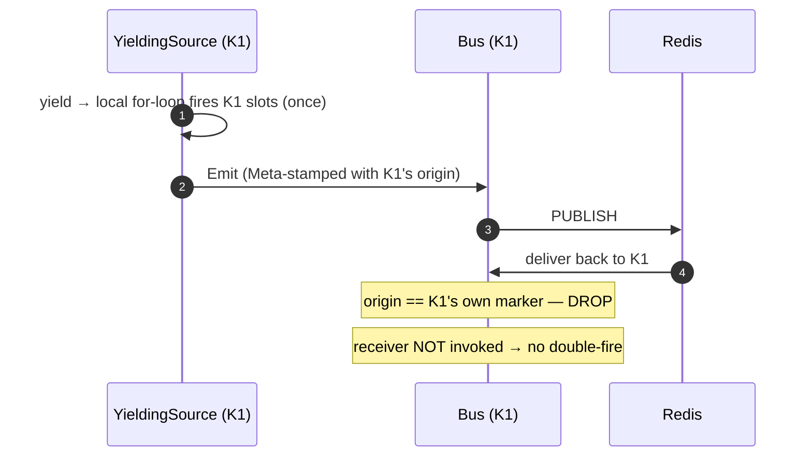

### Tenant scoping cross-replica

The bug that motivated issue 755: an asgard event reaches babylon's streamer because the cross-replica broadcast bypassed per-slot `Match`. With the fix (`LocalDeliver` routes through the slot system on every replica), `Match` runs per-slot per-replica and tenant scoping holds.

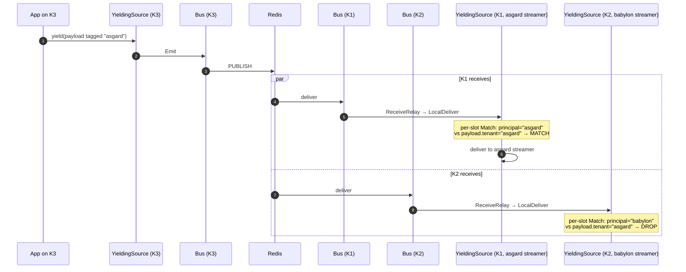

### Slow subscriber — drop policy

When a Bus's incoming queue fills (slow receiver), the Hub / Subscriber drops new messages rather than blocking the publisher. This is fail-fast, not retry — adopters depending on at-least-once delivery should run their transport with persistence enabled (Redis Streams, Kafka with consumer groups) instead of pubsub.

In Pattern B with Redis pubsub specifically:

| Symptom | Cause | Mitigation |
|---|---|---|
| Slow client backs up the receive loop | client's session notify channel buffered too small | increase session buffer in transport options |
| Bus's `incoming` queue fills | adopter's receiver does slow I/O inline | adopter's receiver should do work in a goroutine and return quickly |
| Redis pubsub backpressure to publisher | should never happen on pubsub | switch to a persistent transport (Redis Streams) if at-least-once is required |

### Replica join mid-flight

A new replica K4 attaches to the shared transport. Notifications generated AFTER K4's `Subscribe + Run` reach K4; notifications generated BEFORE do not (pubsub is fire-and-forget; K4 missed them).

```mermaid
sequenceDiagram
    autonumber
    participant K1 as Replica K1
    participant Redis as Redis
    participant K4 as New replica K4

    K1->>Redis: PUBLISH event-A
    Note over K4: K4 not yet attached → misses event-A
    K4->>Redis: SUBSCRIBE
    K1->>Redis: PUBLISH event-B
    Redis->>K4: deliver event-B
```

For adopter use cases needing replay (a new replica needs to catch up on missed list_changed notifications), the standard mitigation is for K4 to fetch the current catalog (`tools/list`, `resources/list`, `prompts/list`) on startup. Events/event has an explicit cursor + `events/poll` path for the same purpose; capability-shaped surfaces have no cursor and rely on the "fetch on startup" pattern.

### Replica leave mid-flight

A replica's `Bus.Close()` detaches it from the Hub / pubsub channel. Other replicas keep publishing and receiving; the departed replica's clients (if any disconnected with it) get the disconnection signal from the transport.

```mermaid
sequenceDiagram
    autonumber
    participant K1 as K1
    participant Redis as Redis
    participant K2 as K2 (closing)

    K2->>K2: Bus.Close()
    K2->>Redis: UNSUBSCRIBE
    K1->>Redis: PUBLISH event-C
    Note over K2: no longer receives — Close detached the subscriber
    Note over K1: K1 continues normally
```

## Configuration recipes

### Capability-shaped only (tools/resources/prompts list_changed)

When your server emits only catalog-mutation notifications and you don't use `resources/updated` or the events SDK:

```go
import (
    "github.com/panyam/mcpkit/server"
    redisstore "github.com/panyam/mcpkit/experimental/ext/events/stores/redis"
)

bus, err := redisstore.NewCapabilityBus(
    redisstore.CapabilityBusOptions{Client: redisClient},
    server.NewCapabilityBroadcastReceiver(srv),
)
if err != nil { /* handle */ }
defer bus.Close()

ctx, cancel := context.WithCancel(context.Background())
defer cancel()
_ = bus.Subscribe(ctx,
    "notifications/tools/list_changed",
    "notifications/resources/list_changed",
    "notifications/prompts/list_changed",
)
go bus.Run(ctx)

// Now srv.Broadcast / Registry.OnChange notifications fan across replicas.
srv := server.NewServer(info, server.WithBroadcastRelay(bus))
```

### Events SDK only (events/event)

When you use the events SDK but not the catalog notifications:

```go
import (
    "github.com/panyam/mcpkit/experimental/ext/events"
    redisstore "github.com/panyam/mcpkit/experimental/ext/events/stores/redis"
)

eventsBus, err := redisstore.NewBus(opts, mySource)  // mySource is the receiver
defer eventsBus.Close()

eventsBus.Subscribe(ctx, "chat.message", "presence.changed")
go eventsBus.Run(ctx)

cfg.Emitter = eventsBus
events.Register(cfg)
```

### Mixed — all 5 surfaces

When your server uses both catalog notifications AND `resources/updated` AND events. Wire one `CapabilityBus` + `MultiplexRelayReceiver` for the server-side notifications, and a separate `events.Bus` for events (events have a different wire format):

```go
// Server-side capability + subscription-shaped (3 list_changed + resources/updated)
mux := server.NewMultiplexRelayReceiver().
    Handle("notifications/tools/list_changed",     server.NewCapabilityBroadcastReceiver(srv)).
    Handle("notifications/resources/list_changed", server.NewCapabilityBroadcastReceiver(srv)).
    Handle("notifications/prompts/list_changed",   server.NewCapabilityBroadcastReceiver(srv)).
    Handle("notifications/resources/updated",      server.NewResourcesUpdatedReceiver(srv))

capBus, _ := redisstore.NewCapabilityBus(opts, mux)
defer capBus.Close()
_ = capBus.Subscribe(ctx,
    "notifications/tools/list_changed",
    "notifications/resources/list_changed",
    "notifications/prompts/list_changed",
    "notifications/resources/updated",
)
go capBus.Run(ctx)

// Events (separate Bus, separate wire format)
eventsBus, _ := redisstore.NewBus(opts, mySource)
defer eventsBus.Close()
_ = eventsBus.Subscribe(ctx, "chat.message")
go eventsBus.Run(ctx)
cfg.Emitter = eventsBus

srv := server.NewServer(info, server.WithBroadcastRelay(capBus))
events.Register(cfg)
```

### Custom transport adapter

For Kafka / NATS / SNS adopters writing their own transport:

```go
// Implement server.BroadcastRelay for the publish side:
type MyKafkaBus struct{ ... }

func (b *MyKafkaBus) PublishBroadcast(ctx context.Context, method string, params any) {
    // 1. Encode (method, params) into your wire format with origin marker
    // 2. Publish to Kafka topic
    // 3. Errors are fire-and-forget — log internally
}

// Implement the receive loop that calls server.NotificationRelayReceiver:
func (b *MyKafkaBus) Run(ctx context.Context) error {
    for msg := range b.consumer.Consume(ctx) {
        // 1. Decode message
        // 2. Check origin marker — drop if matches b.originID
        // 3. b.receiver.ReceiveRelay(ctx, method, params)
    }
}
```

The two interface implementations are independent — same struct can satisfy both, or separate publisher/subscriber types. Reference impls: `redisstore.CapabilityBus` (catalog-shaped) and `redisstore.Bus` (events-shaped).

## Trade-offs and gotchas

### Eventual consistency

Pattern B is asynchronous. A `tools/list_changed` fired on K1 reaches K2's clients with some latency (Redis pubsub roundtrip — typically single-digit milliseconds, but adversarial network conditions can extend this).

For applications that need synchronous cross-replica state, mcpkit's catalog mutations are NOT a synchronization primitive — the catalog itself remains per-replica. If K1 adds a tool and K2 doesn't acknowledge before a client on K2 calls `tools/list`, the call returns K2's view (pre-add).

For most adopters this is fine: list_changed notifications are advisory; the next `tools/list` call on K2 (potentially triggered by the notification) reflects K2's updated state after K2 picks up the new tool via its own registration path.

### Not at-least-once

Redis pubsub does NOT persist messages. A replica that's offline when a publish happens misses the message permanently. If your application semantics require at-least-once delivery (e.g., billing events), use a persistent transport (Redis Streams, Kafka with consumer groups) — the `BroadcastRelay` + `NotificationRelayReceiver` shapes accommodate either, but the reference `redisstore.CapabilityBus` uses pubsub specifically.

For events, the `EventBufferStore` + `events/poll` path gives at-least-once for clients that opt in.

### Subscribe state stays per-replica

A client subscribed to `resources/subscribe(file:///x)` on K1 is subscribed ON K1 ONLY. The cross-replica `notifications/resources/updated` reaches K2; if a client on K2 ALSO subscribed to `file:///x`, K2's `subscriptionRegistry` fires that client. There's no cross-replica subscription registry — each replica filters its own local set.

This means: clients DO NOT roam between replicas mid-session. If your deployment moves a client from K1 to K2 (load balancer reroutes, replica restart), the new connection re-subscribes from scratch.

### Origin marker is transport-internal

Adopters never see origin markers. Transport adapters handle them internally:

| Transport | Where origin lives |
|---|---|
| `redisstore.Bus` (events) | `event.Meta[_mcpkit_redisstore_origin]`, stripped before deliver |
| `redisstore.CapabilityBus` (notifications) | JSON envelope `{"origin": "..."}`, never seen by receiver |
| `memorystore.Bus` (test) | per-frame `origin` field, never seen by receiver |
| Your custom transport | wherever your wire format puts it; never on receiver-facing params |

If you're writing a custom transport, follow this rule. Adopters who depend on origin markers leaking into receiver code create coupling that breaks when transports change.

### `BroadcastToSessions` vs `Broadcast`

Two-method API on `Server`:

| Method | Fires relay? | Fires local sessions? | Who calls it? |
|---|---|---|---|
| `Broadcast` | yes (if installed) | yes | application code, `Registry.OnChange` |
| `BroadcastToSessions` | no | yes | `CapabilityBroadcastReceiver.ReceiveRelay` (the receive side of Pattern B) |

The split exists to break the recursion that would happen if the receive side called `Broadcast` (which would re-publish via the relay → receive again → publish again → loop). If you're writing a custom capability-shaped receiver, you MUST call `BroadcastToSessions`, not `Broadcast`.

Symmetric split exists on `subscriptionRegistry`:

| Method | Fires relay? | Fires local subscribers? | Who calls it? |
|---|---|---|---|
| `notify` | yes (if installed) | yes (via `notifyLocal`) | `Server.NotifyResourceUpdated`, internal callers |
| `notifyLocal` | no | yes | `ResourcesUpdatedReceiver.ReceiveRelay`, `Server.NotifyResourceUpdatedLocal` |

Same recursion guard. Custom subscription-shaped receivers call `notifyLocal` (via `Server.NotifyResourceUpdatedLocal`), not `notify`.

## Where to look in code

| Concept | File |
|---|---|
| `BroadcastRelay` interface | `server/relay.go` |
| `NotificationRelayReceiver` interface | `server/relay.go` |
| `CapabilityBroadcastReceiver` | `server/relay.go` |
| `ResourcesUpdatedReceiver` | `server/relay.go` |
| `MultiplexRelayReceiver` | `server/relay.go` |
| `Server.Broadcast` / `BroadcastToSessions` | `server/server.go` |
| `subscriptionRegistry.notify` / `notifyLocal` | `server/server.go` |
| `WithBroadcastRelay` option | `server/relay.go` |
| `redisstore.CapabilityBus` | `experimental/ext/events/stores/redis/capability_bus.go` |
| `redisstore.Bus` (events) | `experimental/ext/events/stores/redis/bus.go` |
| `memorystore.Bus` + `Hub` | `experimental/ext/events/stores/memory/bus.go` |
| `YieldingSource.LocalDeliver` / `ReceiveRelay` | `experimental/ext/events/yield.go` |

## Test coverage

Pattern B's contracts are covered by `-race`-clean tests at every layer. Reference them when changing this code:

| Layer | Tests |
|---|---|
| Server-level primitives | `server/relay_test.go` (16 tests covering `CapabilityBroadcastReceiver`, `ResourcesUpdatedReceiver`, `MultiplexRelayReceiver`, subscriptionRegistry split) |
| In-memory broadcast harness | `server/relay_inmemory_test.go` (5 tests: split semantics, fan-out, self-publish dedup, no-relay backwards compat, N×T matrix) |
| Wiring for 5 surfaces | `server/listchanged_relay_test.go` (3 tests covering all 4 list_changed paths + resources/updated end-to-end) |
| Events multi-replica | `experimental/ext/events/stores/memory/multi_replica_test.go` (5 tests: tenant scoping, self-publish dedup, N×T×M matrix, leave-mid-flight, high concurrency stress) |
| Redis CapabilityBus round-trip | `experimental/ext/events/stores/redis/capability_bus_test.go` (3 tests: cross-replica round-trip, single-bus self-dedup, full WithBroadcastRelay end-to-end via miniredis) |
