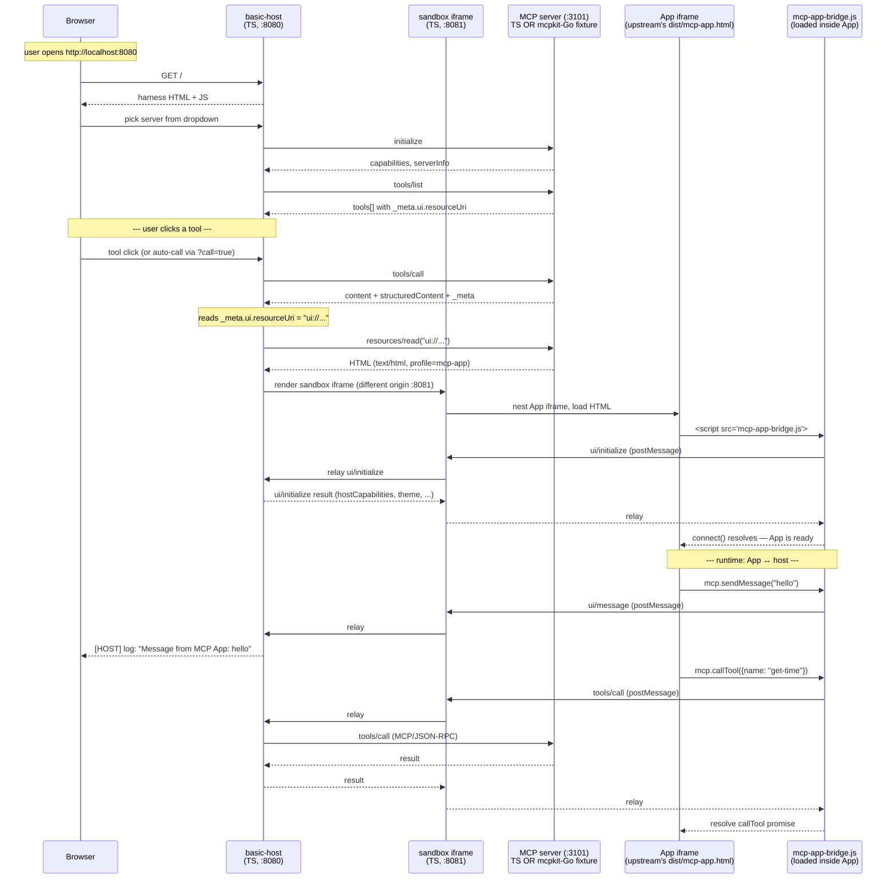

# MCP Apps — Flow Reference

How the pieces fit together when an MCP Apps tool is invoked, what each
component does, and where mcpkit fits in. Specific to the workflows in
this repo (`demo-app`, `demo-upstream`, `test-apps-playwright`).

## The cast of characters

| Piece | Who owns it | Language | Where it lives |
|---|---|---|---|
| **`basic-host`** | upstream | TypeScript | `github.com/modelcontextprotocol/ext-apps/examples/basic-host` |
| **example TS servers** (`basic-server-vanillajs`, `integration-server`, …) | upstream | TypeScript | `github.com/modelcontextprotocol/ext-apps/examples/<name>` |
| **App HTML bundle** (`dist/mcp-app.html`) | upstream | per-example bundle (React/Vue/Solid/Vanilla → JS) | built by `npm run build` in each example |
| **`@modelcontextprotocol/ext-apps` library** | upstream | TypeScript | npm package — provides `registerAppTool`, host helpers, bridge JS |
| **MCPJam Inspector** | third-party (mcpjam) | npm CLI | `npx @mcpjam/inspector@latest` |
| **mcpkit `core/server/client`** | us | Go | `core/`, `server/`, `client/` packages |
| **mcpkit `ext/ui`** | us | Go + a TS bridge JS | MCP Apps extension support in Go |
| **mcpkit-Go compat fixtures** | us | Go | `examples/apps/compat/<name>/` — drop-in replacements for upstream's TS servers |

**"Upstream"** here means [`github.com/modelcontextprotocol/ext-apps`](https://github.com/modelcontextprotocol/ext-apps) — the official MCP Apps repo, TypeScript across the board. It owns the spec, the bridge protocol, the canonical host (`basic-host`), the reference example servers, and the Playwright test suite. **mcpkit is not upstream.** mcpkit is a parallel Go implementation of the MCP protocol that aims to be wire-compatible with upstream's reference servers.

## The boot sequence

What happens when you click a tool in basic-host's UI:



Read this top-to-bottom: the host loads the tool surface from the server, the user picks a tool, the host fetches the App HTML and renders it in a nested sandboxed iframe, the bridge JS inside the App establishes its postMessage channel, and from then on the App can talk back to the host via the bridge.

## What each piece does

### `basic-host` (upstream, TS, port `:8080`)

The canonical reference host implementation. Single-page TS/React app served on `:8080`. Job:

- Discover MCP servers via the `SERVERS` env var
- Run `initialize` + `tools/list` against each
- Render the tool dropdown and call UI
- When a tool returns `_meta.ui.resourceUri`, fetch the App HTML via `resources/read` and render it
- Manage the nested sandbox iframe (CSP, sandbox attributes, postMessage relay)
- Provide host-side handlers for bridge events (`sendMessage`, `sendLog`, `openLink`, etc.)

**We don't own basic-host.** When upstream's Playwright suite runs, it's driving basic-host's UI in a browser.

### The MCP server (port `:3101`)

This is the one slot in the flow that can be **either** upstream's TS **or** our mcpkit-Go.

| Workflow | Server is… | Owner |
|---|---|---|
| `just demo-app` (any `RENDERER`) | mcpkit-Go drop-in (`examples/apps/compat/<name>/main.go`) | us |
| `just demo-upstream` (any `RENDERER`) | upstream's TS server (`basic-server-vanillajs/dist/index.js` etc.) | upstream |
| `just test-apps-playwright[-docker]` | mcpkit-Go drop-in (`examples/apps/compat/<name>/main.go`) | us |

In `test-apps-playwright-docker` mode, upstream's TS *also* runs on a side port (`UPSTREAM_PORT`, default 3102) so the wrapper can JSON-diff `tools/list` against the Go fixture before Playwright starts — the strict drift gate. Playwright itself only drives the Go fixture on `:3101`.

Either way the **wire surface is identical**: respond to MCP/JSON-RPC over Streamable HTTP, return tool definitions with `_meta.ui.resourceUri`, serve the App HTML when the host fetches the `ui://...` resource. The compat fixtures' whole purpose is to be indistinguishable from upstream's TS at the wire layer.

### The sandbox iframe (upstream, TS, port `:8081`)

A separate-origin iframe basic-host uses to isolate the App from the host page. Apps can't touch basic-host's DOM directly; they go through the sandbox via `postMessage`, which forwards to basic-host. The separation enforces:

- **CSP**: the sandbox origin has its own Content-Security-Policy built from `_meta.ui.csp`
- **Sandbox attribute**: the iframe `sandbox` attribute restricts the App's capabilities (no top navigation, no parent access, etc.) from `_meta.ui.permissions`
- **Origin isolation**: a malicious App can't escape into basic-host's origin

### The App iframe (HTML bundle, delivered by the MCP server)

What the user actually sees. Each upstream example builds its own `dist/mcp-app.html` — a single-file bundle (Vite + `vite-plugin-singlefile`) containing the App's UI code and the `mcp-app-bridge.js` library.

The compat fixtures **don't build their own App HTML**. They read upstream's `dist/mcp-app.html` from `$EXT_APPS_DIR` at startup and serve it byte-for-byte verbatim. That's the contract — pretend to be upstream's TS server, including identical HTML.

### How the App HTML gets to the iframe (and why it's not at the server's URL)

A common misconception: the App iframe is **not** loaded via `<iframe src="http://your-mcp-server/...">`. The flow is:

1. The host calls the MCP `resources/read` method (over the same JSON-RPC channel it's using for everything else)
2. The MCP server's resource handler returns the App's HTML **as bytes inside the JSON-RPC response**
3. The host renders those bytes into the iframe using `srcdoc="..."` (inline HTML) or a `blob:` URL

So if your MCP server is at `http://localhost:3101/mcp`, the App is **not** at `http://localhost:3101/myapp` — there's no such HTTP endpoint. The HTML is delivered as a JSON-RPC payload through `/mcp` and rendered into an iframe at whatever origin the host chose for the sandbox (`localhost:8081` in basic-host) or a unique `blob:` / `about:srcdoc` origin.

Consequences:

| Question | Answer |
|---|---|
| Can the App make `fetch()` calls directly to the MCP server? | No (and that's intentional) — the iframe doesn't run at the server's origin; cross-origin would be blocked. The App talks to the server only via `mcp.callTool` / `mcp.readResource` through the bridge. |
| Does the MCP server have to be HTTP-reachable from the browser? | No — only the **host** needs to talk to it. A stdio MCP server (Cursor, Claude Desktop) can still expose Apps; the host receives the HTML over stdio and renders it the same way. |
| Can the server generate the HTML per-call? | Yes. `resources/read` is just a handler; the server can return different HTML per user, per tenant, per call. |
| Can the App reference external origins (CDNs, fonts)? | Yes, but only the ones whitelisted in `_meta.ui.csp`. The host builds a Content-Security-Policy header from those declarations and applies it to the sandbox iframe. |
| Could the App HTML come from somewhere other than the MCP server? | The host decides. By convention the `ui://` URI is a resource on the same MCP server, but nothing in the protocol forbids returning bytes pulled from elsewhere. In practice, App HTML is bundled and returned inline from the MCP server. |

### Why two layers of iframe (not just one)

The sandbox iframe is the *outer* iframe; the App iframe is *nested* inside it.

```
┌─────────────────────────────────────────────────────────┐
│ Host page (basic-host, origin A: localhost:8080)        │
│                                                         │
│   ┌─────────────────────────────────────────────────┐   │
│   │ Sandbox iframe (origin B: localhost:8081)       │   │
│   │ Different origin from the host — "origin moat"  │   │
│   │                                                 │   │
│   │   ┌─────────────────────────────────────────┐   │   │
│   │   │ App iframe (sandbox="..." attribute)    │   │   │
│   │   │ Your App HTML + bridge.js               │   │   │
│   │   │ User interacts with this                │   │   │
│   │   └─────────────────────────────────────────┘   │   │
│   └─────────────────────────────────────────────────┘   │
└─────────────────────────────────────────────────────────┘
```

Two defenses, layered:

1. **Origin moat** (the outer sandbox iframe): the sandbox runs at a different *origin* from the host. Even if an App escapes the inner sandbox attribute, browser same-origin policy stops it from touching the host's DOM, cookies, or storage. The two halves can communicate ONLY via `postMessage`.
2. **Sandbox attribute** (the inner App iframe): a per-App `sandbox="..."` HTML attribute built from `_meta.ui.permissions` — restricts top-level navigation, popups, form submission, etc. Per-App finer-grained control.

postMessage flow from App → host crosses both iframe boundaries: App → (boundary) → Sandbox → (boundary) → Host. Each hop is `window.parent.postMessage(...)`.

### Is it efficient to ship the App as a single inline payload?

Yes, with caveats. Typical bundle sizes from our compat fixtures range 100 KB to ~1 MB (the larger ones being Three.js / CesiumJS / shader-heavy Apps). Three reasons it's tolerable:

1. **Fetched once per App invocation, not per tool call.** The host loads the App iframe HTML once when the user invokes the tool with the UI; subsequent `tools/call` operations into the same App don't re-fetch. Data flows separately through `mcp.callTool` bridge calls.
2. **Inline-everything is intentional.** Upstream examples use `vite-plugin-singlefile` so the bundle has zero extra fetches once delivered. CSS, fonts (base64), JS — all in one payload, no waterfall.
3. **Local transport.** In practice the bytes flow server-process → host-process on the user's machine (stdio for Cursor / Claude Desktop; localhost HTTP for browser hosts). The wire isn't a public internet link.

When it isn't enough, the escape hatches:

| Scenario | Mitigation |
|---|---|
| App needs heavy libraries (Three.js, CesiumJS, WASM) | Reference via CDN URLs in the HTML; CSP-whitelist those origins via `_meta.ui.csp`. Bundle stays small; heavy stuff streams from a real CDN with HTTP caching. |
| App needs megabytes of user data | Keep data out of the HTML. Return it via `tools/call` `structuredContent` or separate `resources/read` data resources. HTML is the App shell; data flows via bridge calls. |
| App invoked very frequently | Host implementations cache the App HTML keyed by resource URI between invocations. Not mandated by the spec, but real hosts do it. |
| Resource templates (`ui://app/{userId}/view`) producing per-user HTML | Same caching, keyed by the resolved URI. Server still generates per-user; host avoids re-fetch within a session. |

The single-payload model trades raw bandwidth for *correctness, simplicity, and stdio-compatibility* — a stdio MCP server can expose Apps without needing an HTTP layer at all, which is a real feature when the server runs in a Cursor or Claude Desktop process.

### The bridge (`mcp-app-bridge.js`, upstream)

The JavaScript layer the App uses to talk to the host. Lives **inside** the App iframe. Exposes a `mcp` object with methods:

| Bridge method | What it does | Where it terminates |
|---|---|---|
| `mcp.callTool({name, arguments})` | invoke a server tool | server (via MCP `tools/call`) |
| `mcp.readResource(uri)` | fetch a resource | server (via MCP `resources/read`) |
| `mcp.sendMessage(text)` | push a message to the host | host (no server round-trip) |
| `mcp.sendLog({level, message})` | push a log line | host |
| `mcp.openLink(url)` | request the host open a URL | host |
| `mcp.updateModelContext({content, structuredContent})` | push context the LLM should see | host (forwards to LLM in real deployments) |
| `mcp.requestDisplayMode("fullscreen")` | request a display mode change | host |
| `mcp.downloadFile({contents})` | trigger a file download | host |

Each call is a `postMessage(ui/<method>, params)` to the sandbox iframe, which relays to basic-host. basic-host either handles it locally (`sendMessage` → console log) or forwards it as an MCP/JSON-RPC call to the server (`callTool` → `tools/call`).

This bridge ships as part of `@modelcontextprotocol/ext-apps`. mcpkit also ships its own bridge at `ext/ui/assets/mcp-app-bridge.js` for non-compat mcpkit Apps you'd write in Go — but in the compat flow we serve upstream's HTML which embeds upstream's bridge.

## Where mcpkit fits

In the compat flow (the focus of `apps/compat/`), mcpkit replaces exactly **one** slot in the diagram: the MCP server. Everything else is upstream.

```
                ┌──────────────────────────────────────────┐
                │           OWNED BY UPSTREAM              │
                ├──────────────────────────────────────────┤
                │  basic-host ←→ sandbox ←→ App ←→ bridge  │
                └──────────────────────────────────────────┘
                                     ↑ MCP/JSON-RPC over Streamable HTTP
                                     ↓
                ┌──────────────────────────────────────────┐
                │  The ONE slot mcpkit replaces in compat: │
                │  the MCP server                          │
                │  (Go binary under examples/apps/compat/) │
                └──────────────────────────────────────────┘
```

mcpkit packages doing real work in this flow:

- **`core/`** — protocol types (`ToolDef`, `ToolMeta`, `UIMetadata`, `ToolExecution`, etc.). What gets serialized on the wire.
- **`server/`** — HTTP server, Streamable HTTP transport, JSON-RPC dispatch, session management.
- **`ext/ui/`** — MCP Apps extension support. `RegisterTypedAppTool`, the `_meta.ui` shape, the dual `ui.resourceUri` / `ui/resourceUri` key emit, the `UIExtension` extension marker.
- **`examples/common/MCPServerOptions(...)`** — boilerplate for spinning up a mcpkit server with sensible defaults.

Outside compat (a "normal" mcpkit App you'd ship in production), mcpkit additionally provides:

- **`ext/ui/assets/mcp-app-bridge.js`** — our own bridge JS for Apps you author in Go. Spec-compatible with upstream's bridge; you'd embed it in your own App HTML.
- **`ext/ui/AppHost`, `ServerRegistry`** — if you want a Go program to act AS an Apps host (not the test scenario; relevant for headless agent harnesses).

## Why mcpkit doesn't ship a browser harness

mcpkit provides host-side primitives (`ext/ui/AppHost`, `ServerRegistry`) but **not** a browser SPA equivalent of basic-host. That's deliberate, not an omission. The two host roles differ:

| | basic-host (TS) | mcpkit `ext/ui/AppHost` (Go) |
|---|---|---|
| Audience | a human in a browser | a Go process |
| Renders the App | yes, in a sandboxed iframe | no — drives the bridge protocol programmatically |
| Use case | "see / debug an App" | headless agent harnesses, integration tests |

Three reasons we don't ship the browser variant:

1. **The host slot belongs to a product, not a library.** In real deployments the host is Claude.ai, ChatGPT, Cursor, Claude Desktop — each with its own chrome, auth, LLM integration, settings UI. A mcpkit-branded harness SPA would compete with all of them and nobody would adopt it.
2. **Ecosystem mismatch.** A browser harness is a TS/React/Vite project. mcpkit is a Go library; shipping and maintaining a parallel TS SPA would drift from upstream's basic-host (the canonical reference *and* the bar production hosts measure themselves against).
3. **Wire compatibility is the leverage point.** Our value is that any mcpkit Go server works inside *any* spec-compliant host — basic-host today, the production hosts tomorrow. Shipping our own browser host would tempt App authors to code to mcpkit-host quirks instead of the spec, diluting that guarantee.

For testing we lean on basic-host directly (Playwright drives upstream's harness), plus `ext/ui/AppHost` for the Go-programmatic side. No browser harness of our own needed.

## The workflows in this repo

Two axes — **server** (Go fixture vs. upstream TS) × **renderer** (MCPJam for the wire, basic-host for the iframe). Plus a separate strict-parity target.

| You want to… | Use |
|---|---|
| Inspect the wire of the **mcpkit Go fixture** | `just demo-app EXAMPLE=<name>` |
| See the **mcpkit Go fixture** rendered in basic-host | `RENDERER=basic-host just demo-app EXAMPLE=<name>` |
| Inspect the wire of **upstream's TS reference** (incl. SKIP examples) | `just demo-upstream EXAMPLE=<name>` |
| See **upstream's TS reference** rendered in basic-host | `RENDERER=basic-host just demo-upstream EXAMPLE=<name>` |
| Strict parity check — Go fixture wire vs upstream TS wire + visual regression | `just test-apps-playwright-docker EXAMPLE=<name>` |

Demo targets default to **MCPJam** (lower-friction first-touch, works for SKIP examples that have no `dist/mcp-app.html` to render). `RENDERER=basic-host` flips to the iframe-rendering path when you want to *see* the App rather than inspect its wire.

`demo-upstream` is how you reach SKIP examples (`video-resource-server`, `lazy-auth-server`, `qr-server`, `say-server`) — they have no Go drop-in yet, but upstream's TS server still runs them.

Only `test-apps-playwright[-docker]` exercises the Go fixture under upstream's Playwright suite. In DOCKER mode it also runs upstream's TS on a side port for the strict `tools/list` drift diff.

## On the `ui://` URI scheme

`ui://get-time/mcp-app.html` is a regular MCP resource URI — basic-host fetches it via `resources/read` like any other resource. The `ui://` prefix is a **convention** from the MCP Apps spec that signals "this resource serves App HTML with MIME `text/html;profile=mcp-app`." Nothing in the protocol parses the URI; it's just a string identifier. The same App resource could equally be served at `https://...` or `resource://...` — the prefix exists to make Apps-vs-non-Apps resources easy to distinguish at a glance.

## On `_meta.ui` (and the dual `ui/resourceUri` key)

Tool definitions can carry MCP Apps metadata under `_meta`. The canonical form is nested:

```json
"_meta": {
  "ui": {
    "resourceUri": "ui://get-time/mcp-app.html",
    "visibility": ["model", "app"]
  }
}
```

Older clients may read a flat fallback key `"ui/resourceUri"` instead. Upstream's `registerAppTool` emits **both** the nested form and the flat fallback for backward-compat — mcpkit's `core.ToolMeta` does the same via custom `MarshalJSON`/`UnmarshalJSON`. Either is valid input; both are emitted on output.

## Production hosts vs `basic-host`

`basic-host` is a **reference** implementation for testing and demos. Real-world MCP Apps hosts (Claude.ai, ChatGPT, Cursor, etc.) implement the same protocol but with their own UI, their own sandbox enforcement, their own LLM integration. The flow above is identical at the protocol layer — only the host's outer chrome differs.

Any App that works in `basic-host` should work in a production host, modulo host-specific feature support (display modes, permissions, etc. that the App declares via `_meta.ui.*`).
