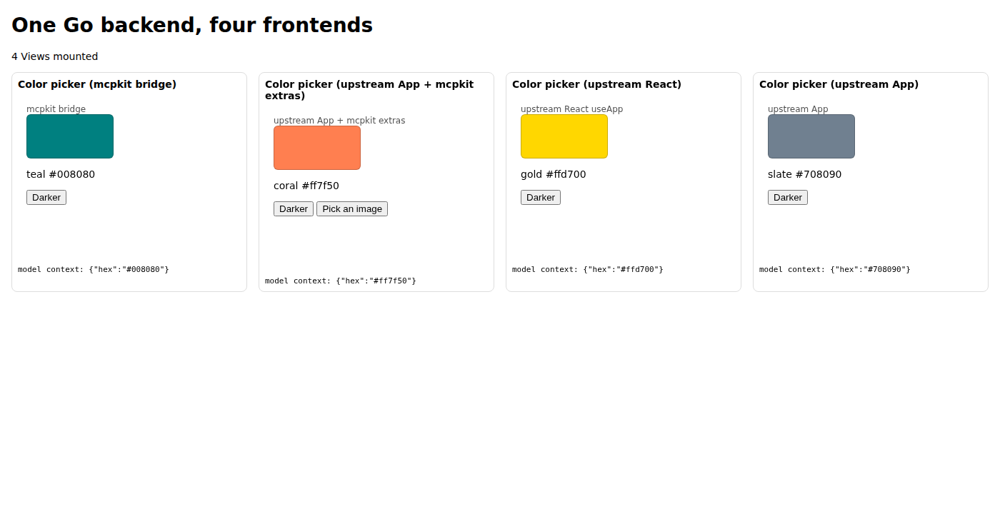
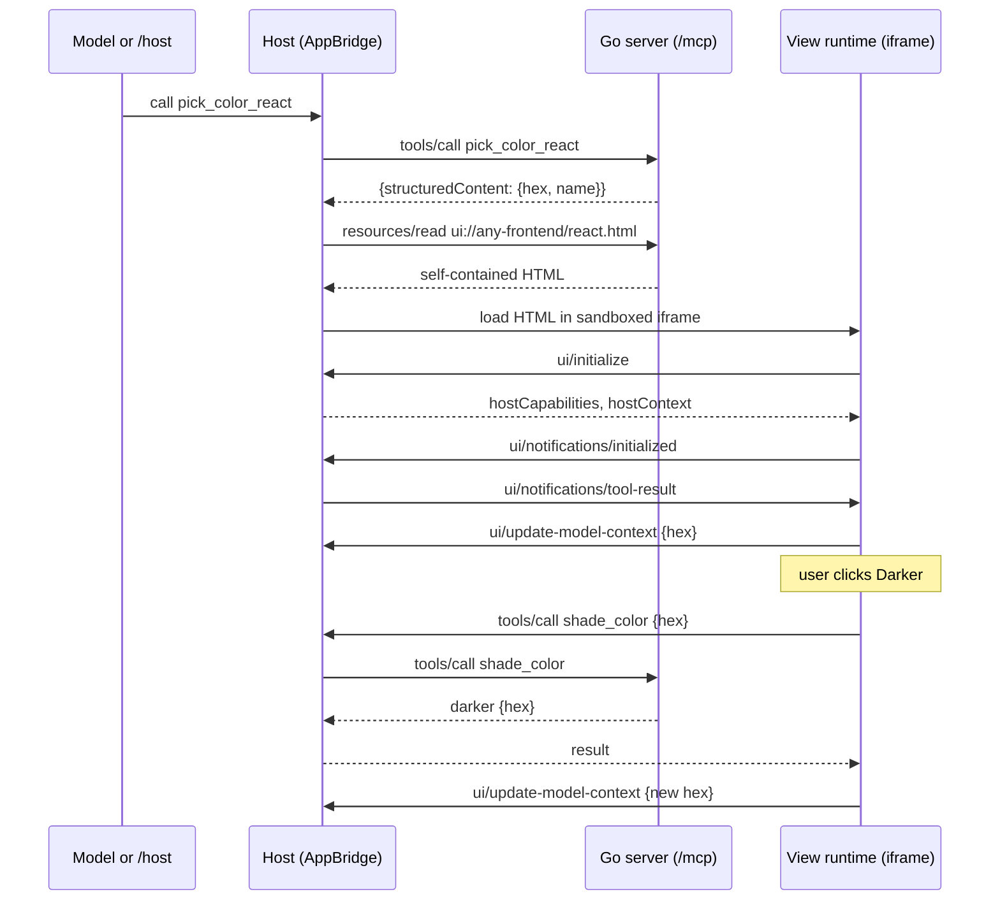

# One Go backend, four frontends (MCP Apps)

An mcpkit MCP Apps server works with any frontend runtime that speaks the MCP Apps wire protocol.
This example serves the same color-picker app four ways from one Go server:

| Tool | View | Runtime | Build step |
|---|---|---|---|
| `pick_color_bridge` | `ui://any-frontend/bridge.html` | mcpkit bridge, injected into a Go template | none |
| `pick_color_vanilla` | `ui://any-frontend/vanilla.html` | upstream [`App`](https://github.com/modelcontextprotocol/ext-apps) | esbuild |
| `pick_color_react` | `ui://any-frontend/react.html` | upstream React `useApp` | esbuild |
| `pick_color_extras` | `ui://any-frontend/extras.html` | upstream `App` plus mcpkit's extras | esbuild |

The Go server doesn't know or care which runtime a View uses. It registers four app tools that share
one handler, serves each View's bytes from `resources/read`, and answers `shade_color` when a View
calls back. That's the whole backend. The design decision behind it is
[Frontend independence](../../../docs/APPS_DESIGN.md#frontend-independence).



## How a round trip works

The same sequence runs for all four Views. Only the box labelled "View runtime" changes: the mcpkit
bridge, upstream `App`, or upstream `useApp`.



## Run it

```bash
go run .            # or: make run
```

Then open **http://localhost:8080/host**. That page is a small reference host built on upstream's
`AppBridge`. It calls each `pick_color_*` tool and renders its View side by side, so you can see all
four without installing a host. Click **Darker** in any View: the View calls the server's
`shade_color` tool through the host, shows the result, and pushes the new color to the host as model
context (shown under each View).

To use a real host, point MCPJam, upstream's `basic-host`, or Claude at `http://localhost:8080/mcp`
and ask for a color, e.g. "pick a color with the React view".

## Which runtime should I use?

- **The mcpkit bridge**: server-rendered pages with no build step. It's one small script (about
  25 KB) that `ui.InjectAppBridge` or the `mcpkit-bridge` template drops into HTML a Go template
  already renders. See `views/bridge.html`.
- **Upstream `App`** (vanilla or React): single-page and framework apps. It's the reference
  runtime, maintained with the spec, with React bindings. It needs a bundler, and the bundle is
  larger (330 KB for the vanilla View, 550 KB with React, minified) because it carries the MCP
  client SDK and zod.
- **Upstream `App` plus mcpkit extras**: when you want upstream's runtime and also mcpkit's
  SEP-414 trace relay (`withTraceRelay`) or SEP-2356 file picker (`selectFile`). See
  `web/src/extras.ts`.

All four speak the same protocol, so you can pick per View, and a server can mix them.

## Where to look in the code

- `main.go`: the whole backend. `views()` lists the four Views, and `register()` loops over them.
  Nothing in it branches on the runtime.
- `views/bridge.html`: the bridge View, a Go template.
- `web/src/vanilla.ts`, `web/src/react.tsx`, `web/src/extras.ts`: the three upstream-runtime Views.
- `web/src/host.ts`: the `/host` reference host.
- `web/build.mjs`: bundles each View into one self-contained HTML file under `views/`. It also drops
  zod's unused locale files, about 250 KB per View (upstream ext-apps issue 665).
- `web/tests/any-frontend.spec.ts`: drives every View in Chromium through `/host`.

## Rebuilding the Views

The built `views/*.html` are committed so `go run .` needs no Node toolchain. After editing anything
under `web/`:

```bash
make build-views    # rebuild views/*.html (needs pnpm + Node)
make check-views    # typecheck and fail if the committed views are stale (CI runs this)
make test-e2e       # drive all four Views in Chromium through /host (CI runs this)
make test           # Go unit tests
```

## What `/host` is not

`/host` loads each View into one sandboxed `srcdoc` iframe. A production host should use the
double-iframe sandbox proxy the MCP Apps spec describes, and enforce each View's CSP and permissions.
It is a demo and a test fixture, not a host to copy.
