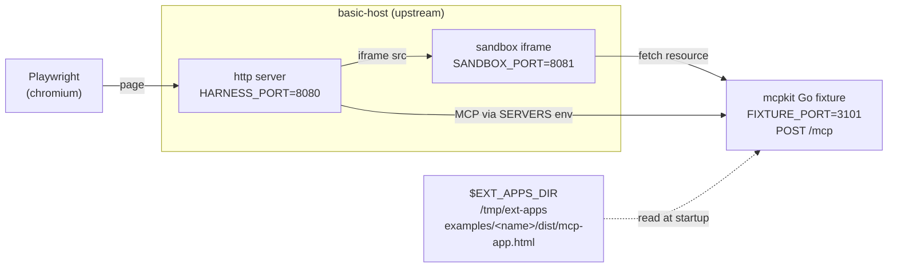

# apps/compat — mcpkit-Go drop-ins for upstream ext-apps parity testing

Each subdirectory here is a mcpkit-Go MCP server that mimics one of
[`modelcontextprotocol/ext-apps`](https://github.com/modelcontextprotocol/ext-apps)'s
TypeScript example servers byte-for-byte at the protocol surface. We run
upstream's own Playwright suite against the Go binary to validate that mcpkit
hosts can drive any client that targets the upstream examples.

Tracked under issue 533 (umbrella) and the per-example issues it links to.

## Wiring overview

Each box is a separate process the wrapper script orchestrates; the labels
show the env var that picks its port or path.



- `EXT_APPS_DIR` — upstream checkout the script clones / updates; the
  fixture reads `dist/mcp-app.html` from here verbatim.
- `HARNESS_PORT` — basic-host's HTTP listen port; Playwright drives this.
- `SANDBOX_PORT` — basic-host's sandbox-iframe origin; the app iframe
  loads inside it.
- `FIXTURE_PORT` — the mcpkit Go binary's MCP endpoint; basic-host
  connects here via the `SERVERS` env var.

## Drop-in shape

A compat fixture must match its upstream counterpart on three things:

1. **Tool name + input schema + output schema.** The host's Playwright tests
   call the tool by name and assert against the response shape.
2. **Resource URI exposing the UI.** Upstream picks `ui://<tool-name>/mcp-app.html`;
   mirror it exactly so the host renders the iframe at the URL it expects.
3. **HTML body served verbatim from upstream's `dist/mcp-app.html`.** Read it
   from `$EXT_APPS_DIR` at startup; do not vendor or modify it. The fixture's
   only job is to wire mcpkit's protocol surface to the same iframe payload
   upstream's server would have served.

CORS is the only host-environment-specific concern: basic-host runs on port
8080, the fixture runs on 3101, so the browser needs `Mcp-Session-Id` exposed.
`examples/apps/compat/basic-vanillajs/main.go` shows the minimal wrapper.

Anything not on this list (logging, framework choice, transport flavor) is
free. The whole point is that `basic-host` cannot tell the fixture apart from
upstream's TS server at the wire level.

## Adding a fixture for a new upstream example

1. Create `examples/apps/compat/<name>/` with `go.mod`, `main.go`, and the
   matching tool / resource registration. Copy the structure of
   `basic-vanillajs/main.go`.
2. Add a `case` arm in `scripts/apps-playwright-test.sh` mapping the upstream
   `EXAMPLE` value to your `FIXTURE_DIR` and a `GREP_PATTERN` that scopes
   Playwright to your example's `test.describe` block.
3. Generate the canonical baseline (Docker, byte-identical to what
   upstream's CI would produce):
   ```bash
   DOCKER=1 UPDATE_SNAPSHOTS=1 EXAMPLE=<name> make test-apps-playwright
   ```
   Writes `examples/apps/compat/<fixture>/__snapshots__/<key>.png`.
4. Verify clean runs pass:
   ```bash
   DOCKER=1 EXAMPLE=<name> make test-apps-playwright   # visual + protocol gate
   EXAMPLE=<name> make test-apps-playwright            # native — `loads app UI` only
   ```
5. Commit the fixture, the script arm, and the baseline PNG.

## Native vs Docker modes

Two run modes, same wrapper:

| Mode | Invocation | Purpose |
|---|---|---|
| Native (default) | `make test-apps-playwright` | Fast local iteration. Runs `loads app UI` (functional check) — passes anywhere. Runs `screenshot matches golden` — **expected to fail on non-Linux hosts** because the committed baseline is Docker-pinned. |
| Docker | `make test-apps-playwright-docker` (or `DOCKER=1 …`) | CI-identical run inside `mcr.microsoft.com/playwright:v1.57.0-noble` — same image upstream's `test:e2e:docker` uses. Cross-compiles the Go fixture for `linux/amd64` on the host, mounts it in; `basic-host` + Playwright run inside. The real visual gate. |

One canonical baseline per fixture (no `{platform}` suffix), matching
upstream's pinning convention. macOS / Windows contributors use Docker mode
when they want the visual check; native mode gives them the fast `loads app UI`
check for everyday iteration.

## Protocol-surface drift check (DOCKER mode)

The screenshot test is a **regression check, not an upstream-parity check** —
it compares each run against our own committed PNG, not against upstream's.
That means if upstream changes their fixture's tool description, schema, or
`_meta.ui` shape, our test still passes (we regen our PNG against our own
unchanged fixture; upstream regens theirs against the changed one), even
though we've silently fallen behind upstream's protocol surface.

To catch that, DOCKER mode runs upstream's own TypeScript reference server
on a side port (`UPSTREAM_PORT`, default 3102) and JSON-diffs `tools/list`
against the mcpkit fixture before Playwright runs. Today the check is
**warn-only** — drift is printed but doesn't fail the build, because
several remaining drift items track real library gaps in `ext/ui`'s
`TypedAppToolConfig` (no `Title` field, `OutputSchema` not propagated to
the wire, `Execution.TaskSupport` not exposed) plus an ext-apps SDK
convention (`_meta["ui/resourceUri"]` fallback key). Once those land,
flip the check from warn-only to fail-on-drift.

Skip the check with `SKIP_DRIFT_CHECK=1`. Native mode doesn't run the
drift check — would require Node + ext-apps build artifacts + the
upstream server runtime on the host, which fights the "fast local
iteration" goal of native mode.

## Where test results land

Whenever a run produces artifacts (failure diffs, traces, the HTML
report), they land under the fixture's `.test-results/` dir:

```
examples/apps/compat/<fixture>/.test-results/
├── artifacts/   ← per-test failure dirs: -actual.png / -diff.png /
│                  -expected.png / trace.zip / error-context.md
└── report/      ← Playwright HTML report; open index.html in a browser
```

Same paths in both modes — in Docker mode, the bind-mounted `/mcpkit`
volume surfaces the dir back to the host filesystem, so you can open
`report/index.html` in your local browser without `docker cp` or
volume gymnastics. The wrapper prints both paths at the end of any
failed run. The whole dir is gitignored.

## Snapshot baseline pinning

Chromium's font fallback differs across operating systems, producing ~5–10px
layout shifts that exceed `maxDiffPixelRatio: 0.06`. We pin one canonical
baseline per fixture to Linux Chromium (generated via Docker), matching
upstream's own pattern — `modelcontextprotocol/ext-apps` commits a single
PNG per example, pinned to the `mcr.microsoft.com/playwright:v1.57.0-noble`
image their `test:e2e:docker` target uses, and so do we.

Regenerate with:

```bash
DOCKER=1 UPDATE_SNAPSHOTS=1 EXAMPLE=<name> make test-apps-playwright
```

The native (non-Docker) wrapper still runs the visual test on the host, but
on non-Linux hosts it will fail vs the pinned Linux baseline. That's a
feature — visual regression is the kind of check you want on stable
infrastructure, not on whatever Chromium font fallback your laptop ships
this month. The `loads app UI` test is what carries the fast-local-iteration
story; that one passes anywhere.

Future direction (see issue 538): once mcpkit's `tools/list` surface matches
upstream byte-for-byte, the per-fixture `__snapshots__/` dir disappears
entirely — Playwright will compare against upstream's own committed PNG in
the ext-apps tree, so we inherit upstream's regenerations automatically.

## Status legend

The umbrella issue tracks per-example status: `NOT` (not implemented),
`WIP` (in progress), `PROT` (protocol passes, visual diff outstanding),
`OK` (all-pass), `SKIP` (upstream marks as skipped for special-resource
reasons such as GPU or large model downloads).
