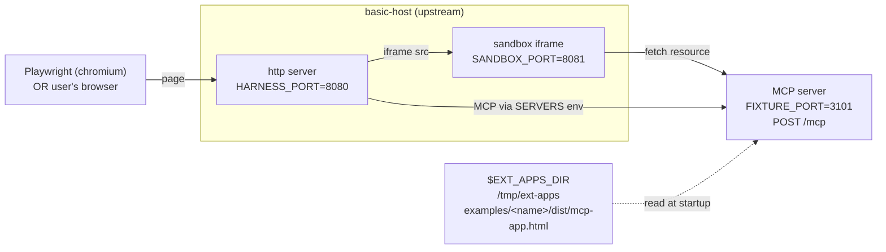
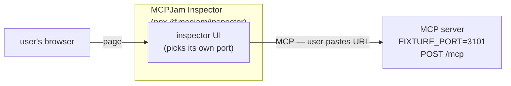

# apps/compat — mcpkit-Go drop-ins for upstream ext-apps parity testing

> **New to MCP Apps?** Read [`examples/apps/FLOW.md`](../FLOW.md) first — explains
> the full architecture (basic-host, sandbox, App iframe, bridge JS) and where
> mcpkit fits in the picture.


Each subdirectory here is a mcpkit-Go MCP server that mimics one of
[`modelcontextprotocol/ext-apps`](https://github.com/modelcontextprotocol/ext-apps)'s
TypeScript example servers byte-for-byte at the protocol surface. We run
upstream's own Playwright suite against the Go binary to validate that mcpkit
hosts can drive any client that targets the upstream examples.

Tracked under issue 533 (umbrella) and the per-example issues it links to.

## Reading order — examples ladder

Examples are ordered so each rung adds one new dimension over the
previous. Read top-down to walk the surface from a minimal one-tool
fixture up to a 9-tool backend-state-heavy one. The published parity
report at [conformance/apps/compat](https://panyam.github.io/mcpkit/conformance/apps/compat/)
shows the current status of each row.

| Rung | What's new | Examples |
|---|---|---|
| **1. Minimum viable App.** Start here. | One tool, one resource, vanilla-JS iframe. The smallest thing that exercises the full host ↔ server ↔ iframe round trip. | [`basic-vanillajs`](basic-vanillajs/README.md) |
| **2. Framework freedom.** Skim — same shape, different framework. | Identical wire surface; the iframe just happens to be Preact/React/Solid/Svelte/Vue. Demonstrates the protocol doesn't care about the iframe's stack. | [`basic-preact`](basic-preact/README.md) · [`basic-react`](basic-react/README.md) · [`basic-solid`](basic-solid/README.md) · [`basic-svelte`](basic-svelte/README.md) · [`basic-vue`](basic-vue/README.md) |
| **3. Single tool, richer payload.** | Same one-tool shape but the output is structured. First taste of typed-handler + Go struct → reflection schema. | [`quickstart`](quickstart/README.md) · [`transcript`](transcript/README.md) · [`sheet-music`](sheet-music/README.md) |
| **4. Deeply nested data shapes.** | Multi-level nested objects in the output. First place reflection meets its limits — nullable fields, anyOf composition. Introduces the `InputSchemaPatch` / `OutputSchemaPatch` escape hatches. | [`budget-allocator`](budget-allocator/README.md) · [`scenario-modeler`](scenario-modeler/README.md) · [`cohort-heatmap`](cohort-heatmap/README.md) · [`customer-segmentation`](customer-segmentation/README.md) |
| **5. Multi-tool fixtures.** | More than one tool registered on the same server. The host's tool dropdown picks up multiple entries; iframe and "plain" tools share the surface. | [`map`](map/README.md) · [`threejs`](threejs/README.md) · [`wiki-explorer`](wiki-explorer/README.md) · [`shadertoy`](shadertoy/README.md) |
| **6. App-only tools + host interactions.** | Some tools never appear in the model's dropdown — they're called by the iframe via the bridge. Introduces `Visibility: ["app"]`. Integration server adds host-callback tests (Send Message, Send Log, Open Link). | [`system-monitor`](system-monitor/README.md) · [`debug-server`](debug-server/README.md) · [`integration`](integration/README.md) |
| **7. Backend state machinery.** | Per-viewUUID command queue, long-poll endpoint, server-initiated rendezvous (server enqueues a command, viewer responds via separate tool, server's await unblocks). Most complex fixture. | [`pdf-server`](pdf-server/README.md) |

Each example's own `README.md` lists prompts to try against it in
MCPJam Inspector or basic-host. Run a single one with:

```bash
# mcpkit-Go fixture + MCPJam (default — wire-level inspection)
make demo-app EXAMPLE=basic-vanillajs

# mcpkit-Go fixture + basic-host (visual demo — renders the App iframe)
RENDERER=basic-host make demo-app EXAMPLE=basic-vanillajs

# upstream TS reference server + MCPJam (use for SKIP examples below)
make demo-upstream EXAMPLE=basic-vanillajs
```

**SKIP rows** — examples upstream's `servers.spec.ts` deliberately
excludes (special build-time deps or out of the default test matrix).
No mcpkit-Go drop-in exists for these; browse them with
`make demo-upstream`:
[`lazy-auth-server`](https://github.com/modelcontextprotocol/ext-apps/tree/main/examples/lazy-auth-server),
[`qr-server`](https://github.com/modelcontextprotocol/ext-apps/tree/main/examples/qr-server),
[`say-server`](https://github.com/modelcontextprotocol/ext-apps/tree/main/examples/say-server),
[`video-resource-server`](https://github.com/modelcontextprotocol/ext-apps/tree/main/examples/video-resource-server).

## Wiring overview

Each box is a separate process the wrapper script orchestrates; the labels
show the env var that picks its port or path.

Two topologies, picked by the `RENDERER` knob (or by `test-apps-playwright`).
The MCP server slot is the same in both — Go fixture or upstream TS depending
on `demo-app` vs `demo-upstream` (or always Go fixture under
`test-apps-playwright`).

### basic-host renderer (Playwright or interactive)

Used by `make test-apps-playwright[-docker]` (Playwright drives) and
`RENDERER=basic-host make demo-app|demo-upstream` (your browser drives).
Renders the App iframe end-to-end.



### MCPJam Inspector renderer (default for `demo-app` / `demo-upstream`)

Used by `make demo-app` and `make demo-upstream` without a `RENDERER`
flag. Shows the wire (`tools/list`, `_meta.ui`, tool-call payloads); does
**not** render the App iframe — that's basic-host's job.



Simpler than basic-host because there's no sandbox, no iframe, and no
`$EXT_APPS_DIR` dependency — MCPJam never asks for `dist/mcp-app.html`.
That's why MCPJam is the default renderer for SKIP examples (they have
no `dist/mcp-app.html` to render anyway).

Production hosts (Claude.ai, ChatGPT, Cursor, Claude Desktop) plug into
the same MCP server slot as `FIX` above — different chrome around it, same
wire contract. See [`../FLOW.md`](../FLOW.md#production-hosts-vs-basic-host).

### Env vars

- `EXT_APPS_DIR` — upstream checkout the script clones / updates; basic-host
  and (when applicable) upstream TS read `dist/mcp-app.html` from here.
- `HARNESS_PORT` — basic-host's HTTP listen port; Playwright or browser drives
  this in the basic-host topology.
- `SANDBOX_PORT` — basic-host's sandbox-iframe origin; the App iframe loads
  inside it.
- `FIXTURE_PORT` — the MCP server's endpoint. The Go fixture (`demo-app`,
  `test-apps-playwright`) or upstream's TS server (`demo-upstream`) listens
  here.
- `RENDERER` — `mcpjam` (default) or `basic-host`. Picks which topology runs.

## Drop-in shape

A compat fixture must match its upstream counterpart on three things:

1. **Tool name + input schema + output schema.** The host's Playwright tests
   call the tool by name and assert against the response shape.
2. **Resource URI exposing the UI.** Upstream picks `ui://<tool-name>/mcp-app.html`;
   mirror it exactly so the host renders the iframe at the URL it expects.
3. **HTML body served verbatim from upstream's `dist/mcp-app.html`.** Read it
   from `$EXT_APPS_DIR` at startup; do not vendor or modify it. The fixture's
   only job is to wire mcpkit's protocol surface to the same iframe payload
   upstream's server would have served.

CORS is the only host-environment-specific concern: basic-host runs on port
8080, the fixture runs on 3101, so the browser needs `Mcp-Session-Id` exposed.
`examples/apps/compat/basic-vanillajs/main.go` shows the minimal wrapper.

Anything not on this list (logging, framework choice, transport flavor) is
free. The whole point is that `basic-host` cannot tell the fixture apart from
upstream's TS server at the wire level.

## Adding a fixture for a new upstream example

1. Create `examples/apps/compat/<name>/` with `go.mod`, `main.go`, and the
   matching tool / resource registration. Copy the structure of
   `basic-vanillajs/main.go`.
2. Add a `case` arm in `scripts/apps-playwright-test.sh` mapping the upstream
   `EXAMPLE` value to your `FIXTURE_DIR` and a `GREP_PATTERN` that scopes
   Playwright to your example's `test.describe` block.
3. Generate the canonical baseline (Docker, byte-identical to what
   upstream's CI would produce):
   ```bash
   DOCKER=1 UPDATE_SNAPSHOTS=1 EXAMPLE=<name> make test-apps-playwright
   ```
   Writes `examples/apps/compat/<fixture>/__snapshots__/<key>.png`.
4. Verify clean runs pass:
   ```bash
   DOCKER=1 EXAMPLE=<name> make test-apps-playwright   # visual + protocol gate
   EXAMPLE=<name> make test-apps-playwright            # native — `loads app UI` only
   ```
5. Commit the fixture, the script arm, and the baseline PNG.

## Native vs Docker modes

Two run modes, same wrapper:

| Mode | Invocation | Purpose |
|---|---|---|
| Native (default) | `make test-apps-playwright` | Fast local iteration. Runs `loads app UI` (functional check) — passes anywhere. Runs `screenshot matches golden` — **expected to fail on non-Linux hosts** because the committed baseline is Docker-pinned. |
| Docker | `make test-apps-playwright-docker` (or `DOCKER=1 …`) | CI-identical run inside `mcr.microsoft.com/playwright:v1.57.0-noble` — same image upstream's `test:e2e:docker` uses. Cross-compiles the Go fixture for `linux/amd64` on the host, mounts it in; `basic-host` + Playwright run inside. The real visual gate. |

One canonical baseline per fixture (no `{platform}` suffix), matching
upstream's pinning convention. macOS / Windows contributors use Docker mode
when they want the visual check; native mode gives them the fast `loads app UI`
check for everyday iteration.

## Protocol-surface drift check (DOCKER mode)

The screenshot test is a **regression check, not an upstream-parity check** —
it compares each run against our own committed PNG. That's by design (see
the *Why not point at upstream's PNG?* note below). The upstream-parity
gate is a different mechanism: in DOCKER mode the wrapper spins up
upstream's own TypeScript reference server on a side port (`UPSTREAM_PORT`,
default 3102) and JSON-diffs `tools/list` against the mcpkit fixture
before Playwright runs. **The drift gate is strict** — any divergence
fails the build immediately. That makes the protocol surface the
load-bearing parity check; the PNG check covers visual regression on
top.

The drift diff filters two keys before comparison: `$schema` (different
SDKs emit different valid draft URLs — mcpkit emits draft-2020-12 via
invopop, upstream's TS SDK emits draft-07 via zod-to-json-schema; both
forward `$schema` on the wire for clients, but the value-level diff is
noise) and `additionalProperties` (mcpkit's schema generator deliberately
allows additional properties; upstream's is strict — `core/schema.go`
documents the rationale).

Skip the gate with `SKIP_DRIFT_CHECK=1` if you need to iterate while
tracking a known library gap. Native mode doesn't run the drift check —
would require Node + ext-apps build artifacts + the upstream server
runtime on the host, which fights the "fast local iteration" goal of
native mode.

### Why not point at upstream's PNG?

Tempting because once mcpkit's `tools/list` matches upstream's byte-for-
byte (which it now does — see drift gate above), the rendered iframe
should be identical too. We tried it; it doesn't work cleanly.

`basic-host` renders one entry per server in its dropdown. Upstream's
CI generates their PNG with all 25 example servers running at once —
their dropdown has 25 entries. Compat runs spin up only the example
under test, so the dropdown has 1 entry, and the whole iframe shifts
up by ~8px Y. With strict pixel-ratio checks, even byte-for-byte
surface parity isn't enough to match a multi-server baseline. Per-
fixture committed PNGs capture our actual run shape, which is the only
fair regression check we can do.

## Browsing a fixture interactively

The demo targets pick a server and a renderer independently:

| Command | MCP server | Renderer |
|---|---|---|
| `make demo-app EXAMPLE=<name>` | **mcpkit-Go fixture** | **MCPJam Inspector** (default) |
| `RENDERER=basic-host make demo-app EXAMPLE=<name>` | mcpkit-Go fixture | basic-host (iframe rendering) |
| `make demo-upstream EXAMPLE=<name>` | **upstream TS reference** | MCPJam Inspector (default) |
| `RENDERER=basic-host make demo-upstream EXAMPLE=<name>` | upstream TS reference | basic-host (iframe rendering) |

### When to use which

- **`make demo-app`** (Go + MCPJam) — the default. Wire-level inspection
  of the mcpkit fixture. Open MCPJam, paste the server URL into its
  server list, browse `tools/list` JSON, `_meta.ui` structure, tool-call
  payloads, resource list. No upstream JS build needed for inspection.
- **`RENDERER=basic-host make demo-app`** — visual demo of the Go fixture.
  Renders the App's iframe + bridge JS in `basic-host`. Use this to
  verify the round-trip end-to-end (server → host → iframe → bridge
  callback). Requires upstream's `dist/mcp-app.html` build.
- **`make demo-upstream`** (TS + MCPJam) — same UX as `demo-app` but
  hits upstream's TypeScript reference server. Use this for SKIP
  examples without a Go drop-in (`lazy-auth-server`,
  `video-resource-server`, `qr-server`, `say-server`), or to compare
  the Go fixture's wire surface against the canonical TS implementation.
- **`RENDERER=basic-host make demo-upstream`** — see the upstream TS
  example rendered in basic-host (the original `make demo-app` from
  before issue 608).
- **`make test-apps-playwright-docker EXAMPLE=<name>`** — strict parity
  check (visual + `tools/list` diff). Separate axis; not interactive.

### Friendly errors

`make demo-app EXAMPLE=<name>` requires a mcpkit-Go drop-in to exist
under `examples/apps/compat/`. For SKIP examples that don't have one
(see the list above), the wrapper prints a redirect:

```
ERROR: no mcpkit-Go drop-in for upstream example 'lazy-auth-server'.

  Try `make demo-upstream EXAMPLE=lazy-auth-server` to browse the upstream
  TS reference instead.
```

### What runs under the hood

For either `demo-app` or `demo-upstream`:

1. Clone / update `$EXT_APPS_DIR` (default `/tmp/ext-apps`).
2. Run `npm install` if needed + `npm run build` for the example
   (the iframe `dist/mcp-app.html` is needed by basic-host, and the
   upstream server build by `demo-upstream`).
3. Start the chosen MCP server (Go fixture or upstream TS) on
   `SERVER_PORT` (default 3101).
4. Start the renderer:
   - `RENDERER=mcpjam`: launch `npx -y @mcpjam/inspector@latest`, opens
     its own browser tab. Paste `http://localhost:3101/mcp` into the
     server list.
   - `RENDERER=basic-host`: start basic-host on `HARNESS_PORT` (default
     8080) with `SERVERS` pointing at the MCP server, auto-open the
     browser (suppress with `OPEN=0`).

Foreground only — Ctrl-C tears the MCP server down. MCPJam manages its
own browser lifecycle; when you quit MCPJam, you'll still need Ctrl-C to
release the MCP server.

## Watching a run interactively

**Native mode opens a visible browser by default** — local dev iteration
is the primary use case for native mode, and watching what's happening
is the whole point. Three env switches control the visible-browser
modes:

| Flag | What it does |
|---|---|
| `HEADLESS=1` | Force headless even in native mode. CI / conformance runs should set this. |
| `DEBUG_PW=1` | Launches Playwright's Inspector. Pauses at every test step; click "step over" to advance. Overrides headless default. |
| `UI=1` | Launches Playwright's full UI runner — time-travel debugging, watch-mode, action timeline. Heavyweight. Overrides headless default. |

`HEADED=1` is also accepted (it's the explicit way to opt in) but
unnecessary in native mode.

All four are **native-mode only**. `DOCKER=1` is implicitly headless —
the guard rail just silently downgrades for `HEADED`, but errors out
clearly for `DEBUG_PW=1` or `UI=1` since those make no sense without
a display. Run native mode for visible-browser debugging; run Docker
mode for the strict drift gate.

```bash
make test-apps-playwright                        # headed native (local default)
HEADLESS=1 make test-apps-playwright             # native, headless (CI / conformance)
DEBUG_PW=1 make test-apps-playwright             # step through with Inspector
UI=1 make test-apps-playwright                   # full Playwright UI runner
make test-apps-playwright-docker                 # docker, always headless
```

## Where test results land

Whenever a run produces artifacts (failure diffs, traces, the HTML
report), they land under the fixture's `.test-results/` dir:

```
examples/apps/compat/<fixture>/.test-results/
├── artifacts/   ← per-test failure dirs: -actual.png / -diff.png /
│                  -expected.png / trace.zip / error-context.md
└── report/      ← Playwright HTML report; open index.html in a browser
```

Same paths in both modes — in Docker mode, the bind-mounted `/mcpkit`
volume surfaces the dir back to the host filesystem, so you can open
`report/index.html` in your local browser without `docker cp` or
volume gymnastics. The wrapper prints both paths at the end of any
failed run. The whole dir is gitignored.

## Snapshot baseline pinning

Chromium's font fallback differs across operating systems, producing ~5–10px
layout shifts that exceed `maxDiffPixelRatio: 0.06`. We pin one canonical
baseline per fixture to Linux Chromium (generated via Docker), matching
upstream's own pattern — `modelcontextprotocol/ext-apps` commits a single
PNG per example, pinned to the `mcr.microsoft.com/playwright:v1.57.0-noble`
image their `test:e2e:docker` target uses, and so do we.

Regenerate with:

```bash
DOCKER=1 UPDATE_SNAPSHOTS=1 EXAMPLE=<name> make test-apps-playwright
```

The native (non-Docker) wrapper still runs the visual test on the host, but
on non-Linux hosts it will fail vs the pinned Linux baseline. That's a
feature — visual regression is the kind of check you want on stable
infrastructure, not on whatever Chromium font fallback your laptop ships
this month. The `loads app UI` test is what carries the fast-local-iteration
story; that one passes anywhere.

## Status legend

The umbrella issue tracks per-example status: `NOT` (not implemented),
`WIP` (in progress), `PROT` (protocol passes, visual diff outstanding),
`OK` (all-pass), `SKIP` (upstream marks as skipped for special-resource
reasons such as GPU or large model downloads).
