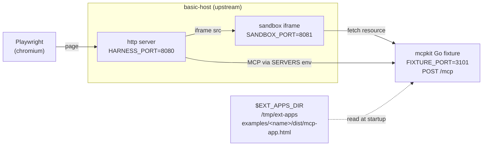

# apps/compat — mcpkit-Go drop-ins for upstream ext-apps parity testing

Each subdirectory here is a mcpkit-Go MCP server that mimics one of
[`modelcontextprotocol/ext-apps`](https://github.com/modelcontextprotocol/ext-apps)'s
TypeScript example servers byte-for-byte at the protocol surface. We run
upstream's own Playwright suite against the Go binary to validate that mcpkit
hosts can drive any client that targets the upstream examples.

Tracked under issue 533 (umbrella) and the per-example issues it links to.

## Wiring overview

Each box is a separate process the wrapper script orchestrates; the labels
show the env var that picks its port or path.



- `EXT_APPS_DIR` — upstream checkout the script clones / updates; the
  fixture reads `dist/mcp-app.html` from here verbatim.
- `HARNESS_PORT` — basic-host's HTTP listen port; Playwright drives this.
- `SANDBOX_PORT` — basic-host's sandbox-iframe origin; the app iframe
  loads inside it.
- `FIXTURE_PORT` — the mcpkit Go binary's MCP endpoint; basic-host
  connects here via the `SERVERS` env var.

## Drop-in shape

A compat fixture must match its upstream counterpart on three things:

1. **Tool name + input schema + output schema.** The host's Playwright tests
   call the tool by name and assert against the response shape.
2. **Resource URI exposing the UI.** Upstream picks `ui://<tool-name>/mcp-app.html`;
   mirror it exactly so the host renders the iframe at the URL it expects.
3. **HTML body served verbatim from upstream's `dist/mcp-app.html`.** Read it
   from `$EXT_APPS_DIR` at startup; do not vendor or modify it. The fixture's
   only job is to wire mcpkit's protocol surface to the same iframe payload
   upstream's server would have served.

CORS is the only host-environment-specific concern: basic-host runs on port
8080, the fixture runs on 3101, so the browser needs `Mcp-Session-Id` exposed.
`examples/apps/compat/basic-vanillajs/main.go` shows the minimal wrapper.

Anything not on this list (logging, framework choice, transport flavor) is
free. The whole point is that `basic-host` cannot tell the fixture apart from
upstream's TS server at the wire level.

## Adding a fixture for a new upstream example

1. Create `examples/apps/compat/<name>/` with `go.mod`, `main.go`, and the
   matching tool / resource registration. Copy the structure of
   `basic-vanillajs/main.go`.
2. Add a `case` arm in `scripts/apps-playwright-test.sh` mapping the upstream
   `EXAMPLE` value to your `FIXTURE_DIR` and a `GREP_PATTERN` that scopes
   Playwright to your example's `test.describe` block.
3. Generate the canonical (Linux / Docker) baseline:
   ```bash
   DOCKER=1 UPDATE_SNAPSHOTS=1 EXAMPLE=<name> make test-apps-playwright
   ```
   This writes `examples/apps/compat/<fixture>/__snapshots__/<key>-linux.png`.
4. (Optional) Generate the macOS dev baseline so local non-Docker iteration
   on darwin still passes visual checks:
   ```bash
   UPDATE_SNAPSHOTS=1 EXAMPLE=<name> make test-apps-playwright
   ```
   Writes `<key>-darwin.png` alongside the linux one.
5. Verify clean runs pass:
   ```bash
   EXAMPLE=<name> make test-apps-playwright            # native (uses your OS's baseline)
   DOCKER=1 EXAMPLE=<name> make test-apps-playwright   # CI-identical
   ```
6. Commit the fixture, the script arm, and the baseline PNG(s).

## Native vs Docker modes

Two run modes, same wrapper:

| Mode | Invocation | Snapshot suffix | Purpose |
|---|---|---|---|
| Native (default) | `make test-apps-playwright` | `-darwin` / `-linux` | Fast local iteration on the host OS. |
| Docker | `make test-apps-playwright-docker` (or `DOCKER=1 …`) | `-linux` | CI-identical run inside `mcr.microsoft.com/playwright:v1.57.0-noble` — same image upstream's `test:e2e:docker` uses. Cross-compiles the Go fixture for `linux/amd64` on the host, mounts it into the container; `basic-host` + Playwright run inside. Use this to generate the canonical linux baseline. |

The Playwright config templates the snapshot filename with `{platform}` so
`-darwin.png` and `-linux.png` coexist under the same `__snapshots__/`
directory; the runner auto-picks the file matching the run's OS, so no script
flag is needed to switch baselines.

## Where test results land

Whenever a run produces artifacts (failure diffs, traces, the HTML
report), they land under the fixture's `.test-results/` dir:

```
examples/apps/compat/<fixture>/.test-results/
├── artifacts/   ← per-test failure dirs: -actual.png / -diff.png /
│                  -expected.png / trace.zip / error-context.md
└── report/      ← Playwright HTML report; open index.html in a browser
```

Same paths in both modes — in Docker mode, the bind-mounted `/mcpkit`
volume surfaces the dir back to the host filesystem, so you can open
`report/index.html` in your local browser without `docker cp` or
volume gymnastics. The wrapper prints both paths at the end of any
failed run. The whole dir is gitignored.

## Snapshot baseline platform

Chromium's font fallback differs across operating systems, producing ~5–10px
layout shifts that exceed `maxDiffPixelRatio: 0.06`. The wrapper commits one
baseline per supported platform (`-darwin`, `-linux`) and Playwright resolves
the right one at runtime via the `{platform}` snapshot template token.

- **Linux baseline (`*-linux.png`)** is canonical. Generated under Docker
  using the same image upstream uses for `test:e2e:docker`, so the file is
  byte-identical to what their CI would produce.
- **macOS baseline (`*-darwin.png`)** is convenience. Lets contributors on
  Mac run `make test-apps-playwright` without Docker and still see visual
  regressions. Re-generate after any code change that affects the rendered
  output, the same way you'd re-generate the linux one.

If your platform has no committed baseline, the wrapper warns at startup
with the exact command to generate it. Windows / other Unices aren't
supported today (no `-win32` baseline); use Docker mode.

## Status legend

The umbrella issue tracks per-example status: `NOT` (not implemented),
`WIP` (in progress), `PROT` (protocol passes, visual diff outstanding),
`OK` (all-pass), `SKIP` (upstream marks as skipped for special-resource
reasons such as GPU or large model downloads).
