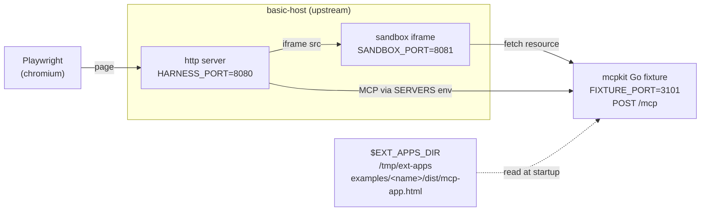

# apps/compat — mcpkit-Go drop-ins for upstream ext-apps parity testing

Each subdirectory here is a mcpkit-Go MCP server that mimics one of
[`modelcontextprotocol/ext-apps`](https://github.com/modelcontextprotocol/ext-apps)'s
TypeScript example servers byte-for-byte at the protocol surface. We run
upstream's own Playwright suite against the Go binary to validate that mcpkit
hosts can drive any client that targets the upstream examples.

Tracked under issue 533 (umbrella) and the per-example issues it links to.

## Wiring overview

Each box is a separate process the wrapper script orchestrates; the labels
show the env var that picks its port or path.



- `EXT_APPS_DIR` — upstream checkout the script clones / updates; the
  fixture reads `dist/mcp-app.html` from here verbatim.
- `HARNESS_PORT` — basic-host's HTTP listen port; Playwright drives this.
- `SANDBOX_PORT` — basic-host's sandbox-iframe origin; the app iframe
  loads inside it.
- `FIXTURE_PORT` — the mcpkit Go binary's MCP endpoint; basic-host
  connects here via the `SERVERS` env var.

## Drop-in shape

A compat fixture must match its upstream counterpart on three things:

1. **Tool name + input schema + output schema.** The host's Playwright tests
   call the tool by name and assert against the response shape.
2. **Resource URI exposing the UI.** Upstream picks `ui://<tool-name>/mcp-app.html`;
   mirror it exactly so the host renders the iframe at the URL it expects.
3. **HTML body served verbatim from upstream's `dist/mcp-app.html`.** Read it
   from `$EXT_APPS_DIR` at startup; do not vendor or modify it. The fixture's
   only job is to wire mcpkit's protocol surface to the same iframe payload
   upstream's server would have served.

CORS is the only host-environment-specific concern: basic-host runs on port
8080, the fixture runs on 3101, so the browser needs `Mcp-Session-Id` exposed.
`examples/apps/compat/basic-vanillajs/main.go` shows the minimal wrapper.

Anything not on this list (logging, framework choice, transport flavor) is
free. The whole point is that `basic-host` cannot tell the fixture apart from
upstream's TS server at the wire level.

## Adding a fixture for a new upstream example

1. Create `examples/apps/compat/<name>/` with `go.mod`, `main.go`, and the
   matching tool / resource registration. Copy the structure of
   `basic-vanillajs/main.go`.
2. Add a `case` arm in `scripts/apps-playwright-test.sh` mapping the upstream
   `EXAMPLE` value to your `FIXTURE_DIR` and a `GREP_PATTERN` that scopes
   Playwright to your example's `test.describe` block.
3. Generate the canonical baseline (Docker, byte-identical to what
   upstream's CI would produce):
   ```bash
   DOCKER=1 UPDATE_SNAPSHOTS=1 EXAMPLE=<name> make test-apps-playwright
   ```
   Writes `examples/apps/compat/<fixture>/__snapshots__/<key>.png`.
4. Verify clean runs pass:
   ```bash
   DOCKER=1 EXAMPLE=<name> make test-apps-playwright   # visual + protocol gate
   EXAMPLE=<name> make test-apps-playwright            # native — `loads app UI` only
   ```
5. Commit the fixture, the script arm, and the baseline PNG.

## Native vs Docker modes

Two run modes, same wrapper:

| Mode | Invocation | Purpose |
|---|---|---|
| Native (default) | `make test-apps-playwright` | Fast local iteration. Runs `loads app UI` (functional check) — passes anywhere. Runs `screenshot matches golden` — **expected to fail on non-Linux hosts** because the committed baseline is Docker-pinned. |
| Docker | `make test-apps-playwright-docker` (or `DOCKER=1 …`) | CI-identical run inside `mcr.microsoft.com/playwright:v1.57.0-noble` — same image upstream's `test:e2e:docker` uses. Cross-compiles the Go fixture for `linux/amd64` on the host, mounts it in; `basic-host` + Playwright run inside. The real visual gate. |

One canonical baseline per fixture (no `{platform}` suffix), matching
upstream's pinning convention. macOS / Windows contributors use Docker mode
when they want the visual check; native mode gives them the fast `loads app UI`
check for everyday iteration.

## Protocol-surface drift check (DOCKER mode)

The screenshot test is a **regression check, not an upstream-parity check** —
it compares each run against our own committed PNG. That's by design (see
the *Why not point at upstream's PNG?* note below). The upstream-parity
gate is a different mechanism: in DOCKER mode the wrapper spins up
upstream's own TypeScript reference server on a side port (`UPSTREAM_PORT`,
default 3102) and JSON-diffs `tools/list` against the mcpkit fixture
before Playwright runs. **The drift gate is strict** — any divergence
fails the build immediately. That makes the protocol surface the
load-bearing parity check; the PNG check covers visual regression on
top.

The drift diff filters two keys before comparison: `$schema` (different
SDKs emit different valid draft URLs — mcpkit emits draft-2020-12 via
invopop, upstream's TS SDK emits draft-07 via zod-to-json-schema; both
forward `$schema` on the wire for clients, but the value-level diff is
noise) and `additionalProperties` (mcpkit's schema generator deliberately
allows additional properties; upstream's is strict — `core/schema.go`
documents the rationale).

Skip the gate with `SKIP_DRIFT_CHECK=1` if you need to iterate while
tracking a known library gap. Native mode doesn't run the drift check —
would require Node + ext-apps build artifacts + the upstream server
runtime on the host, which fights the "fast local iteration" goal of
native mode.

### Why not point at upstream's PNG?

Tempting because once mcpkit's `tools/list` matches upstream's byte-for-
byte (which it now does — see drift gate above), the rendered iframe
should be identical too. We tried it; it doesn't work cleanly.

`basic-host` renders one entry per server in its dropdown. Upstream's
CI generates their PNG with all 25 example servers running at once —
their dropdown has 25 entries. Compat runs spin up only the example
under test, so the dropdown has 1 entry, and the whole iframe shifts
up by ~8px Y. With strict pixel-ratio checks, even byte-for-byte
surface parity isn't enough to match a multi-server baseline. Per-
fixture committed PNGs capture our actual run shape, which is the only
fair regression check we can do.

## Browsing an upstream example without Playwright

If you just want to *see* what an upstream example looks like in `basic-host`
— including the SKIP ones that don't have automated tests (`video-resource-
server`, `lazy-auth-server`) — there's a separate target:

```bash
make demo-app EXAMPLE=video-resource-server
make demo-app EXAMPLE=lazy-auth-server
make demo-app EXAMPLE=basic-server-vanillajs       # also works for testable examples
OPEN=0 make demo-app EXAMPLE=quickstart            # don't auto-open (CI / no display)
```

What it does (pure browse, no Playwright, no Docker, no drift check, no
snapshots):

1. Clones / updates `$EXT_APPS_DIR` (default `/tmp/ext-apps`)
2. Runs `npm install` if needed + `npm run build` for the chosen example
3. Starts the upstream **TS** server (not a mcpkit-Go fixture) on
   `SERVER_PORT` (default 3101). Uses `node dist/index.js` if the build
   produced one, falls back to `npx tsx main.ts`.
4. Starts `basic-host` on `HARNESS_PORT` (default 8080) with `SERVERS`
   pointing at the TS server
5. Opens the URL in your default browser (suppress with `OPEN=0`).

The browser opens by default — the whole point of this target is to see
an example without driving the test suite. Use it when comparing what
upstream's TS renders vs. what a mcpkit-Go drop-in would render, or when
poking at a SKIP example. CI / headless invocations should pass `OPEN=0`.

### Inspecting the protocol surface (`make inspect-app`)

Sibling target: instead of opening basic-host (which renders the App),
runs **MCPJam Inspector locally** (`npx @mcpjam/inspector@latest`) and
boots the upstream TS server alongside. MCPJam opens its own browser tab;
you paste the upstream server URL into MCPJam to connect.

```bash
make inspect-app EXAMPLE=basic-server-vanillajs
make inspect-app EXAMPLE=integration-server
make inspect-app EXAMPLE=debug-server
```

The wrapper prints a step-by-step banner: where the upstream server is
serving, what to paste into MCPJam, what to look for in each section.
Once MCPJam's browser tab is open, you'll see the wire — raw
`tools/list` JSON, `_meta.ui` structure, tool-call payloads, resource
bytes.

Decision matrix:

| Goal | Use |
|---|---|
| "Does this App render correctly? Does the bridge work?" | `make demo-app` |
| "What does the tool surface actually look like on the wire? What's in `_meta.ui`?" | `make inspect-app` |
| "Strict parity check against upstream's TS reference" | `make test-apps-playwright-docker` |

The console banner printed by each target tells you what to do once the
browser opens.

## Watching a run interactively

**Native mode opens a visible browser by default** — local dev iteration
is the primary use case for native mode, and watching what's happening
is the whole point. Three env switches control the visible-browser
modes:

| Flag | What it does |
|---|---|
| `HEADLESS=1` | Force headless even in native mode. CI / conformance runs should set this. |
| `DEBUG_PW=1` | Launches Playwright's Inspector. Pauses at every test step; click "step over" to advance. Overrides headless default. |
| `UI=1` | Launches Playwright's full UI runner — time-travel debugging, watch-mode, action timeline. Heavyweight. Overrides headless default. |

`HEADED=1` is also accepted (it's the explicit way to opt in) but
unnecessary in native mode.

All four are **native-mode only**. `DOCKER=1` is implicitly headless —
the guard rail just silently downgrades for `HEADED`, but errors out
clearly for `DEBUG_PW=1` or `UI=1` since those make no sense without
a display. Run native mode for visible-browser debugging; run Docker
mode for the strict drift gate.

```bash
make test-apps-playwright                        # headed native (local default)
HEADLESS=1 make test-apps-playwright             # native, headless (CI / conformance)
DEBUG_PW=1 make test-apps-playwright             # step through with Inspector
UI=1 make test-apps-playwright                   # full Playwright UI runner
make test-apps-playwright-docker                 # docker, always headless
```

## Where test results land

Whenever a run produces artifacts (failure diffs, traces, the HTML
report), they land under the fixture's `.test-results/` dir:

```
examples/apps/compat/<fixture>/.test-results/
├── artifacts/   ← per-test failure dirs: -actual.png / -diff.png /
│                  -expected.png / trace.zip / error-context.md
└── report/      ← Playwright HTML report; open index.html in a browser
```

Same paths in both modes — in Docker mode, the bind-mounted `/mcpkit`
volume surfaces the dir back to the host filesystem, so you can open
`report/index.html` in your local browser without `docker cp` or
volume gymnastics. The wrapper prints both paths at the end of any
failed run. The whole dir is gitignored.

## Snapshot baseline pinning

Chromium's font fallback differs across operating systems, producing ~5–10px
layout shifts that exceed `maxDiffPixelRatio: 0.06`. We pin one canonical
baseline per fixture to Linux Chromium (generated via Docker), matching
upstream's own pattern — `modelcontextprotocol/ext-apps` commits a single
PNG per example, pinned to the `mcr.microsoft.com/playwright:v1.57.0-noble`
image their `test:e2e:docker` target uses, and so do we.

Regenerate with:

```bash
DOCKER=1 UPDATE_SNAPSHOTS=1 EXAMPLE=<name> make test-apps-playwright
```

The native (non-Docker) wrapper still runs the visual test on the host, but
on non-Linux hosts it will fail vs the pinned Linux baseline. That's a
feature — visual regression is the kind of check you want on stable
infrastructure, not on whatever Chromium font fallback your laptop ships
this month. The `loads app UI` test is what carries the fast-local-iteration
story; that one passes anywhere.

## Status legend

The umbrella issue tracks per-example status: `NOT` (not implemented),
`WIP` (in progress), `PROT` (protocol passes, visual diff outstanding),
`OK` (all-pass), `SKIP` (upstream marks as skipped for special-resource
reasons such as GPU or large model downloads).
