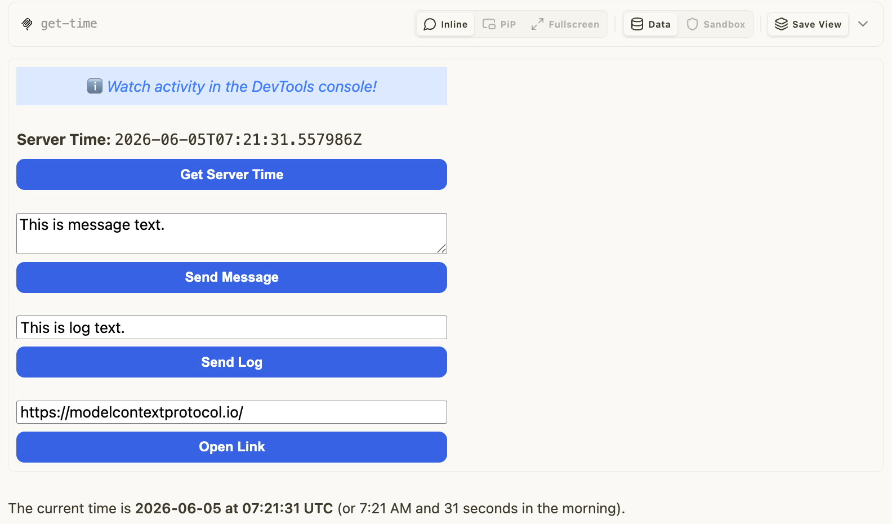

# basic-preact — same App, Preact iframe

Rung 2 on the [examples ladder](../README.md#reading-order--examples-ladder).
Same wire surface as [`basic-vanillajs`](../basic-vanillajs/README.md);
the iframe is built with Preact instead of vanilla JS.

## What it shows

The MCP protocol surface doesn't care how the iframe is built. Tool
name, schema, resource URI, and `_meta.ui` shape are identical to
basic-vanillajs — only the HTML payload differs. Demonstrates that
mcpkit hosts can drive a Preact-based App with no special handling.

## Run it

> ▶ **[Play the walkthrough in your browser](https://panyam.github.io/mcpkit/walkthroughs/examples/apps/compat/basic-preact/)** — animated playback of every curl / Go call the walkthrough makes, step-by-step. No clone, no setup.

Boots the mcpkit-Go fixture (`main.go` in this folder) and opens
[MCPJam Inspector](https://github.com/MCPJam/inspector) so you can poke
at the protocol surface:

```bash
make demo-app EXAMPLE=basic-preact
```

Paste `http://localhost:3101/mcp` into MCPJam's server list and connect.
Then browse `tools/list`, `_meta.ui`, and tool-call payloads on the wire.

See [Other ways to test a fixture](../README.md#other-ways-to-test-a-fixture) in the compat README for wire inspection, upstream comparison, and the strict Playwright gate.

## Prompts to try

Connect to `Basic MCP App Server (Preact)`, then paste any of these:

```
What's the current server time?
```

<a href="screenshots/01-get-time.png" target="_blank"></a>

```
Get the current time and tell me what day of the week that is.
```

```
Use the get-time tool.
```

The model calls `get-time`; the Preact iframe renders the result and
provides a button to call the tool again from the App side.

### Direct tool call (no LLM needed)

Same as [basic-vanillajs](../basic-vanillajs/README.md#direct-tool-call-no-llm-needed)
— select `get-time`, call with empty input, verify
`structuredContent.time` is an ISO 8601 string.

## What to look at next

- [`basic-vanillajs`](../basic-vanillajs/README.md) — the no-framework
  baseline.
- Other rung-2 framework variants:
  [`basic-react`](../basic-react/README.md) ·
  [`basic-solid`](../basic-solid/README.md) ·
  [`basic-svelte`](../basic-svelte/README.md) ·
  [`basic-vue`](../basic-vue/README.md).
- [`quickstart`](../quickstart/README.md) — same `get-time` tool, but
  upstream's "quickstart" template (default build setup).
