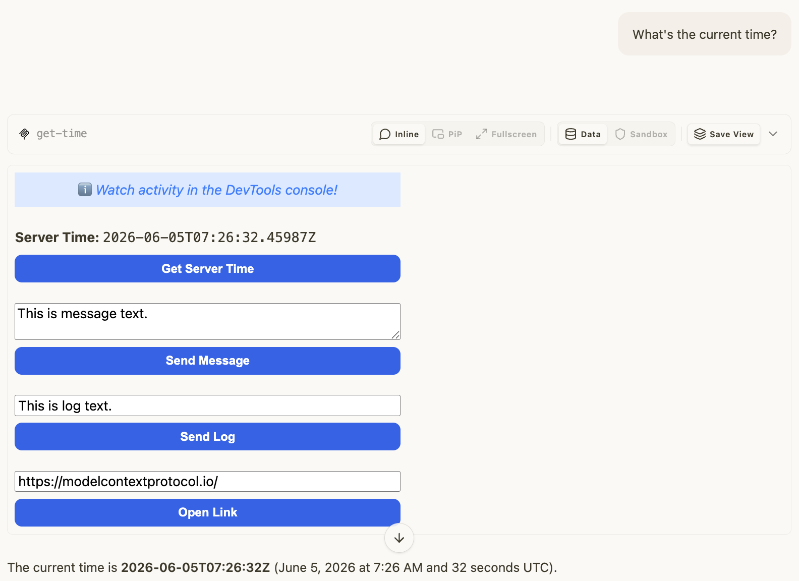

# basic-solid — same App, Solid iframe

Rung 2 on the [examples ladder](../README.md#reading-order--examples-ladder).
Same wire surface as [`basic-vanillajs`](../basic-vanillajs/README.md);
the iframe is built with Solid instead of vanilla JS.

## What it Shows

- **Identical wire surface to basic-vanillajs.** Same tool name
  (`get-time`), same input/output schema, same `ui://get-time/mcp-app.html`
  resource URI, same `_meta.ui` shape. Only the HTML payload differs.
- **Solid iframe instead of hand-rolled DOM.** The iframe HTML
  comes from upstream's `basic-server-solid` example's build
  output — pre-bundled Solid bundle. The mcpkit-Go fixture serves
  it verbatim as the resource.
- **Protocol surface is framework-agnostic.** mcpkit hosts can drive
  any of the rung-2 fixtures with no special handling — the framework
  choice never reaches the protocol.

## Run Pre-Recorded

> ▶ **[Play the walkthrough in your browser](https://panyam.github.io/mcpkit/walkthroughs/examples/apps/compat/basic-solid/)** — animated playback of every curl / Go call the walkthrough makes, step-by-step. No clone, no setup.

## Or Run Live

### Start Server

```bash
just demo-app EXAMPLE=basic-solid
```

Starts the mcpkit-Go fixture on `http://localhost:3101/mcp` and basic-host on `http://localhost:8080`. (Pass `OPEN=1` to auto-open the browser.)

## Try It Out on basic-host

Open <http://localhost:8080> in your browser. Then:

1. Pick **Basic MCP App Server (Solid)** from the server dropdown.
2. Pick **get-time** from the tool dropdown, click **Call Tool** with empty input.
3. The iframe inlines the ISO 8601 timestamp. The App also renders a button — click it and the App calls `get-time` itself via the bridge (no model in the loop).

<a href="screenshots/01-get-time.png" target="_blank"></a>

## Try It Out from a Host

Connect to `http://localhost:3101/mcp` from your favorite MCP host — VS Code, Claude Desktop, [MCPJam Inspector](https://github.com/MCPJam/inspector), or any spec-compliant client.

**Prompts to try** (LLM-driven hosts):

> "What's the current server time?"
> "Get the current time and tell me what day of the week that is."
> "Use the get-time tool."

The model calls `get-time`; the Solid iframe renders the result and exposes a button that calls the tool again from the App side via the bridge.

See [Other ways to test a fixture](../README.md#other-ways-to-test-a-fixture) in the compat README for wire inspection, upstream comparison, the strict Playwright gate, and connecting from VS Code / Claude Desktop / other MCP hosts.

## What to Try Next

- [`basic-vanillajs`](../basic-vanillajs/README.md) — the no-framework baseline that proves the protocol surface is the same regardless of iframe stack.
- Other rung-2 framework variants:
  [`basic-preact`](../basic-preact/README.md) · [`basic-react`](../basic-react/README.md) · [`basic-svelte`](../basic-svelte/README.md) · [`basic-vue`](../basic-vue/README.md).
- [`quickstart`](../quickstart/README.md) — same `get-time` tool, but upstream's "quickstart" template (default scaffolded build setup).
- See [`main.go`](main.go) — fixture is ~60 lines.
