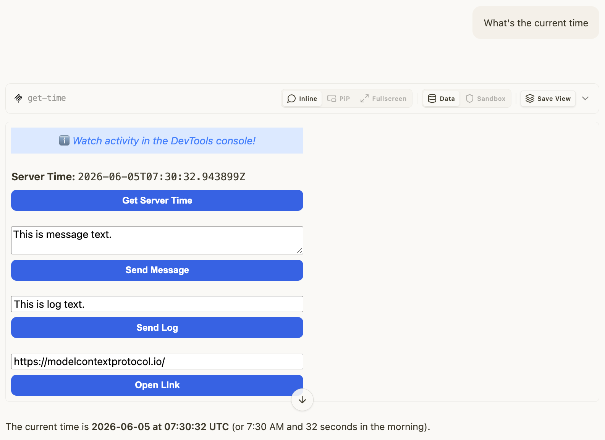

# basic-svelte — same App, Svelte iframe

Rung 2 on the [examples ladder](../README.md#reading-order--examples-ladder).
Same wire surface as [`basic-vanillajs`](../basic-vanillajs/README.md);
the iframe is built with Svelte (compiled at build time, no runtime).

## What it shows

The MCP protocol surface doesn't care how the iframe is built. Tool
name, schema, resource URI, and `_meta.ui` shape are identical to
basic-vanillajs — only the HTML payload differs. Demonstrates that
mcpkit hosts can drive a Svelte-based App with no special handling.

## Run it

Boots the mcpkit-Go fixture (`main.go` in this folder) and opens
[MCPJam Inspector](https://github.com/MCPJam/inspector) so you can poke
at the protocol surface:

```bash
make demo-app EXAMPLE=basic-server-svelte
```

Paste `http://localhost:3101/mcp` into MCPJam's server list and connect.
Then browse `tools/list`, `_meta.ui`, and tool-call payloads on the wire.

### [Optional] You can also do…

- **See the App rendered in basic-host.** Same Go fixture, but driven by
  basic-host (the canonical reference UI) instead of MCPJam. Opens a
  browser at `http://localhost:8080`:

  ```bash
  RENDERER=basic-host make demo-app EXAMPLE=basic-server-svelte
  ```

- **Hit upstream's TS reference server instead.** Useful for comparing
  the Go fixture's wire surface against the canonical implementation:

  ```bash
  make demo-upstream EXAMPLE=basic-server-svelte
  ```

  Add `RENDERER=basic-host` to render the upstream TS in basic-host
  instead of MCPJam.

- **Strict parity check against the mcpkit-Go fixture.** Runs upstream's
  Playwright suite against the Go binary — wire-level `tools/list` diff
  + visual PNG gate. Requires Docker:

  ```bash
  EXAMPLE=basic-server-svelte make test-apps-playwright-docker
  ```

## Prompts to try

Connect to `Basic MCP App Server (Svelte)`, then paste any of these:

```
What's the current server time?
```



```
Get the current time and tell me what day of the week that is.
```

```
Use the get-time tool.
```

The model calls `get-time`; the Svelte iframe renders the result and
provides a button to call the tool again from the App side.

### Direct tool call (no LLM needed)

Same as [basic-vanillajs](../basic-vanillajs/README.md#direct-tool-call-no-llm-needed)
— select `get-time`, call with empty input, verify
`structuredContent.time` is an ISO 8601 string.

## What to look at next

- [`basic-vanillajs`](../basic-vanillajs/README.md) — the no-framework
  baseline.
- Other rung-2 framework variants:
  [`basic-preact`](../basic-preact/README.md) ·
  [`basic-react`](../basic-react/README.md) ·
  [`basic-solid`](../basic-solid/README.md) ·
  [`basic-vue`](../basic-vue/README.md).
- [`quickstart`](../quickstart/README.md) — same `get-time` tool, but
  upstream's "quickstart" template (default build setup).
