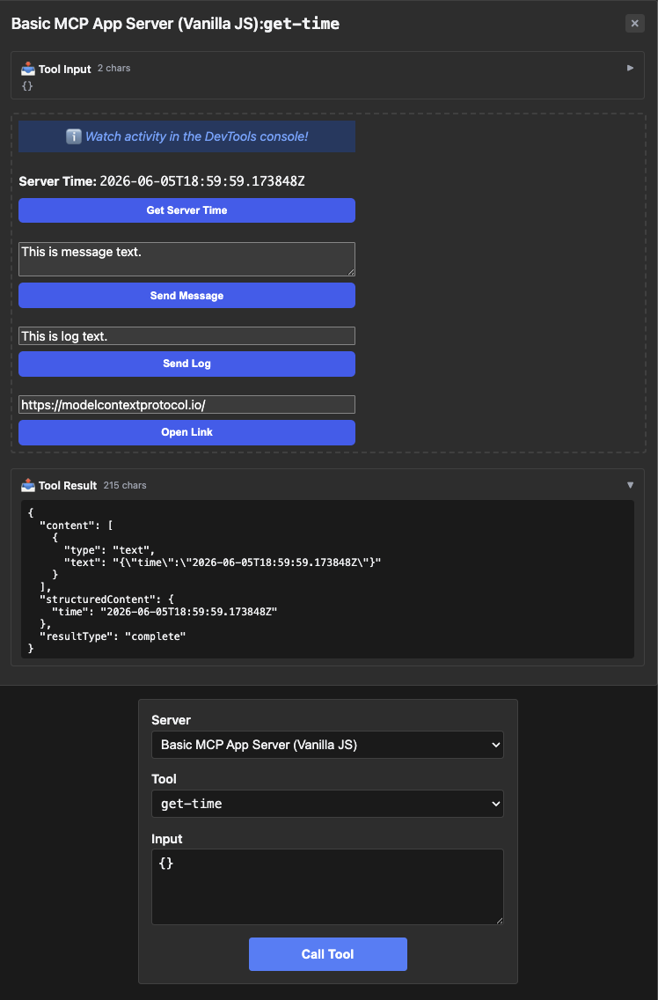

# basic-vanillajs — minimum-viable MCP App in Go

The simplest fixture in [`examples/apps/compat`](../) — one tool, one
resource, vanilla-JS iframe. Start here if you're new to the
host ↔ server ↔ App-iframe round trip.

## What it shows

- **One tool** — `get-time` returns the current server time as an
  ISO 8601 string. Typed handler (`struct{}` input, `getTimeOutput`
  output); the JSON Schema is reflected from the struct.
- **One resource** — `ui://get-time/mcp-app.html` serves upstream's
  verbatim iframe HTML. The host reads it at startup and inlines into
  the iframe on first tool call.
- **No frontend framework** — the App HTML is hand-rolled with
  `document.createElement` + `addEventListener`. Demonstrates that the
  protocol surface is framework-agnostic; later examples
  (`basic-preact`, `basic-react`, ...) plug Preact / React / Solid /
  Svelte / Vue behind the same wire.

## Run it

Start here — boots the mcpkit-Go fixture (`main.go` in this folder)
inside upstream's `basic-host` so you can see the App render in a real
browser. **No LLM required** — the iframe's bridge JS calls `get-time`
on its own and the result is inlined into the page:

```bash
make demo-app EXAMPLE=basic-vanillajs
```

What runs:

- **mcpkit-Go fixture** on `http://localhost:3101/mcp` — the Go binary
  built from `main.go` in this folder.
- **basic-host** opens at `http://localhost:8080`. Pick **Basic MCP App
  Server (Vanilla JS)** from the server dropdown, call **get-time** with
  empty input, watch the iframe inline the ISO 8601 timestamp.

See [Other ways to test a fixture](../README.md#other-ways-to-test-a-fixture) in the compat README for wire inspection, upstream comparison, and the strict Playwright gate.

## Prompts to try

Connect to `Basic MCP App Server (Vanilla JS)` from any MCP host with an
LLM (Claude Desktop, VS Code, etc. — see the [centralized guide](../README.md#other-ways-to-test-a-fixture)),
then paste
any of these into the chat:

```
What's the current server time?
```

<a href="screenshots/01-get-time.png" target="_blank"></a>

```
Get the current time and tell me what day of the week that is.
```

```
Use the get-time tool.
```

Any of these should make the model call `get-time` and inline the
result. The App iframe also renders a button — click it directly and
the App calls `get-time` itself via the bridge (no model in the loop).

### Direct tool call (no LLM needed)

If you're running MCPJam without an LLM connected, or want to verify
the wire shape:

| What | How | What you should see |
|---|---|---|
| Smoke test the tool | Select `get-time` from the dropdown and click "Call Tool" with empty input | Tool result panel: `{ "time": "2026-…Z" }` in `structuredContent` |
| Check `_meta.ui.resourceUri` | Expand the tool's `_meta` field in the tools list | `{"ui": {"resourceUri": "ui://get-time/mcp-app.html"}, "ui/resourceUri": "ui://get-time/mcp-app.html"}` — both the nested and flat forms are emitted for backward compat. |

## What to look at next

- Move up the [examples ladder](../README.md#reading-order--examples-ladder) — rung 2
  shows the same shape behind frameworks; rung 3 onwards introduces
  richer payloads.
- Compare upstream's TS server side-by-side: `make demo-upstream
  EXAMPLE=basic-vanillajs` runs the TS one; the visual + wire
  surface should be identical.
- See [`main.go`](main.go) — fixture is ~60 lines.
