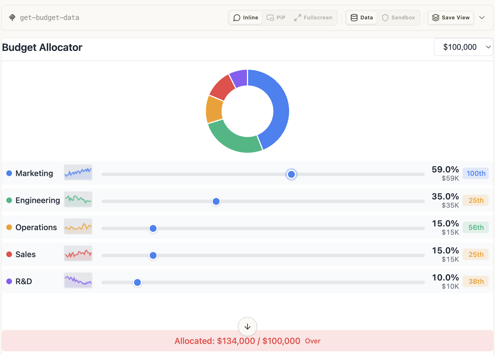

# budget-allocator — deeply nested SaaS budget data

Rung 4 on the [examples ladder](../README.md#reading-order--examples-ladder).
One tool, but the output is a deeply nested object (config + analytics
with multi-month history and stage benchmarks). First fixture where
reflection of nested Go structs + maps produces the matching shape
without override.

## What it shows

- **Multi-level nested output.** `get-budget-data` returns a Budget
  Config (categories + presets) plus Analytics (24 months of
  historical allocations + benchmarks by company stage). Each nested
  level uses Go structs + `map[string]any`-style typed maps; the
  reflector emits the matching JSON Schema cleanly.
- **No override needed.** Standard struct tags get this right. Sits
  in the sweet spot of what reflection can handle.

## Run it

Boots the mcpkit-Go fixture (`main.go` in this folder) inside upstream's
`basic-host` so you can see the App render in a real browser. **No LLM
required** — the App's bridge JS calls `get-budget-data` on its own and
all interaction (sliders, stage switcher, benchmark comparison) goes
through the same MCP wire:

```bash
make demo-app EXAMPLE=budget-allocator
```

A browser opens at `http://localhost:8080`. First-touch flow:

1. Pick **Budget Allocator Server** from the server dropdown.
2. Pick **get-budget-data** from the tool dropdown, click **Call Tool**
   with empty input.
3. The iframe renders. Interact directly — drag the sliders, switch
   company stages, compare against the benchmark bands.

<a href="screenshots/01-default-budget.png" target="_blank"></a>

<a href="screenshots/02-analytics-view.png" target="_blank"></a>

<a href="screenshots/03-series-a-benchmark.png" target="_blank"></a>

See [Other ways to test a fixture](../README.md#other-ways-to-test-a-fixture) in the compat README for wire inspection, upstream comparison, the strict Playwright gate, and connecting from VS Code / Claude Desktop / other MCP hosts.

### Verify the wire shape (no LLM needed)

Useful for spot-checking what the Go fixture puts on the wire vs. what
the iframe reads:

| What | How | What you should see |
|---|---|---|
| Smoke test | Call `get-budget-data` with empty input (basic-host or MCPJam) | Tool result `structuredContent`: `{"config": {"categories": [...5 entries], "presetBudgets": [50000, 100000, 250000, 500000], "defaultBudget": 100000, "currency": "USD", "currencySymbol": "$"}, "analytics": {"history": [...24 months], "benchmarks": [...4 stages], "stages": ["Seed", "Series A", "Series B", "Growth"], "defaultStage": "Series A"}}` |
| Verify the nested shape | Expand `outputSchema.properties.analytics.properties.history.items` in MCPJam | Nested item schema with month + per-category allocations — reflected from the Go struct, no override |

## What to look at next

- [`scenario-modeler`](../scenario-modeler/README.md) — rung-4
  sibling; adds a nullable field at depth that reflection alone
  CAN'T produce (OutputSchemaOverride still required).
- [`cohort-heatmap`](../cohort-heatmap/README.md) /
  [`customer-segmentation`](../customer-segmentation/README.md) —
  same rung, different data shapes.
