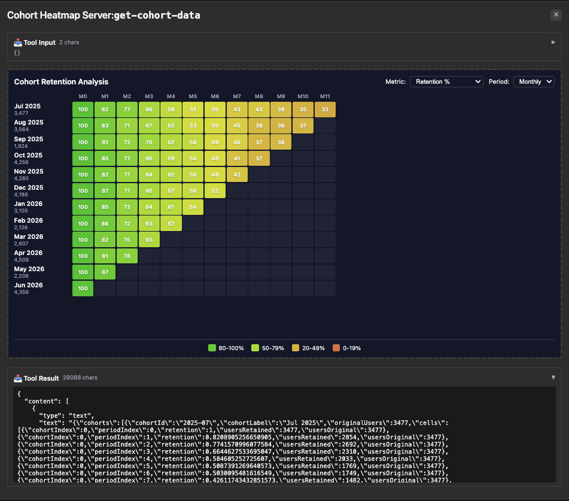

# cohort-heatmap — retention heatmap with rich numeric data

Rung 4 on the [examples ladder](../README.md#reading-order--examples-ladder).
One tool, nested retention data. The iframe renders a classic
cohort-retention heatmap.

## What it Shows

- **12×12 retention dataset.** `get-cohort-data` returns 12 cohorts ×
  12 period columns of structured retention data, generated server-side
  by a seeded exponential-decay curve (`baseRetention * exp(-decayRate
  * (period-1)) + floor + noise`). The iframe binds directly to
  `structuredContent.cohorts` / `periods` / `periodLabels` and renders
  the matrix as a color-graded heatmap.
- **Enum + default input schema, reflected cleanly.** The `metric`
  (retention / revenue / active) and `periodType` (monthly / weekly)
  inputs use enums with defaults declared via struct tags — no
  `InputSchemaPatch` needed. The iframe's two filter dropdowns send
  the picked values back through `app.callServerTool` to re-fetch.
- **Integer-vs-number drift, by design.** Cohort sizes and indices are
  semantically integer; Go's `int` reflects to `"type": "integer"`
  while upstream's zod `z.number()` emits `"type": "number"`. The
  DOCKER drift comparator normalizes these (PR 549) so the fixture
  uses idiomatic Go types and still passes the strict parity gate.
- **Moderate bridge dance.** The iframe uses `app.callServerTool` per
  filter change and `app.getHostContext` for theming — but no
  `app.registerTool` and no `app.updateModelContext`. Sits between
  `quickstart` (bare minimum) and `budget-allocator` (rich dance) on
  the App-ness spectrum.

## Run Pre-Recorded

> ▶ **[Play the walkthrough in your browser](https://panyam.github.io/mcpkit/walkthroughs/examples/apps/compat/cohort-heatmap/)** — animated playback of every curl / Go call the walkthrough makes. Steps 1-4 walk the server-side surface (initialize → tools/list with the enum/default input schema highlighted → tools/call get-cohort-data showing the 12×12 payload shape → resources/read on the iframe HTML); the closing narrative section names the moderate bridge dance the iframe takes from there. No clone, no setup.

## Or Run Live

### Start Server

```bash
just demo-app EXAMPLE=cohort-heatmap
```

Starts the mcpkit-Go fixture on `http://localhost:3101/mcp` and basic-host on `http://localhost:8080`. (Pass `OPEN=1` to auto-open the browser.)

## Try It Out on basic-host

Open <http://localhost:8080> in your browser. Then:

1. Pick **Cohort Heatmap Server** from the server dropdown.
2. Pick **get-cohort-data** from the tool dropdown, click **Call Tool**.
3. The iframe renders the result; interact with it directly to drive subsequent tool calls (no model in the loop).

<a href="screenshots/01-default-heatmap.png" target="_blank"></a>

## Try It Out from a Host

Connect to `http://localhost:3101/mcp` from your favorite MCP host — VS Code, Claude Desktop, [MCPJam Inspector](https://github.com/MCPJam/inspector), or any spec-compliant client.

**Prompts to try** (LLM-driven hosts):

> "Show me a cohort retention heatmap."
> "What's my user retention by signup month?"
> "Display the cohort analysis dashboard."
> "How is retention looking month-over-month for the last six cohorts?"

The model calls `get-cohort-data`; the iframe renders the heatmap
with cohorts on one axis, time periods on the other.

**Verify the wire shape** (no LLM needed):

| What | How | What you should see |
|---|---|---|
| Smoke test | Select `get-cohort-data`, call with empty input | Tool result: nested cohort × period retention data in `structuredContent` |
| Iframe renders the heatmap | Same call, scroll up | Color-graded matrix in the App iframe |

See [Other ways to test a fixture](../README.md#other-ways-to-test-a-fixture) in the compat README for wire inspection, upstream comparison, the strict Playwright gate, and connecting from VS Code / Claude Desktop / other MCP hosts.

## What to Try Next

- [`customer-segmentation`](../customer-segmentation/README.md) —
  rung-4 sibling, different analytical shape.
- [`budget-allocator`](../budget-allocator/README.md) /
  [`scenario-modeler`](../scenario-modeler/README.md) — other
  rung-4 fixtures.
