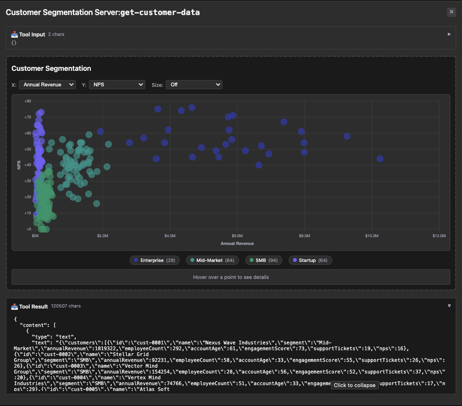

# customer-segmentation — customer clusters with multi-dimension features

Rung 4 on the [examples ladder](../README.md#reading-order--examples-ladder).
One tool, customer cluster data. The iframe renders cluster scatter
plots + per-segment summaries.

## What it shows

- **Customer segmentation output.** `get-customer-data` returns
  cluster assignments + per-cluster feature averages + per-customer
  records. The iframe lets you explore segments interactively.
- **Multi-dimensional records.** Each customer record carries
  numeric + categorical features; clusters carry feature averages
  + sizes. Reflection of the nested Go shape produces the schema
  cleanly without override.

## Run it

```bash
# mcpkit-Go fixture + MCPJam (default — wire-level inspection)
make demo-app EXAMPLE=customer-segmentation-server

# Same Go fixture rendered in basic-host (iframe + bridge JS)
RENDERER=basic-host make demo-app EXAMPLE=customer-segmentation-server

# Compare against upstream's TS reference server
make demo-upstream EXAMPLE=customer-segmentation-server

# Strict parity check (visual baseline + tools/list diff, requires Docker)
EXAMPLE=customer-segmentation-server make test-apps-playwright-docker
```

## Prompts to try

Connect to `Customer Segmentation Server`, then paste any of these:

```
Show me my customer segments.
```



```
Cluster my customers and visualize the segments.
```

```
Which customer segments are most valuable?
```


```
Display customer segmentation with average revenue per cluster.
```

The model calls `get-customer-data`; the iframe renders the cluster
scatter plot + per-segment summaries.

### Direct tool call (no LLM needed)

| What | How | What you should see |
|---|---|---|
| Smoke test | Select `get-customer-data`, call with empty input | Tool result: nested clusters + customer records in `structuredContent` |
| Iframe renders the clusters | Same call, scroll up | Scatter plot + segment summary in the App iframe |

## What to look at next

- [`cohort-heatmap`](../cohort-heatmap/README.md) — rung-4 sibling,
  different analytical shape.
- [`budget-allocator`](../budget-allocator/README.md) — rung-4 with
  config + analytics nested model.
