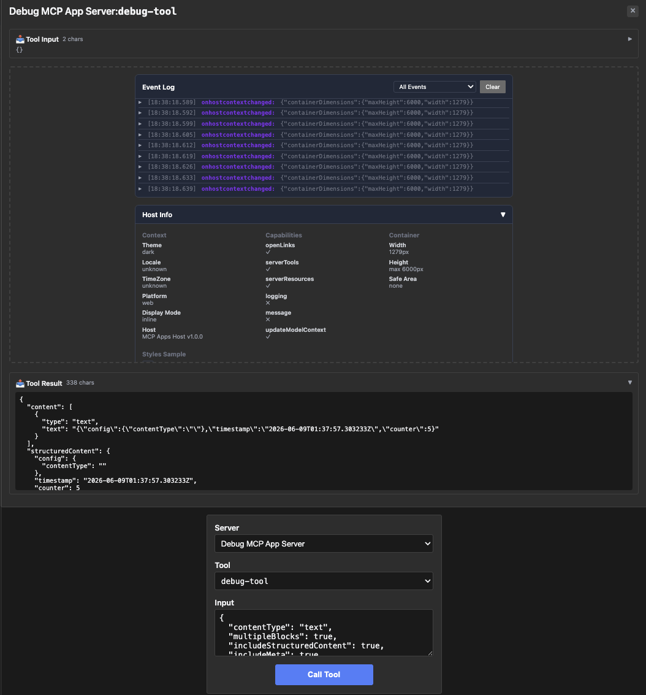

# debug-server — kitchen-sink diagnostic + two app-only helpers

Rung 6 on the [examples ladder](../README.md#reading-order--examples-ladder).
Three tools — a kitchen-sink debug surface for the model, plus two
app-only helpers (refresh / log) the iframe uses internally.

## What it shows

- **Three tools, shared iframe.** `debug-tool` is the model-visible
  kitchen-sink for testing content-type behavior (text, image, audio,
  resource, mixed), error simulation, delays, large input, and
  structured content. `debug-refresh` and `debug-log` are app-only
  helpers the iframe calls via the bridge.
- **`Payload any` reflects cleanly.** Before the issue 548 Gap 2 fix,
  `debug-log`'s `Payload any` field required an `InputSchemaOverride`
  because invopop emits bare-`true` for `any` (rejected by the MCP
  TypeScript SDK's zod validator). With the fix in place, the field
  reflects to `{}` automatically — no override.

## Run it

```bash
# mcpkit-Go fixture + MCPJam (default — wire-level inspection)
make demo-app EXAMPLE=debug-server

# Same Go fixture rendered in basic-host (iframe + bridge JS)
RENDERER=basic-host make demo-app EXAMPLE=debug-server

# Compare against upstream's TS reference server
make demo-upstream EXAMPLE=debug-server

# Strict parity check (visual baseline + tools/list diff, requires Docker)
EXAMPLE=debug-server make test-apps-playwright-docker
```

## Prompts to try

Connect to `Debug MCP App Server`, then paste any of these:

```
Use the debug tool to show me text content.
```



```
Debug tool with content type "image" and include structured content.
```

```
Run the debug tool with mixed content blocks and a 500ms delay.
```


```
Simulate an error in the debug tool.
```

```
Send a debug call with a large input string (say 10KB of text).
```

The model calls `debug-tool` with the corresponding parameters; the
iframe renders the result and exercises whichever content shape was
requested.

### Direct tool call (no LLM needed)

| What | How | What you should see |
|---|---|---|
| Text-only response | Select `debug-tool`, call with `{"contentType": "text"}` | Tool result is a text block, `structuredContent` has counter + timestamp |
| Mixed-content response | Call with `{"contentType": "mixed", "multipleBlocks": true}` | Multiple content items: text + image + audio etc. |
| Simulate error | Call with `{"simulateError": true}` | Tool result has `isError: true` + an error message |
| App-only refresh | Select `debug-refresh`, call with empty input | Tool result has fresh timestamp + counter. (App-only — model won't see this in its tool list by default.) |
| App-only log | Select `debug-log`, call with `{"type": "test", "payload": {"any": "shape"}}` | Tool result confirms logged. Note the `payload` field accepts any shape — that's the issue-548 Gap 2 fix working. |

## What to look at next

- [`system-monitor`](../system-monitor/README.md) — rung-6 sibling
  with two tools (one app-only) sharing the iframe.
- [`integration`](../integration/README.md) — rung-6 sibling that
  adds host-callback semantics.
- [`pdf-server`](../pdf-server/README.md) — rung-7 endgame for
  multi-tool fixtures.
