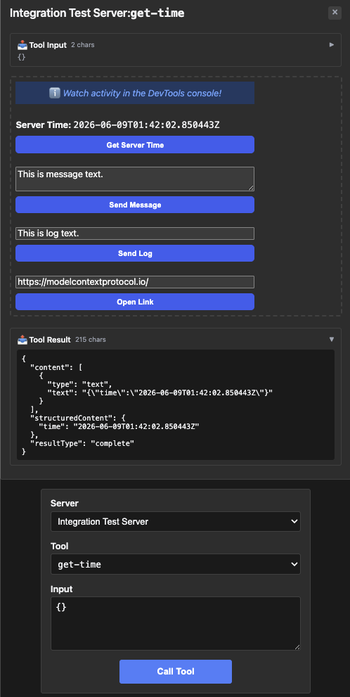
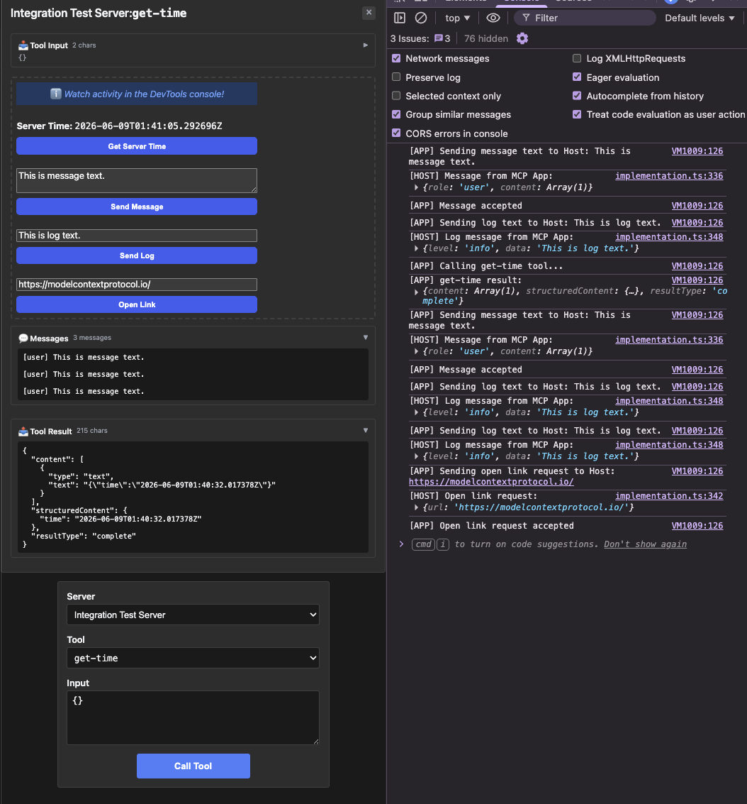

# integration — host-callback interactions (Send Message / Log / Link)

Rung 6 on the [examples ladder](../README.md#reading-order--examples-ladder).
Most-tested fixture in the cluster — passes the 2 standard
servers.spec.ts tests PLUS 3 host-callback interaction tests (Send
Message, Send Log, Open Link).

## What it shows

- **Host callbacks from the App.** The App iframe surfaces buttons
  that drive **host-level** interactions over the bridge — not just
  tool calls back to the server, but messages the host itself reacts
  to (logging, link opening, notifications). Exercises the full
  three-way conversation: model ↔ server ↔ App ↔ host.
- **Multiple resources for one server.** The fixture registers a
  resource for the download URL alongside the `get-time` tool. Host
  reads the resource separately as part of the test flow.
- **5/5 in the test suite.** Two standard `loads app UI` /
  `screenshot matches golden` tests + three interaction tests
  (`Send Message button triggers host callback`, `Send Log button
  triggers host callback`, `Open Link button triggers host
  callback`). Highest pass count of any compat fixture in DOCKER mode.

## Run it

Boots the mcpkit-Go fixture (`main.go` in this folder) and opens
[MCPJam Inspector](https://github.com/MCPJam/inspector) so you can poke
at the protocol surface:

```bash
make demo-app EXAMPLE=integration-server
```

Paste `http://localhost:3101/mcp` into MCPJam's server list and connect.
Then browse `tools/list`, `_meta.ui`, and tool-call payloads on the wire.

### [Optional] You can also do…

- **See the App rendered in basic-host.** Same Go fixture, but driven by
  basic-host (the canonical reference UI) instead of MCPJam. Opens a
  browser at `http://localhost:8080`:

  ```bash
  RENDERER=basic-host make demo-app EXAMPLE=integration-server
  ```

- **Hit upstream's TS reference server instead.** Useful for comparing
  the Go fixture's wire surface against the canonical implementation:

  ```bash
  make demo-upstream EXAMPLE=integration-server
  ```

  Add `RENDERER=basic-host` to render the upstream TS in basic-host
  instead of MCPJam.

- **Strict parity check against the mcpkit-Go fixture.** Runs upstream's
  Playwright suite against the Go binary — wire-level `tools/list` diff
  + visual PNG gate. Requires Docker:

  ```bash
  EXAMPLE=integration-server make test-apps-playwright-docker
  ```

## Prompts to try

Connect to `Integration Test Server`, then paste any of these:

```
What's the current server time?
```



```
Use the get-time tool.
```

After the tool call lands, click any of the three buttons in the
iframe directly to see the host respond:



The model calls `get-time`. The interesting bits are inside the
iframe — click "Send Message", "Send Log", or "Open Link" directly in
the App to see the host pick up the callback (basic-host renders the
message in its UI).

### Direct tool call (no LLM needed)

| What | How | What you should see |
|---|---|---|
| Smoke test the tool | Select `get-time`, call with empty input | Result: `{"time": "2026-…Z"}` in `structuredContent` |
| Send Message button | In the App iframe, click "Send Message" | basic-host (host side) shows the message — App-to-host callback over the bridge |
| Send Log button | Click "Send Log" in the App | basic-host's log surface picks it up |
| Open Link button | Click "Open Link" in the App | basic-host emits an open-link event |

## What to look at next

- [`system-monitor`](../system-monitor/README.md) /
  [`debug-server`](../debug-server/README.md) — rung-6 siblings,
  multi-tool surfaces without host callbacks.
- [`pdf-server`](../pdf-server/README.md) — rung-7 endgame; takes the
  multi-tool + state pattern to a 9-tool surface with command queue.
