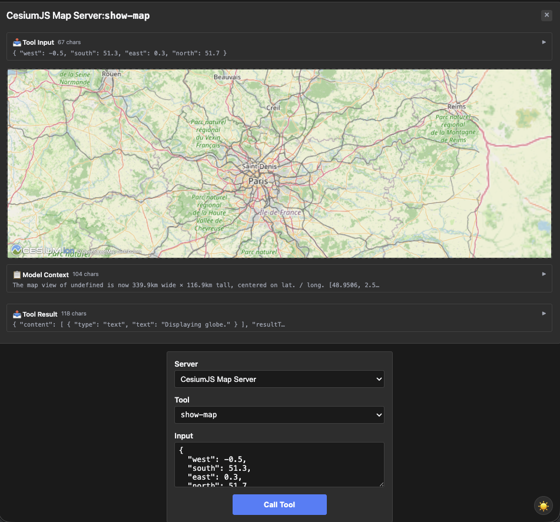
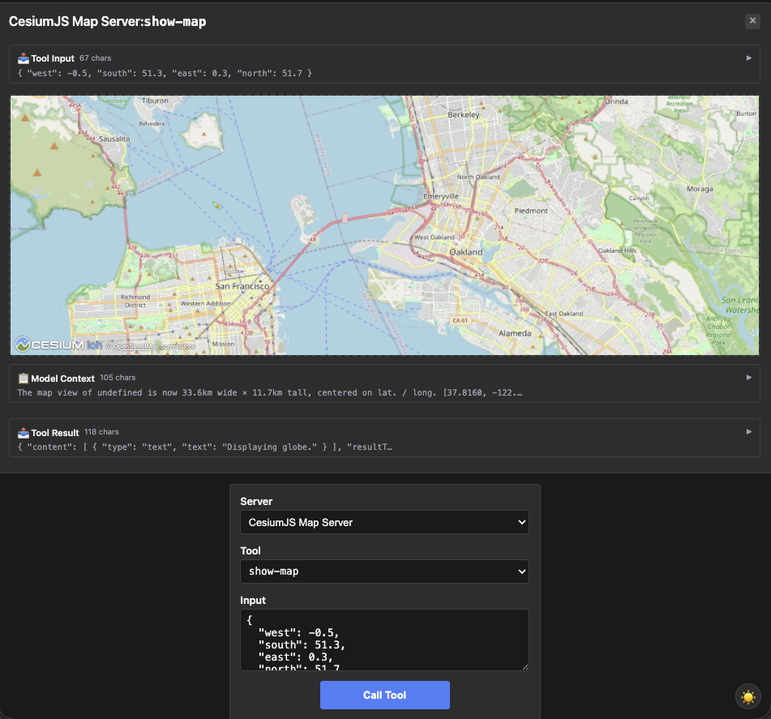

# map — CesiumJS interactive map + geocoding

Rung 5 on the [examples ladder](../README.md#reading-order--examples-ladder).
Two tools — one carries the iframe, the other is a plain MCP tool the
App calls via the bridge.

## What it shows

- **App-side bridge calls.** `show-map` renders a CesiumJS globe in
  the iframe. The App calls `geocode` over the bridge (not via the
  model) to convert place names into bounding boxes. First example
  where a plain tool is exercised primarily by the App, not the
  model.
- **Comma-rich tool descriptions.** `geocode`'s input description
  contains a comma-separated list of examples (`"e.g., 'Paris',
  'Golden Gate Bridge', '1600 Pennsylvania Ave'"`). Struct-tag
  reflection would truncate at the first comma; `InputSchemaPatch`
  lands the full description through `Prop("query").Desc(...)
  .Required()`.

## Run it

```bash
# mcpkit-Go fixture + MCPJam (default — wire-level inspection)
make demo-app EXAMPLE=map-server

# Same Go fixture rendered in basic-host (iframe + bridge JS)
RENDERER=basic-host make demo-app EXAMPLE=map-server

# Compare against upstream's TS reference server
make demo-upstream EXAMPLE=map-server

# Strict parity check (visual baseline + tools/list diff, requires Docker)
EXAMPLE=map-server make test-apps-playwright-docker
```

## Prompts to try

In MCPJam Inspector or basic-host, connect to `CesiumJS Map Server`,
then paste any of these into the chat:

```
Show me a map of Paris.
```



```
Where is the Golden Gate Bridge? Show it on a map.
```



```
Geocode "1600 Pennsylvania Avenue" and then display it on the map.
```

```
Zoom in on Tokyo Tower.
```


Each should make the model call `geocode` (to resolve the place name
into a bounding box) followed by `show-map` (with that bounding box).
The iframe pans to the location.

The iframe also has its own search field — type a place name directly
and the App calls `geocode` via the bridge and updates the map (no
model in the loop).

### Direct tool call (no LLM needed)

| What | How | What you should see |
|---|---|---|
| Render the default map | Select `show-map`, call with an empty input | Iframe renders the CesiumJS globe at the default view |
| Geocode a place | Select `geocode`, call with `{"query": "Paris"}` | Tool result: text block with coordinates + bounding box for up to 5 matches |
| Inspect comma-rich description | Expand `geocode`'s `inputSchema.properties.query.description` | The full `"...e.g., 'Paris', 'Golden Gate Bridge', '1600 Pennsylvania Ave'"` string survives intact |

## What to look at next

- [`wiki-explorer`](../wiki-explorer/README.md) (rung 5, sibling) —
  one-tool interactive graph; the App does the work itself.
- [`integration`](../integration/README.md) (rung 6) — App-callable
  tools with host-callback semantics (Send Message, Send Log, Open
  Link).
- See [`main.go`](main.go) — the `InputSchemaPatch` on `geocode`
  is one method-chain line.
