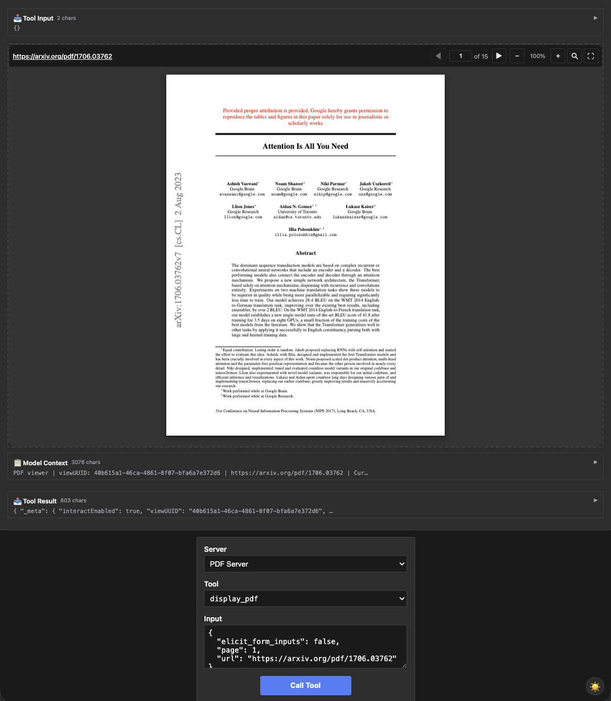

# pdf-server — 9-tool surface, command queue, long-poll

Rung 7 on the [examples ladder](../README.md#reading-order--examples-ladder) —
the most complex fixture. Goes beyond the request/response pattern of
the other examples: per-viewUUID command queue, long-poll endpoint,
server-initiated rendezvous (server enqueues a command, viewer
responds via separate tool, server's `Await` unblocks).

If you've worked through the earlier rungs, this is where the
patterns compound.

## What it shows

- **9 tools**, mirroring upstream's `--enable-interact` surface:
  - `list_pdfs`, `read_pdf_bytes`, `display_pdf`, `save_pdf` — the
    base 4 that the default no-flag upstream surface also exposes.
  - `interact`, `poll_pdf_commands`, `submit_page_data`,
    `submit_save_data`, `submit_viewer_state` — the 5 that wire up
    the command-queue / rendezvous machinery.
- **Per-viewUUID state.** Each call to `display_pdf` mints a UUID;
  later `interact` calls reference it. Multiple PDFs can be open at
  once; the queue + waiters are per-UUID. Implementation in
  [`queue.go`](queue.go).
- **Long-poll endpoint.** The iframe calls `poll_pdf_commands` and
  blocks (server-side) until commands arrive or a timeout fires. The
  drain is batched — short window after wake-up lets in-flight
  `interact` calls join the same response.
- **Server-initiated rendezvous.** When the model asks for `get_text`
  or `get_screenshot`, the server enqueues a command with a
  `requestId`, then `Await`s a separate channel until the iframe calls
  `submit_page_data` with that `requestId`. Three rendezvous tables
  (pages, saves, viewer states) — each backed by a typed
  `gocurrent.SyncMap`.
- **HTTP range proxy.** `read_pdf_bytes` is a streaming range proxy
  for `https://` and `file://` URLs, so the iframe can stream PDFs
  larger than 512KB chunks. Implementation in
  [`bytes.go`](bytes.go).
- **The `core.ToolResultMeta.Extras` library addition.** `display_pdf`
  emits `_meta.interactEnabled`, `_meta.viewUUID`, `_meta.writable`
  via `Extras` — the wire spec lists `_meta` as an open object, so
  extension-namespaced keys spread at the top level of the meta
  object.

## Run it

```bash
# mcpkit-Go fixture + MCPJam (default — wire-level inspection)
make demo-app EXAMPLE=pdf-server

# Same Go fixture rendered in basic-host (iframe + bridge JS)
RENDERER=basic-host make demo-app EXAMPLE=pdf-server

# Compare against upstream's TS reference server
make demo-upstream EXAMPLE=pdf-server

# Strict parity check (visual baseline + tools/list diff, requires Docker)
EXAMPLE=pdf-server make test-apps-playwright-docker
```

Default PDF is `https://arxiv.org/pdf/1706.03762` ("Attention Is All
You Need") — upstream's default too.

## Prompts to try

In MCPJam Inspector or basic-host, connect to `PDF Server`, then paste
prompts into the chat. Each builds on the previous — start at the top.

Open a PDF:

```
Show me the "Attention Is All You Need" paper.
```



Navigate:

```
Navigate to page 3.
```

Highlight matches across the visible page:

```
Highlight every occurrence of "attention" in yellow.
```


Search:

```
Search for "transformer" and jump to the first match.
```

Zoom:

```
Zoom in to 150%.
```


Extract content:

```
Get the text from pages 2 through 4.
```

```
Take a screenshot of the current page.
```


Read the live viewer state (server-initiated rendezvous):

```
What page am I currently on, and what's the zoom level?
```


Behind the scenes:

- The first prompt makes the model call `display_pdf` (the iframe
  renders the PDF, the tool result carries `viewUUID`). Subsequent
  prompts reuse that `viewUUID` via the `interact` tool — the model
  figures out the right `action`.
- `navigate`, `highlight_text`, `search`, `zoom` are fire-and-forget:
  server enqueues a command, viewer picks it up via long-poll.
- `get_text`, `get_screenshot`, `get_viewer_state` are
  request/response: server enqueues + blocks; viewer responds via
  `submit_page_data` / `submit_viewer_state`.

### Direct tool call (no LLM needed)

| What | How | What you should see |
|---|---|---|
| Open the default PDF | Select `display_pdf`, call with empty input | Iframe renders the default arxiv PDF. Tool result has `viewUUID` in `structuredContent` AND in `_meta` (the `Extras` flow). |
| Custom PDF | `display_pdf` with `{"url": "https://arxiv.org/pdf/2401.04088"}` | Iframe renders the Mixtral paper. New viewUUID. |
| Navigate via interact | `interact` with `{"viewUUID":"<uuid>","action":"navigate","page":3}` | Iframe scrolls to page 3. Server enqueued a `{type:"navigate",page:3}` command; iframe long-polled and picked it up. |
| Highlight text | `interact` with `{"viewUUID":"<uuid>","action":"highlight_text","query":"attention","color":"yellow"}` | Iframe highlights every occurrence of "attention" on the current page in yellow. |
| Batched commands | `interact` with `{"viewUUID":"<uuid>","commands":[{"action":"navigate","page":1},{"action":"highlight_text","query":"transformer"},{"action":"zoom","scale":1.5}]}` | Three commands ride one tool call. Iframe applies them in order. |
| Server-initiated rendezvous | `interact` with `{"viewUUID":"<uuid>","action":"get_viewer_state"}` | Server enqueues a command with a generated requestId, blocks on its rendezvous channel. Iframe sees the command via the long-poll, then calls `submit_viewer_state` with that requestId carrying its live state. Server's await unblocks; the rendezvous payload becomes the tool result. |

## What to look at next

- This is the top of the ladder. If you want to see how the patterns
  compound from the bottom up, walk back through [`map`](../map/README.md)
  → [`wiki-explorer`](../wiki-explorer/README.md) →
  [`integration`](../integration/README.md).
- Read [`queue.go`](queue.go) — single-file implementation of the
  command queue + waiter + three rendezvous tables (~250 LOC).
- Read [`bytes.go`](bytes.go) — HTTP range proxy + local-file
  handling (~80 LOC).
- Open issue: [`#574`](https://github.com/panyam/mcpkit/issues/574)
  tracks the one remaining test (form-fields-names; needs a streaming
  AcroForm parser).
