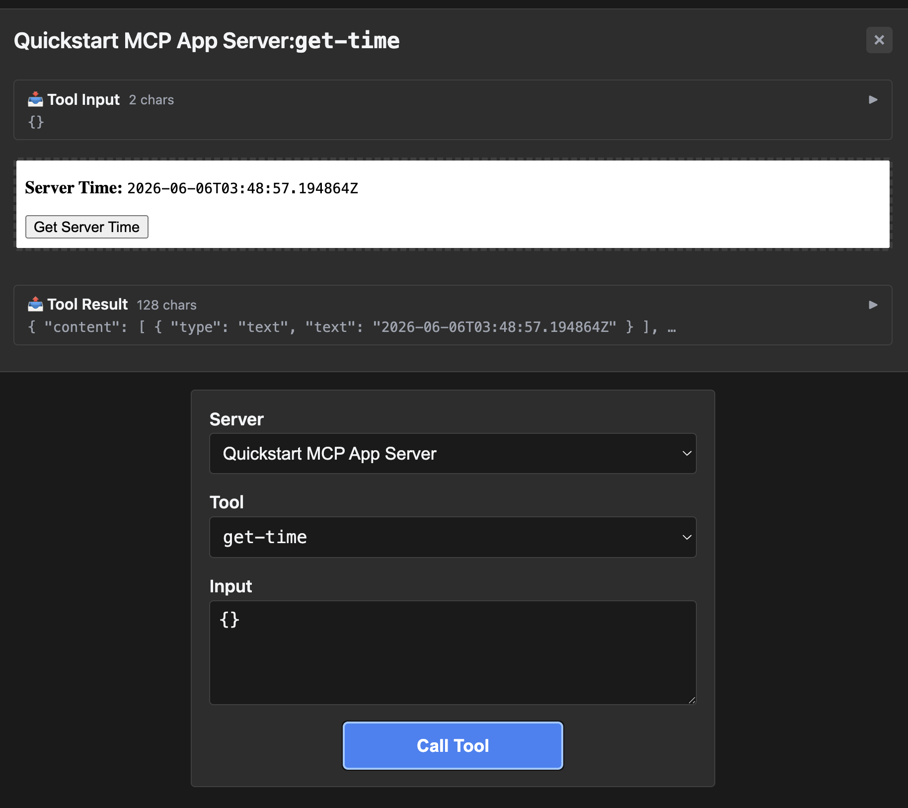

# quickstart — minimum with the default build template

Rung 3 on the [examples ladder](../README.md#reading-order--examples-ladder).
Upstream's "quickstart" template — same `get-time` tool as the basic-*
fixtures, but the iframe ships from a default scaffolded build setup
rather than a hand-rolled minimal one.

## What it shows

- **Same one-tool wire surface** as basic-vanillajs. The
  differentiator is the upstream-side build pipeline (a sensible
  default a developer would actually scaffold), not the protocol.
- **`tsx` fallback in the wrapper.** Upstream's quickstart doesn't
  ship a `dist/index.js`; the test wrapper falls back to
  `npx tsx main.ts` to run the server. That fallback lives in
  `scripts/apps-playwright-docker-inner.sh`.

## Run it

Boots the mcpkit-Go fixture (`main.go` in this folder) and opens
[MCPJam Inspector](https://github.com/MCPJam/inspector) so you can poke
at the protocol surface:

```bash
make demo-app EXAMPLE=quickstart
```

Paste `http://localhost:3101/mcp` into MCPJam's server list and connect.
Then browse `tools/list`, `_meta.ui`, and tool-call payloads on the wire.

### [Optional] You can also do…

- **See the App rendered in basic-host.** Same Go fixture, but driven by
  basic-host (the canonical reference UI) instead of MCPJam. Opens a
  browser at `http://localhost:8080`:

  ```bash
  RENDERER=basic-host make demo-app EXAMPLE=quickstart
  ```

- **Hit upstream's TS reference server instead.** Useful for comparing
  the Go fixture's wire surface against the canonical implementation:

  ```bash
  make demo-upstream EXAMPLE=quickstart
  ```

  Add `RENDERER=basic-host` to render the upstream TS in basic-host
  instead of MCPJam.

- **Strict parity check against the mcpkit-Go fixture.** Runs upstream's
  Playwright suite against the Go binary — wire-level `tools/list` diff
  + visual PNG gate. Requires Docker:

  ```bash
  EXAMPLE=quickstart make test-apps-playwright-docker
  ```

## Prompts to try

Connect to `Quickstart MCP App Server`, then paste any of these:

```
What's the current server time?
```



```
Use the get-time tool.
```

```
What time is it right now in UTC?
```

The model calls `get-time`; the iframe renders the result.

### Direct tool call (no LLM needed)

Same as [basic-vanillajs](../basic-vanillajs/README.md#direct-tool-call-no-llm-needed)
— select `get-time`, call with empty input, verify
`structuredContent.time` is an ISO 8601 string.

## What to look at next

- [`basic-vanillajs`](../basic-vanillajs/README.md) — the
  no-build-pipeline variant of the same tool.
- [`transcript`](../transcript/README.md) — different tool, still one
  per server.
- [`sheet-music`](../sheet-music/README.md) — first time a multi-line
  default trips struct-tag reflection (introduces the
  `InputSchemaPatch` escape).
