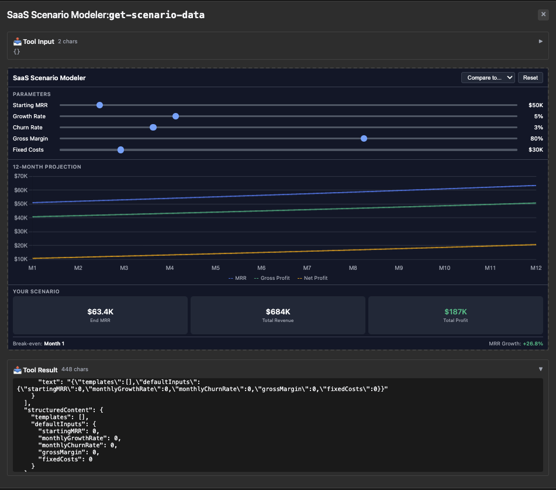

# scenario-modeler — nullable field at depth, needs OutputSchemaOverride

Rung 4 on the [examples ladder](../README.md#reading-order--examples-ladder).
One tool, but the output's deeply nested templates contain a nullable
`breakEvenMonth` field at two different nesting depths. First fixture
where even the patch builder can't shrink to a one-liner — keeping
the full `OutputSchemaOverride` is genuinely cleaner.

## What it shows

- **SaaS scenario projections.** `get-scenario-data` returns a set of
  pre-built scenario templates (conservative growth, aggressive, etc.)
  plus optional custom projections computed from caller-supplied
  inputs. Templates and custom projections both produce a `summary`
  object that has `breakEvenMonth: number | null`.
- **Nullable at depth.** The nullable field appears as
  `templates[].summary.breakEvenMonth` AND as
  `customSummary.breakEvenMonth` — same shape, two nesting paths.
  Hand-stitching that with `Patch.Replace` at deep paths is uglier
  than the explicit override, so the override stays for the output.
- **`InputSchemaPatch` for the input.** The input's `customInputs`
  field just needs a description tweak — patch is shorter than the
  old override there.

## Run it

```bash
make demo-app EXAMPLE=scenario-modeler-server
make inspect-app EXAMPLE=scenario-modeler-server
EXAMPLE=scenario-modeler-server make test-apps-playwright-docker
```

## Prompts to try

Connect to `SaaS Scenario Modeler`, then paste any of these:

```
Show me SaaS scenario projections.
```



```
Model an aggressive growth scenario for my startup.
```

```
What if my SaaS company starts at $50k MRR with 10% monthly growth and 3% churn? When do I break even at $20k fixed costs?
```


```
Project my revenue with starting MRR $100k, 5% growth, 2% churn, 80% gross margin, $50k fixed costs.
```


The model calls `get-scenario-data` (with `customInputs` for the
parameterized prompts); the iframe renders the projection charts +
template comparison.

### Direct tool call (no LLM needed)

| What | How | What you should see |
|---|---|---|
| Just the templates | Select `get-scenario-data`, call with empty input | Tool result has `templates[]` populated, `customProjections` / `customSummary` omitted |
| With custom inputs | Call with `{"customInputs": {"startingMRR": 100000, "monthlyGrowthRate": 0.05, "monthlyChurnRate": 0.02, "grossMargin": 0.8, "fixedCosts": 50000}}` | Result has `customProjections` and `customSummary` populated. `customSummary.breakEvenMonth` is a number or `null`. |
| Verify nullable on the wire | Expand `outputSchema.properties.customSummary.properties.breakEvenMonth` | `{"anyOf": [{"type":"number"}, {"type":"null"}]}` — the nullable form. |

## What to look at next

- [`wiki-explorer`](../wiki-explorer/README.md) — also has a nullable
  field, but at the top level (one path, one Replace call — patch
  fits cleanly there).
- [`budget-allocator`](../budget-allocator/README.md) — rung-4
  sibling without the nullable; reflection alone handles it.
