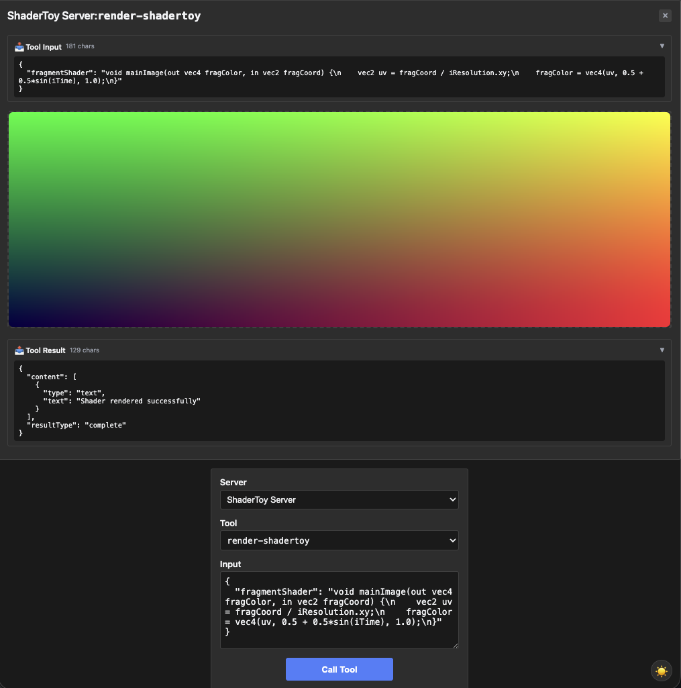

# shadertoy — GLSL fragment shader, WebGL App

Rung 5 on the [examples ladder](../README.md#reading-order--examples-ladder).
One tool, but the input is a GLSL fragment shader program. First
fixture targeted at WebGL-style rendering inside the App iframe.

## What it shows

- **GLSL as input.** `render-shadertoy` accepts a `fragmentShader`
  field (plus optional `common` and four buffer channels for
  multi-pass rendering) and runs it in the iframe via WebGL 2.0,
  using ShaderToy conventions (`iTime`, `iResolution`, `iChannel*`).
- **Multi-line default with commas.** The default fragment shader is
  several lines of GLSL containing commas — struct-tag reflection
  would truncate at the first comma. The fixture uses
  `InputSchemaPatch` to land the multi-line default verbatim AND
  add descriptions for each of the six optional channel fields.
- **Six fields patched in one chain.** Showcases the
  `s.Prop(name).Desc(...)` pattern across multiple properties — much
  shorter than the equivalent override map.

## Run it

Boots the mcpkit-Go fixture (`main.go` in this folder) and opens
[MCPJam Inspector](https://github.com/MCPJam/inspector) so you can poke
at the protocol surface:

```bash
make demo-app EXAMPLE=shadertoy
```

Paste `http://localhost:3101/mcp` into MCPJam's server list and connect.
Then browse `tools/list`, `_meta.ui`, and tool-call payloads on the wire.

### [Optional] You can also do…

- **See the App rendered in basic-host.** Same Go fixture, but driven by
  basic-host (the canonical reference UI) instead of MCPJam. Opens a
  browser at `http://localhost:8080`:

  ```bash
  RENDERER=basic-host make demo-app EXAMPLE=shadertoy
  ```

- **Hit upstream's TS reference server instead.** Useful for comparing
  the Go fixture's wire surface against the canonical implementation:

  ```bash
  make demo-upstream EXAMPLE=shadertoy
  ```

  Add `RENDERER=basic-host` to render the upstream TS in basic-host
  instead of MCPJam.

- **Strict parity check against the mcpkit-Go fixture.** Runs upstream's
  Playwright suite against the Go binary — wire-level `tools/list` diff
  + visual PNG gate. Requires Docker:

  ```bash
  EXAMPLE=shadertoy make test-apps-playwright-docker
  ```

## Prompts to try

Connect to `ShaderToy Server`, then paste any of these:

```
Render a ShaderToy shader.
```



```
Show me a shader that displays rainbow colors that shift over time.
```

```
Render a Mandelbrot fractal as a fragment shader.
```


```
Show me a plasma effect using sin and cos of iTime.
```

```
Render a shader that draws concentric pulsing circles centered at the screen.
```


The model calls `render-shadertoy` with the generated GLSL; the
iframe compiles and runs it on the GPU.

### Direct tool call (no LLM needed)

| What | How | What you should see |
|---|---|---|
| Default shader | Select `render-shadertoy`, call with empty input | Iframe renders the default UV gradient shader (the default `fragmentShader` value) |
| Verify the multi-line default landed intact | Expand `inputSchema.properties.fragmentShader.default` | The full multi-line GLSL with commas preserved — what `InputSchemaPatch` guarantees |
| Custom shader | Call with a `{"fragmentShader": "void mainImage(...)"}` payload | Iframe renders whatever GLSL you supplied (errors land in the iframe's console) |

## What to look at next

- [`threejs`](../threejs/README.md) — rung-5 sibling; also takes code
  as input, but for Three.js scene setup instead of fragment shaders.
- [`pdf-server`](../pdf-server/README.md) — rung-7 endgame for "the
  iframe runs sophisticated logic" pattern.
