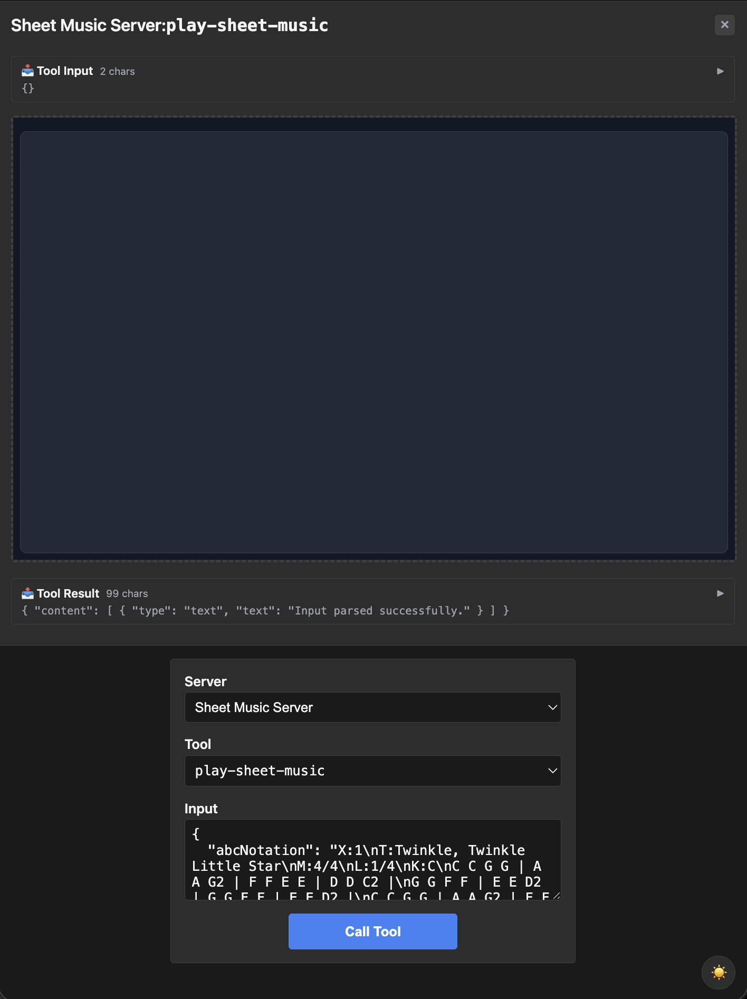
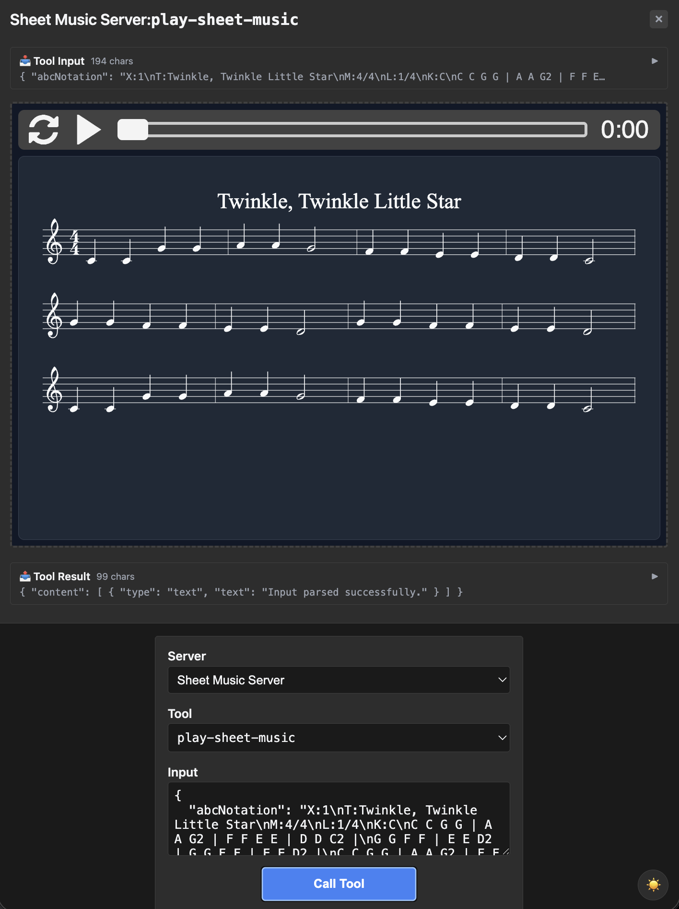
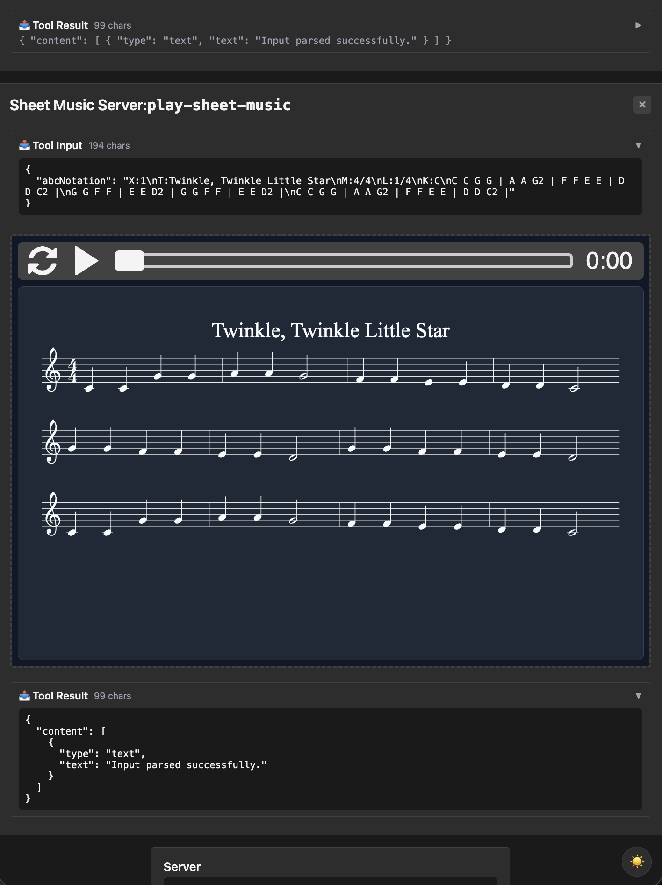

# sheet-music — multi-line default, first use of the patch escape

Rung 3 on the [examples ladder](../README.md#reading-order--examples-ladder).
One tool, but the input has a multi-line default value with commas —
the first fixture where reflection alone won't produce the right
schema. Introduces the `InputSchemaPatch` escape hatch.

## What it Shows

- **ABC notation input.** `play-sheet-music` accepts an ABC notation
  string and the iframe renders it as both readable sheet music and
  playable audio (via abcjs in the iframe).
- **The struct-tag-comma problem.** Upstream's default is an 11-line
  ABC notation string for "Twinkle Twinkle Little Star" — which
  contains commas. invopop's struct-tag parser would truncate the
  default at the first comma. The fixture uses `InputSchemaPatch` to
  land the default verbatim via
  `s.Prop("abcNotation").Default(defaultABCNotation)`.

## Or Run Live

### Start Server

```bash
make demo-app EXAMPLE=sheet-music
```

Starts the mcpkit-Go fixture on `http://localhost:3101/mcp` and basic-host on `http://localhost:8080`. (Pass `OPEN=1` to auto-open the browser.)

## Try It Out on basic-host

Open <http://localhost:8080> in your browser. Then:

1. Pick **Sheet Music Server** from the server dropdown.
2. Pick **play-sheet-music** from the tool dropdown. The **Input** field below auto-populates with the schema's default — the 11-line, multi-comma ABC notation for "Twinkle, Twinkle Little Star". The entire string landing here intact (with every embedded comma) is the whole point of this fixture: `InputSchemaPatch` bypasses invopop's comma-truncating struct-tag parser. See the second bullet under [What it Shows](#what-it-shows) above for the Go side.

   <a href="screenshots/01-on-page-load.png" target="_blank"></a>

3. Click **Call Tool**. The handler returns the synchronous text content "Input parsed successfully" (visible in the Tool Result panel), and the iframe renders the ABC notation as engraved sheet music with audio playback controls at the top. Click **▶ Play** in the iframe to hear it — the audio render happens entirely client-side via abcjs.

   <a href="screenshots/02-on-tool-call.png" target="_blank"></a>

4. Drill into the **Tool Input** panel to confirm what crossed the wire — the full 184-char ABC notation, multi-line, comma-laden, untruncated. The Tool Result alongside is the small text envelope the Go handler returned synchronously; the visual rendering is the iframe's own work driven from that input.

   <a href="screenshots/03-wire-data.png" target="_blank"></a>

## Try It Out from a Host

Connect to `http://localhost:3101/mcp` from your favorite MCP host — VS Code, Claude Desktop, [MCPJam Inspector](https://github.com/MCPJam/inspector), or any spec-compliant client.

**Prompts to try** (LLM-driven hosts):

> "Play Twinkle Twinkle Little Star on the sheet music tool."
> "Show me sheet music for "Mary Had a Little Lamb" in C major."
> "Use the play-sheet-music tool with the default ABC notation."
> "Render Greensleeves in the key of A minor."

The model calls `play-sheet-music` with ABC notation (recalling it or
constructing it); the iframe renders the sheet music and lets you
play it back.

**Verify the wire shape** (no LLM needed):

| What | How | What you should see |
|---|---|---|
| Default tune | Select `play-sheet-music`, call with empty input | Iframe renders Twinkle Twinkle as sheet music + audio player |
| Verify the multi-line default landed intact | Expand `inputSchema.properties.abcNotation.default` | The full 11-line ABC notation including commas — no truncation. This is what `InputSchemaPatch` preserves. |

See [Other ways to test a fixture](../README.md#other-ways-to-test-a-fixture) in the compat README for wire inspection, upstream comparison, the strict Playwright gate, and connecting from VS Code / Claude Desktop / other MCP hosts.

## What to Try Next

- [`shadertoy`](../shadertoy/README.md) — same "multi-line code as
  input" pattern for GLSL.
- [`threejs`](../threejs/README.md) — same again, but also introduces
  `PropertyBuilder.Replace()` for fields the typed builder doesn't
  cover.
- [`scenario-modeler`](../scenario-modeler/README.md) — rung 4, takes
  the schema-override pattern to nested nullable fields.
