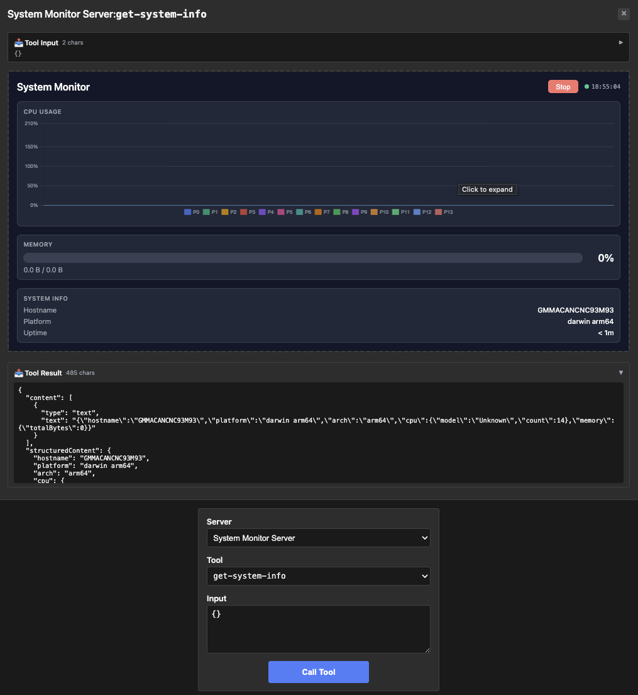

# system-monitor — live system stats with an app-only polling tool

Rung 6 on the [examples ladder](../README.md#reading-order--examples-ladder).
Two tools — one the model calls to render the dashboard, one the
iframe polls from inside via the bridge. First fixture introducing
`Visibility: ["app"]`.

## What it shows

- **One model-visible tool, one app-only tool.** `get-system-info`
  appears in the model's tool dropdown; the model calls it once and
  the iframe takes over. `poll-system-stats` doesn't appear to the
  model — it's app-only (`_meta.ui.visibility = ["app"]`) and the
  iframe polls it on a timer to update the dashboard live.
- **Shared resource URI.** Both tools point at the same App iframe
  (`ui://system-monitor/mcp-app.html`) so they update the same
  rendered surface. The fixture registers the resource once (via
  `get-system-info`) and references the same URI from
  `poll-system-stats` without re-registering.

## Run it

```bash
make demo-app EXAMPLE=system-monitor-server
make inspect-app EXAMPLE=system-monitor-server
EXAMPLE=system-monitor-server make test-apps-playwright-docker
```

## Prompts to try

Connect to `System Monitor Server`, then paste any of these:

```
Show me the system monitor dashboard.
```



```
What does my system look like right now? CPU, memory, disk?
```

```
Open the live system stats view.
```

The model calls `get-system-info`; the iframe renders the dashboard
and starts polling `poll-system-stats` every few seconds from inside
the iframe (not via the model).

### Direct tool call (no LLM needed)

| What | How | What you should see |
|---|---|---|
| Smoke test the model-visible tool | Select `get-system-info`, call with empty input | Tool result has system info in `structuredContent`; iframe renders the dashboard |
| Verify the app-only tool's visibility | In MCPJam, find `poll-system-stats` and expand `_meta.ui` | `{"visibility": ["app"]}` — the model can't see this tool by default |
| Call the app-only tool directly | Select `poll-system-stats`, call with empty input | Tool result has live stats. In normal use the iframe drives this every few seconds. |

## What to look at next

- [`debug-server`](../debug-server/README.md) — rung-6 sibling, takes
  the same app-only pattern further with three tools sharing one
  iframe.
- [`integration`](../integration/README.md) — rung-6 sibling with
  host-callback semantics.
