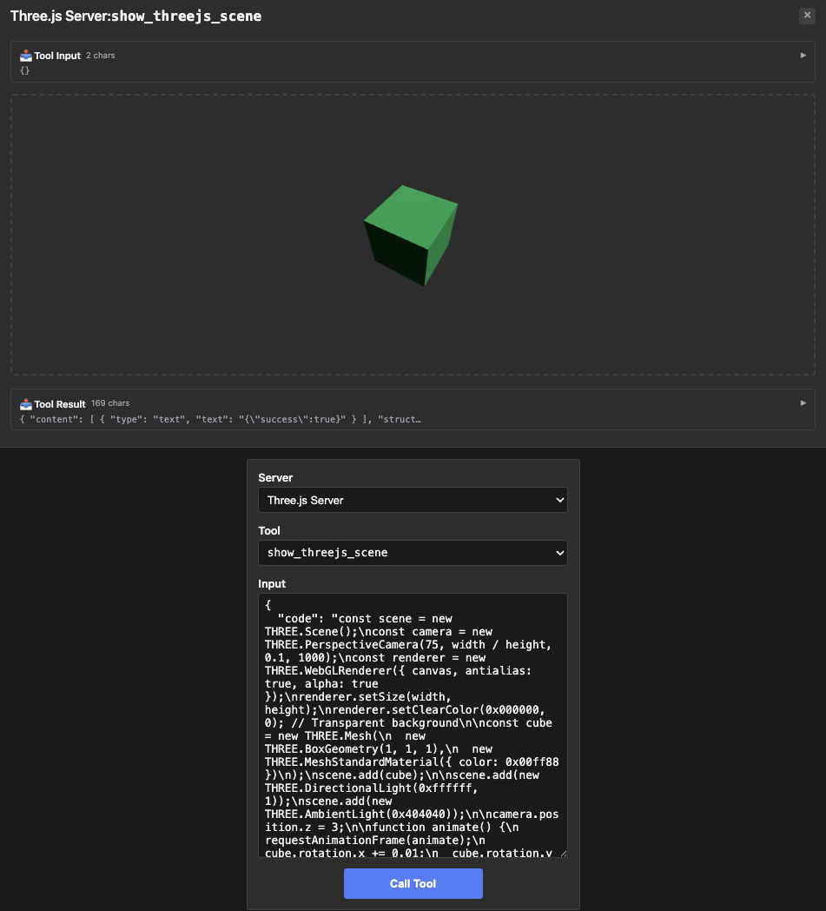

# threejs — code-as-input, WebGL App

Rung 5 on the [examples ladder](../README.md#reading-order--examples-ladder).
Two tools — one renders an interactive Three.js scene, the other
exposes documentation. First example where a tool's input is
literally a multi-line JavaScript program.

## What it Shows

- **Two tools on one server.** `show_threejs_scene` carries the App
  iframe; `learn_threejs` is a plain (no-UI) tool that returns the
  documentation string. The host's tool dropdown picks up both.
- **Multi-line code as default value.** The default Three.js scene is
  a multi-line `code` string with commas — exactly the pattern that
  trips up struct-tag reflection (invopop's tag parser splits on
  commas, truncating defaults at the first one). The fixture uses
  `InputSchemaPatch` to land the default verbatim without restating
  the whole schema.
- **`Replace()` escape hatch.** The `height` field needs
  `exclusiveMinimum: 0` + `Number.MAX_SAFE_INTEGER` upper bound —
  shape the `PropertyBuilder` doesn't expose direct methods for. The
  fixture uses `PropertyBuilder.Replace(rawSchema)` for that one
  field while patching the others normally.
- **Self-describing for models.** `learn_threejs` returns a ~2.7KB
  markdown reference: available globals (`THREE`, `OrbitControls`,
  `EffectComposer`, etc.), the transparent-background convention,
  and three ready-to-run examples (basic template, rotating cube,
  OrbitControls sphere). A model that hasn't seen the fixture can
  call this once and then write valid `show_threejs_scene` calls.
- **Bundled, no CDN.** Unlike `map` (which streams CesiumJS from
  `cesium.com` at runtime and needs `_meta.ui.csp`), threejs bundles
  Three.js + post-processing passes directly into the iframe (~1.3MB
  resource read, zero runtime network surface).

## Run Pre-Recorded

> ▶ **[Play the walkthrough in your browser](https://panyam.github.io/mcpkit/walkthroughs/examples/apps/compat/threejs/)** — animated playback of every curl / Go call the walkthrough makes, step-by-step. Includes a custom OrbitControls scene call. No clone, no setup.

## Or Run Live

### Start Server

```bash
just demo-app EXAMPLE=threejs
```

Starts the mcpkit-Go fixture on `http://localhost:3101/mcp` and basic-host on `http://localhost:8080`. (Pass `OPEN=1` to auto-open the browser.)

## Try It Out on basic-host

Open <http://localhost:8080> in your browser. Then:

1. Pick **Three.js Server** from the server dropdown.
2. Pick **show_threejs_scene** from the tool dropdown, click **Call Tool** with empty input — the iframe runs the server-advertised default code and renders the rotating green cube.
3. Send your own Three.js snippet — change the `code` argument to anything that uses the available globals (`THREE`, `canvas`, `width`, `height`, `OrbitControls`, etc.). The iframe re-runs the code in its sandboxed Web Worker. Try the OrbitControls sphere example from `learn_threejs` for a draggable scene.
4. Pick **learn_threejs**, call with empty input — get back ~2.7KB of markdown reference. Models call this to discover what's available before writing scenes.

<a href="screenshots/01-default-cube.png" target="_blank"></a>

## Try It Out from a Host

Connect to `http://localhost:3101/mcp` from your favorite MCP host — VS Code, Claude Desktop, [MCPJam Inspector](https://github.com/MCPJam/inspector), or any spec-compliant client.

**Prompts to try** (LLM-driven hosts):

> "Render a 3D scene using Three.js."
> "Show me a green wireframe sphere rotating slowly."
> "Make a Three.js scene with three colored cubes arranged in a triangle."
> "Render a torus knot with rainbow material that rotates on all three axes."
> "How do I use OrbitControls in Three.js?"

The first four should make the model call `show_threejs_scene` with a
generated `code` payload; the iframe renders the scene. The last one
should make the model call `learn_threejs` (no iframe — plain text
docs back).

**Verify the wire shape** (no LLM needed):

| What | How | What you should see |
|---|---|---|
| Default scene | Select `show_threejs_scene`, call with empty input | App iframe renders the default rotating cube. Tool result: `{"success": true}` |
| Verify the multi-line default landed intact | Expand `show_threejs_scene`'s `inputSchema.properties.code.default` | The full multi-line JavaScript program — newlines and commas preserved verbatim, no struct-tag truncation. |
| Plain (no-UI) tool | Select `learn_threejs`, call with empty input | Tool result is a text block of Three.js API docs. No iframe — this tool has no `_meta.ui` block. |

See [Other ways to test a fixture](../README.md#other-ways-to-test-a-fixture) in the compat README for wire inspection, upstream comparison, the strict Playwright gate, and connecting from VS Code / Claude Desktop / other MCP hosts.

## What to Try Next

- [`shadertoy`](../shadertoy/README.md) (rung 5, sibling) — same
  "multi-line code as input" pattern, but for GLSL fragment shaders.
- [`pdf-server`](../pdf-server/README.md) (rung 7) — for examples
  where the iframe runs even more sophisticated logic.
- See [`main.go`](main.go) — the `InputSchemaPatch` block shows
  both `.Default(...)` chains and a `Replace(...)` escape side by
  side.
