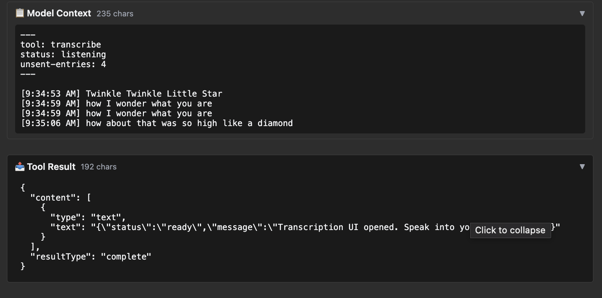

# transcript — speech-to-text-style transcribe tool

Rung 3 on the [examples ladder](../README.md#reading-order--examples-ladder).
One tool, structured output. First fixture where the tool does
meaningful work in the iframe (rather than just rendering a value).

## What it Shows

- **Single tool with richer payload.** `transcribe` accepts an audio
  source and returns a structured transcript. The iframe renders
  the transcript with timing/segment data.
- **Typed Go output struct.** Reflection produces the JSON Schema
  from the struct alone — no override needed. A clean middle ground
  between rung 1's trivial output and rung 4's nullable / nested
  shapes.
- **Iframe Permission-Policy declaration.** First fixture to set
  `_meta.ui.permissions` on the resource read response — declares the
  Web Speech API (`microphone`) and the copy-transcript button
  (`clipboardWrite`) so basic-host (and any spec-compliant host)
  passes the right `<iframe allow=...>` attribute through to the
  sandbox. Without this declaration, `recognition.start()` silently
  fails inside the iframe — the browser blocks mic access by default.
  See [The iframe permission contract](#the-iframe-permission-contract)
  below for the wire shape and the spec-conformance footnote.

## Run Pre-Recorded

> ▶ **[Play the walkthrough in your browser](https://panyam.github.io/mcpkit/walkthroughs/examples/apps/compat/transcript/)** — animated playback of every curl / Go call the walkthrough makes, step-by-step. Step 4 surfaces the distinctive thing about this fixture on the wire: `_meta.ui.permissions` declaring microphone + clipboardWrite, which is what lets basic-host pass through Permission-Policy grants to the iframe. No clone, no setup.

## Or Run Live

### Start Server

```bash
just demo-app EXAMPLE=transcript
```

Starts the mcpkit-Go fixture on `http://localhost:3101/mcp` and basic-host on `http://localhost:8080`. (Pass `OPEN=1` to auto-open the browser.)

## Try It Out on basic-host

Open <http://localhost:8080> in your browser. Then:

1. Pick **Transcript Server** from the server dropdown.
2. Pick **transcribe** from the tool dropdown, click **Call Tool** with the default empty input.

   The iframe loads with the Start button, the empty transcript area ("Your speech will appear here…"), and the Tool Result panel shows the immediate `{status:"ready", message:"Transcription UI opened…"}` payload — that's the synchronous text content the Go handler returns. The interactive piece is everything that follows.

   <a href="screenshots/01-transcript-view.png" target="_blank"></a>

3. Click **Start**. The first time you do this, the browser prompts for microphone access — that prompt only fires because the Go fixture declares `microphone` on the resource's `_meta.ui.permissions` (see [The iframe permission contract](#the-iframe-permission-contract) below). Allow it.
4. Speak. The iframe transcribes inline as you talk — each utterance lands as a timestamped row above the buttons.

   <a href="screenshots/02-structured-result.png" target="_blank"></a>

5. Watch the **Model Context** block populate below the iframe. This is what the model would see on its next turn — the App is feeding structured context back through the bridge (`status: listening`, current entries, unsent count). The Tool Result block is the synchronous response from step 2; the Model Context block is everything the App has pushed since.

   <a href="screenshots/03-wire-data.png" target="_blank"></a>

## Try It Out from a Host

Connect to `http://localhost:3101/mcp` from your favorite MCP host — VS Code, Claude Desktop, [MCPJam Inspector](https://github.com/MCPJam/inspector), or any spec-compliant client.

**Prompts to try** (LLM-driven hosts):

> "Transcribe the audio at <some-audio-url>."
> "Use the transcribe tool to convert this audio to text."
> "Get me a transcript with timing segments."

The model calls `transcribe`; the iframe renders the result as a
structured transcript view.

**Verify the wire shape** (no LLM needed):

| What | How | What you should see |
|---|---|---|
| Smoke test | Select `transcribe`, call with the example input | Tool result panel shows the transcript in `structuredContent` |
| Iframe renders the transcript | Same call, scroll up | App iframe lays out the transcript with segments |

See [Other ways to test a fixture](../README.md#other-ways-to-test-a-fixture) in the compat README for wire inspection, upstream comparison, the strict Playwright gate, and connecting from VS Code / Claude Desktop / other MCP hosts.

## The iframe permission contract

The transcript App calls the browser's Web Speech API (`recognition.start()`),
which requires the host to grant the `microphone` Permission-Policy on the
sandbox iframe. The mcpkit-Go fixture declares this on the resource's
per-content `_meta.ui.permissions`:

```go
return core.ResourceResult{Contents: []core.ResourceReadContent{{
    URI:      req.URI,
    MimeType: core.AppMIMEType,
    Text:     html,
    Meta: &core.ResourceContentMeta{
        UI: &core.UIMetadata{
            Permissions: &core.UIPermissions{
                Microphone:     &struct{}{},
                ClipboardWrite: &struct{}{},
            },
        },
    },
}}}, nil
```

On the wire (`resources/read` response):

```json
"_meta": {
  "ui": {
    "permissions": { "microphone": {}, "clipboardWrite": {} }
  }
}
```

basic-host reads this object and propagates each key into the iframe's
`allow=` attribute (`microphone; clipboard-write`). The browser then prompts
for mic access on the first `recognition.start()` call. Without the `_meta`
block, the iframe loads with no policy grant and recognition silently fails
with no prompt.

### Why an object (and not an array)?

The spec defines `McpUiResourcePermissions` as a named-and-typed interface
where each value is an empty object `{}`:

```ts
interface McpUiResourcePermissions {
  camera?: {};
  microphone?: {};
  geolocation?: {};
  clipboardWrite?: {};
}
```

The empty-object values are a placeholder — future revisions can add
per-permission options without a wire break (e.g. `microphone: { autoGain: true }`).
mcpkit mirrors this with the `core.UIPermissions` struct (pointer-to-`struct{}`
fields, JSON-marshalled to the object form). Pre-`v0.3.x`, mcpkit serialized
permissions as a JSON array of strings — basic-host did property lookups on
that array and treated every permission as absent. The shape fix landed
alongside this fixture's `_meta` wiring.

### Spec-conformance footnote

The MCP Apps spec also says permissions belong **only on the UI resource**,
not on tool `_meta` (`permissions?: never` on `McpUiToolMeta`). The
`AppToolConfig.Permissions` / `TypedAppToolConfig.Permissions` fields in
`ext/ui` currently flow into tool `_meta.ui` for backward compatibility,
but basic-host does not read them from there. To make a permission take
effect in the iframe, you must set it on the **resource's** per-content
`_meta.ui` as shown above. A follow-up will deprecate the tool-meta path.

## What to Try Next

- [`sheet-music`](../sheet-music/README.md) — rung-3 sibling; the
  first place a multi-line default value trips struct-tag reflection.
- [`budget-allocator`](../budget-allocator/README.md) — rung 4, takes
  the "richer output" idea to nested objects.
