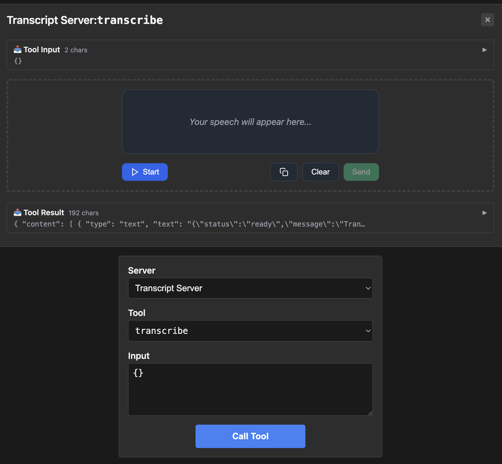
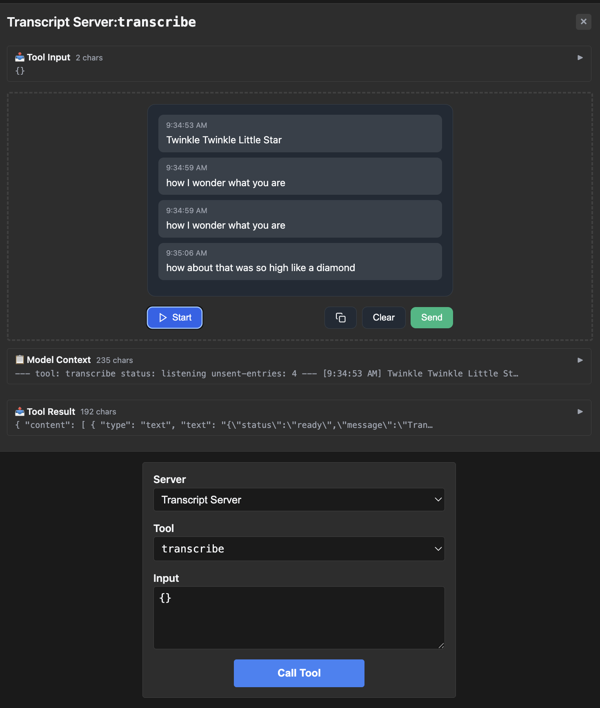

# transcript — speech-to-text-style transcribe tool

Rung 3 on the [examples ladder](../README.md#reading-order--examples-ladder).
One tool, structured output. First fixture where the tool does
meaningful work in the iframe (rather than just rendering a value).

## What it shows

- **Single tool with richer payload.** `transcribe` accepts an audio
  source and returns a structured transcript. The iframe renders
  the transcript with timing/segment data.
- **Typed Go output struct.** Reflection produces the JSON Schema
  from the struct alone — no override needed. A clean middle ground
  between rung 1's trivial output and rung 4's nullable / nested
  shapes.

## Run it

```bash
make demo-app EXAMPLE=transcript-server
make inspect-app EXAMPLE=transcript-server
EXAMPLE=transcript-server make test-apps-playwright-docker
```

## Prompts to try

Connect to `Transcript Server`, then paste any of these:

```
Transcribe the audio at <some-audio-url>.
```



```
Use the transcribe tool to convert this audio to text.
```

```
Get me a transcript with timing segments.
```



The model calls `transcribe`; the iframe renders the result as a
structured transcript view.

### Direct tool call (no LLM needed)

| What | How | What you should see |
|---|---|---|
| Smoke test | Select `transcribe`, call with the example input | Tool result panel shows the transcript in `structuredContent` |
| Iframe renders the transcript | Same call, scroll up | App iframe lays out the transcript with segments |

## What to look at next

- [`sheet-music`](../sheet-music/README.md) — rung-3 sibling; the
  first place a multi-line default value trips struct-tag reflection.
- [`budget-allocator`](../budget-allocator/README.md) — rung 4, takes
  the "richer output" idea to nested objects.
