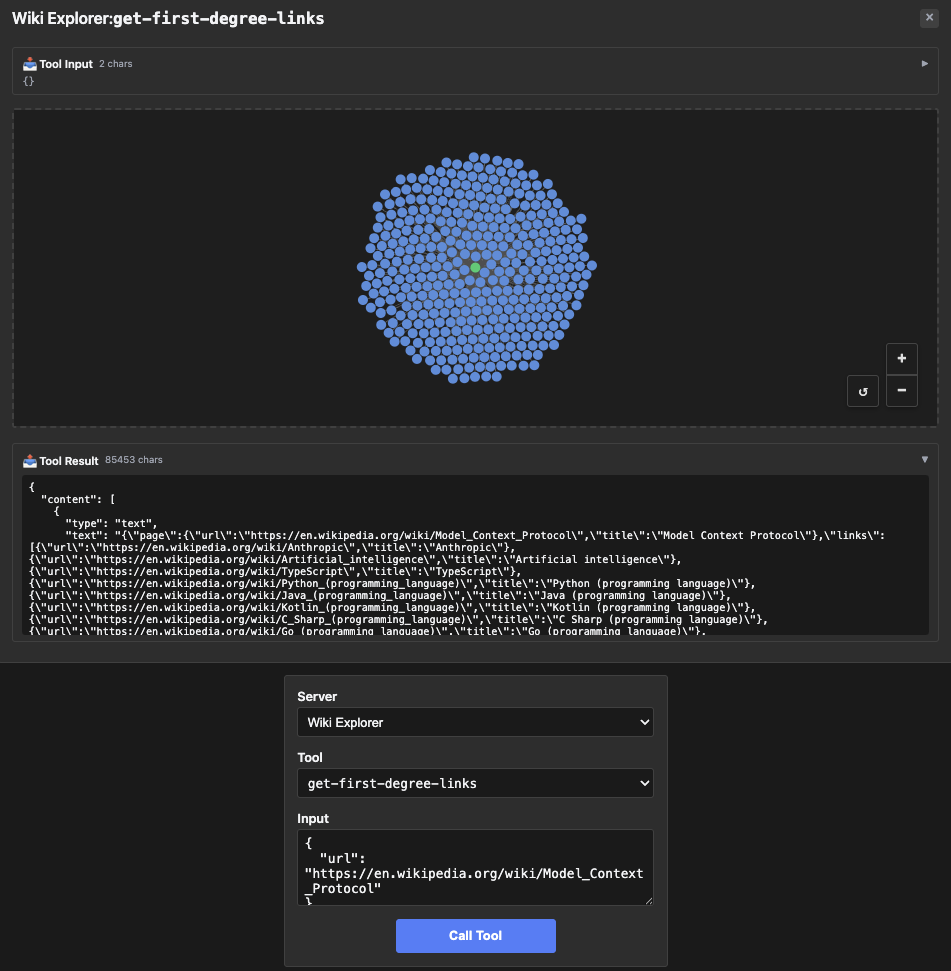

# wiki-explorer — interactive graph App with a nullable output field

Rung 5 on the [examples ladder](../README.md#reading-order--examples-ladder).
One tool, but the App iframe renders an interactive force-directed
Wikipedia link graph — first example where the iframe is doing real
work, not just printing the tool result.

## What it Shows

- **Real Wikipedia link graph on the wire.** `get-first-degree-links`
  fetches the live Wikipedia HTML, regex-extracts every `/wiki/...`
  link, filters out namespace pages (Wikipedia: / Help: / File: /
  etc.) and self-links, dedupes, and returns one node per outbound
  article. The default MCP page lands at ~380 outbound links;
  Anthropic's page at ~260.
- **User-Agent required.** Wikipedia returns 403 for requests with no
  User-Agent string per their policy — the fetcher sets one. Same
  pattern as `map`'s Nominatim hit.
- **Interactive App UI.** The iframe pulls in a graph library, lays
  out nodes for the linked Wikipedia pages, and lets the user click to
  expand or query. The host doesn't know any of that — it sees one
  tool with structured output.
- **Never-Go-error contract.** Fetch failures, 404s, non-Wikipedia
  URLs all land in the nullable `error` field rather than firing an
  `isError` tool result. Mirrors upstream's catch-block behaviour:
  the tool always succeeds on the wire; the iframe + model read
  `.error` to decide what to render.
- **Nullable field at the wire.** The output's `error` field is
  `*string` in Go (nil-or-string). Upstream's `z.string().nullable()`
  emits `{"anyOf": [{"type":"string"}, {"type":"null"}]}` in JSON
  Schema, which Go's reflection alone can't produce. The fixture uses
  `OutputSchemaPatch` with `Prop("error").Replace(...)` to land the
  matching shape without restating the whole schema.
- **The patch-builder pattern in practice.** ~8 lines of patch vs ~33
  lines of full-override that the fixture used to ship. Reflection
  still does the heavy lifting for `page` + `links`; the patch only
  touches the field reflection can't get right.

## Run Pre-Recorded

> ▶ **[Play the walkthrough in your browser](https://panyam.github.io/mcpkit/walkthroughs/examples/apps/compat/wiki-explorer/)** — animated playback of every curl / Go call the walkthrough makes, step-by-step. Includes a live Wikipedia hit (~383 links for the MCP page) and the error path. No clone, no setup.

## Or Run Live

### Start Server

```bash
just demo-app EXAMPLE=wiki-explorer
```

Starts the mcpkit-Go fixture on `http://localhost:3101/mcp` and basic-host on `http://localhost:8080`. (Pass `OPEN=1` to auto-open the browser.)

## Try It Out on basic-host

Open <http://localhost:8080> in your browser. Then:

1. Pick **Wiki Explorer** from the server dropdown.
2. Pick **get-first-degree-links** from the tool dropdown, click **Call Tool** with empty input — the iframe renders the force-directed graph for the default Model Context Protocol article (~380 first-degree neighbours).
3. Click a node in the graph — the App calls `get-first-degree-links` itself via the bridge to expand from that node (no model in the loop). Try the **Anthropic** node — it has ~260 outbound links of its own.

<a href="screenshots/01-mcp-graph.png" target="_blank"></a>

## Try It Out from a Host

Connect to `http://localhost:3101/mcp` from your favorite MCP host — VS Code, Claude Desktop, [MCPJam Inspector](https://github.com/MCPJam/inspector), or any spec-compliant client.

**Prompts to try** (LLM-driven hosts):

> "Show me what the Wikipedia page for Model Context Protocol links to."
> "Explore the link graph from https://en.wikipedia.org/wiki/Knowledge_graph"
> "Get first-degree links for the Wikipedia article about Transformer architecture."
> "Build me a one-hop link graph starting at https://en.wikipedia.org/wiki/Model_context_protocol"

Any of these should make the model call `get-first-degree-links`. The
App iframe renders the result as a force-directed graph — click a
node directly and the App calls `get-first-degree-links` itself via
the bridge to expand from that node (no model in the loop).

**Verify the wire shape** (no LLM needed):

| What | How | What you should see |
|---|---|---|
| Smoke test the tool | Select `get-first-degree-links`, call with `{"url": "https://en.wikipedia.org/wiki/Model_context_protocol"}` | Result panel: `{"page": {"url":"…","title":"Model Context Protocol"}, "links": [...], "error": null}` |
| Verify nullable on the wire | Expand the tool's `outputSchema` and find the `error` property | `{"anyOf": [{"type":"string"}, {"type":"null"}]}` — the nullable anyOf form, not `"type": "string"` |

See [Other ways to test a fixture](../README.md#other-ways-to-test-a-fixture) in the compat README for wire inspection, upstream comparison, the strict Playwright gate, and connecting from VS Code / Claude Desktop / other MCP hosts.

## What to Try Next

- Compare against [`map`](../map/README.md) (rung 5, sibling) — two
  tools instead of one, less interactive iframe.
- [`pdf-server`](../pdf-server/README.md) (rung 7) takes the "iframe
  doing real work" pattern to its endgame with a 9-tool surface and
  server-side command queue.
- See [`main.go`](main.go) — the `OutputSchemaPatch` block is one
  contiguous chunk of code.
