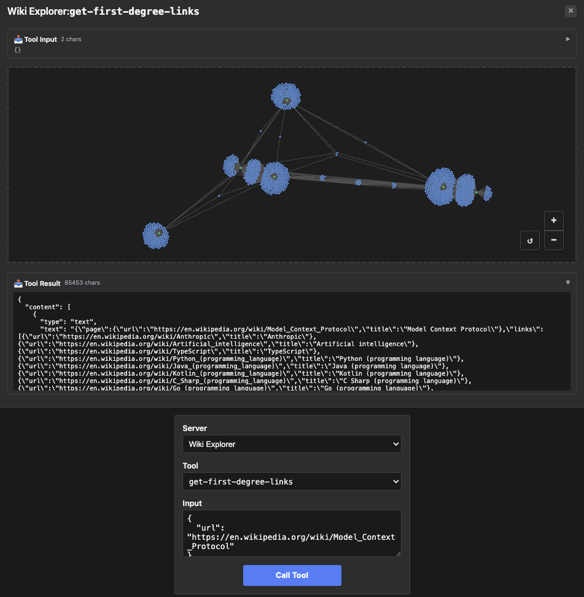

# wiki-explorer — interactive graph App with a nullable output field

Rung 5 on the [examples ladder](../README.md#reading-order--examples-ladder).
One tool, but the App iframe renders an interactive force-directed
Wikipedia link graph — first example where the iframe is doing real
work, not just printing the tool result.

## What it shows

- **Interactive App UI.** The iframe pulls in a graph library, lays
  out nodes for the linked Wikipedia pages, and lets the user click to
  expand or query. The host doesn't know any of that — it sees one
  tool with structured output.
- **Nullable field at the wire.** The output's `error` field is
  `*string` in Go (nil-or-string). Upstream's `z.string().nullable()`
  emits `{"anyOf": [{"type":"string"}, {"type":"null"}]}` in JSON
  Schema, which Go's reflection alone can't produce. The fixture uses
  `OutputSchemaPatch` with `Prop("error").Replace(...)` to land the
  matching shape without restating the whole schema.
- **The patch-builder pattern in practice.** ~8 lines of patch vs ~33
  lines of full-override that the fixture used to ship. Reflection
  still does the heavy lifting for `page` + `links`; the patch only
  touches the field reflection can't get right.

## Run it

```bash
make demo-app EXAMPLE=wiki-explorer-server
make inspect-app EXAMPLE=wiki-explorer-server
EXAMPLE=wiki-explorer-server make test-apps-playwright-docker
```

## Prompts to try

In MCPJam Inspector or basic-host, connect to `Wiki Explorer`, then
paste any of these into the chat:

```
Show me what the Wikipedia page for Model Context Protocol links to.
```


```
Explore the link graph from https://en.wikipedia.org/wiki/Knowledge_graph
```

```
Get first-degree links for the Wikipedia article about Transformer architecture.
```

```
Build me a one-hop link graph starting at https://en.wikipedia.org/wiki/Model_context_protocol
```



Any of these should make the model call `get-first-degree-links`. The
App iframe renders the result as a force-directed graph — click a
node directly and the App calls `get-first-degree-links` itself via
the bridge to expand from that node (no model in the loop).

### Direct tool call (no LLM needed)

| What | How | What you should see |
|---|---|---|
| Smoke test the tool | Select `get-first-degree-links`, call with `{"url": "https://en.wikipedia.org/wiki/Model_context_protocol"}` | Result panel: `{"page": {"url":"…","title":"Model Context Protocol"}, "links": [...], "error": null}` |
| Verify nullable on the wire | Expand the tool's `outputSchema` and find the `error` property | `{"anyOf": [{"type":"string"}, {"type":"null"}]}` — the nullable anyOf form, not `"type": "string"` |

## What to look at next

- Compare against [`map`](../map/README.md) (rung 5, sibling) — two
  tools instead of one, less interactive iframe.
- [`pdf-server`](../pdf-server/README.md) (rung 7) takes the "iframe
  doing real work" pattern to its endgame with a 9-tool surface and
  server-side command queue.
- See [`main.go`](main.go) — the `OutputSchemaPatch` block is one
  contiguous chunk of code.
