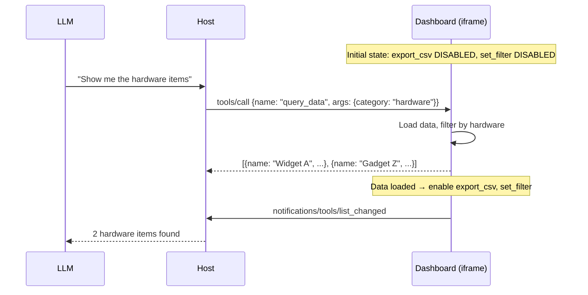
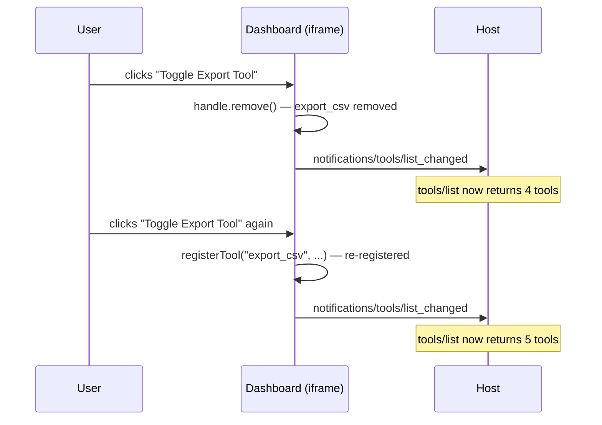
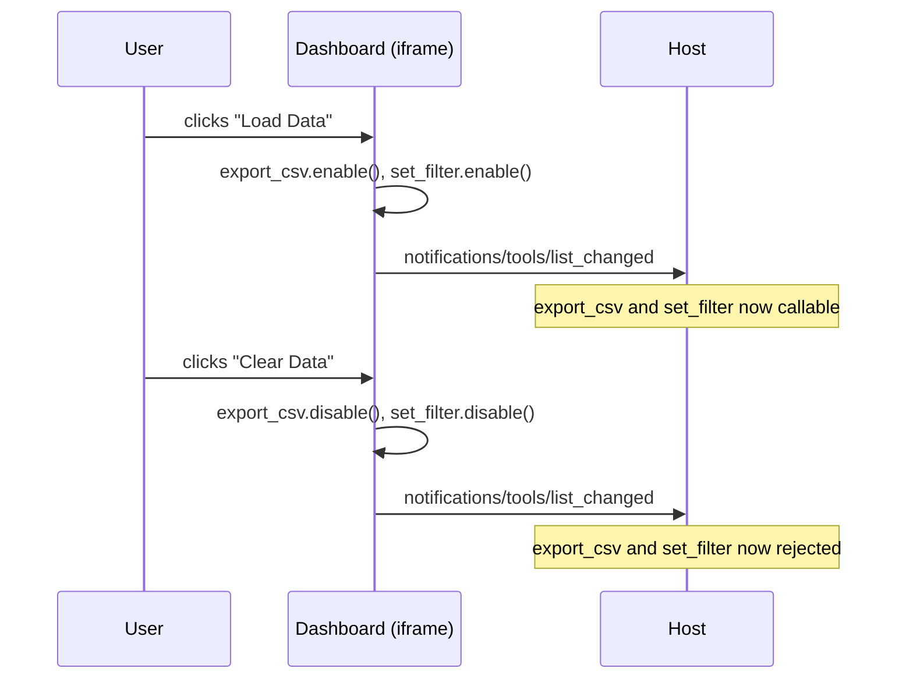

# Dashboard — MCP App with Tool Lifecycle

A data dashboard that registers 5 app-provided tools and demonstrates the full tool lifecycle: register, enable, disable, remove, and re-register. Tools become available based on app state (data loaded vs empty).

## MCPKit Features Used

| Category | Feature |
|----------|---------|
| Core | `server.Run` |
| Extension | `ext/ui` — `UIExtension`, `RegisterTypedAppTool`, `BridgeTemplateDef` |
| Bridge | `MCPApp.registerTool()`, `handle.enable()`, `handle.disable()`, `handle.remove()`, `MCPApp.sendToolListChanged()` |

## What it demonstrates

- **5 app-provided tools** with different lifecycle behaviors
- **State-dependent availability**: `export_csv` and `set_filter` start disabled, enabled when data loads
- **Tool removal and re-registration**: `export_csv` can be removed and re-added via UI button
- **`sendToolListChanged()`** fires on every state change so the host stays in sync

## App-Provided Tools

| Tool | Initial State | Description |
|------|---------------|-------------|
| `query_data` | Active | Query dataset with optional category filter |
| `export_csv` | Disabled | Export current view as CSV (enabled when data loaded) |
| `refresh_data` | Active | Reload data from source |
| `set_filter` | Disabled | Apply filters (enabled when data loaded) |
| `get_settings` | Active | Read dashboard settings |

## Sequence Diagrams

### Model queries data (tool becomes fully active)



### Tool removal and re-registration



### Tool enable/disable based on state



## Setup

```bash
cd examples/apps/dashboard
go run . -addr :8080
```

## Connect a host

In MCPJam (or Claude Desktop):
1. Add server: `http://localhost:8080/mcp` (Streamable HTTP)
2. Server name: "Dashboard"

## Prompts to try

- "Open the dashboard" — opens the dashboard UI
- "Query hardware items" — calls `query_data` with category filter
- "Export the data as CSV" — calls `export_csv` (fails if no data loaded)
- "Load the data first, then export" — loads data, enables export, then exports
- "What are the dashboard settings?" — calls `get_settings`

## Key files

| File | What |
|------|------|
| `dashboard.html` | HTML with bridge + 5 `registerTool()` calls + lifecycle management |
| `main.go` | Go server: open_dashboard tool + resource serving |
