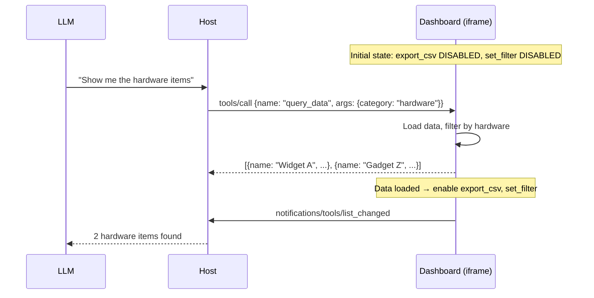
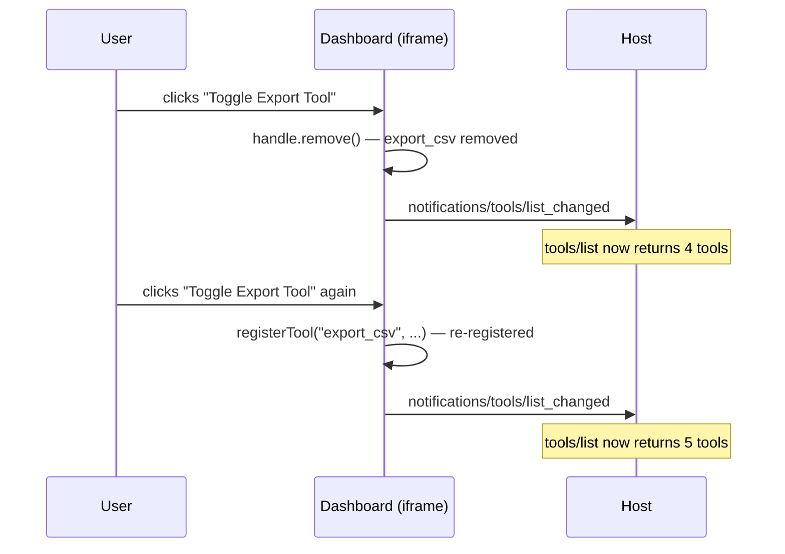
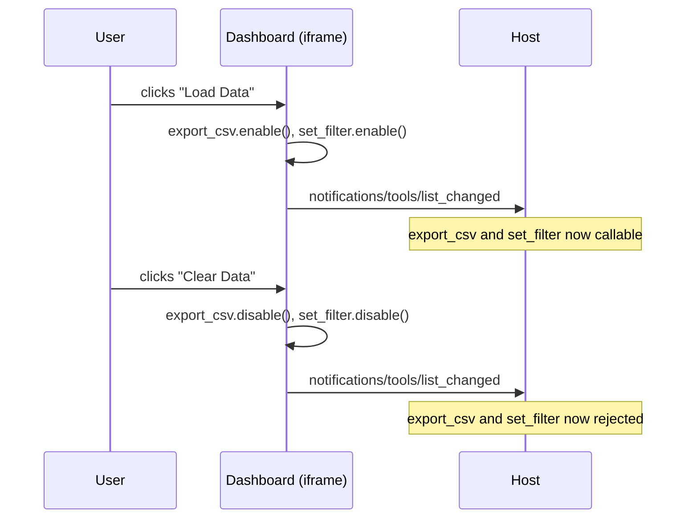

# Dashboard — MCP App with Tool Lifecycle

A data dashboard that registers 5 app-provided tools and demonstrates the full tool lifecycle: register, enable, disable, remove, and re-register. Tools become available based on app state (data loaded vs empty).

## MCPKit Features Used

| Category | Feature |
|----------|---------|
| Core | `server.Run` |
| Extension | `ext/ui` — `UIExtension`, `RegisterTypedAppTool`, `BridgeTemplateDef` |
| Bridge | `MCPApp.registerTool()`, `handle.enable()`, `handle.disable()`, `handle.remove()`, `MCPApp.sendToolListChanged()` |

## What it demonstrates

- **5 app-provided tools** with different lifecycle behaviors
- **State-dependent availability**: `export_csv` and `set_filter` start disabled, enabled when data loads
- **Tool removal and re-registration**: `export_csv` can be removed and re-added via UI button
- **`sendToolListChanged()`** fires on every state change so the host stays in sync

## App-Provided Tools

| Tool | Initial State | Description |
|------|---------------|-------------|
| `query_data` | Active | Query dataset with optional category filter |
| `export_csv` | Disabled | Export current view as CSV (enabled when data loaded) |
| `refresh_data` | Active | Reload data from source |
| `set_filter` | Disabled | Apply filters (enabled when data loaded) |
| `get_settings` | Active | Read dashboard settings |

## Sequence Diagrams

### Model queries data (tool becomes fully active)



### Tool removal and re-registration



### Tool enable/disable based on state



## Setup

```bash
cd examples/apps/dashboard
go run . -addr :8080
```

## Connect a host

In MCPJam (or Claude Desktop):
1. Add server: `http://localhost:8080/mcp` (Streamable HTTP)
2. Server name: "Dashboard"

## Try it — Step by Step

### 1. Open and check initial tool states

- **"Open the dashboard"** → model calls `open_dashboard`, iframe appears
- Look at the tool status panel in the iframe — you should see:
  - `query_data` — **active** (green)
  - `refresh_data` — **active** (green)
  - `get_settings` — **active** (green)
  - `export_csv` — **disabled** (grey)
  - `set_filter` — **disabled** (grey)

### 2. Try a disabled tool (should fail)

- **"Export the data as CSV"** → model calls `export_csv` → **should fail** because no data is loaded yet

### 3. Load data and watch tools enable

- Click **"Load Data"** in the iframe → `export_csv` and `set_filter` badges turn **active**
- The app sends `notifications/tools/list_changed` — the host re-fetches the tool list
- **"Now export the data as CSV"** → **should succeed** — returns CSV text

### 4. Use the data tools

- **"Query hardware items"** → model calls `query_data({category: "hardware"})` → returns 3 items
- **"Filter by name 'Widget'"** → model calls `set_filter({name: "Widget"})` → narrows results
- **"What are the dashboard settings?"** → model calls `get_settings` → returns theme, refreshInterval, pageSize

### 5. Test tool removal and re-registration

- Click **"Toggle Export Tool"** in the iframe → `export_csv` badge turns **removed** (red)
- **"Export data"** → **should fail** — tool no longer exists
- Click **"Toggle Export Tool"** again → `export_csv` is **re-registered** and active
- **"Export data"** → **should succeed** again

### 6. Test data clearing

- Click **"Clear Data"** → `export_csv` and `set_filter` go back to **disabled**
- **"Export data"** → **should fail** again

### What to verify

- Tools start in the correct states (3 active, 2 disabled)
- Loading data enables the disabled tools
- `notifications/tools/list_changed` fires on every state change (host sees updated tool list)
- Removing a tool makes it uncallable; re-registering brings it back
- Clearing data disables data-dependent tools

## Key files

| File | What |
|------|------|
| `dashboard.html` | HTML with bridge + 5 `registerTool()` calls + lifecycle management |
| `main.go` | Go server: open_dashboard tool + resource serving |
