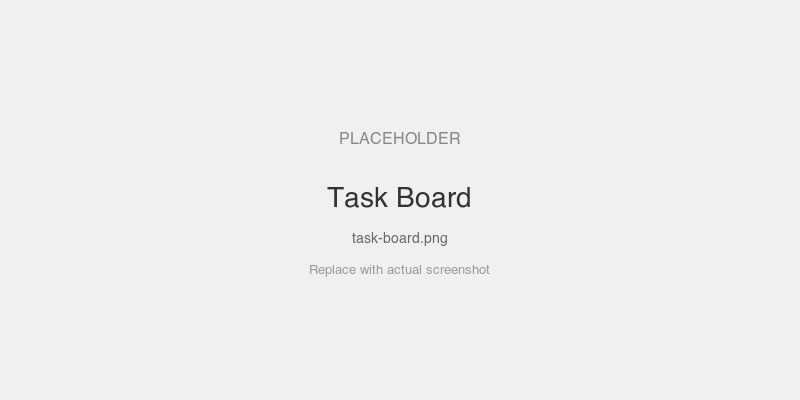
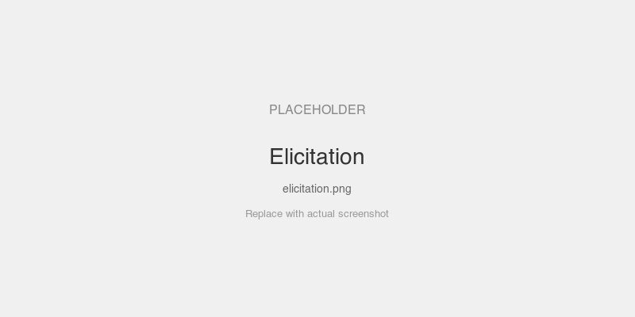

# Task Board — HTMX MCP App

A server-rendered MCP App with zero custom JavaScript. HTMX handles all UI updates via the bridge's `CustomEvent` dispatch. Demonstrates the full MCP protocol surface: tools, elicitation, sampling, and prompts.

## What it demonstrates

- Zero custom JS — only the bridge + HTMX library
- `hx-trigger="mcp:toolresult from:document"` listens for bridge events
- `hx-get="/partial/tasks"` fetches server-rendered HTML partials
- MCP tools + REST partials on the same Go HTTP mux
- **Tools**: `add_task`, `complete_task`, `list_tasks`, `add_task_confirmed`, `categorize_task`
- **Elicitation**: `add_task_confirmed` pauses to ask the user for priority confirmation
- **Sampling**: `categorize_task` asks the LLM to suggest a priority
- **Prompts**: `task_summary` returns a formatted overview of all tasks
- **Middleware**: `LoggingMiddleware` logs every JSON-RPC request

## Screenshots

<!-- TODO: add screenshots -->



## Setup

```bash
cd examples/apps/htmx
go run . -addr :8080
```

## Connect a host

In MCPJam (or Claude Desktop):
1. Add server: `http://localhost:8080/mcp` (Streamable HTTP)
2. Server name: "Task Board"

## Prompts to try

- "Add a task to buy groceries" — adds a task, iframe updates via HTMX swap
- "Add a high priority task to review the PR" — adds with priority badge
- "Mark buy groceries as done" — strikes through the task
- "What tasks do I have?" — lists all tasks
- "Add three tasks: laundry, cooking, cleaning" — bulk add, iframe updates after each
- **"Add a task to call mom, but let me pick the priority"** — triggers elicitation flow
- **"Categorize the task 'deploy to production'"** — LLM suggests priority via sampling
- **Use the `task_summary` prompt** — formatted overview of all tasks

## MCP Features

| Feature | Tool/Prompt | Description |
|---------|------------|-------------|
| Tool (basic) | `add_task` | Add task with title + priority |
| Tool (basic) | `complete_task` | Mark task as done |
| Tool (basic) | `list_tasks` | List all tasks (structured output) |
| Elicitation | `add_task_confirmed` | Asks user to confirm priority before adding |
| Sampling | `categorize_task` | LLM suggests priority based on title |
| Prompt | `task_summary` | Formatted task board overview |

## Key files

| File | What |
|------|------|
| `templates/page.html` | Main page with HTMX + bridge template |
| `templates/tasks.html` | Partial template for task list (HTMX swaps this) |
| `main.go` | Go server: tools, elicitation, sampling, prompts, partials |
