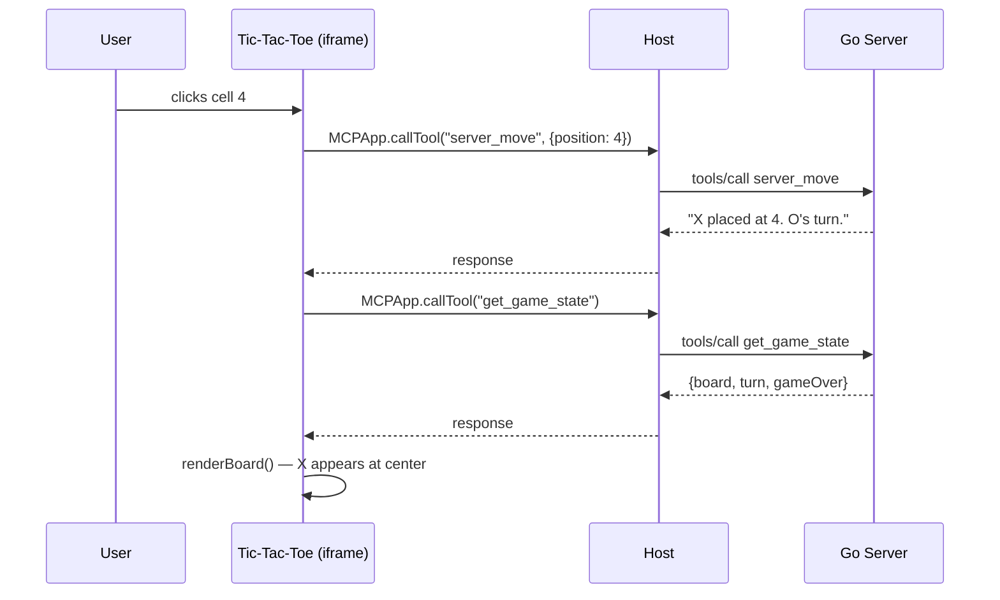
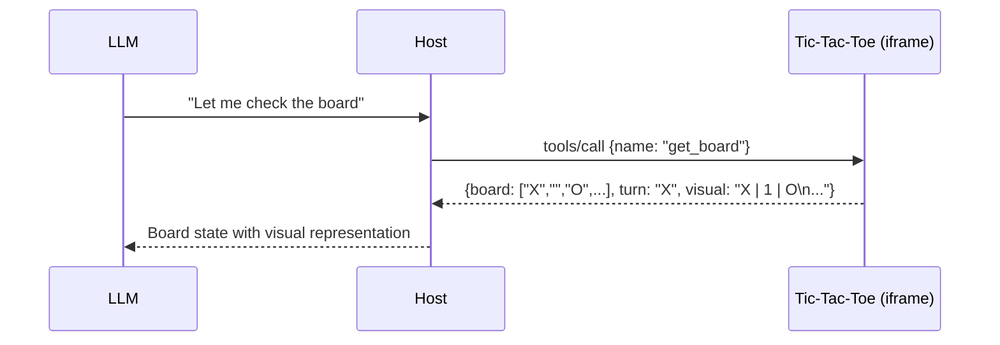

# Tic-Tac-Toe — Interactive MCP App

A tic-tac-toe game where the user plays by clicking cells in the iframe and the model plays by calling app-provided tools. Demonstrates the full bidirectional app-provided tools pattern from the ext-apps spec.

## MCPKit Features Used

| Category | Feature |
|----------|---------|
| Core | `core.TextTool`, `core.TypedTool`, `server.Run` |
| Extension | `ext/ui` — `UIExtension`, `RegisterTypedAppTool`, `BridgeTemplateDef`, `NewBridgeData` |
| Bridge | `MCPApp.registerTool()`, `MCPApp.callTool()`, `MCPApp.sendToolListChanged()` |
| MCP primitives | Tools, Resources (App), App-provided tools (bidirectional) |

## What it demonstrates

- **App-provided tools** via `registerTool()`: `make_move` and `get_board`
- **Server tools**: `new_game`, `server_move`, `get_game_state`
- **Bidirectional flow**: user clicks → app calls server tool; model calls app tool → app updates board
- **Tool lifecycle**: `sendToolListChanged()` on game reset

## Sequence Diagrams

### User makes a move (app→host→server)



### Model makes a move (host→app tool)

```mermaid
sequenceDiagram
    participant LLM
    participant Host
    participant App as Tic-Tac-Toe (iframe)

    LLM->>Host: "I'll take the corner"
    Host->>App: tools/call {name: "make_move", args: {position: 0}}
    App->>App: board[0] = "O"; renderBoard()
    App-->>Host: {text: "O placed at 0. X's turn."}
    Host-->>LLM: "O placed at position 0. X's turn."
```

### Model reads board state



## Setup

```bash
cd examples/apps/interactive
go run . -addr :8080
```

## Connect a host

In MCPJam (or Claude Desktop):
1. Add server: `http://localhost:8080/mcp` (Streamable HTTP)
2. Server name: "Tic-Tac-Toe"

## Try it — Step by Step

### 1. Verify server tools work

Ask the model:
- **"Let's play tic-tac-toe"** → model calls `new_game`, you should see the empty board in the iframe
- **"What does the board look like?"** → model calls `get_game_state`, returns the board array + whose turn

### 2. Test user interaction (app→host→server)

- **Click a cell** in the iframe → the app calls `server_move` via `MCPApp.callTool()`, the cell fills with X
- Click a few more cells — the board should update after each click

### 3. Test app-provided tools (host→app via registerTool)

These are the key new feature — tools registered by the HTML app, not the Go server:
- **"Check the board using get_board"** → model calls the **app-provided** `get_board` tool → returns a visual grid
- **"Place your piece at position 0"** → model calls the **app-provided** `make_move` tool → board updates in the iframe

### 4. Test game lifecycle

- **"Start a new game"** → model calls `new_game`, board resets, `sendToolListChanged()` fires
- Play a full game to completion — verify win/draw detection works

### What to verify

- Server tools (`new_game`, `server_move`, `get_game_state`) and app tools (`make_move`, `get_board`) both work
- Clicking cells in the iframe updates the board (app→host→server round-trip)
- Model can play by calling app tools (host→app round-trip)
- Board state stays consistent between server and app

## Tools

| Tool | Source | Description |
|------|--------|-------------|
| `new_game` | Server | Reset the board, X goes first |
| `server_move` | Server | Place a piece (alternative to app tool) |
| `get_game_state` | Server | Get full game state as structured JSON |
| `make_move` | App (registerTool) | Place a piece — model plays as O |
| `get_board` | App (registerTool) | Get board state with visual grid |

## Key files

| File | What |
|------|------|
| `tictactoe.html` | HTML with bridge + game logic + `registerTool()` |
| `main.go` | Go server: game state, new_game, server_move, get_game_state |
