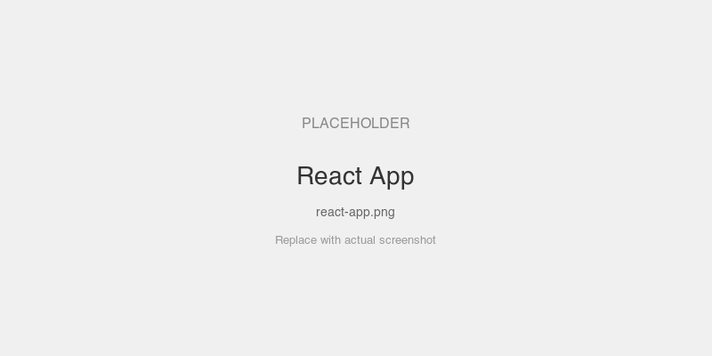
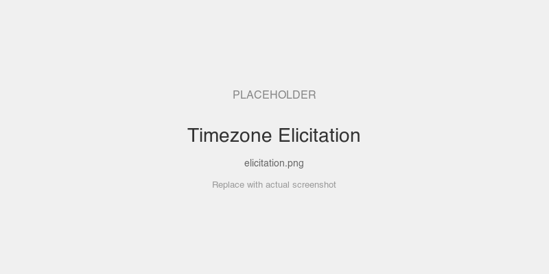

# React App — MCP App with mcpkit backend

A React 19 MCP App that mirrors the upstream ext-apps `basic-server-vanillajs` feature set, extended with elicitation, sampling, and prompts to demonstrate the full MCP protocol surface.

## MCPKit Features Used

| Category | Feature |
|----------|---------|
| Core | `core.TextTool`, `core.ToolContext.Elicit`, `core.ToolContext.Sample`, `server.WithMiddleware`, `LoggingMiddleware` |
| Extension | `ext/ui` — `UIExtension`, `RegisterTypedAppTool`, `InjectAppBridge` |
| MCP primitives | Tools, Resources (App), Elicitation, Sampling, Prompts |
| Frontend | React 19 hooks (`useMCPApp`, `useMCPEvent`), Vite + `vite-plugin-singlefile` |

## What it demonstrates

- React hooks for the bridge: `useMCPApp()`, `useMCPEvent()` (~30 lines)
- Type-safe via `mcp-app-bridge.d.ts` — full autocomplete for `MCPApp.*`
- Vite + `vite-plugin-singlefile` builds to one HTML file (same as upstream pattern)
- Go server injects bridge via `ui.InjectAppBridge()` into Vite-built output
- **Tools**: `get-time`, `get-time-with-tz`, `time-fact`
- **Elicitation**: `get-time-with-tz` asks the user to pick a timezone
- **Sampling**: `time-fact` asks the LLM for a fun fact about today
- **Prompts**: `time_format` returns a time-related prompt message
- **Middleware**: `LoggingMiddleware` logs every JSON-RPC request

## Screenshots

<!-- TODO: add screenshots -->



## Setup

```bash
# 1. Build the React frontend
cd examples/apps/react
pnpm install
pnpm build

# 2. Start the Go server
cd server
go run . -addr :8080
```

## Connect a host

In MCPJam (or Claude Desktop):
1. Add server: `http://localhost:8080/mcp` (Streamable HTTP)
2. Server name: "React App"

## Prompts to try

- "What time is it?" — calls `get-time` tool, time appears in the React UI
- **"What time is it in Tokyo?"** — triggers elicitation for timezone selection
- **"Tell me a fun fact about today"** — LLM generates a fact via sampling
- **Use the `time_format` prompt** — formatted time question for the LLM
- Then click **Get Server Time** in the iframe — calls the tool back through the bridge
- Type a message and click **Send Message** — sends text to the conversation

## MCP Features

| Feature | Tool/Prompt | Description |
|---------|------------|-------------|
| Tool (basic) | `get-time` | Returns current UTC time |
| Elicitation | `get-time-with-tz` | Asks user to pick timezone, returns local time |
| Sampling | `time-fact` | LLM generates fun fact about today's date |
| Prompt | `time_format` | Time question with optional timezone argument |

## Key files

| File | What |
|------|------|
| `src/App.tsx` | React component: time display, message/log/link controls |
| `src/useMCPApp.ts` | React hooks: `useMCPApp()` + `useMCPEvent()` |
| `src/mcp-app-bridge.d.ts` | TypeScript declarations for `MCPApp` global |
| `server/main.go` | Go server: tools, elicitation, sampling, prompts |
| `vite.config.ts` | Vite + singlefile plugin config |
