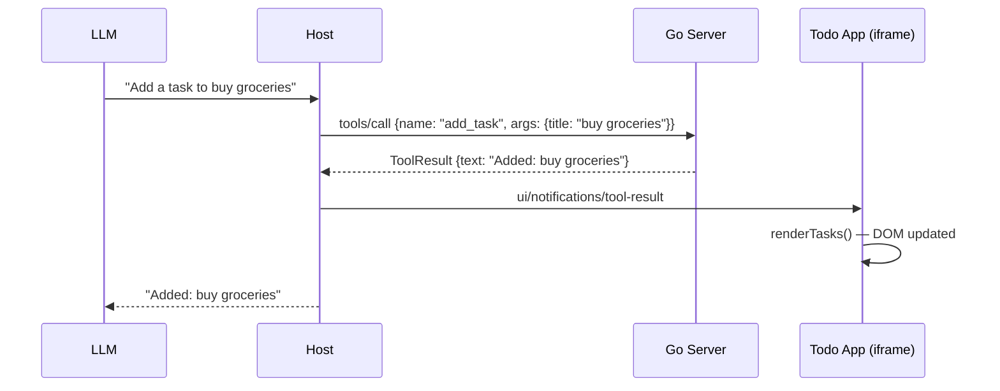
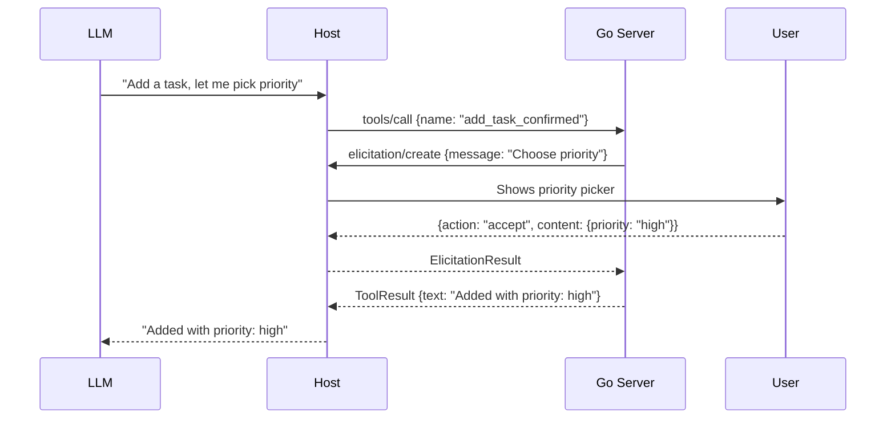
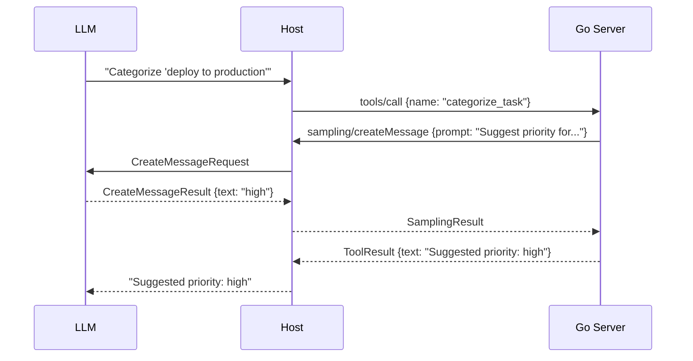
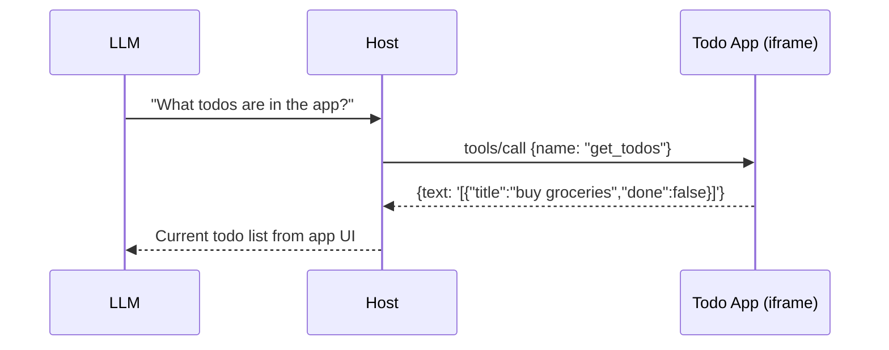
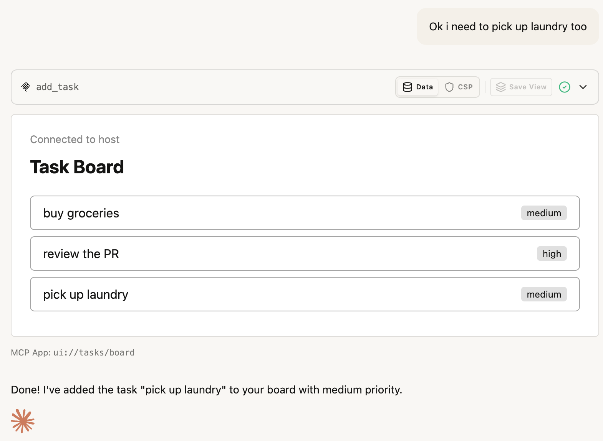

# Todo List — MCP App

A server-rendered MCP App with inline JavaScript. The initial state is rendered server-side in the resource handler. Live updates arrive via the bridge's `toolresult` event and update the DOM with inline JS. Demonstrates the full MCP protocol surface: tools, elicitation, sampling, and prompts.

## MCPKit Features Used

| Category | Feature |
|----------|---------|
| Core | `core.TextTool`, `core.ToolContext.Elicit`, `core.ToolContext.Sample`, `server.WithMiddleware`, `LoggingMiddleware` |
| Extension | `ext/ui` — `UIExtension`, `RegisterTypedAppTool`, `BridgeTemplateDef`, `NewBridgeData` |
| MCP primitives | Tools, Resources (App), Elicitation, Sampling, Prompts |

## What it demonstrates

- Server-rendered initial state via Go `html/template`
- Bridge `toolresult` event drives live DOM updates (no external scripts or fetches)
- Works within MCP App CSP constraints (`script-src 'unsafe-inline'` only)
- **Tools**: `add_task`, `complete_task`, `list_tasks`, `add_task_confirmed`, `categorize_task`
- **Elicitation**: `add_task_confirmed` pauses to ask the user for priority confirmation
- **Sampling**: `categorize_task` asks the LLM to suggest a priority
- **Prompts**: `task_summary` returns a formatted overview of all items
- **Middleware**: `LoggingMiddleware` logs every JSON-RPC request

## App-Provided Tools

The todolist app registers tools that let the host/model query and mutate the app's live UI state directly:

| Tool | Direction | Description |
|------|-----------|-------------|
| `get_todos` | host→app | Read the current todo list from the app's DOM |
| `toggle_todo` | host→app | Toggle a todo done/undone by index |

These complement the server-side tools — server tools manage canonical state, app tools give the model direct access to the UI's live state.

## Sequence Diagrams

### Add a task (server tool → app update)



### Elicitation flow (user picks priority)



### Sampling flow (LLM suggests priority)



### Host queries app state (app-provided tool)



### Host mutates app state (app-provided tool)

```mermaid
sequenceDiagram
    participant LLM
    participant Host
    participant App as Todo App (iframe)

    LLM->>Host: "Toggle the first todo"
    Host->>App: tools/call {name: "toggle_todo", args: {index: 0}}
    App->>App: tasks[0].done = true; renderTasks()
    App-->>Host: {text: "Toggled: buy groceries → done"}
    Host-->>LLM: "Toggled: buy groceries → done"
```

## Screenshots

### Todo list with items added by the LLM



### Elicitation flow — user picks priority before adding


## Setup

```bash
cd examples/apps/todolist
go run . -addr :8080
```

## Connect a host

In MCPJam (or Claude Desktop):
1. Add server: `http://localhost:8080/mcp` (Streamable HTTP)
2. Server name: "Todo List"

## Try it — Step by Step

### 1. Test server tools (basic CRUD)

- **"Add a task to buy groceries"** → model calls `add_task` → item appears in the iframe
- **"Add a high priority task to review the PR"** → adds with priority badge
- **"Mark buy groceries as done"** → model calls `complete_task` → item strikes through
- **"What tasks do I have?"** → model calls `list_tasks` → returns structured list

### 2. Test app-provided tools (host→app via registerTool)

The todolist HTML registers two tools via `MCPApp.registerTool()`:
- **"What todos does the app have?"** → model calls the **app-provided** `get_todos` → returns live DOM state as JSON
- **"Toggle the first todo"** → model calls the **app-provided** `toggle_todo({index: 0})` → item toggles in the iframe

These read/write the app's live UI state directly — independent of the server's state.

### 3. Test elicitation (user input during tool call)

- **"Add a task to call mom, but let me pick the priority"** → triggers elicitation flow → host shows priority picker → you choose → task added with your choice

### 4. Test sampling (LLM-assisted categorization)

- **"Categorize the task 'deploy to production'"** → server asks the LLM to suggest a priority → LLM responds → task gets the suggested priority

### 5. Test prompts

- **Use the `task_summary` prompt** → formatted overview of all items

## MCP Features

| Feature | Tool/Prompt | Description |
|---------|------------|-------------|
| Tool (basic) | `add_task` | Add item with title + priority |
| Tool (basic) | `complete_task` | Mark item as done |
| Tool (basic) | `list_tasks` | List all items (structured output) |
| Elicitation | `add_task_confirmed` | Asks user to confirm priority before adding |
| Sampling | `categorize_task` | LLM suggests priority based on title |
| Prompt | `task_summary` | Formatted todo list overview |

## Key files

| File | What |
|------|------|
| `templates/page.html` | Main page with bridge + inline JS for live updates |
| `main.go` | Go server: tools, elicitation, sampling, prompts |
