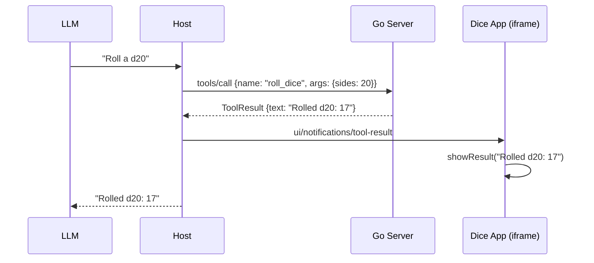
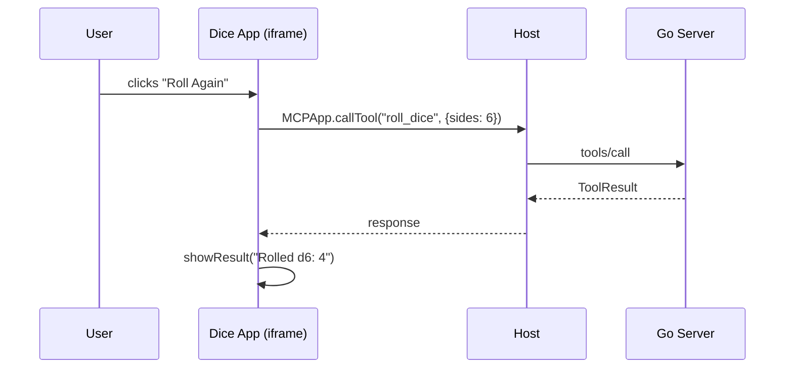
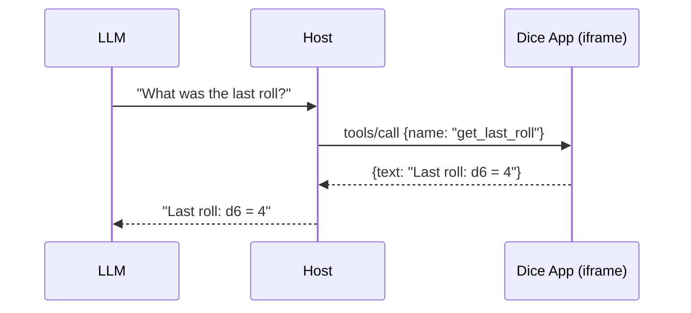
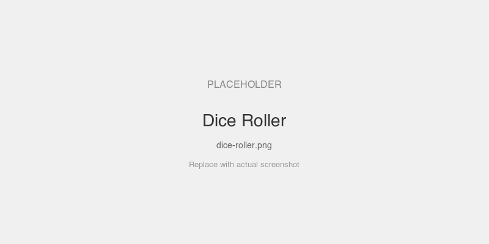

# Dice Roller — Vanilla JS MCP App

A minimal MCP App using the bridge with plain JavaScript. No framework, no build step.

## MCPKit Features Used

| Category | Feature |
|----------|---------|
| Core | `core.TextTool`, `server.Run` |
| Extension | `ext/ui` — `UIExtension`, `RegisterTypedAppTool`, `BridgeTemplateDef`, `NewBridgeData` |
| MCP primitives | Tools, Resources (App resource via `ui://` URI) |

## What it demonstrates

- Bridge included via Go `html/template` (`{{ template "mcpkit-bridge" .Bridge }}`)
- `MCPApp.on('toolresult', ...)` to display results from LLM-initiated tool calls
- `MCPApp.callTool('roll_dice', ...)` for iframe-initiated tool calls (Roll Again button)
- `MCPApp.on('connected', ...)` for connection status
- Host theme auto-applied by the bridge

## App-Provided Tools

The dice app registers two tools that the host/model can call directly:

| Tool | Description |
|------|-------------|
| `roll_dice` | Roll a die (optional `sides` param, default 6) |
| `get_last_roll` | Get the result of the last roll |

These use `MCPApp.registerTool()` — the app auto-handles `tools/list` and `tools/call` from the host.

## Sequence Diagrams

### LLM-initiated dice roll (server tool)



### User clicks "Roll Again" (app→host→server)



### Host queries app tool (app-provided)



## Setup

```bash
cd examples/apps/vanilla
go run . -addr :8080
```

## Connect a host

In MCPJam (or Claude Desktop):
1. Add server: `http://localhost:8080/mcp` (Streamable HTTP)
2. Server name: "Dice App"

## Prompts to try

- "Roll a die" — calls `roll_dice`, result appears in the iframe
- "Roll a d20" — calls with `sides: 20`
- Then click **Roll Again** in the iframe — calls the tool back through the bridge

## Screenshots



## Key files

| File | What |
|------|------|
| `dice.html` | HTML template with bridge + app logic in one `<script type="module">` |
| `main.go` | Go server: parses template, registers tool + resource, serves MCP |
