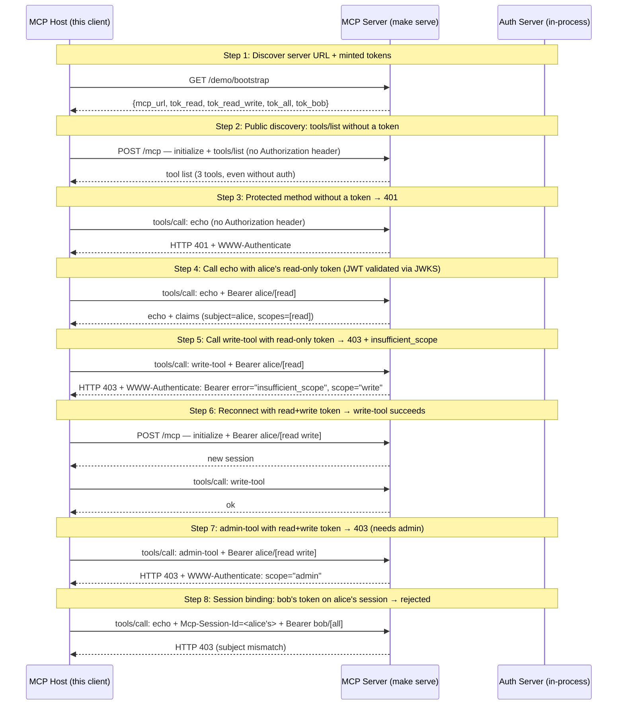

# MCP Auth — Public Discovery + JWT + Scopes + Session Binding

Walks through auth patterns layered on a single mcpkit server: public method allowlist, JWT/JWKS validation, per-tool scope enforcement, and session hijacking prevention.

## What you'll learn

- **Discover server URL + minted tokens** — The server pre-mints four tokens for the demo and exposes them via a non-standard /demo/bootstrap endpoint. In production a host would do OAuth (or accept tokens via mcp.json config); this shortcut keeps the demo focused on auth behavior.
- **Public discovery: tools/list without a token** — The server is configured with WithPublicMethods("initialize", "notifications/initialized", "tools/list", "prompts/list", "ping"). These bypass the auth check so an unauthenticated client can discover what's available before requesting a token.
- **Protected method without a token → 401** — tools/call is NOT in the public allowlist. The mcpkit client surfaces this as *client.ClientAuthError. A real MCP host would use this to trigger an OAuth flow.
- **Call echo with alice's read-only token (JWT validated via JWKS)** — The mcpkit JWTValidator fetches the AS's JWKS, verifies the RS256 signature using kid lookup, and exposes the claims to handlers via core.AuthClaims(ctx). echo is a no-scope tool that reflects the authenticated identity back, so we can see the validated claims.
- **Call write-tool with read-only token → 403 + insufficient_scope** — write-tool declares RequiredScopes: ["write"] on its ToolDef. The auth.NewToolScopeMiddleware short-circuits the request with HTTP 403 + WWW-Authenticate before the handler runs (per SEP-2643 UC2 + RFC 6750). Scope info is in the header — the client's RFC 6750 parser auto-populates RequiredScopes.
- **Reconnect with read+write token → write-tool succeeds** — New session with the broader token. write-tool runs because the token includes write. Scope step-up in real systems is driven by the WWW-Authenticate response from the previous step — see examples/fine-grained-auth/ for the full SEP-2643 UC2 flow.
- **admin-tool with read+write token → 403 (needs admin)** — admin-tool requires "admin" scope. The same scope-enforcement middleware returns 403 + WWW-Authenticate with the missing scope.
- **Session binding: bob's token on alice's session → rejected** — mcpkit binds the principal (Claims.Subject) to the session at creation time. Subsequent requests on the same session must come from the same subject. Even though bob's token is independently valid (correct signature, fresh, has all scopes), it doesn't match alice's bound session — so the request is rejected. This prevents an attacker who steals a session ID from using their own valid token to take over.

## Flow



## Steps

### Setup

Start the MCP server in a separate terminal first:

```
Terminal 1:  make serve        # MCP server + in-process AS on :8080
Terminal 2:  make run          # this demo
```

### Auth patterns covered

1. **Public discovery** — `tools/list` works *without* a token (per spec, capability discovery should be permitted pre-auth).
2. **JWT authentication** — protected methods require `Authorization: Bearer <RS256 JWT>`. The MCP server fetches the AS's JWKS and validates signatures.
3. **Scope enforcement** — `write-tool` requires `write` scope; `admin-tool` requires `admin`. Missing scopes → HTTP 403 + `WWW-Authenticate: Bearer error="insufficient_scope"`.
4. **Session binding** — once a session is established with one user's token, requests on that session must come from the same subject. Swapping tokens mid-session is rejected to prevent session hijacking.

### Step 1: Discover server URL + minted tokens

The server pre-mints four tokens for the demo and exposes them via a non-standard /demo/bootstrap endpoint. In production a host would do OAuth (or accept tokens via mcp.json config); this shortcut keeps the demo focused on auth behavior.

### Step 2: Public discovery: tools/list without a token

The server is configured with WithPublicMethods("initialize", "notifications/initialized", "tools/list", "prompts/list", "ping"). These bypass the auth check so an unauthenticated client can discover what's available before requesting a token.

### Step 3: Protected method without a token → 401

tools/call is NOT in the public allowlist. The mcpkit client surfaces this as *client.ClientAuthError. A real MCP host would use this to trigger an OAuth flow.

### Step 4: Call echo with alice's read-only token (JWT validated via JWKS)

The mcpkit JWTValidator fetches the AS's JWKS, verifies the RS256 signature using kid lookup, and exposes the claims to handlers via core.AuthClaims(ctx). echo is a no-scope tool that reflects the authenticated identity back, so we can see the validated claims.

### Step 5: Call write-tool with read-only token → 403 + insufficient_scope

write-tool declares RequiredScopes: ["write"] on its ToolDef. The auth.NewToolScopeMiddleware short-circuits the request with HTTP 403 + WWW-Authenticate before the handler runs (per SEP-2643 UC2 + RFC 6750). Scope info is in the header — the client's RFC 6750 parser auto-populates RequiredScopes.

### Step 6: Reconnect with read+write token → write-tool succeeds

New session with the broader token. write-tool runs because the token includes write. Scope step-up in real systems is driven by the WWW-Authenticate response from the previous step — see examples/fine-grained-auth/ for the full SEP-2643 UC2 flow.

### Step 7: admin-tool with read+write token → 403 (needs admin)

admin-tool requires "admin" scope. The same scope-enforcement middleware returns 403 + WWW-Authenticate with the missing scope.

### Step 8: Session binding: bob's token on alice's session → rejected

mcpkit binds the principal (Claims.Subject) to the session at creation time. Subsequent requests on the same session must come from the same subject. Even though bob's token is independently valid (correct signature, fresh, has all scopes), it doesn't match alice's bound session — so the request is rejected. This prevents an attacker who steals a session ID from using their own valid token to take over.

### Where each pattern lives in the code

- Public methods: `server.WithPublicMethods(...)`
- JWT/JWKS validation: `auth.NewJWTValidator(JWTConfig{JWKSURL: ...})` — `ext/auth/jwt_validator.go`
- Per-tool scopes: `core.ToolDef.RequiredScopes` + `auth.NewToolScopeMiddleware(reg)` — `ext/auth/scope_middleware.go`
- Session binding: enforced in `server/streamable_transport.go` (verifyPrincipal); subject is captured at session creation

## Run it

```bash
go run ./examples/auth/
```

Pass `--non-interactive` to skip pauses:

```bash
go run ./examples/auth/ --non-interactive
```
