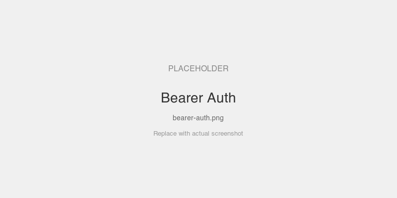

# Bearer Token Auth

The simplest auth pattern — server validates a static bearer token. No JWT, no JWKS, no authorization server.

## MCPKit Features Used

| Category | Feature |
|----------|---------|
| Core | `server.WithBearerToken` |

## Setup

```bash
cd examples/auth
go run ./bearer
```

Connect to `http://localhost:8081/mcp` with header `Authorization: Bearer my-secret-token`.

## Prompts to Try

- "Echo hello" — works with the correct token
- Connect without a token or with a wrong token — all calls fail with 401

## Screenshots

### Connected with the static token — echo responds



## Key Files

| File | What |
|------|------|
| `main.go` | Server with `WithBearerToken("my-secret-token")` |
| `../common/setup.go` | Shared echo tools |
