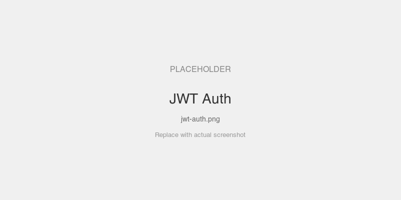

# JWT/JWKS Auth

Server validates RS256 JWTs via an in-process JWKS endpoint. The echo tool reports the authenticated user's identity and claims.

## MCPKit Features Used

| Category | Feature |
|----------|---------|
| Core | `server.WithAuth` |
| Extension | `ext/auth` — `JWTValidator`, `MountAuth` (PRM discovery endpoints) |

## Setup

```bash
cd examples/auth
go run ./jwt
```

The server prints a valid token on startup. Connect to `http://localhost:8082/mcp` with `Authorization: Bearer <token>`.

## Prompts to Try

- "Echo hello" — returns identity: `echo: hello (user: alice, scopes: [read write])`
- Connect without a token — 401
- Connect with a tampered/expired token — 401

## Screenshots

<!-- TODO: add screenshots -->


## Key Files

| File | What |
|------|------|
| `main.go` | Server with JWT validator + PRM auth endpoints |
| `../common/setup.go` | In-process AS, JWT minting, echo tools |
