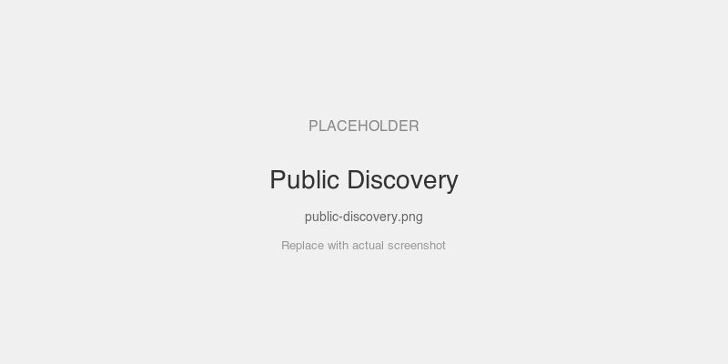
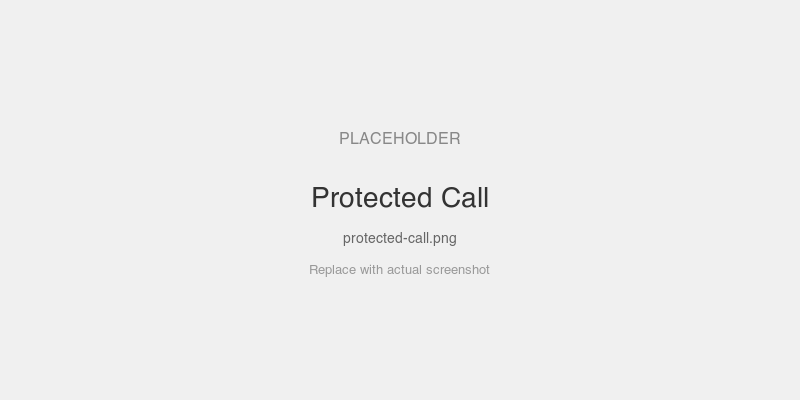

# Pre-Auth Public Discovery

Server with JWT auth that allows clients to discover tools before authenticating. `tools/list` works without a token, but `tools/call` still requires one.

## MCPKit Features Used

| Category | Feature |
|----------|---------|
| Core | `server.WithAuth`, `server.WithPublicMethods` |
| Extension | `ext/auth` — `JWTValidator`, `MountAuth` |

## Setup

```bash
cd examples/auth
go run ./public-discovery
```

The server prints a token. Connect to `http://localhost:8085/mcp`.

## Prompts to Try

**Without a token:**
- `initialize` — works
- `tools/list` — works, shows available tools
- `ping` — works
- Call `echo` — returns 401

**With the printed token:**
- Everything works

## Screenshots

<!-- TODO: add screenshots -->



## Key Files

| File | What |
|------|------|
| `main.go` | Server with `WithPublicMethods("initialize", "tools/list", ...)` |
| `../common/setup.go` | In-process AS, echo tools |
