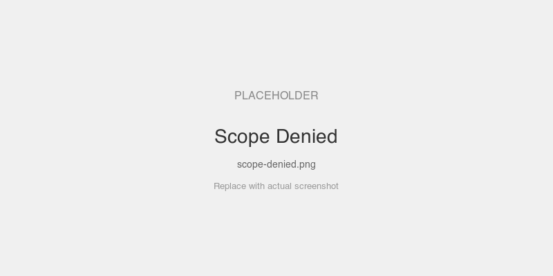
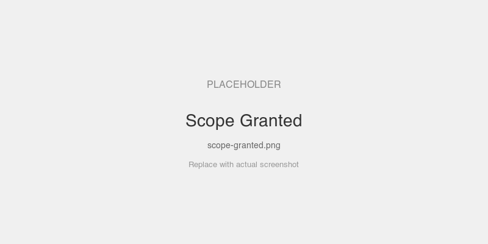

# Scope Enforcement

Server has tools requiring different scopes. Demonstrates step-up authorization — try calling a tool you don't have permission for, then reconnect with a broader token.

## MCPKit Features Used

| Category | Feature |
|----------|---------|
| Core | `server.WithAuth` |
| Extension | `ext/auth` — `JWTValidator`, `MountAuth`, `RequireScope` |

## Setup

```bash
cd examples/auth
go run ./scopes
```

The server prints three tokens with different scope sets. Connect to `http://localhost:8083/mcp`.

## Prompts to Try

With **read-only** token:
- "Echo hello" — works (echo has no scope requirement)
- "Call write-tool" — fails: `insufficient scope: requires "write"`
- "Call admin-tool" — fails: `insufficient scope: requires "admin"`

With **read+write** token:
- "Call write-tool" — works
- "Call admin-tool" — still fails

With **all-scopes** token:
- Everything works

## Screenshots

<!-- TODO: add screenshots -->



## Key Files

| File | What |
|------|------|
| `main.go` | Server with scope-protected tools |
| `../common/setup.go` | Echo tools with `auth.RequireScope` checks |
