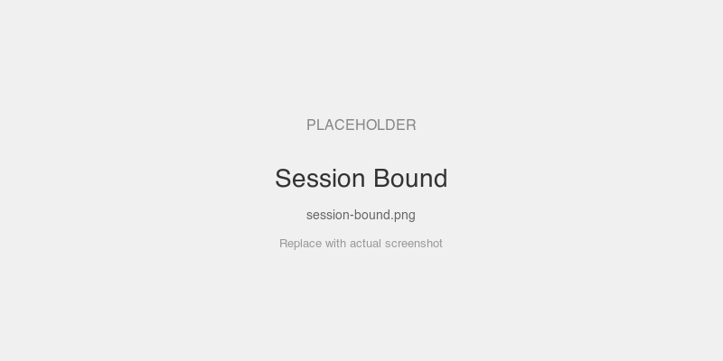
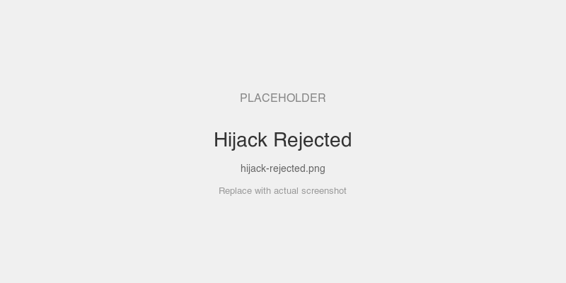

# Session Binding (Hijacking Prevention)

Demonstrates that one user cannot use another user's MCP session. The server binds `Claims.Subject` to the session at creation time — subsequent requests with a different principal are rejected.

## MCPKit Features Used

| Category | Feature |
|----------|---------|
| Core | `server.WithAuth` (session binding is automatic) |
| Extension | `ext/auth` — `JWTValidator`, `MountAuth` |

Session binding is built into the Streamable HTTP transport. When `WithAuth` is configured, the transport automatically binds the JWT `sub` claim to the session on first request.

## Setup

```bash
cd examples/auth
go run ./session-binding
```

The server prints tokens for alice and bob. Connect to `http://localhost:8084/mcp`.

## Prompts to Try

1. Connect with **alice's token** — call `echo`, note the session ID in the `Mcp-Session-Id` header
2. Send a request with **bob's token** using alice's session ID — **403 Forbidden**
3. Connect bob on a fresh session (no session ID header) — works fine, gets his own session

## Screenshots

### Alice connected — session bound to her identity



### Bob's token on alice's session — 403 rejected



## Key Files

| File | What |
|------|------|
| `main.go` | Server with two users, session binding via `WithAuth` |
| `../common/setup.go` | In-process AS, token minting |
