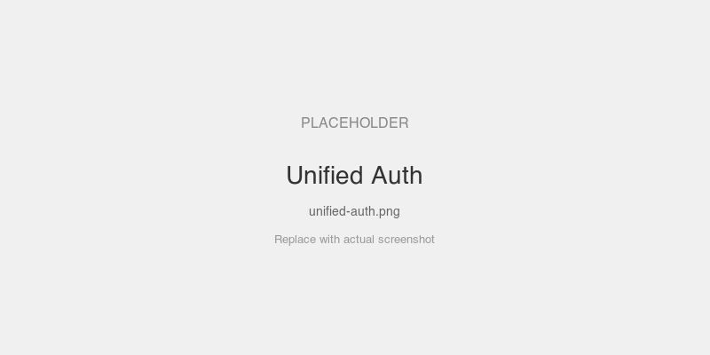
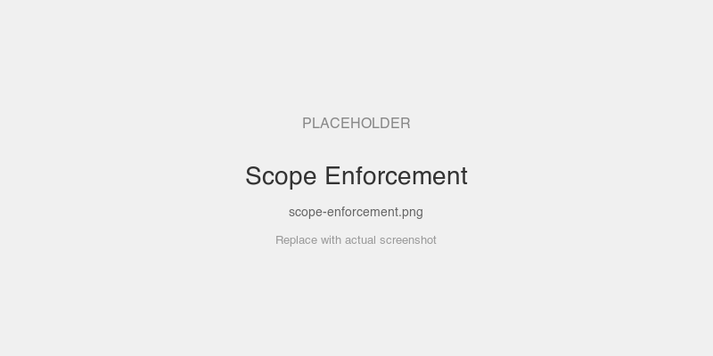

# Unified Auth — All Patterns in One Server

A single MCP server that layers all four auth patterns together. Start here to experience the full auth surface.

## MCPKit Features Used

| Category | Feature |
|----------|---------|
| Core | `server.WithAuth`, `server.WithPublicMethods`, `server.WithMux` |
| Extension | `ext/auth` — `JWTValidator`, `MountAuth` (PRM endpoints), `RequireScope` |
| Auth patterns | JWT/JWKS validation, public discovery, scope enforcement, session binding |

## Setup

```bash
cd examples/auth
go run ./unified
```

The server prints tokens for each exercise. Connect your MCP host to `http://localhost:8080/mcp` (Streamable HTTP).

## Exercises

### 1. Public Discovery

Connect **without** a token.

- `tools/list` works — discover available tools
- Call `echo` — returns 401

### 2. JWT Authentication

Connect with the **read-only token** printed at startup.

- Call `echo` with `{"message": "hello"}` — see identity in response

### 3. Scope Enforcement

With the read-only token:

- Call `write-tool` — fails (missing `write` scope)
- Call `admin-tool` — fails (missing `admin` scope)

Reconnect with the **read+write token** — `write-tool` works, `admin-tool` still fails.
Reconnect with the **all-scopes token** — everything works.

### 4. Session Binding

Connect as alice. Then try bob's token on the same session — **403 Forbidden**.

## Prompts to Try

- "Echo hello" — calls `echo`, shows authenticated identity
- "Call the write tool" — fails with read-only token, works with write scope
- "Call the admin tool" — only works with all-scopes token

## Screenshots

### Connected with a valid JWT — echo reports identity



### Calling write-tool with a read-only token — scope enforcement in action



### Using bob's token on alice's session — 403 rejected


## Key Files

| File | What |
|------|------|
| `main.go` | Server: JWT + public discovery + scopes + session binding |
| `../common/setup.go` | Shared auth infra: in-process AS, JWT minting, echo tools |
